# Chakra Meditation · Flow Atlas

Source snapshot: f531002 baseline + uncommitted CP-MOD-026 · 2026-09-25.

Source-reviewed application behavior at the latest modularize integration baseline with shared range controls integrated and the localized journey roadmap extracted on the active checkpoint branch, pending integration. Yoga Experience Settings, Lobby experience visibility, Mood & Relaxation and drone-duration views, shared screen navigation, Lobby session estimates and all journey practices are integrated. Assessment remains a standalone operator aid; trained-operator acceptance is a follow-up. The approved Cosmic Observatory redesign follows modularization and relocates the dynamic sky to a Settings-linked Sky page.

Open [the interactive atlas](./index.html) for diagrams, node details, source references, SVG export and printing.

## Index

1. [Curriculum and marketing assets](#curriculum-branding)
2. [The whole application](#overview)
3. [Modularization safety loop](#modularization)
4. [Startup and first visit](#startup)
5. [PLANNED · Cosmic Observatory theme](#cosmic-theme-planned)
6. [Mode selection and start routing](#modes)
7. [Standard chakra journey](#standard)
8. [Inside one chakra](#chakra)
9. [HRIM activation](#hrim)
10. [Sleep and Music Only](#sleep)
11. [Box breathing and Ho’oponopono](#focused)
12. [Yoga experience](#yoga)
13. [Intimate Service and massage](#care)
14. [Sound Shots](#shots)
15. [Experiment activities](#experiments)
16. [Ordered Chakra Journey add-ons](#journey-addons)
17. [Lobby journey roadmap](#journey-roadmap)
18. [Pause, stop and live controls](#controls)
19. [Optional Lobby video introduction](#restart)
20. [Completion, statistics and external handoff](#completion)
21. [Scripts, language and timing](#content)
22. [Narration and fallback](#narration)
23. [Audio signal architecture](#audio)
24. [Sound options and live suppression](#sound-options)
25. [Visuals and browser lifecycle](#visuals)
26. [Earth observer reference and atmosphere](#earth-atmosphere)
27. [Thematic solar containment glow](#solar-containment)
28. [Persistence, caching and network](#storage)
29. [Failure and recovery map](#recovery)
30. [Isolated checkpoint delivery](#delivery-workflow)
31. [Settings backup and restore](#settings-backup)
32. [Operator-led chakra assessment](#assessment-tournament)
33. [Frequency repertory handoff](#repertory)

## Curriculum and marketing assets

Approved facilitator programme → reusable marketing package. This is documentation and collateral, not an app navigation path.

Sources: [meditation_curriculum.md:1](/Users/lekshmisyam/Desktop/Ikigai/lite/meditation_curriculum.md:1), [branding/source/brochure-content.md:1](/Users/lekshmisyam/Desktop/Ikigai/lite/branding/source/brochure-content.md:1), [branding/README.md:1](/Users/lekshmisyam/Desktop/Ikigai/lite/branding/README.md:1).

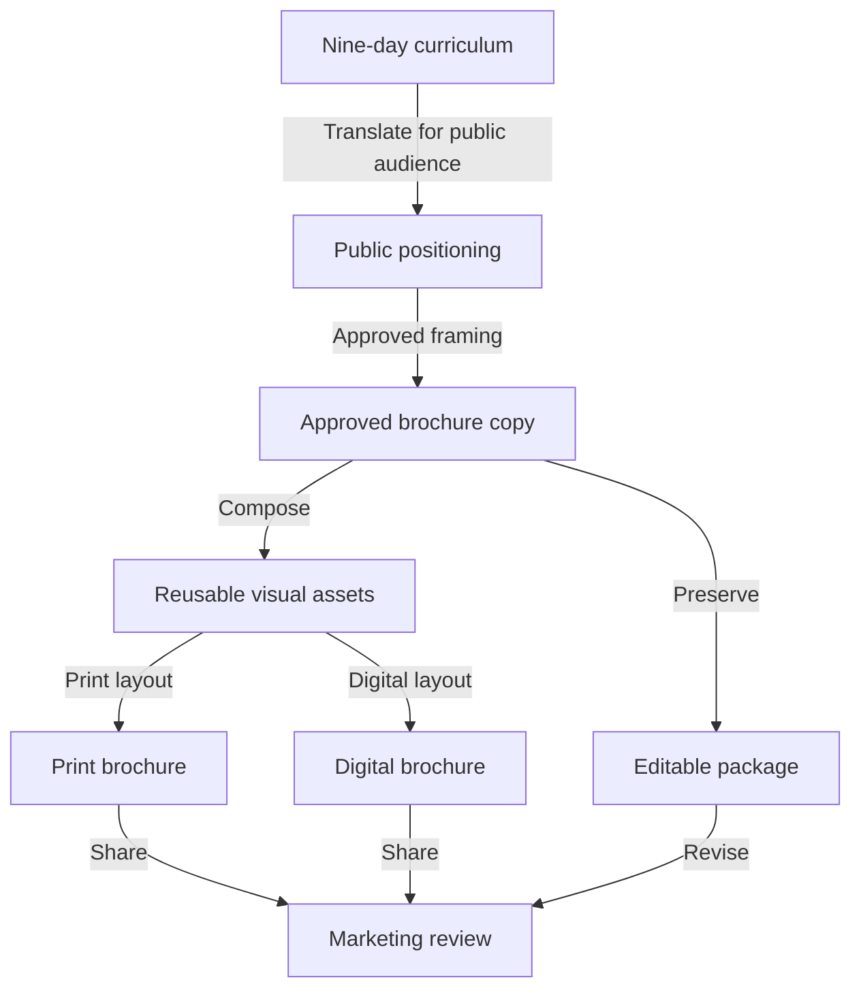
```mermaid
flowchart TD
  curriculum["Nine-day curriculum"]
  position["Public positioning"]
  copy["Approved brochure copy"]
  visual["Reusable visual assets"]
  print["Print brochure"]
  digital["Digital brochure"]
  source["Editable package"]
  review["Marketing review"]
  curriculum -->|"Translate for public audience"| position
  position -->|"Approved framing"| copy
  copy -->|"Compose"| visual
  visual -->|"Print layout"| print
  visual -->|"Digital layout"| digital
  copy -->|"Preserve"| source
  print -->|"Share"| review
  digital -->|"Share"| review
  source -->|"Revise"| review
```

| Step | Current behavior |
| --- | --- |
| Nine-day curriculum | Facilitator-ready progression: foundations and Root through Crown, integrated sound practice, Resonant Energy Meditation, reflection, home practice and safety boundaries. |
| Public positioning | Beginner-friendly, premium and technology-supported. Traditional contemplative practices are not presented as medical treatment or guaranteed outcomes. |
| Approved brochure copy | Nine-day overview, immersive technology, one-hour starter demo, business solutions, trained-manpower support, franchise opportunity, six-step delivery process and contact details. |
| Reusable visual assets | Supplied Srishti Innovative logo plus generated text-free hero artwork with exactly two premium inclined seats, two participants and an infinite-cosmos screen. |
| Print brochure | Two-page A4 roll-fold PDF with embedded fonts, 3 mm bleed, crop/fold marks, 97/100/100 mm outside panels and mirrored inside panels. Printer colour conversion and physical fold proof remain production steps. |
| Digital brochure | Seven-page 4:5 PDF with clickable WhatsApp, email, website and QR links. Includes the 1080×1350 social cover; original hero proportions retained. |
| Editable package | Editorial PDF generator, original artwork, vector website QR, brand guide, approved copy, production notes and build report are stored under branding. The original build command forwards to the current edition. |
| Marketing review | Open branding/index.html to browse every current page and download PDFs, social cover, QR and sources. This is a static collateral gallery separate from the PWA. |

- The Quick Starter Demo is one hour and carries the secondary note “Charges may apply.” Public contact: +91 7510726715, syamnath.s@srishtiinnovative.com and www.srishtis.com. Pricing is intentionally omitted. These files are not precached by the PWA or exposed as an in-app route.

## The whole application

Navigation, journey families, supporting systems, and exits.

Sources: [app.js:6184](/Users/lekshmisyam/Desktop/Ikigai/lite/app.js:6184), [app.js:7553](/Users/lekshmisyam/Desktop/Ikigai/lite/app.js:7553), [index.html:248](/Users/lekshmisyam/Desktop/Ikigai/lite/index.html:248).

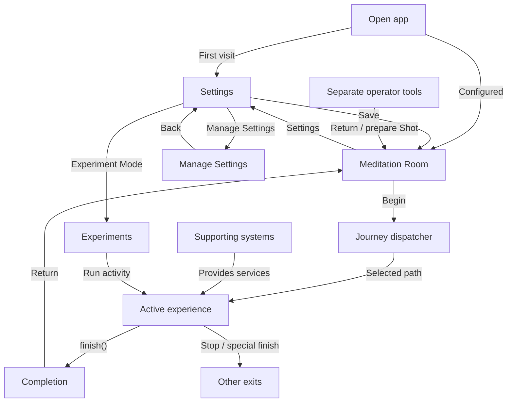
```mermaid
flowchart TD
  launch["Open app"]
  settings["Settings"]
  lobby["Meditation Room"]
  manage["Manage Settings"]
  experiments["Experiments"]
  journeys["Journey dispatcher"]
  consult["Separate operator tools"]
  runtime["Active experience"]
  support["Supporting systems"]
  complete["Completion"]
  other["Other exits"]
  launch -->|"First visit"| settings
  launch -->|"Configured"| lobby
  settings -->|"Save"| lobby
  lobby -->|"Settings"| settings
  settings -->|"Manage Settings"| manage
  manage -->|"Back"| settings
  settings -->|"Experiment Mode"| experiments
  lobby -->|"Begin"| journeys
  journeys -->|"Selected path"| runtime
  support -->|"Provides services"| runtime
  runtime -->|"finish()"| complete
  runtime -->|"Stop / special finish"| other
  experiments -->|"Run activity"| runtime
  complete -->|"Return"| lobby
  consult -->|"Return / prepare Shot"| lobby
```

| Step | Current behavior |
| --- | --- |
| Open app | Browser or installed PWA; local preferences and cached assets influence startup. |
| Settings | First visit or Lobby → Settings. Languages, voice, sound, visuals, timing and scripts. |
| Meditation Room | Main mode selection, chakra choices, intention, duration and assessment entry point. |
| Manage Settings | Public settings import and Advanced Features-protected export. |
| Experiments | Settings → isolated activity → return to Experiment screen. See Experiments map. |
| Journey dispatcher | Shots → Music Only → Sleep → focused or standard guided start. See mode map. |
| Separate operator tools | Assessment is a standalone page opened directly by the operator; repertory can prepare a custom Shot. |
| Active experience | Shared timer, audio, narration, visuals, mixer, pause and stop. |
| Supporting systems | JSON scripts, language bundles, Web Audio, Piper worker, localStorage and service worker. |
| Completion | Guided and Sleep flows update local stats; return to room or eligible Earn link. |
| Other exits | Shot completion reloads; Music Only stops manually; experiments return to their screen. |

- The operator assessment is a separate document opened directly; no Lobby assessment CTA is currently provided. Assessment is separate from journey start and manual planning remains with the operator. Runtime behavior takes precedence over older HANDOFF entries.

## Modularization safety loop

Atlas-led, behavior-preserving extraction with one independently verifiable boundary per checkpoint.

Sources: [modules/settings-backup.js:1](/Users/lekshmisyam/Desktop/Ikigai/lite/modules/settings-backup.js:1), [modules/app-state.js:1](/Users/lekshmisyam/Desktop/Ikigai/lite/modules/app-state.js:1), [modules/content-localization.js:1](/Users/lekshmisyam/Desktop/Ikigai/lite/modules/content-localization.js:1), [modules/media-lifecycle.js:1](/Users/lekshmisyam/Desktop/Ikigai/lite/modules/media-lifecycle.js:1), [modules/piper-lifecycle.js:1](/Users/lekshmisyam/Desktop/Ikigai/lite/modules/piper-lifecycle.js:1), [modules/audio-route-lifecycle.js:1](/Users/lekshmisyam/Desktop/Ikigai/lite/modules/audio-route-lifecycle.js:1), [modules/journey-routing.js:1](/Users/lekshmisyam/Desktop/Ikigai/lite/modules/journey-routing.js:1), [modules/body-scan-practice.js:1](/Users/lekshmisyam/Desktop/Ikigai/lite/modules/body-scan-practice.js:1), [modules/guided-noting-practice.js:1](/Users/lekshmisyam/Desktop/Ikigai/lite/modules/guided-noting-practice.js:1), [modules/dharana-practice.js:1](/Users/lekshmisyam/Desktop/Ikigai/lite/modules/dharana-practice.js:1), [modules/box-breathing-practice.js:1](/Users/lekshmisyam/Desktop/Ikigai/lite/modules/box-breathing-practice.js:1), [modules/visualization-practice.js:1](/Users/lekshmisyam/Desktop/Ikigai/lite/modules/visualization-practice.js:1), [modules/hooponopono-practice.js:1](/Users/lekshmisyam/Desktop/Ikigai/lite/modules/hooponopono-practice.js:1), [modules/undo-unlearn-practice.js:1](/Users/lekshmisyam/Desktop/Ikigai/lite/modules/undo-unlearn-practice.js:1), [modules/screen-navigation.js:1](/Users/lekshmisyam/Desktop/Ikigai/lite/modules/screen-navigation.js:1), [modules/session-estimate.js:1](/Users/lekshmisyam/Desktop/Ikigai/lite/modules/session-estimate.js:1), [modules/mood-ambience-settings-view.js:1](/Users/lekshmisyam/Desktop/Ikigai/lite/modules/mood-ambience-settings-view.js:1), [modules/drone-duration-settings-view.js:1](/Users/lekshmisyam/Desktop/Ikigai/lite/modules/drone-duration-settings-view.js:1), [modules/lobby-experience-visibility.js:1](/Users/lekshmisyam/Desktop/Ikigai/lite/modules/lobby-experience-visibility.js:1), [modules/yoga-experience-settings.js:1](/Users/lekshmisyam/Desktop/Ikigai/lite/modules/yoga-experience-settings.js:1), [modules/range-controls.js:1](/Users/lekshmisyam/Desktop/Ikigai/lite/modules/range-controls.js:1), [modules/journey-roadmap.js:1](/Users/lekshmisyam/Desktop/Ikigai/lite/modules/journey-roadmap.js:1), [tests/journey-routing.test.mjs:1](/Users/lekshmisyam/Desktop/Ikigai/lite/tests/journey-routing.test.mjs:1), [tests/screen-navigation.test.mjs:1](/Users/lekshmisyam/Desktop/Ikigai/lite/tests/screen-navigation.test.mjs:1), [tests/session-estimate.test.mjs:1](/Users/lekshmisyam/Desktop/Ikigai/lite/tests/session-estimate.test.mjs:1), [tests/mood-ambience-settings-view.test.mjs:1](/Users/lekshmisyam/Desktop/Ikigai/lite/tests/mood-ambience-settings-view.test.mjs:1), [tests/drone-duration-settings-view.test.mjs:1](/Users/lekshmisyam/Desktop/Ikigai/lite/tests/drone-duration-settings-view.test.mjs:1), [tests/lobby-experience-visibility.test.mjs:1](/Users/lekshmisyam/Desktop/Ikigai/lite/tests/lobby-experience-visibility.test.mjs:1), [tests/yoga-experience-settings.test.mjs:1](/Users/lekshmisyam/Desktop/Ikigai/lite/tests/yoga-experience-settings.test.mjs:1), [tests/range-controls.test.mjs:1](/Users/lekshmisyam/Desktop/Ikigai/lite/tests/range-controls.test.mjs:1), [tests/journey-roadmap.test.mjs:1](/Users/lekshmisyam/Desktop/Ikigai/lite/tests/journey-roadmap.test.mjs:1), [docs/app-map/FIX-QUEUE.md:1](/Users/lekshmisyam/Desktop/Ikigai/lite/docs/app-map/FIX-QUEUE.md:1).

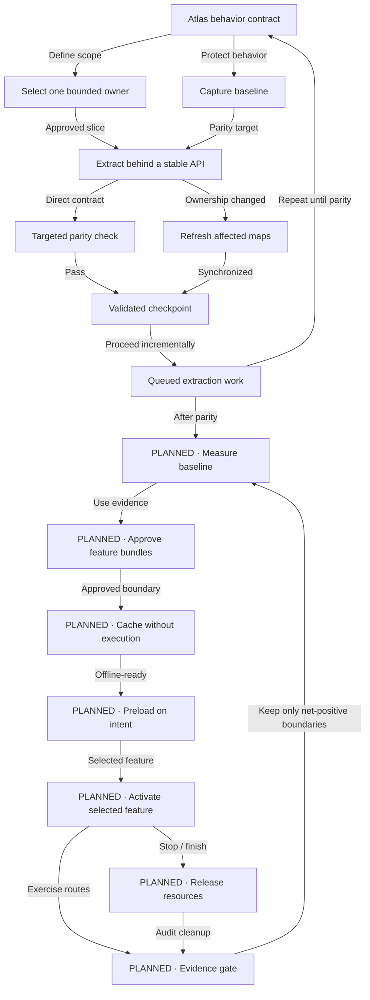
```mermaid
flowchart TD
  atlas["Atlas behavior contract"]
  boundary["Select one bounded owner"]
  baseline["Capture baseline"]
  extract["Extract behind a stable API"]
  test["Targeted parity check"]
  maps["Refresh affected maps"]
  checkpoint["Validated checkpoint"]
  next["Queued extraction work"]
  measure["PLANNED · Measure baseline"]
  partition["PLANNED · Approve feature bundles"]
  cache["PLANNED · Cache without execution"]
  preload["PLANNED · Preload on intent"]
  activate["PLANNED · Activate selected feature"]
  release["PLANNED · Release resources"]
  verify["PLANNED · Evidence gate"]
  atlas -->|"Define scope"| boundary
  atlas -->|"Protect behavior"| baseline
  boundary -->|"Approved slice"| extract
  baseline -->|"Parity target"| extract
  extract -->|"Direct contract"| test
  extract -->|"Ownership changed"| maps
  test -->|"Pass"| checkpoint
  maps -->|"Synchronized"| checkpoint
  checkpoint -->|"Proceed incrementally"| next
  next -->|"Repeat until parity"| atlas
  next -->|"After parity"| measure
  measure -->|"Use evidence"| partition
  partition -->|"Approved boundary"| cache
  cache -->|"Offline-ready"| preload
  preload -->|"Selected feature"| activate
  activate -->|"Stop / finish"| release
  activate -->|"Exercise routes"| verify
  release -->|"Audit cleanup"| verify
  verify -->|"Keep only net-positive boundaries"| measure
```

| Step | Current behavior |
| --- | --- |
| Atlas behavior contract | Choose the affected runtime maps and protected invariants before moving code. |
| Select one bounded owner | Prefer a cohesive dependency-light surface with an existing deterministic test. |
| Capture baseline | Record branch, dirty files, current test evidence and exact public behavior. |
| Extract behind a stable API | Move ownership without changing labels, storage keys, timing, audio, visuals or journey order. |
| Targeted parity check | Test the module directly and confirm its integration references and offline asset delivery. |
| Refresh affected maps | Update delivered ownership and source references; keep future work in the fix queue. |
| Validated checkpoint | Review scope and errors; commit only intended files after fresh checks. |
| Queued extraction work | All practice lifecycles, shared screen navigation, Lobby session estimates, Mood & Relaxation and drone-duration Settings views, Lobby experience visibility, Yoga Experience settings, shared range-control UI and localized Lobby roadmap are integrated; remaining cohesive Settings/UI owners and deferred AudioEngine buses continue before measured delivery changes. |
| PLANNED · Measure baseline | Cold/warm/offline startup, executed script and heap, journey-start latency, active workers, audio graphs and animation owners. |
| PLANNED · Approve feature bundles | Keep a small eager shell; split only cohesive optional features whose measured cost justifies added complexity. |
| PLANNED · Cache without execution | Service worker keeps approved optional bundles offline-ready while startup does not parse or execute them. |
| PLANNED · Preload on intent | Selection or clear intent starts one deduplicated import; Begin awaits only unfinished preparation. |
| PLANNED · Activate selected feature | Load failure is safe and localized; unselected features remain inactive. |
| PLANNED · Release resources | Stop workers, buffers, AudioNodes, media, animation/WebGL, observers, timers and listeners where safe. |
| PLANNED · Evidence gate | Cold/warm/offline, PWA update, route, cancellation/restart and device/browser performance evidence must show net benefit. |

- Delivered seams: settings backup owns collection/validation/replacement; app-state owns initial state; content-localization owns path lookup, language fallback, localized shapes and script validation; media-lifecycle owns stage fade scoping, Unicode narration chunking, Piper envelope constants and native seamless-loop preparation/cleanup; piper-lifecycle owns worker queueing, model configuration, synthesis/decode cache, playback envelopes and cancellation; audio-route-lifecycle owns idempotent effect connection, audio-clock tail retirement, cancellation and disconnection; journey-routing owns focused-mode selection, launch priority, prelude-safe chakra validation, chakra-order selection, ordered preparation-stage planning and sequential execution with a session-active cancellation guard; body-scan-practice owns timed eight-region narration, guarded sequencing and black-scene cleanup; guided-noting-practice owns timed reminder sequencing, cancellation checks and black-scene cleanup; dharana-practice owns focus-anchor/veil setup, selected shape/color, reduced-motion-compatible active-time shrink progression, narrated release and cleanup; box-breathing-practice owns preparation/tutorial transitions, the localized four-step cycle, four repetitions, 100 ms pause-aware time accounting, completion narration and background-music handoff; visualization-practice owns blackout, audio/narration timing and gradual return; hooponopono-practice owns its phrase cycles and closing handoff; undo-unlearn-practice owns phase sequencing and guaranteed black-scene cleanup; screen-navigation owns shared screen visibility, static-sky decoration guards, decorationchange notification and scroll resets. App controllers inject localization and existing screen/audio/session services. These frozen APIs currently load before app.js and are precached. The post-parity loading path is explicitly PLANNED: caching is not execution, and no lazy boundary or performance benefit is claimed until measured and implemented. Earlier CP-MOD-012 measurements showed about 1.4 KiB net local uncompressed body growth for its one eager practice module, with timing differences within single-run noise. No performance gain is claimed. The local server is uncompressed and the harness blocks Google Fonts; results are not production wire/device evidence. AudioEngine bus construction remains owner-deferred until the next weekly reset.

## Startup and first visit

Loading order and optional browser capabilities.

Sources: [modules/screen-navigation.js:1](/Users/lekshmisyam/Desktop/Ikigai/lite/modules/screen-navigation.js:1), [app.js:6181](/Users/lekshmisyam/Desktop/Ikigai/lite/app.js:6181), [app.js:6506](/Users/lekshmisyam/Desktop/Ikigai/lite/app.js:6506), [app.js:6524](/Users/lekshmisyam/Desktop/Ikigai/lite/app.js:6524), [index.html:148](/Users/lekshmisyam/Desktop/Ikigai/lite/index.html:148).

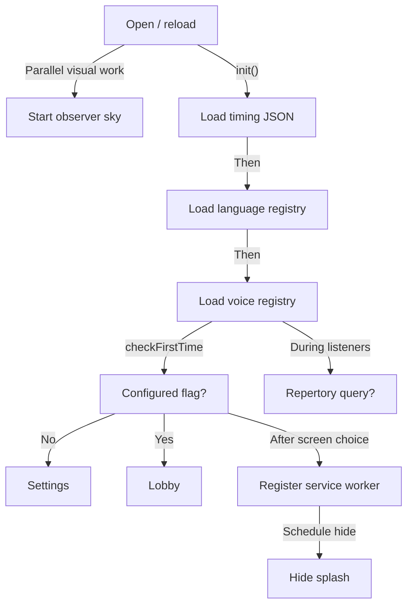
```mermaid
flowchart TD
  open["Open / reload"]
  sky["Start observer sky"]
  timing["Load timing JSON"]
  language["Load language registry"]
  voices["Load voice registry"]
  configured["Configured flag?"]
  repertory["Repertory query?"]
  settings["Settings"]
  lobby["Lobby"]
  sw["Register service worker"]
  splash["Hide splash"]
  open -->|"Parallel visual work"| sky
  open -->|"init()"| timing
  timing -->|"Then"| language
  language -->|"Then"| voices
  voices -->|"checkFirstTime"| configured
  voices -->|"During listeners"| repertory
  configured -->|"No"| settings
  configured -->|"Yes"| lobby
  configured -->|"After screen choice"| sw
  sw -->|"Schedule hide"| splash
```

| Step | Current behavior |
| --- | --- |
| Open / reload | Objects and state are constructed; splash is visible. |
| Start observer sky | Load local Astronomy Engine and the real star catalogue before the sky controller. Begin with an explicitly labelled Greenwich reference, then replace it with granted device coordinates. Positions use the current UTC instant; display timezone does not shift them. |
| Load timing JSON | Built-in defaults on failure; timingProfile query can apply fast-test overrides. |
| Load language registry | Restore meditation language or Malayalam default; restore display language or English fallback. Load all four locale bundles. |
| Load voice registry | Load Piper definitions; enumerate browser voices; restore preferences and attach UI handlers. |
| Configured flag? | chakra_configured determines initial screen. |
| Repertory query? | Keep shotSource / shotFrequency pending while locked. Seven-tap unlock consumes the query and offers normal Shot confirmation; initial screen choice remains unchanged. |
| Settings | Unconfigured visitor. Save sets chakra_configured and opens Lobby. |
| Lobby | Configured visitor. Session-only modes start cleared. |
| Register service worker | Registration is inside a window load listener added after awaited startup work. Registration timing deserves verification. |
| Hide splash | 2.5-second delay begins after async initialization reaches its end. |

- Timing fetch failure uses defaults. Language loading catches failures and installs built-in options. This does not establish complete offline readiness.

## PLANNED · Cosmic Observatory theme

CP-THEME-PLAN-001: owner-approved appearance; implementation follows assessment and modularization.

Sources: [.loop/tracks/cosmic-observatory-theme/spec-plan-review.md:1](/Users/lekshmisyam/Desktop/Ikigai/lite/.loop/tracks/cosmic-observatory-theme/spec-plan-review.md:1), [docs/design/lite-cosmic-observatory/README.md:1](/Users/lekshmisyam/Desktop/Ikigai/lite/docs/design/lite-cosmic-observatory/README.md:1), [docs/app-map/FIX-QUEUE.md:1](/Users/lekshmisyam/Desktop/Ikigai/lite/docs/app-map/FIX-QUEUE.md:1).

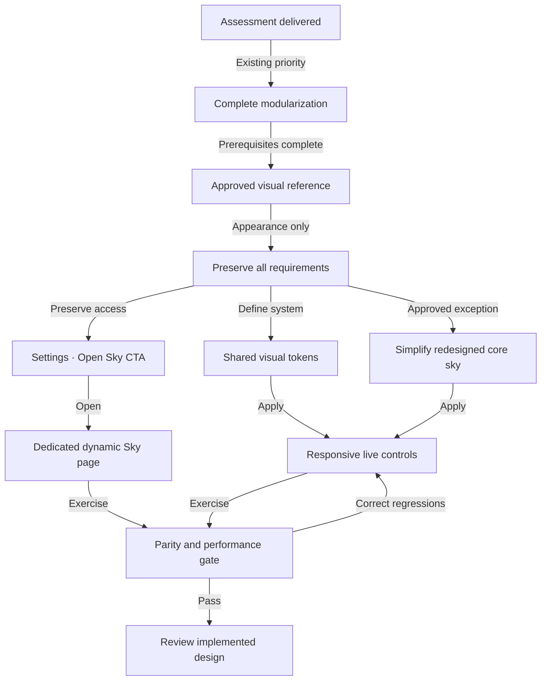
```mermaid
flowchart TD
  assessment["Assessment delivered"]
  modules["Complete modularization"]
  reference["Approved visual reference"]
  contract["Preserve all requirements"]
  tokens["Shared visual tokens"]
  sky["Simplify redesigned core sky"]
  skyCta["Settings · Open Sky CTA"]
  skyPage["Dedicated dynamic Sky page"]
  surfaces["Responsive live controls"]
  verify["Parity and performance gate"]
  review["Review implemented design"]
  assessment -->|"Existing priority"| modules
  modules -->|"Prerequisites complete"| reference
  reference -->|"Appearance only"| contract
  contract -->|"Define system"| tokens
  contract -->|"Approved exception"| sky
  contract -->|"Preserve access"| skyCta
  tokens -->|"Apply"| surfaces
  sky -->|"Apply"| surfaces
  skyCta -->|"Open"| skyPage
  skyPage -->|"Exercise"| verify
  surfaces -->|"Exercise"| verify
  verify -->|"Correct regressions"| surfaces
  verify -->|"Pass"| review
```

| Step | Current behavior |
| --- | --- |
| Assessment delivered | The standalone operator assessment is implemented and synchronized; operator acceptance remains a tracked follow-up. |
| Complete modularization | Resume the existing migration and measured loading review. Theme work does not reorder these checkpoints. |
| Approved visual reference | See docs/design/lite-cosmic-observatory/approved-concept-v1.png: midnight panels, ivory text, champagne actions and cosmic setting. |
| Preserve all requirements | Keep every option, default, gate, translation, navigation, timing, audio and persistence contract. Mockup omissions and sample values are illustrative. |
| Shared visual tokens | Define readable surfaces, typography, spacing, selection states and keyboard focus. |
| Simplify redesigned core sky | The main redesign may use a simpler concept-aligned background while retaining static/performance constraints. |
| Settings · Open Sky CTA | Localized, keyboard/touch accessible navigation to the dedicated responsive Sky page. |
| Dedicated dynamic Sky page | Relocate current observer calculations, proper cardinal order, straight horizon, Earth atmosphere/26°C styling and Sun shield here. |
| Responsive live controls | Restyle Lobby, summary, Settings and applicable surfaces using existing handlers. Keep all options available and localize adopted copy. |
| Parity and performance gate | Check languages, keyboard, mobile/tablet/desktop, video, journeys, offline updates and CPU/memory. Resolve regressions before acceptance. |
| Review implemented design | Present the working theme checkpoint. Production publication needs its own request. |

- PLANNED only. The approved PNG is a documentation reference, not a runtime background or replacement for functional HTML controls. Existing flows remain authoritative until redesign. The current dynamic sky must be preserved until then and subsequently relocated, not silently deleted; generated celestial placements remain illustrative.

## Mode selection and start routing

Mutual exclusion, validation, and dispatch priority.

Sources: [modules/journey-routing.js:1](/Users/lekshmisyam/Desktop/Ikigai/lite/modules/journey-routing.js:1), [modules/lobby-experience-visibility.js:1](/Users/lekshmisyam/Desktop/Ikigai/lite/modules/lobby-experience-visibility.js:1), [app.js:5633](/Users/lekshmisyam/Desktop/Ikigai/lite/app.js:5633), [app.js:7550](/Users/lekshmisyam/Desktop/Ikigai/lite/app.js:7550), [app.js:7573](/Users/lekshmisyam/Desktop/Ikigai/lite/app.js:7573).

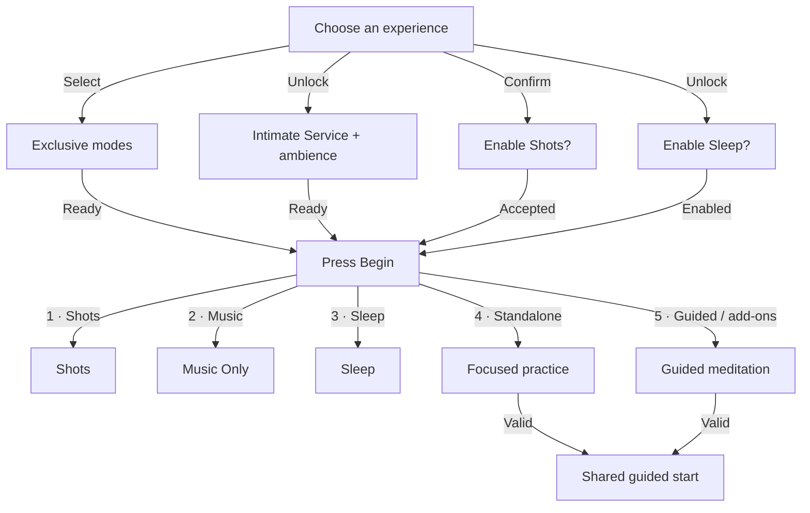
```mermaid
flowchart TD
  lobby["Choose an experience"]
  exclusive["Exclusive modes"]
  care["Intimate Service + ambience"]
  shots["Enable Shots?"]
  sleepgate["Enable Sleep?"]
  begin["Press Begin"]
  shot["Shots"]
  music["Music Only"]
  sleep["Sleep"]
  focused["Focused practice"]
  guided["Guided meditation"]
  start["Shared guided start"]
  lobby -->|"Select"| exclusive
  lobby -->|"Unlock"| care
  lobby -->|"Confirm"| shots
  lobby -->|"Unlock"| sleepgate
  exclusive -->|"Ready"| begin
  care -->|"Ready"| begin
  shots -->|"Accepted"| begin
  sleepgate -->|"Enabled"| begin
  begin -->|"1 · Shots"| shot
  begin -->|"2 · Music"| music
  begin -->|"3 · Sleep"| sleep
  begin -->|"4 · Standalone"| focused
  begin -->|"5 · Guided / add-ons"| guided
  focused -->|"Valid"| start
  guided -->|"Valid"| start
```

| Step | Current behavior |
| --- | --- |
| Choose an experience | Ordinary mode uses selected chakras; choose at least one. |
| Exclusive modes | HRIM, Sleep, Music Only and Yoga clear competing modes, all journey add-ons and intimate-service choices. Yoga is hidden and disabled until Advanced Features is unlocked; relock clears it and direct locked selection/start is rejected. Box Breathing, Dharana, Visualization and Ho’oponopono are compatible journey add-ons. |
| Intimate Service + ambience | Hidden by default. Settings → About → App version needs seven rapid taps, resetting after 1.5 seconds between taps. Taps 1–4 are silent; 5–6 show a countdown; tap 7 opens a localized password prompt. Only a Web Crypto SHA-256 match unlocks the current page load; wrong, cancelled or unsupported verification retains the lock. The unlocked Lobby panel contains care stages and Mood & Relaxation ambience controls; they are not duplicated in Journey Tuning. Advanced Features OFF clears care, Shots, Sleep, Yoga and enabled ambience, stops ambience playback, then locks/hides their controls. Reload locks again. Any combination of three care options is allowed; choosing care clears other modes. |
| Enable Shots? | Hidden and disabled until the shared seven-tap-and-password unlock. No Frequency still blocks it. Confirmation is required; cancel restores normal mode and Shots clear all journey add-ons. |
| Enable Sleep? | Hidden and disabled until the shared seven-tap-and-password unlock. Relock clears it; direct locked start is rejected. |
| Press Begin | Actual dispatcher tests Shots first; then derives Sleep and focused experience. |
| Shots | Validate custom Hz: finite, >0 and ≤20,000. Initialize audio and run Shot. |
| Music Only | Start indefinite music with common controls. |
| Sleep | Load and validate five stages; start silent narration-free journey. |
| Focused practice | Yoga and Intimate Care are standalone routes. With no chakra selected, Box Breathing, Visualization, Dharana, Body Scan, Guided Noting, Ho’oponopono and Undo & Unlearn run as standalone preparation sessions in the displayed order; Ho’oponopono and Undo & Unlearn follow the chakra loop when chakras are selected. |
| Guided meditation | HRIM bypasses chakra selection; standard requires chakras unless a standalone preparation practice is selected. |
| Shared guided start | DND reminder, scripts, validation, audio, Piper warmup, wake lock, timers, selected routine. |

- Shots hide incompatible Lobby controls. Add-on selectors remain independently selectable and their option rows open directly below each checked item. Checking Music Only, Sleep, Yoga, Intimate Care or Shots clears journey add-ons; those exclusive choices can also clear Corpse Pose.

## Standard chakra journey

Selected chakras in Root → Crown order; returning, newcomer and demo branches included.

Sources: [app.js:4429](/Users/lekshmisyam/Desktop/Ikigai/lite/app.js:4429), [app.js:4740](/Users/lekshmisyam/Desktop/Ikigai/lite/app.js:4740), [app.js:4769](/Users/lekshmisyam/Desktop/Ikigai/lite/app.js:4769), [app.js:5585](/Users/lekshmisyam/Desktop/Ikigai/lite/app.js:5585), [index.html:448](/Users/lekshmisyam/Desktop/Ikigai/lite/index.html:448).

```mermaid
flowchart TD
  begin["Press Begin"]
  newcomer["Newcomer orientation"]
  setup["Audio + warmup"]
  arrive["Arriving countdown"]
  prepare["Preparation"]
  wrapper["Arrival induction"]
  moon["Moon opening"]
  return["Returning opening"]
  gratitude["Gratitude + intention"]
  ready["Arrival readiness"]
  loop["Selected chakra loop"]
  end["Silence + closing"]
  emerge["Emergence"]
  finish["Completion"]
  begin -->|"Returning off · normal standard"| newcomer
  newcomer -->|"Narration complete"| setup
  begin -->|"Returning on / demo / Sleep / Music Only / focused"| setup
  setup -->|"Ready"| arrive
  arrive -->|"Warmup awaited"| prepare
  prepare -->|"Non-demo"| wrapper
  prepare -->|"Demo + new opening"| moon
  prepare -->|"Demo + returning"| return
  wrapper -->|"Returning off"| moon
  wrapper -->|"Returning on"| return
  moon -->|"Opening pause"| gratitude
  return -->|"ready"| gratitude
  gratitude -->|"Demo"| loop
  ready -->|"Ready"| loop
  loop -->|"Last chakra"| end
  end -->|"Non-demo"| emerge
  end -->|"Demo"| finish
  emerge -->|"Done"| finish
```

| Step | Current behavior |
| --- | --- |
| Press Begin | First validate a normal journey has one or more chakras selected; reject immediately if not. If valid and the persisted Lobby Video Introduction option is selected, play the explicit video introduction; otherwise continue directly. Remaining mode-specific guards and first-time eligibility run in the dispatcher after the optional prelude. |
| Newcomer orientation | Only for a normal standard journey when Returning Journey is unchecked. The static standing body-map illustration has fixed English chakra names and leader lines embedded in the artwork. Its separate language-specific names, locations and curved arrowheads remain responsive but are deliberately faded to supporting guidance. A ResizeObserver geometry pass measures the rendered image and label boxes, then draws each arrowhead to normalized coordinates for the matching marker after image load and resize. Its spoken orientation follows the Meditation Language before Arriving. |
| Audio + warmup | Background music starts silently; optional ambience; Piper warms during Arriving; wake lock requested. |
| Arriving countdown | Configured 10–300 seconds, default 60. Music entry uses 20% of the selected period capped at 3s (10s → 2s); the settling timer remains unchanged. |
| Preparation | Initial settle → pre-practice guidance. In English, Malayalam, Hindi and Russian: Sacral includes wholesome fun and everyday happiness; Solar frames a kind, realistic deep-work period; Third Eye includes concentration, attention management, intelligence as an ordinary learning skill, and unforced deep work. These are reflective practices, not outcome guarantees. |
| Arrival induction | Ordinary non-demo only: narration → 432 Hz transition tone for half the selected drone window. |
| Moon opening | When Returning is off, use current moon-phase script. |
| Returning opening | When enabled, use intro.returning; independent of journey statistics. |
| Gratitude + intention | Gratitude narration; if personal intention is nonempty, speak intention with optional timed tone. |
| Arrival readiness | Ordinary non-demo only: narration → 528 Hz transition tone → post-preparation gap. |
| Selected chakra loop | Each chakra: narration → mantra and bounded drone → affirmation. Between chakras: breathing interval. |
| Silence + closing | Final silence → closing narration → full-body affirmation with configured gaps. |
| Emergence | Non-demo only: bowl unless No Frequency → complete guidance → emergence countdown (minimum 30s) → final quiet. Narration music transitions use 20% of the setting capped at 3s; long session exit follows completion. |
| Completion | Stop audio / visuals, update stats and show completion choices. |

- Demo is recognized from custom-script metadata and uses a short core duration. It omits Arrival/Emergence wrappers, not the entire standard preparation and closing flow. No Frequency suppresses tones while keeping the surrounding guidance and gaps. Returning Journey is an explicit preference, not a record of prior sessions.

## Inside one chakra

Narration, audio handoff, bounded exposure, and loop transitions.

Sources: [app.js:5550](/Users/lekshmisyam/Desktop/Ikigai/lite/app.js:5550), [app.js:2712](/Users/lekshmisyam/Desktop/Ikigai/lite/app.js:2712), [app.js:4242](/Users/lekshmisyam/Desktop/Ikigai/lite/app.js:4242), [app.js:20](/Users/lekshmisyam/Desktop/Ikigai/lite/app.js:20).

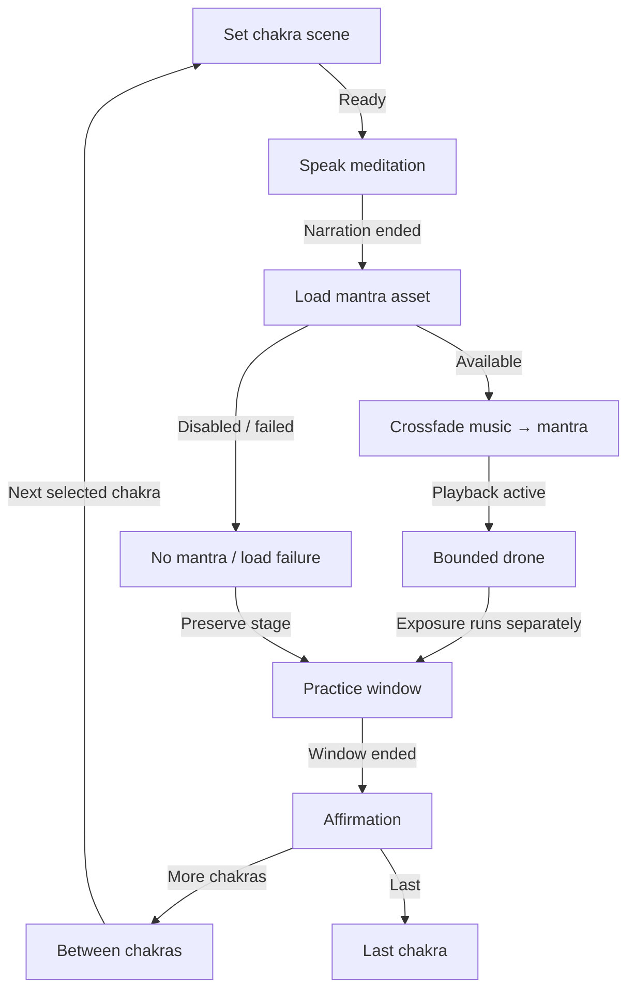
```mermaid
flowchart TD
  visual["Set chakra scene"]
  voice["Speak meditation"]
  load["Load mantra asset"]
  mantra["Crossfade music → mantra"]
  skip["No mantra / load failure"]
  drone["Bounded drone"]
  hold["Practice window"]
  affirm["Affirmation"]
  interval["Between chakras"]
  close["Last chakra"]
  visual -->|"Ready"| voice
  voice -->|"Narration ended"| load
  load -->|"Available"| mantra
  load -->|"Disabled / failed"| skip
  mantra -->|"Playback active"| drone
  drone -->|"Exposure runs separately"| hold
  skip -->|"Preserve stage"| hold
  hold -->|"Window ended"| affirm
  affirm -->|"More chakras"| interval
  interval -->|"Next selected chakra"| visual
  affirm -->|"Last"| close
```

| Step | Current behavior |
| --- | --- |
| Set chakra scene | Choose deity image if available, otherwise symbol; set mantra label, color, aura and progress dot. |
| Speak meditation | Selected language, Piper or browser speech. No chakra drone under this narration. |
| Load mantra asset | Cached decoded buffer or fetch and decode the matching MP3. |
| Crossfade music → mantra | After decoding and cancellation guard, simultaneously fade music out and mantra in over 6 seconds. User mantra volume is applied once. |
| No mantra / load failure | No Mantra skips playback. Asset failure logs error and restores music; stage continues. |
| Bounded drone | Only if mantra exists and both suppression modes permit: Beginner 4 s, Intermediate 10 s, Advanced 14 s, Expert 20 s. |
| Practice window | Core minutes ×60 minus 15-second lead-out, bounded at zero. Pauses suspend elapsed stage time. |
| Affirmation | Fit the mantra exit into the configured post-mantra window: default 4s means 2s dry fade/music restoration plus 2s wet-tail fade, reaching zero before affirmation. Wait only the existing window; zero-duration test profiles remain zero. |
| Between chakras | Stop drone; 2-second preparation; wait for BOTH configured interval and complete breathing narration. Music transitions during this narration use 20% of the interval capped at 3s (10s → 2s). Restore the temporary cap on success/failure. |
| Last chakra | Caller chooses closing/completion, or next care stage. |

- Core practice duration does not extend the fixed drone exposure window. HRIM reuses this routine with high_energy content and its own duration.

## HRIM activation

A dedicated high-energy journey using one stage.

Sources: [app.js:4620](/Users/lekshmisyam/Desktop/Ikigai/lite/app.js:4620), [app.js:4788](/Users/lekshmisyam/Desktop/Ikigai/lite/app.js:4788), [app.js:5531](/Users/lekshmisyam/Desktop/Ikigai/lite/app.js:5531).

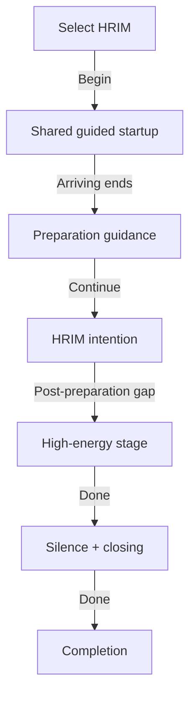
```mermaid
flowchart TD
  choose["Select HRIM"]
  start["Shared guided startup"]
  prepare["Preparation guidance"]
  intention["HRIM intention"]
  stage["High-energy stage"]
  closing["Silence + closing"]
  finish["Completion"]
  choose -->|"Begin"| start
  start -->|"Arriving ends"| prepare
  prepare -->|"Continue"| intention
  intention -->|"Post-preparation gap"| stage
  stage -->|"Done"| closing
  closing -->|"Done"| finish
```

| Step | Current behavior |
| --- | --- |
| Select HRIM | Clears competing experiences; uses its own practice duration and drone setting. |
| Shared guided startup | DND, validation, audio, Piper warmup and Arriving countdown. |
| Preparation guidance | No Arrival wrapper, Moon opening or Returning opening. |
| HRIM intention | Activation-oriented text inserts personal intention; optional timed intention tone; HRIM pacing. |
| High-energy stage | Meditation narration → HREEM mantra → bounded drone → affirmation. |
| Silence + closing | Shared closing and full-body affirmation; no Emergence wrapper. |
| Completion | Stats and completion modal. |

- No local-time restriction appears in this route. HRIM is separate from the seven selected chakras.

## Sleep and Music Only

Two independent narration-free experiences.

Sources: [app.js:4344](/Users/lekshmisyam/Desktop/Ikigai/lite/app.js:4344), [app.js:5057](/Users/lekshmisyam/Desktop/Ikigai/lite/app.js:5057), [app.js:2496](/Users/lekshmisyam/Desktop/Ikigai/lite/app.js:2496), [scripts.json:1](/Users/lekshmisyam/Desktop/Ikigai/lite/scripts.json:1).

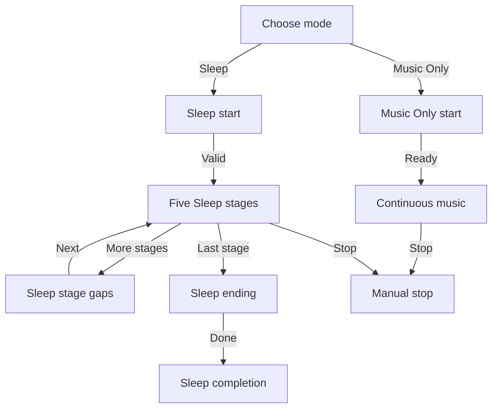
```mermaid
flowchart TD
  choose["Choose mode"]
  sleep["Sleep start"]
  music["Music Only start"]
  stages["Five Sleep stages"]
  loop["Continuous music"]
  gap["Sleep stage gaps"]
  fade["Sleep ending"]
  stop["Manual stop"]
  complete["Sleep completion"]
  choose -->|"Sleep"| sleep
  choose -->|"Music Only"| music
  sleep -->|"Valid"| stages
  stages -->|"More stages"| gap
  gap -->|"Next"| stages
  stages -->|"Last stage"| fade
  fade -->|"Done"| complete
  music -->|"Ready"| loop
  loop -->|"Stop"| stop
  stages -->|"Stop"| stop
```

| Step | Current behavior |
| --- | --- |
| Choose mode | Music Only is public. Sleep is visible only after the shared seven-tap-and-password Advanced Features unlock; direct locked activation is rejected. Both bypass normal guided preparation and chakra narration. |
| Sleep start | DND reminder; load content; exactly five valid stage frequencies required. Sleep dimming multiplies user brightness by 0.4 without filtering the app ancestor; fixed controls retain viewport positioning. |
| Music Only start | Show background symbol; no session countdown; request wake lock. |
| Five Sleep stages | Drowsiness 10 → Light Sleep 6 → True Sleep 5 → Deep Sleep 2 → REM Rest 6 Hz (script values). Each uses configured minutes and its own bounded sleep drone. |
| Continuous music | Background loop and visual pulse continue until user stops. No ordinary completion. |
| Sleep stage gaps | Stop drone after each stage; actual journey waits 3 seconds between stages. |
| Sleep ending | Fade background music for 12 seconds, then finish if still active. |
| Manual stop | Shared stop cleanup → Lobby; no completed-journey increment. |
| Sleep completion | Stats and completion modal; sleep dimming removed. |

- Sleep does not narrate. Its actual gap is hardcoded to 3 seconds, while its estimate reads script intervalSeconds. Music Only does not start the optional ambience through its normal route.

## Box breathing and Ho’oponopono

Standalone practices launched through shared guided startup.

Sources: [app.js:4626](/Users/lekshmisyam/Desktop/Ikigai/lite/app.js:4626), [app.js:4844](/Users/lekshmisyam/Desktop/Ikigai/lite/app.js:4844), [app.js:5459](/Users/lekshmisyam/Desktop/Ikigai/lite/app.js:5459).

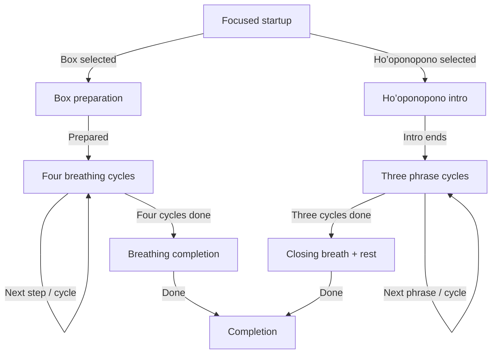
```mermaid
flowchart TD
  start["Focused startup"]
  box["Box preparation"]
  hoo["Ho’oponopono intro"]
  cycles["Four breathing cycles"]
  phrases["Three phrase cycles"]
  boxdone["Breathing completion"]
  hoodone["Closing breath + rest"]
  finish["Completion"]
  start -->|"Box selected"| box
  start -->|"Ho’oponopono selected"| hoo
  box -->|"Prepared"| cycles
  cycles -->|"Next step / cycle"| cycles
  cycles -->|"Four cycles done"| boxdone
  hoo -->|"Intro ends"| phrases
  phrases -->|"Next phrase / cycle"| phrases
  phrases -->|"Three cycles done"| hoodone
  boxdone -->|"Done"| finish
  hoodone -->|"Done"| finish
```

| Step | Current behavior |
| --- | --- |
| Focused startup | DND, load/validate scripts, audio, Piper warmup; bypass ordinary Arriving / chakra wrapper. |
| Box preparation | Breathing screen; fade music out; centering guidance and preparation gap. |
| Ho’oponopono intro | Meditation screen; intro narration and short pause. |
| Four breathing cycles | Each cycle uses four localized steps: inhale, hold, exhale, hold; visual circle and step timer. |
| Three phrase cycles | Narrate all four phrases, with pauses, three times. |
| Breathing completion | Completion guidance; restore music; completion settle. |
| Closing breath + rest | Closing narration fades music; final rest default 15 seconds. |
| Completion | Common stats and completion modal. |

- Neither route automatically appends a chakra journey. Box step length comes from timeBreathing; its ordinary Settings timing row is hidden in the current UI.

## Yoga experience

Advanced Features-gated rest, bathing and selected poses.

Sources: [app.js:6480](/Users/lekshmisyam/Desktop/Ikigai/lite/app.js:6480), [app.js:6621](/Users/lekshmisyam/Desktop/Ikigai/lite/app.js:6621), [index.html:448](/Users/lekshmisyam/Desktop/Ikigai/lite/index.html:448), [timing-config.json:1](/Users/lekshmisyam/Desktop/Ikigai/lite/timing-config.json:1).

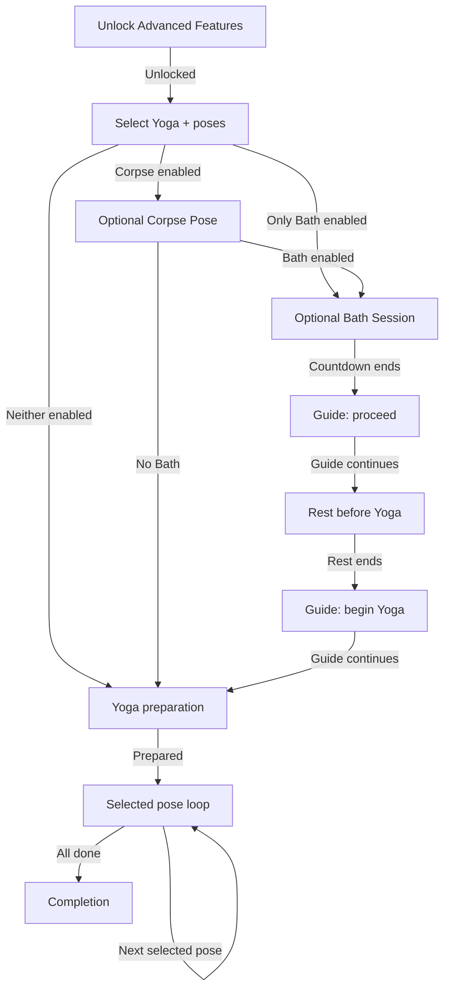
```mermaid
flowchart TD
  unlock["Unlock Advanced Features"]
  begin["Select Yoga + poses"]
  corpse["Optional Corpse Pose"]
  bath["Optional Bath Session"]
  gate1["Guide: proceed"]
  rest["Rest before Yoga"]
  gate2["Guide: begin Yoga"]
  prep["Yoga preparation"]
  poses["Selected pose loop"]
  finish["Completion"]
  unlock -->|"Unlocked"| begin
  begin -->|"Corpse enabled"| corpse
  begin -->|"Only Bath enabled"| bath
  begin -->|"Neither enabled"| prep
  corpse -->|"Bath enabled"| bath
  corpse -->|"No Bath"| prep
  bath -->|"Countdown ends"| gate1
  gate1 -->|"Guide continues"| rest
  rest -->|"Rest ends"| gate2
  gate2 -->|"Guide continues"| prep
  prep -->|"Prepared"| poses
  poses -->|"Next selected pose"| poses
  poses -->|"All done"| finish
```

| Step | Current behavior |
| --- | --- |
| Unlock Advanced Features | Seven rapid App version taps and password verification reveal and enable Yoga for this page load. Reload or switching Advanced Features off hides, disables and clears Yoga. |
| Select Yoga + poses | At least one selected pose required at Begin. A locked direct selection or start is rejected before audio initialization. Shared focused startup. |
| Optional Corpse Pose | Intro → stillness countdown → transition narration at configured point → settle. |
| Optional Bath Session | Intro → instructions → countdown with reminder at 60 seconds. |
| Guide: proceed | Bath completion waits for explicit Continue; does not advance automatically. |
| Rest before Yoga | Default 900 seconds (15 minutes), followed by another guide confirmation. |
| Guide: begin Yoga | Button becomes available after rest; paused session cannot advance. |
| Yoga preparation | 136.1 Hz bounded drone if permitted; intro + preparation narration; prep countdown. |
| Selected pose loop | Pose name/image → explanation → hold countdown → next-pose prompt and gap. |
| Completion | Session-complete narration → settle → common completion. |

- Yoga shares the session-only Advanced Features gate with Sleep, Shots and Intimate Service. Corpse Pose and Bath can be independently enabled. Runtime pose order comes from the script filtered by selected pose IDs. Guide waits have unbounded duration beyond the displayed session estimate.

## Intimate Service and massage

All seven nonempty combinations follow this ordered composition.

Sources: [app.js:6872](/Users/lekshmisyam/Desktop/Ikigai/lite/app.js:6872), [app.js:5615](/Users/lekshmisyam/Desktop/Ikigai/lite/app.js:5615).

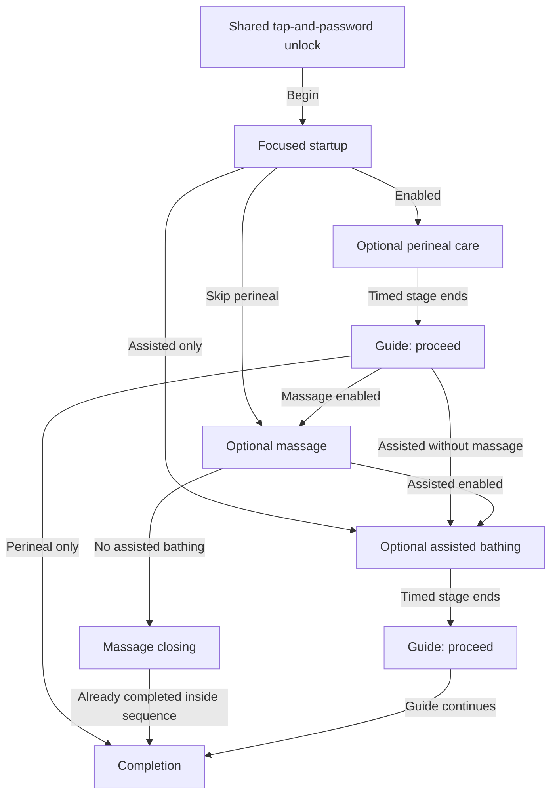
```mermaid
flowchart TD
  unlock["Shared tap-and-password unlock"]
  start["Focused startup"]
  perineal["Optional perineal care"]
  gate1["Guide: proceed"]
  massage["Optional massage"]
  closing["Massage closing"]
  assisted["Optional assisted bathing"]
  gate2["Guide: proceed"]
  finish["Completion"]
  unlock -->|"Begin"| start
  start -->|"Enabled"| perineal
  start -->|"Skip perineal"| massage
  start -->|"Assisted only"| assisted
  perineal -->|"Timed stage ends"| gate1
  gate1 -->|"Massage enabled"| massage
  gate1 -->|"Assisted without massage"| assisted
  gate1 -->|"Perineal only"| finish
  massage -->|"No assisted bathing"| closing
  massage -->|"Assisted enabled"| assisted
  closing -->|"Already completed inside sequence"| finish
  assisted -->|"Timed stage ends"| gate2
  gate2 -->|"Guide continues"| finish
```

| Step | Current behavior |
| --- | --- |
| Shared tap-and-password unlock | Settings → About → App version: seven rapid taps then a successful password prompt reveal care and Shots together. Both are locked and choices reset each page load. Select any nonempty subset of care options. |
| Focused startup | No ordinary Arrival, gratitude, personal intention or Emergence wrapper. |
| Optional perineal care | Narrate intro/instructions → timed stage → 60-second reminder if reached. |
| Guide: proceed | Wait for explicit Continue. |
| Optional massage | Full seven-chakra sequence in reverse: Crown → Third Eye → Throat → Heart → Solar → Sacral → Root. |
| Massage closing | If no assisted bathing follows: final silence and closing, then finish inside runSequence. |
| Optional assisted bathing | Intro/instructions → timed stage → reminder; massage sequence used complete:false if this follows. |
| Guide: proceed | Assisted-bath ending waits for explicit Continue. |
| Completion | Outer focused route calls finish if session remains active. |

- Current behavior: when assisted bathing follows massage, shared silence/closing is skipped and is not called after the bath. A nearby comment says closing is deferred, but the executable path does not perform it. This is recorded for a later fix decision.

## Sound Shots

Six types, confirmation, frequency validation, and distinct finish behavior.

Sources: [app.js:4561](/Users/lekshmisyam/Desktop/Ikigai/lite/app.js:4561), [app.js:6872](/Users/lekshmisyam/Desktop/Ikigai/lite/app.js:6872), [app.js:7117](/Users/lekshmisyam/Desktop/Ikigai/lite/app.js:7117), [index.html:257](/Users/lekshmisyam/Desktop/Ikigai/lite/index.html:257).

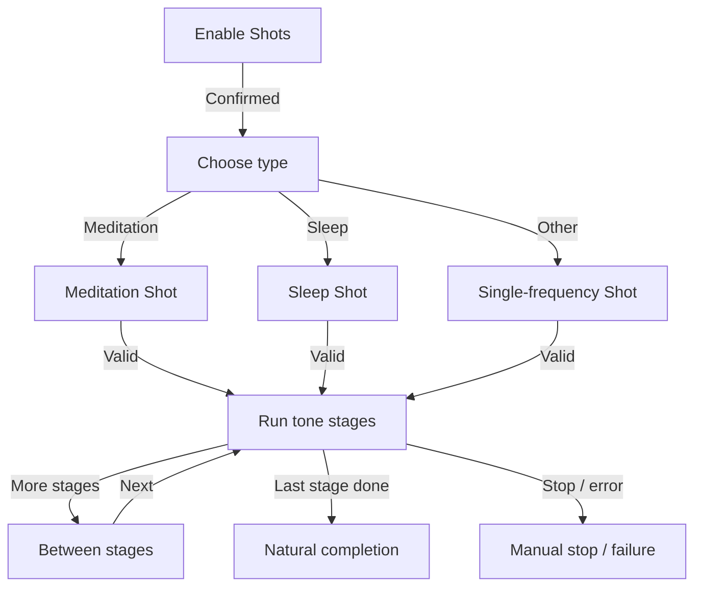
```mermaid
flowchart TD
  enable["Enable Shots"]
  type["Choose type"]
  med["Meditation Shot"]
  sleep["Sleep Shot"]
  single["Single-frequency Shot"]
  run["Run tone stages"]
  gaps["Between stages"]
  reload["Natural completion"]
  abort["Manual stop / failure"]
  enable -->|"Confirmed"| type
  type -->|"Meditation"| med
  type -->|"Sleep"| sleep
  type -->|"Other"| single
  med -->|"Valid"| run
  sleep -->|"Valid"| run
  single -->|"Valid"| run
  run -->|"More stages"| gaps
  gaps -->|"Next"| run
  run -->|"Last stage done"| reload
  run -->|"Stop / error"| abort
```

| Step | Current behavior |
| --- | --- |
| Enable Shots | Heading and controls start hidden/disabled. Shared seven-tap-and-password Advanced Features unlock reveals them alongside care. Relock clears Shots selection; reload locks again. Locked direct execution is rejected. No Frequency → blocked; otherwise confirm. Cancel leaves Shots off. |
| Choose type | Meditation, HRIM, Anesthetic, Mood & Relaxation, Sleep, or Custom. Labels here describe app modes. |
| Meditation Shot | Root 396 → Sacral 417 → Solar 528 → Heart 639 → Throat 741 → Third Eye 852 → Crown 963 Hz. Ignores selected chakra subset. |
| Sleep Shot | Script sequence: 10 → 6 → 5 → 2 → 6 Hz. |
| Single-frequency Shot | HRIM 528 Hz; Anesthetic 174 Hz; Mood & Relaxation 221.23 Hz; or custom finite frequency >0 and ≤20,000 Hz. These are app data values. |
| Run tone stages | No music or narration; divide selected total active seconds equally across stages. |
| Between stages | Meditation: 2 seconds; Sleep: script intervalSeconds, falling back to 2. |
| Natural completion | Stop sound, hide controls, release wake lock, show Lobby then reload page. |
| Manual stop / failure | Manual Stop uses shared stop; activation failure alerts and uses stopShot. No stats increment. |

- Single-frequency default is 1 second; multi-stage default 7 seconds; selected duration range 1–20 seconds. Displayed total active seconds excludes inter-stage gaps; countdown includes them.

## Experiment activities

Isolated activities and return behavior.

Sources: [app.js:4716](/Users/lekshmisyam/Desktop/Ikigai/lite/app.js:4716), [app.js:7481](/Users/lekshmisyam/Desktop/Ikigai/lite/app.js:7481), [index.html:210](/Users/lekshmisyam/Desktop/Ikigai/lite/index.html:210).

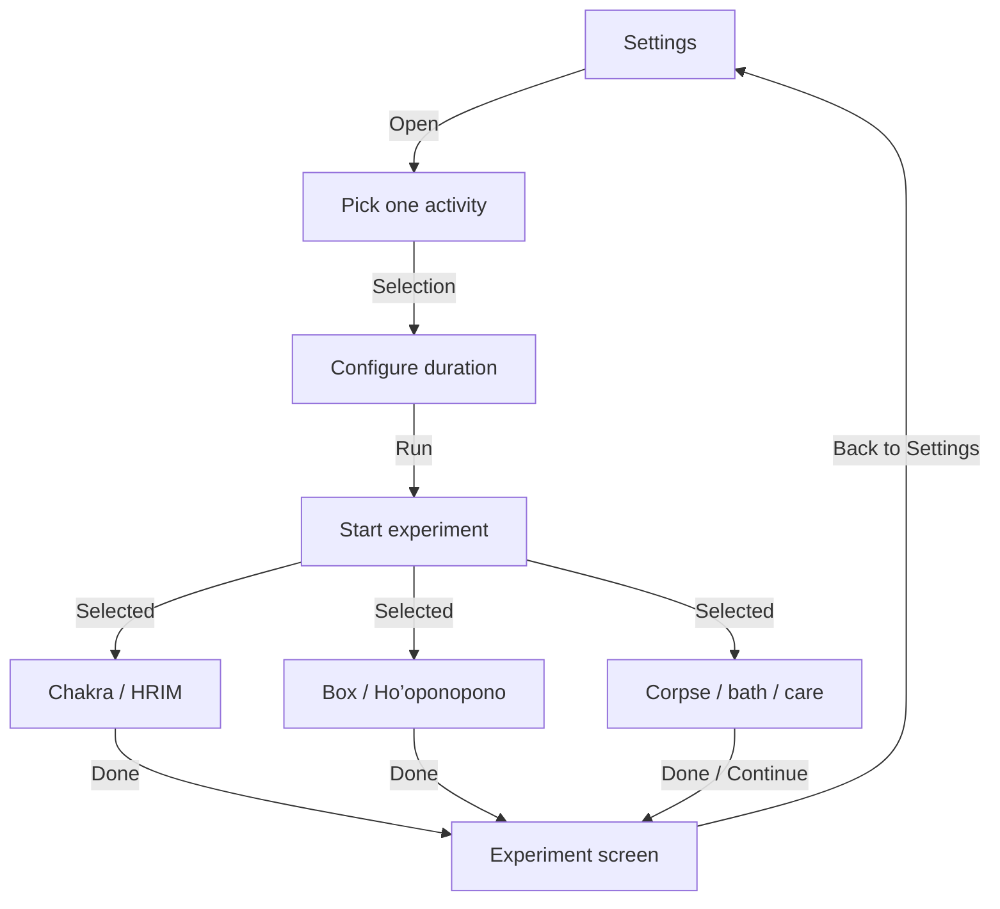
```mermaid
flowchart TD
  settings["Settings"]
  pick["Pick one activity"]
  duration["Configure duration"]
  start["Start experiment"]
  chakra["Chakra / HRIM"]
  practice["Box / Ho’oponopono"]
  care["Corpse / bath / care"]
  return["Experiment screen"]
  settings -->|"Open"| pick
  pick -->|"Selection"| duration
  duration -->|"Run"| start
  start -->|"Selected"| chakra
  start -->|"Selected"| practice
  start -->|"Selected"| care
  chakra -->|"Done"| return
  practice -->|"Done"| return
  care -->|"Done / Continue"| return
  return -->|"Back to Settings"| settings
```

| Step | Current behavior |
| --- | --- |
| Settings | Open Experiment Mode. |
| Pick one activity | Seven individual chakras, HRIM, Box, Ho’oponopono and Corpse Pose are always available. Perineal Care, Bath and Assisted Bath are absent from the native activity picker until the shared seven-tap-and-password Advanced Features unlock. Relocking removes care options, resets a selected care activity to Root and refreshes duration controls. Reload starts locked. |
| Configure duration | Chakra/HRIM use minutes; Box uses seconds per step; care and Corpse routines consume seconds. |
| Start experiment | Reject care activities while Advanced features is locked, before loading content or starting audio. Otherwise load selected content; initialize audio, ambience and wake lock; set experiment flag and countdown. |
| Chakra / HRIM | Run one meditateOnChakra with duration override. |
| Box / Ho’oponopono | Call corresponding focused routine directly. |
| Corpse / bath / care | Call isolated routine; bath/care includes guide-controlled Continue. |
| Experiment screen | Natural end and caught failure use stopExperiment; visible Stop uses shared stop which also returns here. |

- Current inconsistency: UI assigns sec or min, while startExperiment tests for seconds. Countdown therefore treats sec as minutes; care UI also labels raw seconds as min. Ho’oponopono has no duration control, but startExperiment still reads the hidden value. No ordinary completion modal or stats update is used.

## Ordered Chakra Journey add-ons

Box → Visualization → Dharana → Body Scan → Guided Noting → chakras.

Sources: [modules/journey-routing.js:1](/Users/lekshmisyam/Desktop/Ikigai/lite/modules/journey-routing.js:1), [modules/box-breathing-practice.js:1](/Users/lekshmisyam/Desktop/Ikigai/lite/modules/box-breathing-practice.js:1), [modules/visualization-practice.js:1](/Users/lekshmisyam/Desktop/Ikigai/lite/modules/visualization-practice.js:1), [modules/dharana-practice.js:1](/Users/lekshmisyam/Desktop/Ikigai/lite/modules/dharana-practice.js:1), [modules/body-scan-practice.js:1](/Users/lekshmisyam/Desktop/Ikigai/lite/modules/body-scan-practice.js:1), [modules/guided-noting-practice.js:1](/Users/lekshmisyam/Desktop/Ikigai/lite/modules/guided-noting-practice.js:1), [modules/hooponopono-practice.js:1](/Users/lekshmisyam/Desktop/Ikigai/lite/modules/hooponopono-practice.js:1), [modules/undo-unlearn-practice.js:1](/Users/lekshmisyam/Desktop/Ikigai/lite/modules/undo-unlearn-practice.js:1), [modules/session-estimate.js:1](/Users/lekshmisyam/Desktop/Ikigai/lite/modules/session-estimate.js:1), [app.js:4973](/Users/lekshmisyam/Desktop/Ikigai/lite/app.js:4973), [app.js:5001](/Users/lekshmisyam/Desktop/Ikigai/lite/app.js:5001), [app.js:5487](/Users/lekshmisyam/Desktop/Ikigai/lite/app.js:5487), [app.js:5529](/Users/lekshmisyam/Desktop/Ikigai/lite/app.js:5529), [app.js:5549](/Users/lekshmisyam/Desktop/Ikigai/lite/app.js:5549), [app.js:7362](/Users/lekshmisyam/Desktop/Ikigai/lite/app.js:7362), [index.html:322](/Users/lekshmisyam/Desktop/Ikigai/lite/index.html:322).

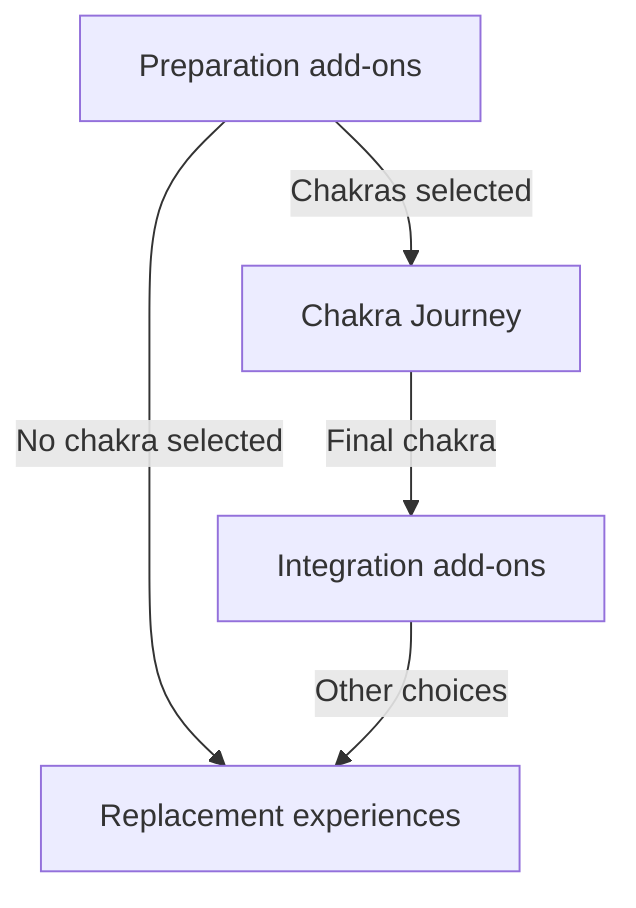
```mermaid
flowchart TD
  prepare["Preparation add-ons"]
  chakras["Chakra Journey"]
  integrate["Integration add-ons"]
  separate["Replacement experiences"]
  prepare -->|"Chakras selected"| chakras
  prepare -->|"No chakra selected"| separate
  chakras -->|"Final chakra"| integrate
  integrate -->|"Other choices"| separate
```

| Step | Current behavior |
| --- | --- |
| Preparation add-ons | All selectors remain independently combinable. Runtime/Lobby order is Box, Visualization, Dharana, Body Scan, then Guided Noting. Body Scan offers 3/5/8 minutes and eight non-corrective head-to-toe regions; its new module owns the timed narration, cancellation guard and black-scene fade/cleanup while the controller supplies localized copy and app services. Guided Noting offers 2/4/6 minutes, neutral private labels, four spaced reminders, permission to return to breath or stop, and a label-free closing. When no chakras are selected, these sessions and Ho’oponopono/Undo & Unlearn run alone; the roadmap shows only the selected standalone stages. With chakras selected, preparation precedes the chakra journey and integration practices follow it. |
| Chakra Journey | One or more selected chakras run in the usual chosen order. |
| Integration add-ons | After the final chakra, optional Ho’oponopono runs first, then optional Undo & Unlearn, before silence, Closing and Emergence. Undo & Unlearn offers 5/8/12 minutes and never asks the meditator to identify, recall, speak, type or mentally answer anything. |
| Replacement experiences | Yoga remains a standalone pose-based experience; HRIM, Sleep, Music Only, Shots and Intimate Service also replace the normal Chakra Journey. |

- Preparation stages execute sequentially in the canonical order; the routing owner stops before the next stage if the session becomes inactive. Box Breathing execution lives in `modules/box-breathing-practice.js`; Visualization blackout/audio/narration/return timing in `modules/visualization-practice.js`; Ho’oponopono phrase-cycle timing and visual setup in `modules/hooponopono-practice.js`; Undo & Unlearn phase/scene lifecycle in `modules/undo-unlearn-practice.js`; Dharana in `modules/dharana-practice.js`; Body Scan in `modules/body-scan-practice.js`; Guided Noting in `modules/guided-noting-practice.js`. The controller supplies localized narration, timing and existing screen/audio/session services. Box Breathing preserves its four-step/four-cycle order, 100 ms pause accounting and music fades. Visualization preserves optional ambience/error fallback, ducked narration, waits, selected duration, silence wake prompt, return-screen fades, ambience stop and music restoration. Ho’oponopono preserves the three four-phrase cycles, configured pauses and closing fade handoff; journey placement remains after the chakra sequence. Undo & Unlearn preserves the selected duration, translated content-free phases and active-session guards, and always hides the scene/releases body mode even if its fade wait rejects. The Lobby estimate owner preserves mode priority, timing/default inputs and the standard add-on formula while app.js refreshes its text and roadmap. Dharana preserves selected anchor shape/color, duration-based CSS timing plus an active-session shrink clock for reduced-motion mode, the four-second narrated release and cleanup. Guided Noting preserves its selected duration, four translated neutral reminders, active-session checks, black-scene five-second fade and cleanup on narration/fade failure. Body Scan, Guided Noting and Undo & Unlearn use only pitch-black fades: no figure, text labels, recurring canvas loop or decorative animation. Undo & Unlearn is content-free: no memory search, private answer or examples; its three forgiveness invitations preserve responsibility, safety, boundaries and choice. It cannot claim another person has forgiven the meditator. Replacement experiences clear every add-on. All narration is contract-checked in the four Meditation Languages.

## Lobby journey roadmap

Localized, display-only summary of the currently selected Lobby route.

Sources: [modules/journey-roadmap.js:1](/Users/lekshmisyam/Desktop/Ikigai/lite/modules/journey-roadmap.js:1), [tests/journey-roadmap.test.mjs:1](/Users/lekshmisyam/Desktop/Ikigai/lite/tests/journey-roadmap.test.mjs:1), [app.js:726](/Users/lekshmisyam/Desktop/Ikigai/lite/app.js:726).

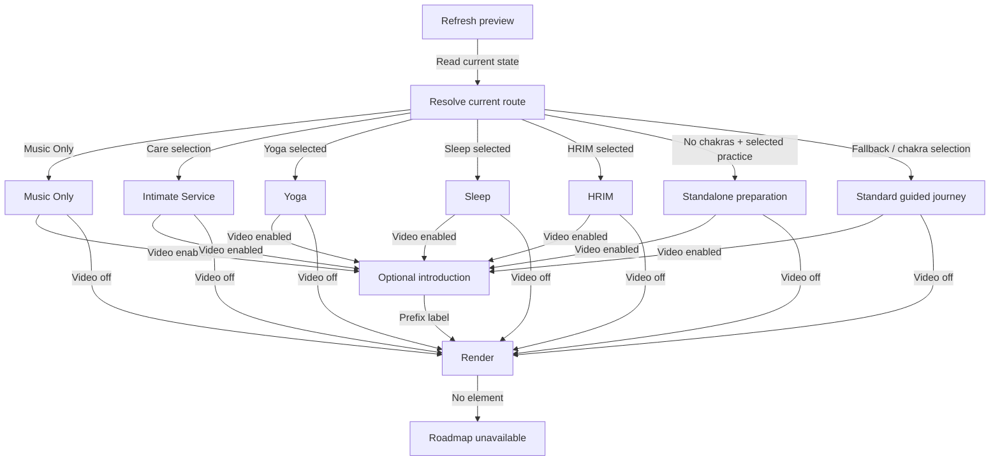
```mermaid
flowchart TD
  refresh["Refresh preview"]
  priority["Resolve current route"]
  music["Music Only"]
  care["Intimate Service"]
  yoga["Yoga"]
  sleep["Sleep"]
  hrim["HRIM"]
  standalone["Standalone preparation"]
  guided["Standard guided journey"]
  video["Optional introduction"]
  render["Render"]
  noTarget["Roadmap unavailable"]
  refresh -->|"Read current state"| priority
  priority -->|"Music Only"| music
  priority -->|"Care selection"| care
  priority -->|"Yoga selected"| yoga
  priority -->|"Sleep selected"| sleep
  priority -->|"HRIM selected"| hrim
  priority -->|"No chakras + selected practice"| standalone
  priority -->|"Fallback / chakra selection"| guided
  music -->|"Video enabled"| video
  care -->|"Video enabled"| video
  yoga -->|"Video enabled"| video
  sleep -->|"Video enabled"| video
  hrim -->|"Video enabled"| video
  standalone -->|"Video enabled"| video
  guided -->|"Video enabled"| video
  music -->|"Video off"| render
  care -->|"Video off"| render
  yoga -->|"Video off"| render
  sleep -->|"Video off"| render
  hrim -->|"Video off"| render
  standalone -->|"Video off"| render
  guided -->|"Video off"| render
  video -->|"Prefix label"| render
  render -->|"No element"| noTarget
```

| Step | Current behavior |
| --- | --- |
| Refresh preview | Lobby mode, add-on, chakra, returning-journey or video-prelude changes request a label recalculation. The preview itself never starts a journey or saves selections. |
| Resolve current route | Music Only → any Intimate Service choice → Yoga → Sleep → HRIM → standalone preparation when no chakras are selected and at least one standalone practice is chosen → standard chakra path. |
| Music Only | One Music Only label. |
| Intimate Service | Only selected care stages, preserving Perineal Care → Massage → Assisted Bathing label order. |
| Yoga | Optional Corpse Pose → optional Bath → Rest Before Yoga → Yoga. |
| Sleep | Sleep → Drowsiness → Light Sleep → True Sleep → Deep Sleep → REM Rest. |
| HRIM | Intention → HRIM → Closing. |
| Standalone preparation | Box → Visualization → Focused Attention → Body Scan → Guided Noting → Ho’oponopono → Undo & Unlearn; only selected stages are included. |
| Standard guided journey | Arrival or Returning → Intention → Chakras, with selected preparation labels inserted in their established order and optional integration stages before Closing. |
| Optional introduction | When the Lobby video preference is enabled, prepend the translated Video Introduction label; this preview label does not play the video. |
| Render | Resolve every label through the current display-language translator and join with the existing » separator. |
| Roadmap unavailable | If the preview element is absent, return without changing anything. |

- The roadmap is a localized preview only. Begin validation and actual dispatch remain in the app/routing owner. Current behavior falls back to standard guided labels when no chakra is selected and no standalone add-on is checked; this preview does not itself enforce Begin eligibility.

## Pause, stop and live controls

Shared interaction and cancellation behavior.

Sources: [app.js:3778](/Users/lekshmisyam/Desktop/Ikigai/lite/app.js:3778), [app.js:3831](/Users/lekshmisyam/Desktop/Ikigai/lite/app.js:3831), [app.js:3850](/Users/lekshmisyam/Desktop/Ikigai/lite/app.js:3850).

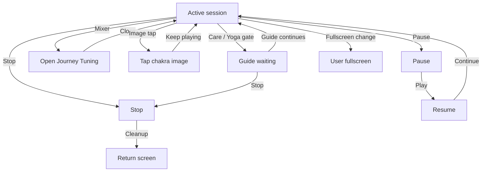
```mermaid
flowchart TD
  active["Active session"]
  pause["Pause"]
  mixer["Open Journey Tuning"]
  stop["Stop"]
  resume["Resume"]
  image["Tap chakra image"]
  return["Return screen"]
  wait["Guide waiting"]
  fullscreen["User fullscreen"]
  active -->|"Pause"| pause
  pause -->|"Play"| resume
  resume -->|"Continue"| active
  active -->|"Mixer"| mixer
  mixer -->|"Close"| active
  active -->|"Stop"| stop
  stop -->|"Cleanup"| return
  active -->|"Image tap"| image
  image -->|"Keep playing"| active
  active -->|"Care / Yoga gate"| wait
  wait -->|"Guide continues"| active
  wait -->|"Stop"| stop
  active -->|"Fullscreen change"| fullscreen
```

| Step | Current behavior |
| --- | --- |
| Active session | Active journeys hide bottom controls including the mixer toggle in normal and fullscreen views. Hover bottom/control area to reveal; leave for 180 ms to hide. While visible, the reveal zone yields pointer events to the control strip so its buttons remain clickable. Cursor hides after 3s idle and returns on movement without revealing controls elsewhere. Touch/pen tap reveals controls for 3s; keyboard focus reveals them. Open mixer preserves visibility and cursor; session exit/page hiding clears timers and hidden cursor. Sleep and Eyes Close use opacity factors instead of ancestor filters, keeping fixed controls/reveal area viewport-positioned. One-shot timers and class observation, no animation loop. |
| Pause | Non-Lobby/Settings screens already have static sky and decorative effects. Set isPaused; freeze stage countdowns; cancel browser speech; pause Piper; suspend AudioContext. |
| Open Journey Tuning | Opening mixer does not pause. Volume, voice, space, ambience, brightness and suppression controls apply live. |
| Stop | Cancel narration jobs/timers; Piper fades over two seconds, mantra/music/ambience over eight seconds with effect tails. Do not restore music during Stop. Browser speech cancellation remains immediate. Stop visuals, resolve guide wait false and hide controls/mixer. |
| Resume | Resume Piper/context. Ordinary browser narration replays the interrupted sentence if pause was observed. |
| Tap chakra image | Toggle session text overlay; session continues. |
| Return screen | Experiment → Experiment screen; other modes → Lobby. No completion statistics. |
| Guide waiting | Continue is accepted only when active and not paused; Stop releases the pending wait. |
| User fullscreen | Track fullscreen on app container. Bottom controls share normal-journey hover/touch/keyboard behavior; fullscreen top timers still follow the reveal state. |

- The app no longer requests or exits fullscreen automatically. Browser-speech cancellation and Piper buffer suspension are different pause mechanisms. Re-enable No Mantra does not immediately restart a previously skipped mantra stage.

## Optional Lobby video introduction

An explicit Lobby preference plays the cinematic introduction before one journey start; Restart stays immediate.

Sources: [app.js:3778](/Users/lekshmisyam/Desktop/Ikigai/lite/app.js:3778), [app.js:3831](/Users/lekshmisyam/Desktop/Ikigai/lite/app.js:3831), [app.js:62](/Users/lekshmisyam/Desktop/Ikigai/lite/app.js:62).

```mermaid
flowchart TD
  lobby["Lobby → Include video introduction"]
  buffer["Prepare and buffer"]
  ready["Begin introduction"]
  hold["Image hold → playback"]
  recover["Buffer recovery"]
  end["Normal video ending"]
  error["Unavailable video"]
  dispatch["Begin journey"]
  lobby -->|"Option selected + Begin"| buffer
  buffer -->|"Ready / timeout"| ready
  ready -->|"User clicks"| hold
  hold -->|"Buffer low"| recover
  recover -->|"Recovered"| hold
  hold -->|"Ended"| end
  buffer -->|"Failure"| error
  hold -->|"Failure"| error
  end -->|"Reminder acknowledged"| dispatch
  error -->|"Normal reminder remains"| dispatch
```

| Step | Current behavior |
| --- | --- |
| Lobby → Include video introduction | The option carries a localized “Cosmic Consciousness Introduction” subtitle. Its persisted choice defaults OFF and appears in the roadmap for every supported journey family. A normal journey with no selected chakras is rejected at the original Begin click, before video preparation. |
| Prepare and buffer | Paused/silent video with meditator image. Target 4 / 6 / 8 seconds by connection, with stability check. |
| Begin introduction | Reveal button when ready OR after the 90-second bounded wait. Explicit user action required. |
| Image hold → playback | Hold image 3 seconds, then video; remove the readiness-only dark shade. The meditator image and video render fully opaque. Loading and Begin content uses a near-solid dark backing with sharp white text for readability. The prelude is outside ordinary screen dimming, so saved brightness, Sleep and Eyes Close cannot make it translucent. Audio fades in over 2.4 seconds using separate video volume. |
| Buffer recovery | Below 2 seconds ahead pauses except near end; waiting/stalled enters recovery. Resume at up to 4 seconds, bounded by remaining clip. |
| Normal video ending | Final 0.25-second audiovisual fade; acknowledge DND reminder. |
| Unavailable video | Missing media, preparation failure, media error or rejected play: unavailable result; error path fades 1.2 seconds. |
| Begin journey | Continue through the current Lobby mode selection exactly once. Restart bypasses this optional prelude and relaunches directly. |

- No skip control and no automatic fullscreen. A buffer countdown reports seconds of media still needed, not a measured wall-clock download ETA. Settings audio preview is separate: play 8 seconds, fade and reset without starting a journey.

## Completion, statistics and external handoff

Different end states are intentionally visible here.

Sources: [app.js:5840](/Users/lekshmisyam/Desktop/Ikigai/lite/app.js:5840), [app.js:550](/Users/lekshmisyam/Desktop/Ikigai/lite/app.js:550), [index.html:659](/Users/lekshmisyam/Desktop/Ikigai/lite/index.html:659).

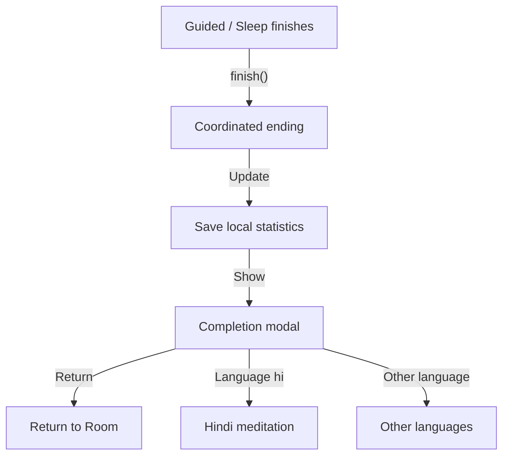
```mermaid
flowchart TD
  natural["Guided / Sleep finishes"]
  cleanup["Coordinated ending"]
  stats["Save local statistics"]
  modal["Completion modal"]
  return["Return to Room"]
  hi["Hindi meditation"]
  earn["Other languages"]
  natural -->|"finish()"| cleanup
  cleanup -->|"Update"| stats
  stats -->|"Show"| modal
  modal -->|"Return"| return
  modal -->|"Language hi"| hi
  modal -->|"Other language"| earn
```

| Step | Current behavior |
| --- | --- |
| Guided / Sleep finishes | Shared finish() for standard, HRIM, focused practices and Sleep. |
| Coordinated ending | Cancel narration and drones; stop mantra without restoring music; fade music; hide controls and clear visuals. |
| Save local statistics | Increment journey count and add rounded wall-clock minutes since start, minimum one. Pause time is included. |
| Completion modal | Show completion message, totals, session time and Return to Room. |
| Return to Room | Cancel pending Earn reveal; hide modal; open Lobby. |
| Hindi meditation | No Earn link. Eligibility uses meditation language, not display language. |
| Other languages | After 3 seconds reveal native Continue to Earn link; user click navigates externally. |

- Earn destination is https://missionode.github.io/earn-app/receive.html?Source=Lite. No automatic navigation. Shots, manual stops, and experiments do not use this stats/completion path.

## Scripts, language and timing

Content selection, validation, fallback and demo behavior.

Sources: [modules/content-localization.js:1](/Users/lekshmisyam/Desktop/Ikigai/lite/modules/content-localization.js:1), [app.js:641](/Users/lekshmisyam/Desktop/Ikigai/lite/app.js:641), [app.js:944](/Users/lekshmisyam/Desktop/Ikigai/lite/app.js:944), [app.js:1160](/Users/lekshmisyam/Desktop/Ikigai/lite/app.js:1160), [app.js:7176](/Users/lekshmisyam/Desktop/Ikigai/lite/app.js:7176), [scripts.json:1](/Users/lekshmisyam/Desktop/Ikigai/lite/scripts.json:1), [language-manifest.json:1](/Users/lekshmisyam/Desktop/Ikigai/lite/language-manifest.json:1).

```mermaid
flowchart TD
  settings["Content settings"]
  default["Default content"]
  custom["Custom JSON"]
  demo["Demo metadata?"]
  validate["Start-time validation"]
  resolve["Resolve narration"]
  ui["Resolve UI labels"]
  voice["Resolve voice"]
  timing["Timing layers"]
  settings -->|"Default"| default
  settings -->|"Custom"| custom
  custom -->|"Valid bundle"| demo
  default -->|"Begin"| validate
  demo -->|"Begin"| validate
  validate -->|"Valid"| resolve
  resolve -->|"Speak"| voice
  settings -->|"Language choice"| ui
  timing -->|"Durations"| validate
  validate -->|"Invalid → error / stop"| settings
```

| Step | Current behavior |
| --- | --- |
| Content settings | Choose meditation language, display language, voice and default/custom script source. |
| Default content | All four languages currently point to scripts.json. Journey fetch appends a timestamp query. |
| Custom JSON | Upload file or fetch URL; validate required schema; store bundle in localStorage. Invalid input shows error. |
| Demo metadata? | Recognized demo bundle applies demo timing preset; switching away restores earlier core duration. |
| Start-time validation | Shared guided start validates sections needed for selected practice; custom allows language fallback. |
| Resolve narration | Meditation language → configured fallback language → English / available localized value. Custom system overrides are optional. |
| Resolve UI labels | Settings/Lobby use display language; journey labels and sky names use meditation language. |
| Resolve voice | Matching browser voice or supported configured Piper voice; Hindi has no default Piper voice. |
| Timing layers | Built-in defaults → timing-config → optional named query profile → saved preferences; demo changes selected core duration. |

- Default add-on narration is complete in English, Malayalam, Hindi and Russian. The production Malayalam fields in scripts.json use a calm, consistent spoken register, natural sentence pacing and corrected care/yoga terminology; Ho’oponopono preserves its four canonical meanings. Box/Dharana/Visualization resolve from locale bundles; Ho’oponopono resolves from scripts.json. Automated checks establish key presence, non-empty copy and expected phrase/step counts, not audible pronunciation quality. Sleep and Shots validate stage frequencies in their own routes. Shots load default language content when a script load is needed; an already-loaded script may be reused. Experiments do not run the same guided schema validation.

## Narration and fallback

Piper synthesis pipeline versus browser speech.

Sources: [modules/media-lifecycle.js:1](/Users/lekshmisyam/Desktop/Ikigai/lite/modules/media-lifecycle.js:1), [modules/piper-lifecycle.js:1](/Users/lekshmisyam/Desktop/Ikigai/lite/modules/piper-lifecycle.js:1), [app.js:5401](/Users/lekshmisyam/Desktop/Ikigai/lite/app.js:5401), [app.js:6092](/Users/lekshmisyam/Desktop/Ikigai/lite/app.js:6092), [piper-worker.js:1](/Users/lekshmisyam/Desktop/Ikigai/lite/piper-worker.js:1), [piper/runtime/bounded-phonemizer.js:1](/Users/lekshmisyam/Desktop/Ikigai/lite/piper/runtime/bounded-phonemizer.js:1), [piper/runtime/piper-tts-web.js:322](/Users/lekshmisyam/Desktop/Ikigai/lite/piper/runtime/piper-tts-web.js:322).

```mermaid
flowchart TD
  text["Localized text"]
  route["Voice engine choice"]
  piper["Piper worker"]
  browser["Browser speech"]
  decode["Decode + normalize ahead"]
  play["Play through Web Audio"]
  fallback["Piper sentence failure"]
  browserend["End / error / timeout"]
  handoff["Finish narration"]
  cancel["Stop / cancellation"]
  text -->|"Narrate"| route
  route -->|"Available"| piper
  route -->|"Else"| browser
  piper -->|"Blob"| decode
  decode -->|"Audio buffer"| play
  piper -->|"Failure"| fallback
  play -->|"Failure"| fallback
  fallback -->|"Remaining text"| browser
  browser -->|"Speech events"| browserend
  play -->|"Last clip"| handoff
  browserend -->|"Last sentence"| handoff
  play -->|"Stop"| cancel
  browser -->|"Stop"| cancel
```

| Step | Current behavior |
| --- | --- |
| Localized text | Narration is audio-only: no scrolling text surfaces or Settings toggle. Duck music unless silence requested; spoken audio and deliberate pauses continue unchanged. |
| Voice engine choice | Use Piper only when selected, supported and configured. |
| Piper worker | The piper-lifecycle module owns model configuration, serial worker requests, synthesis/decode caching, playback envelopes and cancellation. The media-lifecycle module splits text into at most 180 Unicode code points at word boundaries where possible. Prepare first clip, then only one future clip, beginning within twelve seconds of the current clip ending using pause-aware waiting. Reuse phonemizer for at most eight calls or 8,192 input characters before retirement; failed instances are retired. Each inference releases its input/output tensors after WAV creation, including failure cleanup. |
| Browser speech | Select matching voice and locale; apply pace/pitch/volume; speak each sentence. |
| Decode + normalize ahead | In-memory LRU cache keyed by text, voice definition and synthesis settings: at most 16 MiB and 48 decoded clips. Hits skip synthesis, decoding and normalization; misses prepare ahead. Evict oldest clips; oversized clips play uncached; cancelled preparation is never cached. No disk persistence. Reuse normalization per buffer via WeakMap. After preparation, recheck pause, session activity and Piper cancellation generation before playback. |
| Play through Web Audio | Play prepared speech through voice gain, tone controls and effects. |
| Piper sentence failure | Cancel Piper jobs; report fallback; use browser speech for failed and remaining sentences. |
| End / error / timeout | Browser events resolve sentence; timeout avoids waiting forever. Pause can replay interrupted sentence. |
| Finish narration | Sentence gaps; exit gap except mantra handoff; Piper clip fade-out capped at 50 ms to retain final words. Explicit music fade remains; duplicate-path swell removed. |
| Stop / cancellation | Invalidate narration and cancel worker jobs. Session Stop/completion ramps active Piper audio down over two seconds; its five-second Space response remains connected through the fade plus tail. Natural clip endings preserve final words. Browser speech cannot use this gain envelope and explicit Stop cancels it immediately. Intentional stop must not launch fallback speech. |

- Browser speech is outside the Web Audio effects chain. Voice Space/Warmth/Clarity processing applies to Piper audio; browser voice capabilities differ. Soft and interval prompts use related wrappers.

## Audio signal architecture

Logical buses; shared filters are expanded in selected-node details.

Sources: [modules/media-lifecycle.js:1](/Users/lekshmisyam/Desktop/Ikigai/lite/modules/media-lifecycle.js:1), [modules/piper-lifecycle.js:1](/Users/lekshmisyam/Desktop/Ikigai/lite/modules/piper-lifecycle.js:1), [modules/audio-route-lifecycle.js:1](/Users/lekshmisyam/Desktop/Ikigai/lite/modules/audio-route-lifecycle.js:1), [app.js:59](/Users/lekshmisyam/Desktop/Ikigai/lite/app.js:59), [app.js:1047](/Users/lekshmisyam/Desktop/Ikigai/lite/app.js:1047), [app.js:2150](/Users/lekshmisyam/Desktop/Ikigai/lite/app.js:2150), [app.js:2276](/Users/lekshmisyam/Desktop/Ikigai/lite/app.js:2276), [app.js:2627](/Users/lekshmisyam/Desktop/Ikigai/lite/app.js:2627).

```mermaid
flowchart TD
  piper["Piper voice"]
  mantra["Mantra MP3"]
  generated["Generated tones"]
  music["Background music"]
  video["Video audio"]
  ambience["Optional ambience"]
  shared["Shared processing"]
  limiter["Limiter → device"]
  speech["Browser speech"]
  piper -->|"Voice bus"| shared
  mantra -->|"Mantra bus"| shared
  generated -->|"Tone bus"| shared
  music -->|"Music bus"| shared
  video -->|"Video bus"| shared
  ambience -->|"Ambience bus"| shared
  shared -->|"Output"| limiter
```

| Step | Current behavior |
| --- | --- |
| Piper voice | Decoded clips → voice gain → warmth and clarity filters; centered dry voice stays intact. Parallel Voice Space: 180 Hz high-pass → fixed 35 ms pre-delay → 5-second diffuse impulse → low-pass → wet return. Light: 12% return / 3 kHz; Spacious: 18% / 3.6 kHz; Off silences send and return; Off or idle voice disconnects the convolution branch after its tail, reconnecting before Piper playback. Preset changes never sweep delay time. Tone inputs clamp to 0–100, invalid values use neutral 50; 250 ms parameter ramps hold current automation where supported. |
| Mantra MP3 | SeamlessLoop → mantra gain/filter → dry path and reverb tail → spatial panner. Six-second entry belongs to each loop, never zeroing the shared bus. Final Stop/completion uses an eight-second exit plus seven-second response. Stage handoffs instead split the existing post-mantra window into equal dry and wet-tail fades (default 2s + 2s), so affirmation cannot overlap the chant. New mantra entry restores the wet return. Filter modulation fades with the dry exit. Repeated loop Stop does not restart the envelope; restart cancels route retirement and reconnects. |
| Generated tones | Chakra/sleep drones retain configured main frequencies; ordinary main pitch modulation removed. Main sine filter opens to 4× pitch, capped at 45% sample rate. Original six-second drone entry retained; stop holds current gain automation where supported. Tone/filter/panner/gain nodes disconnect on source end. Shots honor zero volume; muted guided cues skip and nonfinite durations reject. Elemental layers retain their own modulation. No new harmonic layers. |
| Background music | Cached PCM equal-power overlap → one native looping source → independent loop level → linear music entry gain; dry gate and Music Space send; music spatial panner. Eight-second Stop fade plus five-second reverb response; Off/Stop disconnects convolution after tail/exit; music or video preparation restores the selected route. First playback preserves the original beginning; subsequent cycles enter just after the overlapped head. |
| Video audio | MediaElementSource → dedicated Video gain → music spatial panner and Music Space send. |
| Optional ambience | Local manifest or user URL → native equal-power layered loops → blur and spatial depth/panner. Blur Off/unused and ambience Stop retire convolution after fade/tail. Audio-clock deadlines freeze during suspension, disconnect on end, and are cancelled on reactivation; no polling. |
| Shared processing | Low-cut → Eyes Close filter → voice-carve filter → exciter → presence → compressor through one path. Filtered duplicate and transition swell removed; dedicated reverb tails remain. Music peaking EQ applies -3 dB when ducked and 0 dB at full level. Voice Space is independent of Spatial Sound; narration and bells stay centered. Primary drone/music/mantra positions remain in front, with restrained separation for speakers and HRTF headphones. Drone sway is 0.018 Hz with reduced depth; Off ramps it to zero. Music positioning also applies to prelude video and Music Space. Position changes hold current automation and ramp for 1.2 seconds; fallback stereo uses source bearing. Reapplying the same mode does not restart movement. Active ambience approaches from current depth instead of resetting; switching Off returns depth over 1.2 seconds. |
| Limiter → device | Shared chain ends in limiter and AudioContext destination. Bell gain connects directly to limiter. |
| Browser speech | Separate speechSynthesis output; not processed by the shared Web Audio graph. |

- Narration ducks music. Music/mantra gates overlap on entry and exit; completion does not restore music and uses one music exit envelope. Native loops do not depend on JavaScript timers and keep one source per layer; prepared overlap PCM is reused by original buffer and overlap length via WeakMap. Overlap remains bounded to half the buffer. Source cleanup follows audio time through pause and explicit exit fades. Elemental exit stops both noise and its modulator; source end disconnects filters and modulation gains. Music entry is linear with no second long source fade. Intentional silence and explicit mute remain. Spatial choices: Off, Stereo, Headphones, Room. PCM/mock tests do not establish device audibility, lack of silence inside recordings, or uninterrupted playback if the OS suspends audio.

## Sound options and live suppression

What changes when sound settings are toggled.

Sources: [app.js:7358](/Users/lekshmisyam/Desktop/Ikigai/lite/app.js:7358), [app.js:2891](/Users/lekshmisyam/Desktop/Ikigai/lite/app.js:2891), [app.js:3008](/Users/lekshmisyam/Desktop/Ikigai/lite/app.js:3008), [app.js:2253](/Users/lekshmisyam/Desktop/Ikigai/lite/app.js:2253).

```mermaid
flowchart TD
  mixer["Settings / Journey Tuning"]
  nofreq["No Frequency ON"]
  nomantra["No Mantra ON"]
  ambient["Mood ambience ON"]
  source["Ambience source"]
  tune["Ambience tuning"]
  fail["Optional source failure"]
  off["Disable / stop"]
  comfort["Comfort + volumes"]
  mixer -->|"Toggle"| nofreq
  mixer -->|"Toggle"| nomantra
  mixer -->|"Enable from Advanced Lobby"| ambient
  ambient -->|"Load"| source
  source -->|"Ready"| tune
  source -->|"Invalid / fetch failure"| fail
  tune -->|"Disable / finish / stop"| off
  mixer -->|"Tune"| comfort
```

| Step | Current behavior |
| --- | --- |
| Settings / Journey Tuning | Shared suppression settings, volume controls and comfort controls. Mood & Relaxation ambience lives in the Advanced Features Lobby panel. |
| No Frequency ON | Cancel drone timer; stop drone, frequency Shot, transition tone and ambience; disable Shots and ambience controls. |
| No Mantra ON | Cancel drone timer; stop drone and mantra; retain spoken guidance and music. |
| Mood ambience ON | Session-only enablement; starts if active and not Music Only; forces soft blur on. |
| Ambience source | Saved custom URL if present; otherwise manifest/local audio buffers. Empty URL restores default selection. |
| Ambience tuning | Intensity, gain, blur and spatial movement. Crossing above 5% gain asks confirmation; cancel restores prior display. |
| Optional source failure | Report status or warning; optional ambience may be unavailable. |
| Disable / stop | Fade ambience out; state and playback are separate. Re-enabling No Frequency only restarts eligible ambience automatically. |
| Comfort + volumes | Eyes Close dims app and changes filters; brightness, voice pace, space, music/video levels act on their buses. |

- No Frequency also suppresses generated bowl/anchor through audio-engine guards. No Mantra affects standard chakra/yoga drone starts, but is not a blanket prohibition on every generated sound route.

## Visuals and browser lifecycle

Natural sky, chakra imagery, immersion and optional capabilities.

Sources: [app.js:3394](/Users/lekshmisyam/Desktop/Ikigai/lite/app.js:3394), [sky-astronomy.js:1](/Users/lekshmisyam/Desktop/Ikigai/lite/sky-astronomy.js:1), [night-sky.js:1](/Users/lekshmisyam/Desktop/Ikigai/lite/night-sky.js:1), [style.css:1](/Users/lekshmisyam/Desktop/Ikigai/lite/style.css:1), [celestial-presence.js:1](/Users/lekshmisyam/Desktop/Ikigai/lite/celestial-presence.js:1).

```mermaid
flowchart TD
  init["Natural sky startup"]
  geo["Location permission"]
  motion["Motion preference"]
  scene["Journey scene"]
  sky["Sky lifecycle"]
  effect["Image effect"]
  comfort["Eyes Close + brightness"]
  fullscreen["Fullscreen lifecycle"]
  wake["Screen wake lock"]
  efficiency["Visual work budget"]
  background["Background / inactive cleanup"]
  init -->|"Request"| geo
  init -->|"Check"| motion
  geo -->|"Observer"| sky
  motion -->|"Animate / static"| sky
  scene -->|"Selected"| effect
  scene -->|"Selected"| comfort
  scene -->|"User fullscreen"| fullscreen
  scene -->|"Session"| wake
  sky -->|"Cached drawing"| efficiency
  effect -->|"Bounded drawing"| efficiency
  efficiency -->|"Hide / pause / stop"| background
  background -->|"Visible / active again"| efficiency
```

| Step | Current behavior |
| --- | --- |
| Natural sky startup | Load NaturalNightSky before app; cache a seeded 700–2,400-star backdrop with faint procedural galactic luminance and dark dust lanes. Neutral night gradient replaces drifting colored CSS clouds. |
| Location permission | Granted coordinates and device time determine apparent topocentric positions. Denied, unavailable or timed-out location keeps a labelled Greenwich reference, never an invented local night sky. Settings explains the observer source and enhanced chart presentation in all four languages. No location is sent to a server. |
| Motion preference | Only Lobby and Settings may animate. Every other app screen renders one static sky, clears meteors and cancels frame/timer work. Reduced motion also makes Lobby/Settings static. At most 110 catalogue stars scintillate; sky positions refresh only on bounded calculation updates, not random drift. |
| Journey scene | Chakra color, aura, deity/symbol selection and progress dots; narration is audio-only. |
| Sky lifecycle | Astronomy Engine 2.1.19 calculates Sun, Moon and seven other planets for the observer, with light time, aberration, precession/nutation and standard refraction. A 5,044-star J2000 catalogue supplies both named and background stars, advanced by proper motion and annual aberration. All share a north–east–south–west panorama with directions centered evenly at 12.5%, 37.5%, 62.5%, 87.5% of viewport width and a straight zero-altitude horizon. Only centers at or above the horizon draw; daylight no longer hides the Moon or replaces real planets with a decorative row. Daylight retains a restrained indigo wash and enhanced visibility to preserve the space theme. Planet sizes and brightness are enhanced; this is a chart, not a camera simulation. Lunar illumination and bright-limb orientation follow the calculated Sun; the Moon stays unlabeled and retains its exact topocentric azimuth/altitude. When above the horizon, a faint cached observer guide connects the fixed Earth reference to the Moon without moving either body. Earth is permanently rendered at one centered position below the horizon with a fixed responsive size, five soft atmospheric volumes and its localized name; scrolling never moves, resizes or hides it. Advanced Features adds the existing illustrative black hole on Lobby/Settings only. Positions and cached gradients/labels update at most once per ten seconds during animation; static journeys have no repeating work and retain their existing astronomy snapshot during layout redraws. Labels use Display Language with plain-name fallback; compact 40% text and 20% backing/outline are retained. Crowded labels may move and gain fine leader lines; object coordinates never move for layout. Meteors remain illustrative, singly scheduled after 5–9 seconds and then every 25–70 seconds with a bounded cached trail. Calculation failures clear stale positions and show an unavailable status; retries remain bounded. |
| Image effect | Natural/Aura/Holographic retain static styling on session screens; all decorative motion is disabled outside Lobby/Settings. Sacred Depth uses a local WebGL 2.5D scene: authored smooth relief displacement, luminance-derived highlight lighting and textured atmosphere around source transparency. Original artwork alpha is preserved. On static screens Sacred Depth draws once on activation/image/size changes and releases its analyser, with no repeating GPU work. Only permitted motion uses a read-only mantra analyser and two-second smoothing; no microphone or audio gain change. Capped at 30 fps, 960 px longest drawing edge and 1.25 DPR. Pause freezes the renderer; hidden pages stop frames; reduced motion draws a static scene. Stop or Eyes Close restores the original image. WebGL/texture failure or context loss falls back to CSS; restored context can retry. Scene breathing is decorative, not synchronized to separate Box Breathing instructions. |
| Eyes Close + brightness | User brightness, Sleep 0.4 and Eyes Close 0.85 multiply as opacity factors on ordinary screens only. Video prelude, fixed controls and overlays remain readable. No filter on body/app ancestors rebases fixed controls; Eyes Close warmth filters only sky canvas and chakra artwork. Before every start the Sleep class is synchronized to the currently selected mode, preventing leftover Sleep dimming in a normal journey. Eyes Close suppresses decorative motion/light; audio comfort filtering remains unchanged. |
| Fullscreen lifecycle | Only responds to user/browser fullscreen; normal/fullscreen journey controls have bottom hover, touch and keyboard reveal, with idle cursor hiding. |
| Screen wake lock | Best-effort request in supported routes; failure is swallowed; release on stop/completion. |
| Visual work budget | Allowed animated surfaces wait 33 ms between display-aligned frame requests (at most 30 fps). All other app screens retain a static canvas with no repeating decorative work. Sky caches celestial lighting and blurred labels until positions, language, font readiness or canvas size change; identical resize events skip regeneration. Sacred Depth caches layout until ResizeObserver reports a change. |
| Background / inactive cleanup | Hidden tabs cancel visual frame requests and waiting timers and pause CSS animations. Return redraws static screens once; only Lobby/Settings may resume sky motion. Sacred Depth releases its analyser on static screens, pause, hide, reduced motion, stop or fallback; active motion recreates it lazily. Completed Piper clips and bell partials disconnect their temporary audio nodes after playback. |

- Sky positions use local Astronomy Engine and a real star catalogue; only textures, enhanced brightness and decorative protective effects are illustrative. NASA reference comparisons and desktop/mobile browser checks pass. Assets are bundled offline; DPR is capped at 1.5. Unit/pixel tests cover protective-layer visibility, lifecycle and caching. Device thermal profiling and actual local-sky comparison remain open.

## Earth observer reference and atmosphere

A permanent centered observer anchor below the horizon.

Sources: [app.js:3635](/Users/lekshmisyam/Desktop/Ikigai/lite/app.js:3635), [app.js:3754](/Users/lekshmisyam/Desktop/Ikigai/lite/app.js:3754), [app.js:3787](/Users/lekshmisyam/Desktop/Ikigai/lite/app.js:3787), [app.js:3822](/Users/lekshmisyam/Desktop/Ikigai/lite/app.js:3822).

```mermaid
flowchart TD
  day["Earth observer marker"]
  fit["Fixed observer anchor"]
  layers["Five soft atmospheric volumes"]
  overlap["Foreground crosses anchor"]
  scope["Earth-to-Moon reference"]
  day -->|"Place reference"| fit
  fit -->|"Always visible"| layers
  fit -->|"Content crosses"| overlap
  layers -->|"Observer relation"| scope
  overlap -->|"Scroll continues"| fit
```

| Step | Current behavior |
| --- | --- |
| Earth observer marker | Earth permanently marks the central observer reference below the horizon in daytime and night. Actual sky directions use device latitude/longitude and time; the artwork does not reposition celestial bodies. |
| Fixed observer anchor | Choose one responsive Earth size for the current viewport width and one centered position below the horizon. Scrolling and foreground layout changes do not move, resize or hide it. |
| Five soft atmospheric volumes | OWNER-RETAINED: troposphere, stratosphere, mesosphere, thermosphere and exosphere remain five merged atmospheric volumes. The innermost layer uses a cool-aqua 26°C comfort palette, not a temperature reading. Brighter outward bands stay visible beyond the fixed-size opaque disc, fading smoothly into space. Soft clouds and a shaded surface remain. The outer glow reaches 2.8 illustrative Earth radii; only the Earth name is shown. Not altitude-proportional. |
| Foreground crosses anchor | Earth remains rendered at the same cached sky coordinate like the other celestial objects. Foreground interface content may visually cover part of the background artwork, but layout logic never shrinks or suppresses Earth. |
| Earth-to-Moon reference | The Moon retains its exact calculated azimuth/altitude above the horizon. A faint cached guide connects Earth to an above-horizon Moon for observer context; below-horizon Moon remains hidden. No climate, UV, aviation, satellite, orbital or celestial-calculation effect. |

- OWNER-RETAINED in the current runtime. During the separately approved redesign, relocate this dynamic sky and its five-layer 26°C cool-aqua treatment to the dedicated Settings-linked Sky page before simplifying the core background. Moon coordinates remain truthful; the guide is illustrative and adds no animation loop. Unit and browser pixel tests protect current visibility on tiny markers.

## Thematic solar containment glow

A visual-only warm containment layer surrounding the daytime Sun.

Sources: [app.js:3662](/Users/lekshmisyam/Desktop/Ikigai/lite/app.js:3662), [app.js:3845](/Users/lekshmisyam/Desktop/Ikigai/lite/app.js:3845).

```mermaid
flowchart TD
  day["Sun above the horizon"]
  glow["Diffuse containment glow"]
  scope["Visual-only scope"]
  day -->|"Draw Sun"| glow
  glow -->|"Artwork only"| scope
```

| Step | Current behavior |
| --- | --- |
| Sun above the horizon | The calculated topocentric Sun draws when its apparent center is at or above zero altitude. It no longer belongs to a decorative planetary tableau. |
| Diffuse containment glow | A warm diffuse glow surrounds the calculated Sun with a softly feathered circular shield rim. This protective-ring motif is artwork, not real radiation filtering. |
| Visual-only scope | No solar-physics, radiation, energy-transfer, climate or celestial-calculation effect. |

- OWNER-RETAINED in the current runtime. During the approved redesign, relocate this treatment with the dynamic sky to the dedicated Settings-linked Sky page before simplifying the core background. Unit and browser render checks protect the current contract. Cached artwork adds no animation loop, timer or per-frame allocation; it makes no real radiation-filtering claim.

## Persistence, caching and network

Local state and the actual service-worker request routing.

Sources: [modules/app-state.js:1](/Users/lekshmisyam/Desktop/Ikigai/lite/modules/app-state.js:1), [sw.js:1](/Users/lekshmisyam/Desktop/Ikigai/lite/sw.js:1), [app.js:6748](/Users/lekshmisyam/Desktop/Ikigai/lite/app.js:6748), [app.js:7073](/Users/lekshmisyam/Desktop/Ikigai/lite/app.js:7073), [app.js:7186](/Users/lekshmisyam/Desktop/Ikigai/lite/app.js:7186), [piper-models.json:1](/Users/lekshmisyam/Desktop/Ikigai/lite/piper-models.json:1).

```mermaid
flowchart TD
  page["Page / experience requests"]
  prefs["localStorage"]
  session["Session-only choices"]
  install["Service worker install"]
  activate["Activate cache generation"]
  optional["Optional ambience"]
  special["Piper / language"]
  general["Other requests"]
  offline["Offline outcome"]
  page -->|"Read / save"| prefs
  page -->|"Runtime"| session
  page -->|"Register / install"| install
  install -->|"Installed"| activate
  activate -->|"Request class"| optional
  activate -->|"Request class"| special
  activate -->|"Else"| general
  optional -->|"Network-dependent"| offline
  special -->|"Hit / miss"| offline
  general -->|"Hit / miss"| offline
```

| Step | Current behavior |
| --- | --- |
| Page / experience requests | HTML/CSS/JS, JSON, audio/video and Piper assets. |
| localStorage | Languages, voices, durations, chakra choices, intention, custom script, mixer settings and stats; consultation stores answers separately. |
| Session-only choices | Experience modes, shared care/Shots unlock and mood ambience enablement reset on page load. No full in-progress journey restore. |
| Service worker install | cache.addAll shell/content/audio assets, including pinned Astronomy Engine and the versioned star catalogue/renderer; one rejected required asset rejects precache installation. skipWaiting requested. |
| Activate cache generation | Claim clients; delete every cache except three exact current shell/Piper/language names. |
| Optional ambience | Manifest and matching pleasure files use network no-store, despite manifest appearing in precache. |
| Piper / language | Cache-first, fetch on miss, cache successful response. Piper recognizes local assets and Hugging Face voice URLs. |
| Other requests | Exact caches.match(request), otherwise network; ordinary misses are not added to cache. |
| Offline outcome | Only matching cached requests can work offline. Timestamped content and versioned shell requests may miss unversioned precache entries. |

- Video is not precached. Browsing tests disable service workers. Offline startup and upgrades are verification priorities; the PWA label alone does not prove offline journey operation.

## Failure and recovery map

Implemented fallback destinations and open verification areas.

Sources: [app.js:1](/Users/lekshmisyam/Desktop/Ikigai/lite/app.js:1), [app.js:3463](/Users/lekshmisyam/Desktop/Ikigai/lite/app.js:3463), [app.js:3477](/Users/lekshmisyam/Desktop/Ikigai/lite/app.js:3477), [sw.js:1](/Users/lekshmisyam/Desktop/Ikigai/lite/sw.js:1).

```mermaid
flowchart TD
  failure["Failure / interruption"]
  config["Configuration fetch"]
  content["Journey content invalid"]
  audio["Audio / narration failure"]
  video["Prelude unavailable"]
  optional["Optional capability denied"]
  storage["Storage / cache failure"]
  cancel["Intentional stop"]
  verify["Runtime verification needed"]
  failure -->|"Config"| config
  failure -->|"Content"| content
  failure -->|"Playback"| audio
  failure -->|"Prelude"| video
  failure -->|"Permission / support"| optional
  failure -->|"Persistence"| storage
  audio -->|"User stops"| cancel
  content -->|"Recovery quality"| verify
  video -->|"Stall / retry"| verify
  storage -->|"No global recovery"| verify
```

| Step | Current behavior |
| --- | --- |
| Failure / interruption | Classify by owning subsystem. |
| Configuration fetch | Timing → defaults; language registry → built-in language choices; Piper registry → empty registry. |
| Journey content invalid | Shared guided start alerts and stops; Sleep caller catches and stops; Shot catch uses stopShot; Experiment catch returns to experiment. |
| Audio / narration failure | Mantra soft-fails and restores music; Piper falls back to browser; browser speech error/timeout releases wait. |
| Prelude unavailable | Media error/rejected play → fade / unavailable → Begin dispatcher; stalled media enters buffer recovery. |
| Optional capability denied | Geolocation failure retains the explicitly labelled Greenwich reference. Sky calculation failure clears old positions, reports unavailable and bounds retries to ten seconds on animated screens; static screens add no retry timer. Wake lock/output selection unsupported → continue. |
| Storage / cache failure | Some reads have guards; many localStorage writes are direct. Precache addAll has no partial-install fallback. |
| Intentional stop | Cancel pending narration/generation and guide waits; stop playback; return screen. |
| Runtime verification needed | Slow network, page hidden, mobile audio interruption, rapid double Begin/Restart, cache upgrades and storage denial. |

- Not every async failure is caught by the top-level window.onerror handler. Missing boundaries are shown as verification work rather than invented successful recovery.

## Isolated checkpoint delivery

Approved project workflow for high-quality, token-aware implementation without changing runtime behavior.

Sources: [.loop/workflow.md:1](/Users/lekshmisyam/Desktop/Ikigai/lite/.loop/workflow.md:1), [Loop/EFFICIENT-WORKFLOW.md:1](/Users/lekshmisyam/Desktop/Ikigai/lite/Loop/EFFICIENT-WORKFLOW.md:1), [Loop/DELIVERY-WORKFLOW.md:1](/Users/lekshmisyam/Desktop/Ikigai/lite/Loop/DELIVERY-WORKFLOW.md:1).

```mermaid
flowchart TD
  scope["Bounded approved checkpoint"]
  mode["Automatic mode selection"]
  ast["Task-scoped AST map"]
  context["Compact task packet"]
  sandbox["Task worktree + branch"]
  agents["Ephemeral specialists"]
  diff["Unified diff handoff"]
  tier["Automatic model tiering"]
  implement["Focused implementation"]
  review["Two-stage review"]
  sync["Atlas + handoff + checkpoint"]
  reset["Durable session reset"]
  pr["Focused pull request"]
  merge["Approved integration merge"]
  regress["Combined regression gate"]
  release["Separate production checkpoint"]
  scope -->|"Classify"| mode
  mode -->|"Substantial"| ast
  mode -->|"Caveman / Focused"| context
  ast -->|"Bound neighborhood"| context
  context -->|"Route"| tier
  tier -->|"Isolate when needed"| sandbox
  sandbox -->|"Independent work exists"| agents
  sandbox -->|"Single owner"| implement
  agents -->|"Return"| diff
  diff -->|"Validate / apply"| implement
  implement -->|"Validate"| review
  review -->|"Fix findings"| implement
  review -->|"Pass"| sync
  sync -->|"Durable boundary"| reset
  sync -->|"PR-ready"| pr
  reset -->|"Fresh task"| scope
  pr -->|"Approved"| merge
  merge -->|"Synchronize local"| regress
  regress -->|"Repair in owner branch"| implement
  regress -->|"Pass"| release
```

| Step | Current behavior |
| --- | --- |
| Bounded approved checkpoint | Define objective, invariants, acceptance criteria, baseline, file ownership and exact checks. Tiny isolated changes may remain direct. |
| Automatic mode selection | Caveman → Focused → Isolated Autonomy → Ephemeral Specialists → High-Risk Gate. Escalate from evidence, not ceremony. |
| Task-scoped AST map | Map affected symbols, imports/callers, state owners, tests and atlas nodes. Keep parser indexes ephemeral and verify against source. |
| Compact task packet | Load the active handoff, affected atlas/AST neighborhood and targeted source ranges; do not copy the full conversation or repeatedly scan history. |
| Task worktree + branch | Use isolation for substantial, risky, experimental or parallel work. One owner per shared integration hotspot. |
| Ephemeral specialists | Dispatch only independent high-value subtasks with minimal immutable packets; no recursive dispatch or external actions. |
| Unified diff handoff | Specialists return bounded diffs/findings; the primary agent reviews, applies and validates accepted hunks as sole integrator. |
| Automatic model tiering | Classify a marked bounded objective, not forbidden-action wording; use the least-cost capable route and record recommendation versus actual execution. |
| Focused implementation | Make one coherent checkpoint; use deterministic tools and targeted tests. Avoid duplicate agents and background overhead. |
| Two-stage review | First requirements/scope; then correctness, maintainability, accessibility, security, performance and regression risk. |
| Atlas + handoff + checkpoint | Synchronize affected flows and continuity; run fresh applicable checks and record limitations. |
| Durable session reset | At a clean boundary, save baseline, decisions, owned symbols, evidence, risks and exact next action; start fresh instead of forking long history. |
| Focused pull request | Include only intended files, evidence, performance impact, manual checks and rollback boundary. External actions follow approval gates. |
| Approved integration merge | Merge into the integration branch, then fast-forward the local workspace without overwriting unrelated changes. |
| Combined regression gate | Exercise integrated behavior, localization, errors, atlas and relevant performance before release consideration. |
| Separate production checkpoint | Production merge, push and deployment require their own review and authorization. |

- Caveman Mode is deliberately primitive: smallest context, one direct agent, no sub-agents and the smallest deterministic check. A worktree consumes disk space, not model tokens. Effective savings come from bounded AST neighborhoods, unified diffs, fresh sessions, targeted checks, one owner and reduced rework. Assessment → modularization/loading → Cosmic Observatory remains the current feature order.

## Settings backup and restore

Portable restore of this app’s persisted preferences, including Visualization ambience choice and volume; exporting is operator-protected.

Sources: [modules/settings-backup.js:1](/Users/lekshmisyam/Desktop/Ikigai/lite/modules/settings-backup.js:1), [app.js:7620](/Users/lekshmisyam/Desktop/Ikigai/lite/app.js:7620), [index.html:215](/Users/lekshmisyam/Desktop/Ikigai/lite/index.html:215).

```mermaid
flowchart TD
  open["Settings / About"]
  exportgate["Advanced Features unlocked?"]
  pick["Choose backup file"]
  export["Export all saved app settings"]
  validate["Validate backup"]
  confirm["Confirm replacement"]
  replace["Replace saved app settings"]
  invalid["Show error"]
  open -->|"Import"| pick
  open -->|"Open"| exportgate
  exportgate -->|"Unlocked"| export
  pick -->|"Read"| validate
  validate -->|"Valid"| confirm
  validate -->|"Invalid"| invalid
  confirm -->|"Accepted"| replace
  confirm -->|"Cancelled"| open
  replace -->|"Reload"| open
```

| Step | Current behavior |
| --- | --- |
| Settings / About | Manage Settings is always visible and opens without Advanced Features. |
| Advanced Features unlocked? | Export controls are hidden by default and appear only after the shared seven-tap-and-password unlock. Direct export is rejected while locked. |
| Choose backup file | Import accepts JSON files up to 2 MiB. |
| Export all saved app settings | Collect only localStorage keys matching chakra_, including Visualization ambience choice and volume. Create a versioned JSON file locally; no upload or network request. |
| Validate backup | Require format chakra-meditation-settings, version 1, up to 200 chakra_ string settings and bounded individual values. |
| Confirm replacement | Cancellation preserves existing settings. |
| Replace saved app settings | Remove existing chakra_ keys only, restore validated preferences including Visualization ambience choice and volume, then reload. Other site/extension storage is untouched. |
| Show error | Invalid/missing/oversized file preserves existing settings. |

- Import is available without Advanced Features. This is a convenience backup, not encrypted credential storage. The browser download destination is chosen by the user/browser. Export is operator-protected; import is intentionally an explicit, destructive preferences replacement and does not restore session-only journey/Advanced Features state.

## Operator-led chakra assessment

Adaptive one-question/two-choice tournament → seven chakra statuses, positive archetypes and one private operator dot.

Sources: [docs/assesment.html:1](/Users/lekshmisyam/Desktop/Ikigai/lite/docs/assesment.html:1), [modules/assessment-tournament.js:1](/Users/lekshmisyam/Desktop/Ikigai/lite/modules/assessment-tournament.js:1), [modules/assessment-persistence.js:1](/Users/lekshmisyam/Desktop/Ikigai/lite/modules/assessment-persistence.js:1), [data/assessment-questions.json:1](/Users/lekshmisyam/Desktop/Ikigai/lite/data/assessment-questions.json:1), [sw.js:1](/Users/lekshmisyam/Desktop/Ikigai/lite/sw.js:1).

```mermaid
flowchart TD
  lobby["Open assessment"]
  restore["Restore current client"]
  interview["One prompt at a time"]
  coverage["Adaptive coverage"]
  result["Assessment complete"]
  dot["Private service-fit signal"]
  clear["Clear for New Client"]
  translate["Translate dynamically rendered content"]
  failure["Failure and exit"]
  lobby -->|"Open"| restore
  restore -->|"Valid / fresh"| interview
  interview -->|"Answer / equal / skip"| coverage
  coverage -->|"More evidence; exclude consumed IDs"| interview
  coverage -->|"Evidence complete"| result
  result -->|"New client"| clear
  clear -->|"Confirmed reset"| restore
  interview -->|"Prompt render"| translate
  result -->|"Result render"| translate
  restore -->|"Invalid stored data"| failure
  failure -->|"Safe fresh state"| interview
```

| Step | Current behavior |
| --- | --- |
| Open assessment | The operator opens docs/assesment.html directly; no Lobby CTA is currently provided. The page is not connected to journey start or recommendations. |
| Restore current client | Resume only sanitized, version-compatible local state. Invalid or stale state starts fresh; storage denial continues in memory. |
| One prompt at a time | Show one neutral prompt and two native answer cards. Every answered, equal or skipped prompt is consumed and never repeated. |
| Adaptive coverage | Balance evidence across seven chakras and eight value priorities. Use unused unique prompts for evidence gaps; no repeated unordered value pairing. |
| Assessment complete | Show seven relative chakra statuses/confidence and up to three positive archetypes. This is an operator reflection aid, not diagnosis or automatic recommendation. |
| Private service-fit signal | Alongside results show one small patterned green/orange/red dot with no text label; only trained operators interpret it. It does not activate or promise service. |
| Clear for New Client | Ask confirmation; accepted clears current and retired assessment records then renders a new first prompt. Cancel preserves the current client. |
| Translate dynamically rendered content | Existing Google Translate widget uses an off-screen translated-string cache for upcoming prompts and results; network required. |
| Failure and exit | Malformed question bank blocks safely; missing/invalid saved state resets; blocked localStorage falls back to memory; leaving page preserves valid local progress. |

- The JSON bank owns English questions, answer-card labels, chakra/value weights and positive archetype strings; the pure engine owns scheduling, uniqueness, scoring and conservative dot thresholds; persistence owns sanitized state and legacy-key clearing. Chromium verified English, Malayalam, Hindi and Russian dynamic prompt rendering, desktop/mobile layout, resume, completion and reset. Google Translate requires a network connection. Trained-operator content acceptance remains a follow-up, not a software test.

## Frequency repertory handoff

Searchable reference → prepared custom Shot → explicit activation.

Sources: [docs/repertory.html:153](/Users/lekshmisyam/Desktop/Ikigai/lite/docs/repertory.html:153), [app.js:7117](/Users/lekshmisyam/Desktop/Ikigai/lite/app.js:7117).

```mermaid
flowchart TD
  open["Open repertory"]
  load["Load two JSON sources"]
  browse["Browse and search"]
  prepare["Prepare Shot link"]
  consume["Unlock, then consume query"]
  confirm["Normal Shot confirmation"]
  ready["Prepared custom Shot"]
  begin["User presses Begin"]
  open -->|"Fetch"| load
  load -->|"Valid"| browse
  browse -->|"Choose entry"| prepare
  prepare -->|"Navigate"| consume
  consume -->|"Valid parameters"| confirm
  confirm -->|"Accepted"| ready
  ready -->|"Explicit action"| begin
```

| Step | Current behavior |
| --- | --- |
| Open repertory | From custom-Shot controls or direct docs/repertory.html navigation. |
| Load two JSON sources | scripts.json provides configured frequencies; frequency-repertory.json provides reference entries. Validate each Shot frequency. |
| Browse and search | English/Malayalam toggle; search names, focus, frequency and metadata; clear query; show empty-results state. |
| Prepare Shot link | Navigate to index.html with shotSource=repertory and shotFrequency query. |
| Unlock, then consume query | While locked, keep parameters pending. Seven rapid App version taps and a successful password prompt unlock care and Shots; then remove parameters using history.replaceState before validation/confirmation. |
| Normal Shot confirmation | Invalid frequency or No Frequency blocks preparation. Cancel leaves Shot off. |
| Prepared custom Shot | Set custom type and frequency, reset duration, show Lobby and focus frequency field. |
| User presses Begin | Only now run Shot; completion reload cannot replay consumed URL request. |

- Fetch or catalog-validation failures show a load error. This handoff prepares settings; it never automatically plays audio. Initial checkFirstTime still routes new visitors to Settings. The pending handoff is offered only after the shared unlock, then acceptance shows the Lobby.

## Coverage and limitations

This atlas represents the reachable branches identified in the main UI/controller, supporting pages and service worker. Repeated stages are loops; independent language, audio, visual and timing choices compose with the journey maps instead of expanding into millions of duplicate diagrams. Timer values are source defaults unless otherwise stated. Imported content can add wording and data variants.

The atlas follows the source snapshot identified above, including explicitly labeled uncommitted changes. It is source analysis, not device playback or a formal proof of exhaustive state-space coverage. User/browser events can interleave in ways that require runtime tests. The logical audio diagram intentionally groups individual filter and oscillator nodes.

2026-09-17 baseline: 34 of 37 non-browser checks pass. Content-safety and drone-duration need owner-managed docs/dot.json; chakra-selection has a pre-existing array-order assertion mismatch. Observer sky has unit, NASA/JPL reference and desktop/mobile Chromium evidence; see ../SKY-ACCURACY.md. No device thermal profiling or listening checks were run.
