# Chakra Meditation · Flow Atlas

Source snapshot: 6a0ee84 + uncommitted natural-sky and audio-transition updates · 2026-09-09.

Current working-tree behavior. Sky and audio changes have static/unit evidence only; no device listening verification. Browser preview was declined. Branches are composed across maps; this is not a claim that every browser, timing race, or setting combination has been runtime-tested.

Open [the interactive atlas](./index.html) for diagrams, node details, source references, SVG export and printing.

## Index

1. [The whole application](#overview)
2. [Startup and first visit](#startup)
3. [Mode selection and start routing](#modes)
4. [Standard chakra journey](#standard)
5. [Inside one chakra](#chakra)
6. [HRIM activation](#hrim)
7. [Sleep and Music Only](#sleep)
8. [Box breathing and Ho’oponopono](#focused)
9. [Yoga experience](#yoga)
10. [Intimate Service and massage](#care)
11. [Sound Shots](#shots)
12. [Experiment activities](#experiments)
13. [Pause, stop and live controls](#controls)
14. [Restart and cinematic prelude](#restart)
15. [Completion, statistics and external handoff](#completion)
16. [Scripts, language and timing](#content)
17. [Narration and fallback](#narration)
18. [Audio signal architecture](#audio)
19. [Sound options and live suppression](#sound-options)
20. [Visuals and browser lifecycle](#visuals)
21. [Persistence, caching and network](#storage)
22. [Failure and recovery map](#recovery)
23. [Consultation flow](#consultation)
24. [Frequency repertory handoff](#repertory)

## The whole application

Navigation, journey families, supporting systems, and exits.

Sources: [app.js:6184](/Users/lekshmisyam/Desktop/Ikigai/lite/app.js:6184), [app.js:7553](/Users/lekshmisyam/Desktop/Ikigai/lite/app.js:7553), [index.html:248](/Users/lekshmisyam/Desktop/Ikigai/lite/index.html:248).

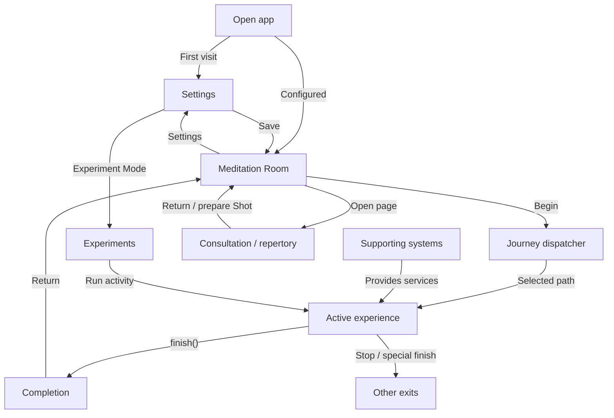
```mermaid
flowchart TD
  launch["Open app"]
  settings["Settings"]
  lobby["Meditation Room"]
  experiments["Experiments"]
  journeys["Journey dispatcher"]
  consult["Consultation / repertory"]
  runtime["Active experience"]
  support["Supporting systems"]
  complete["Completion"]
  other["Other exits"]
  launch -->|"First visit"| settings
  launch -->|"Configured"| lobby
  settings -->|"Save"| lobby
  lobby -->|"Settings"| settings
  settings -->|"Experiment Mode"| experiments
  lobby -->|"Begin"| journeys
  lobby -->|"Open page"| consult
  journeys -->|"Selected path"| runtime
  support -->|"Provides services"| runtime
  runtime -->|"finish()"| complete
  runtime -->|"Stop / special finish"| other
  experiments -->|"Run activity"| runtime
  complete -->|"Return"| lobby
  consult -->|"Return / prepare Shot"| lobby
```

| Step | Current behavior |
| --- | --- |
| Open app | Browser or installed PWA; local preferences and cached assets influence startup. |
| Settings | First visit or Lobby → Settings. Languages, voice, sound, visuals, timing and scripts. |
| Meditation Room | Main mode selection, chakra choices, intention, duration and consultation. |
| Experiments | Settings → isolated activity → return to Experiment screen. See Experiments map. |
| Journey dispatcher | Shots → Music Only → Sleep → focused or standard guided start. See mode map. |
| Consultation / repertory | Separate HTML pages. Consultation produces a review; repertory can prepare a custom Shot. |
| Active experience | Shared timer, audio, narration, visuals, mixer, pause and stop. |
| Supporting systems | JSON scripts, language bundles, Web Audio, Piper worker, localStorage and service worker. |
| Completion | Guided and Sleep flows update local stats; return to room or eligible Earn link. |
| Other exits | Shot completion reloads; Music Only stops manually; experiments return to their screen. |

- Use each detailed map for guards, optional stages and failure branches. Runtime behavior takes precedence over older HANDOFF entries.

## Startup and first visit

Loading order and optional browser capabilities.

Sources: [app.js:895](/Users/lekshmisyam/Desktop/Ikigai/lite/app.js:895), [app.js:1160](/Users/lekshmisyam/Desktop/Ikigai/lite/app.js:1160), [app.js:6184](/Users/lekshmisyam/Desktop/Ikigai/lite/app.js:6184), [app.js:6505](/Users/lekshmisyam/Desktop/Ikigai/lite/app.js:6505).

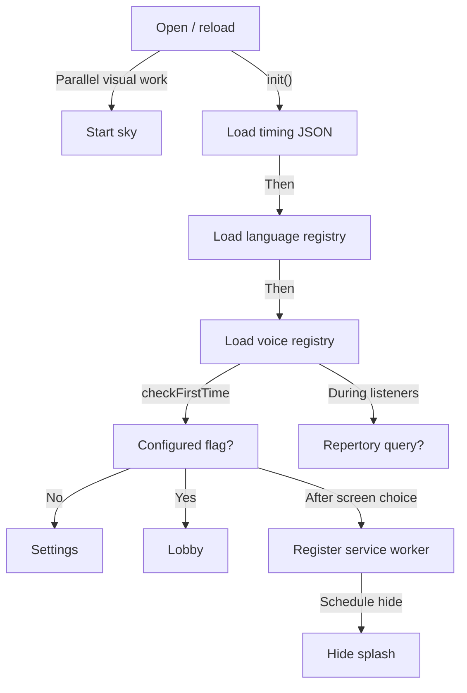
```mermaid
flowchart TD
  open["Open / reload"]
  sky["Start sky"]
  timing["Load timing JSON"]
  language["Load language registry"]
  voices["Load voice registry"]
  configured["Configured flag?"]
  repertory["Repertory query?"]
  settings["Settings"]
  lobby["Lobby"]
  sw["Register service worker"]
  splash["Hide splash"]
  open -->|"Parallel visual work"| sky
  open -->|"init()"| timing
  timing -->|"Then"| language
  language -->|"Then"| voices
  voices -->|"checkFirstTime"| configured
  voices -->|"During listeners"| repertory
  configured -->|"No"| settings
  configured -->|"Yes"| lobby
  configured -->|"After screen choice"| sw
  sw -->|"Schedule hide"| splash
```

| Step | Current behavior |
| --- | --- |
| Open / reload | Objects and state are constructed; splash is visible. |
| Start sky | Approximate sky is immediately available; location permission can refine it. |
| Load timing JSON | Built-in defaults on failure; timingProfile query can apply fast-test overrides. |
| Load language registry | Restore meditation language or Malayalam default; restore display language or English fallback. Load all four locale bundles. |
| Load voice registry | Load Piper definitions; enumerate browser voices; restore preferences and attach UI handlers. |
| Configured flag? | chakra_configured determines initial screen. |
| Repertory query? | Attachment consumes shotSource / shotFrequency and prompts for a Shot before checkFirstTime runs. |
| Settings | Unconfigured visitor. Save sets chakra_configured and opens Lobby. |
| Lobby | Configured visitor. Session-only modes start cleared. |
| Register service worker | Registration is inside a window load listener added after awaited startup work. Registration timing deserves verification. |
| Hide splash | 2.5-second delay begins after async initialization reaches its end. |

- Timing fetch failure uses defaults. Language loading catches failures and installs built-in options. This does not establish complete offline readiness.

## Mode selection and start routing

Mutual exclusion, validation, and dispatch priority.

Sources: [app.js:6791](/Users/lekshmisyam/Desktop/Ikigai/lite/app.js:6791), [app.js:6879](/Users/lekshmisyam/Desktop/Ikigai/lite/app.js:6879), [app.js:7553](/Users/lekshmisyam/Desktop/Ikigai/lite/app.js:7553).

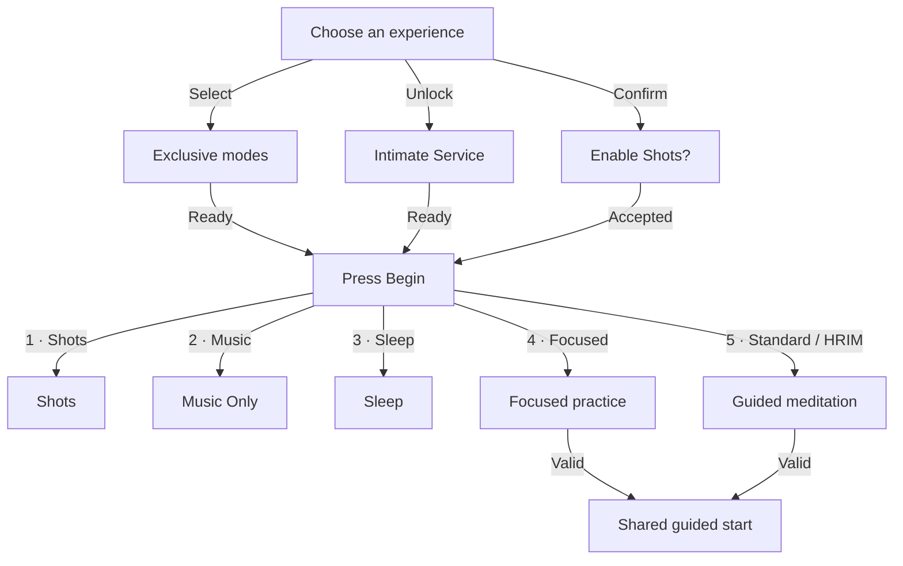
```mermaid
flowchart TD
  lobby["Choose an experience"]
  exclusive["Exclusive modes"]
  care["Intimate Service"]
  shots["Enable Shots?"]
  begin["Press Begin"]
  shot["Shots"]
  music["Music Only"]
  sleep["Sleep"]
  focused["Focused practice"]
  guided["Guided meditation"]
  start["Shared guided start"]
  lobby -->|"Select"| exclusive
  lobby -->|"Unlock"| care
  lobby -->|"Confirm"| shots
  exclusive -->|"Ready"| begin
  care -->|"Ready"| begin
  shots -->|"Accepted"| begin
  begin -->|"1 · Shots"| shot
  begin -->|"2 · Music"| music
  begin -->|"3 · Sleep"| sleep
  begin -->|"4 · Focused"| focused
  begin -->|"5 · Standard / HRIM"| guided
  focused -->|"Valid"| start
  guided -->|"Valid"| start
```

| Step | Current behavior |
| --- | --- |
| Choose an experience | Ordinary mode uses selected chakras; choose at least one. |
| Exclusive modes | HRIM, Sleep, Music Only, Box, Ho’oponopono and Yoga clear competing modes and intimate-service choices. |
| Intimate Service | Four clicks unlock the panel per page load. Any combination of three care options is allowed; choosing care clears other modes. |
| Enable Shots? | No Frequency blocks it. Otherwise a confirmation is required; cancel restores normal mode. |
| Press Begin | Actual dispatcher tests Shots first; then derives Sleep and focused experience. |
| Shots | Validate custom Hz: finite, >0 and ≤20,000. Initialize audio and run Shot. |
| Music Only | Start indefinite music with common controls. |
| Sleep | Load and validate five stages; start silent narration-free journey. |
| Focused practice | Priority if inconsistent state: Box → Ho’oponopono → Yoga → Intimate. Yoga requires a selected pose. |
| Guided meditation | HRIM bypasses chakra-selection requirement; standard requires one or more selected chakras. |
| Shared guided start | DND reminder, scripts, validation, audio, Piper warmup, wake lock, timers, selected routine. |

- Shots hide incompatible Lobby controls. Focused practices hide intention and returning-opening controls. Checking Music Only, Sleep or a focused mode can clear Corpse Pose.

## Standard chakra journey

Selected chakras in Root → Crown order; returning and demo branches included.

Sources: [app.js:4537](/Users/lekshmisyam/Desktop/Ikigai/lite/app.js:4537), [app.js:4788](/Users/lekshmisyam/Desktop/Ikigai/lite/app.js:4788), [app.js:5428](/Users/lekshmisyam/Desktop/Ikigai/lite/app.js:5428).

```mermaid
flowchart TD
  begin["Begin + DND reminder"]
  setup["Audio + warmup"]
  arrive["Arriving countdown"]
  prepare["Preparation"]
  wrapper["Arrival induction"]
  moon["Moon opening"]
  return["Returning opening"]
  gratitude["Gratitude + intention"]
  ready["Arrival readiness"]
  loop["Selected chakra loop"]
  end["Silence + closing"]
  emerge["Emergence"]
  finish["Completion"]
  begin -->|"Valid content"| setup
  setup -->|"Ready"| arrive
  arrive -->|"Warmup awaited"| prepare
  prepare -->|"Non-demo"| wrapper
  prepare -->|"Demo + new opening"| moon
  prepare -->|"Demo + returning"| return
  wrapper -->|"Returning off"| moon
  wrapper -->|"Returning on"| return
  moon -->|"Opening pause"| gratitude
  return -->|"Opening pause"| gratitude
  gratitude -->|"Non-demo"| ready
  gratitude -->|"Demo"| loop
  ready -->|"Ready"| loop
  loop -->|"Last chakra"| end
  end -->|"Non-demo"| emerge
  end -->|"Demo"| finish
  emerge -->|"Done"| finish
```

| Step | Current behavior |
| --- | --- |
| Begin + DND reminder | Guard duplicate starts; show Arriving and load / validate selected content. |
| Audio + warmup | Background music starts silently; optional ambience; Piper warms during Arriving; wake lock requested. |
| Arriving countdown | Configured 10–300 seconds, default 60; music fades in over this period. |
| Preparation | Initial settle → pre-practice guidance. |
| Arrival induction | Ordinary non-demo only: narration → 432 Hz transition tone for half the selected drone window. |
| Moon opening | When Returning is off, use current moon-phase script. |
| Returning opening | When enabled, use intro.returning; independent of journey statistics. |
| Gratitude + intention | Gratitude narration; if personal intention is nonempty, speak intention with optional timed tone. |
| Arrival readiness | Ordinary non-demo only: narration → 528 Hz transition tone → post-preparation gap. |
| Selected chakra loop | Each chakra: narration → mantra and bounded drone → affirmation. Between chakras: breathing interval. |
| Silence + closing | Final silence → closing narration → full-body affirmation with configured gaps. |
| Emergence | Non-demo only: bowl unless No Frequency → guidance → emergence countdown → final quiet. |
| Completion | Stop audio / visuals, update stats and show completion choices. |

- Demo is recognized from custom-script metadata and uses a short core duration. It omits Arrival/Emergence wrappers, not the entire standard preparation and closing flow. No Frequency suppresses tones while keeping the surrounding guidance and gaps.

## Inside one chakra

Narration, audio handoff, bounded exposure, and loop transitions.

Sources: [app.js:5550](/Users/lekshmisyam/Desktop/Ikigai/lite/app.js:5550), [app.js:2712](/Users/lekshmisyam/Desktop/Ikigai/lite/app.js:2712), [app.js:4242](/Users/lekshmisyam/Desktop/Ikigai/lite/app.js:4242), [app.js:20](/Users/lekshmisyam/Desktop/Ikigai/lite/app.js:20).

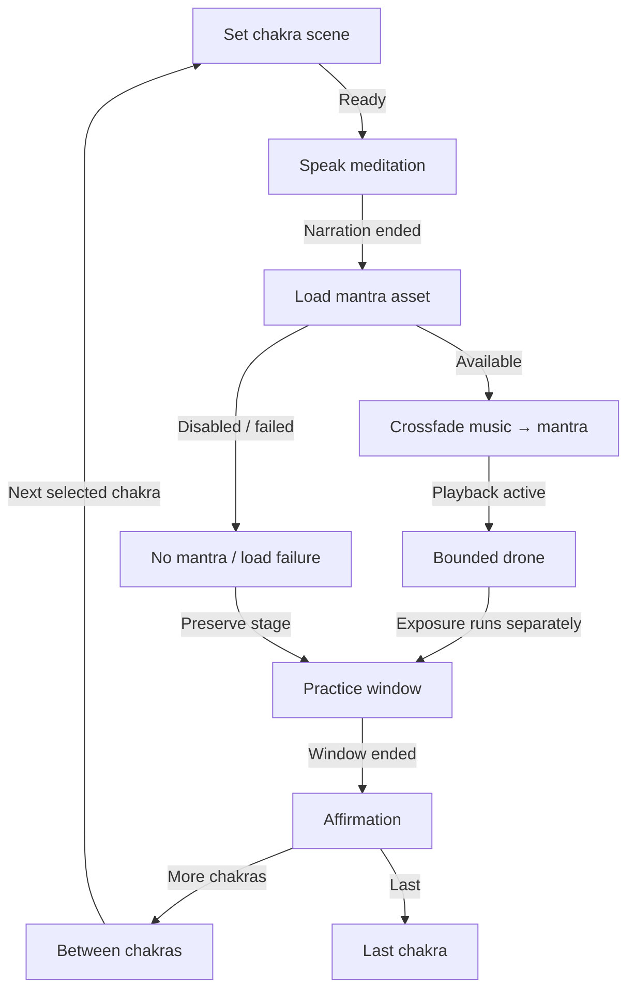
```mermaid
flowchart TD
  visual["Set chakra scene"]
  voice["Speak meditation"]
  load["Load mantra asset"]
  mantra["Crossfade music → mantra"]
  skip["No mantra / load failure"]
  drone["Bounded drone"]
  hold["Practice window"]
  affirm["Affirmation"]
  interval["Between chakras"]
  close["Last chakra"]
  visual -->|"Ready"| voice
  voice -->|"Narration ended"| load
  load -->|"Available"| mantra
  load -->|"Disabled / failed"| skip
  mantra -->|"Playback active"| drone
  drone -->|"Exposure runs separately"| hold
  skip -->|"Preserve stage"| hold
  hold -->|"Window ended"| affirm
  affirm -->|"More chakras"| interval
  interval -->|"Next selected chakra"| visual
  affirm -->|"Last"| close
```

| Step | Current behavior |
| --- | --- |
| Set chakra scene | Choose deity image if available, otherwise symbol; set mantra label, color, aura and progress dot. |
| Speak meditation | Selected language, Piper or browser speech. No chakra drone under this narration. |
| Load mantra asset | Cached decoded buffer or fetch and decode the matching MP3. |
| Crossfade music → mantra | After decoding and cancellation guard, simultaneously fade music out and mantra in over 6 seconds. User mantra volume is applied once. |
| No mantra / load failure | No Mantra skips playback. Asset failure logs error and restores music; stage continues. |
| Bounded drone | Only if mantra exists and both suppression modes permit: Beginner 4 s, Intermediate 10 s, Advanced 14 s, Expert 20 s. |
| Practice window | Core minutes ×60 minus 15-second lead-out, bounded at zero. Pauses suspend elapsed stage time. |
| Affirmation | Crossfade mantra out and music back in together over 4 seconds; default 4-second spoken gap, then affirmation. |
| Between chakras | Stop drone; 2-second preparation; wait for BOTH configured interval and breathing narration. |
| Last chakra | Caller chooses closing/completion, or next care stage. |

- Core practice duration does not extend the fixed drone exposure window. HRIM reuses this routine with high_energy content and its own duration.

## HRIM activation

A dedicated high-energy journey using one stage.

Sources: [app.js:4620](/Users/lekshmisyam/Desktop/Ikigai/lite/app.js:4620), [app.js:4788](/Users/lekshmisyam/Desktop/Ikigai/lite/app.js:4788), [app.js:5531](/Users/lekshmisyam/Desktop/Ikigai/lite/app.js:5531).

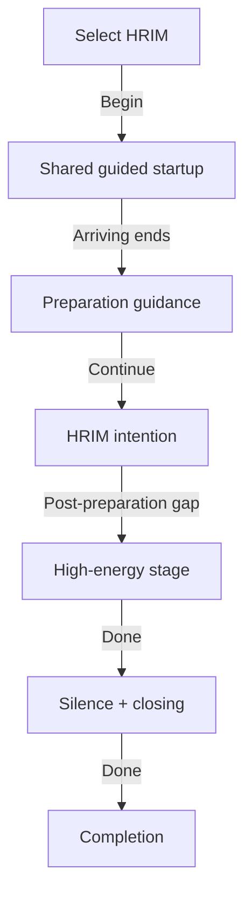
```mermaid
flowchart TD
  choose["Select HRIM"]
  start["Shared guided startup"]
  prepare["Preparation guidance"]
  intention["HRIM intention"]
  stage["High-energy stage"]
  closing["Silence + closing"]
  finish["Completion"]
  choose -->|"Begin"| start
  start -->|"Arriving ends"| prepare
  prepare -->|"Continue"| intention
  intention -->|"Post-preparation gap"| stage
  stage -->|"Done"| closing
  closing -->|"Done"| finish
```

| Step | Current behavior |
| --- | --- |
| Select HRIM | Clears competing experiences; uses its own practice duration and drone setting. |
| Shared guided startup | DND, validation, audio, Piper warmup and Arriving countdown. |
| Preparation guidance | No Arrival wrapper, Moon opening or Returning opening. |
| HRIM intention | Activation-oriented text inserts personal intention; optional timed intention tone; HRIM pacing. |
| High-energy stage | Meditation narration → HREEM mantra → bounded drone → affirmation. |
| Silence + closing | Shared closing and full-body affirmation; no Emergence wrapper. |
| Completion | Stats and completion modal. |

- No local-time restriction appears in this route. HRIM is separate from the seven selected chakras.

## Sleep and Music Only

Two independent narration-free experiences.

Sources: [app.js:4344](/Users/lekshmisyam/Desktop/Ikigai/lite/app.js:4344), [app.js:5057](/Users/lekshmisyam/Desktop/Ikigai/lite/app.js:5057), [app.js:2496](/Users/lekshmisyam/Desktop/Ikigai/lite/app.js:2496), [scripts.json:1](/Users/lekshmisyam/Desktop/Ikigai/lite/scripts.json:1).

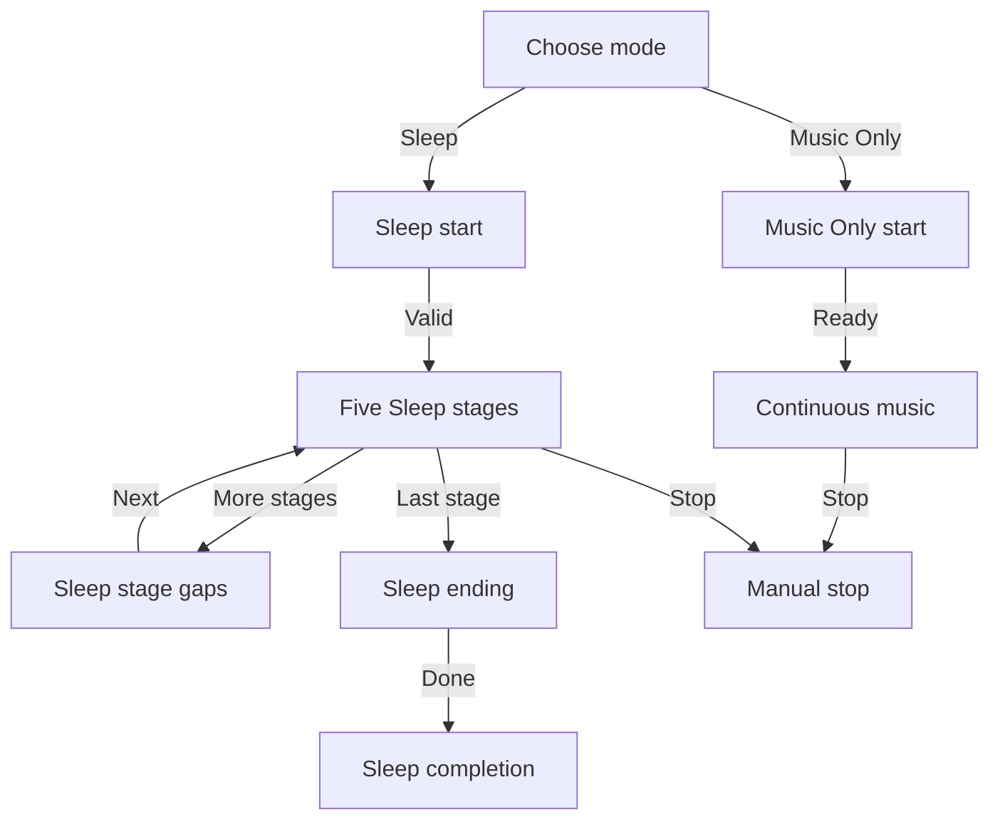
```mermaid
flowchart TD
  choose["Choose mode"]
  sleep["Sleep start"]
  music["Music Only start"]
  stages["Five Sleep stages"]
  loop["Continuous music"]
  gap["Sleep stage gaps"]
  fade["Sleep ending"]
  stop["Manual stop"]
  complete["Sleep completion"]
  choose -->|"Sleep"| sleep
  choose -->|"Music Only"| music
  sleep -->|"Valid"| stages
  stages -->|"More stages"| gap
  gap -->|"Next"| stages
  stages -->|"Last stage"| fade
  fade -->|"Done"| complete
  music -->|"Ready"| loop
  loop -->|"Stop"| stop
  stages -->|"Stop"| stop
```

| Step | Current behavior |
| --- | --- |
| Choose mode | Both bypass normal guided preparation and chakra narration. |
| Sleep start | DND reminder; load content; exactly five valid stage frequencies required. |
| Music Only start | Show background symbol; no session countdown; request wake lock. |
| Five Sleep stages | Drowsiness 10 → Light Sleep 6 → True Sleep 5 → Deep Sleep 2 → REM Rest 6 Hz (script values). Each uses configured minutes and its own bounded sleep drone. |
| Continuous music | Background loop and visual pulse continue until user stops. No ordinary completion. |
| Sleep stage gaps | Stop drone after each stage; actual journey waits 3 seconds between stages. |
| Sleep ending | Fade background music for 12 seconds, then finish if still active. |
| Manual stop | Shared stop cleanup → Lobby; no completed-journey increment. |
| Sleep completion | Stats and completion modal; sleep dimming removed. |

- Sleep does not narrate. Its actual gap is hardcoded to 3 seconds, while its estimate reads script intervalSeconds. Music Only does not start the optional ambience through its normal route.

## Box breathing and Ho’oponopono

Standalone practices launched through shared guided startup.

Sources: [app.js:4626](/Users/lekshmisyam/Desktop/Ikigai/lite/app.js:4626), [app.js:4844](/Users/lekshmisyam/Desktop/Ikigai/lite/app.js:4844), [app.js:5459](/Users/lekshmisyam/Desktop/Ikigai/lite/app.js:5459).

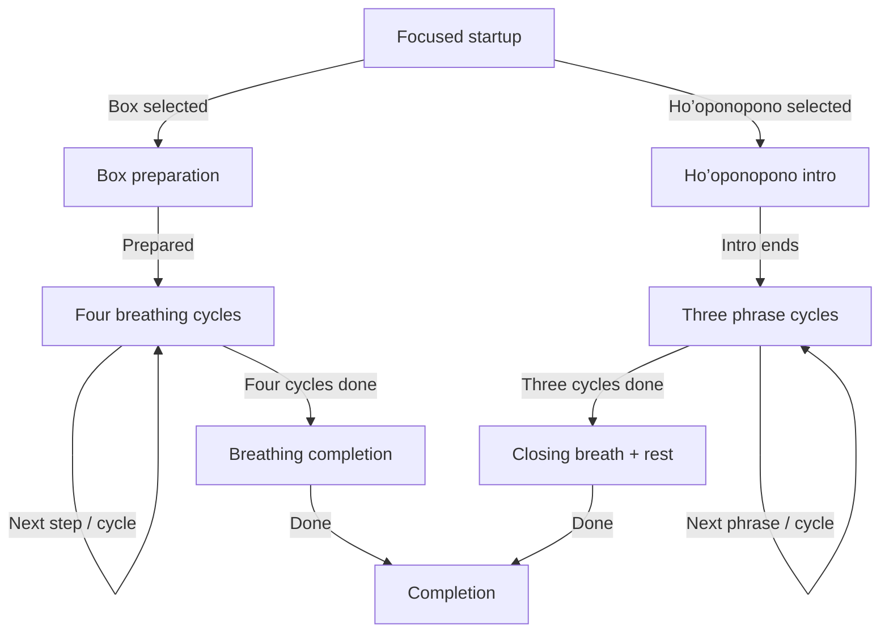
```mermaid
flowchart TD
  start["Focused startup"]
  box["Box preparation"]
  hoo["Ho’oponopono intro"]
  cycles["Four breathing cycles"]
  phrases["Three phrase cycles"]
  boxdone["Breathing completion"]
  hoodone["Closing breath + rest"]
  finish["Completion"]
  start -->|"Box selected"| box
  start -->|"Ho’oponopono selected"| hoo
  box -->|"Prepared"| cycles
  cycles -->|"Next step / cycle"| cycles
  cycles -->|"Four cycles done"| boxdone
  hoo -->|"Intro ends"| phrases
  phrases -->|"Next phrase / cycle"| phrases
  phrases -->|"Three cycles done"| hoodone
  boxdone -->|"Done"| finish
  hoodone -->|"Done"| finish
```

| Step | Current behavior |
| --- | --- |
| Focused startup | DND, load/validate scripts, audio, Piper warmup; bypass ordinary Arriving / chakra wrapper. |
| Box preparation | Breathing screen; fade music out; centering guidance and preparation gap. |
| Ho’oponopono intro | Meditation screen; intro narration and short pause. |
| Four breathing cycles | Each cycle uses four localized steps: inhale, hold, exhale, hold; visual circle and step timer. |
| Three phrase cycles | Narrate all four phrases, with pauses, three times. |
| Breathing completion | Completion guidance; restore music; completion settle. |
| Closing breath + rest | Closing narration fades music; final rest default 15 seconds. |
| Completion | Common stats and completion modal. |

- Neither route automatically appends a chakra journey. Box step length comes from timeBreathing; its ordinary Settings timing row is hidden in the current UI.

## Yoga experience

Optional rest and bathing before selected poses.

Sources: [app.js:5129](/Users/lekshmisyam/Desktop/Ikigai/lite/app.js:5129), [app.js:7558](/Users/lekshmisyam/Desktop/Ikigai/lite/app.js:7558), [timing-config.json:1](/Users/lekshmisyam/Desktop/Ikigai/lite/timing-config.json:1).

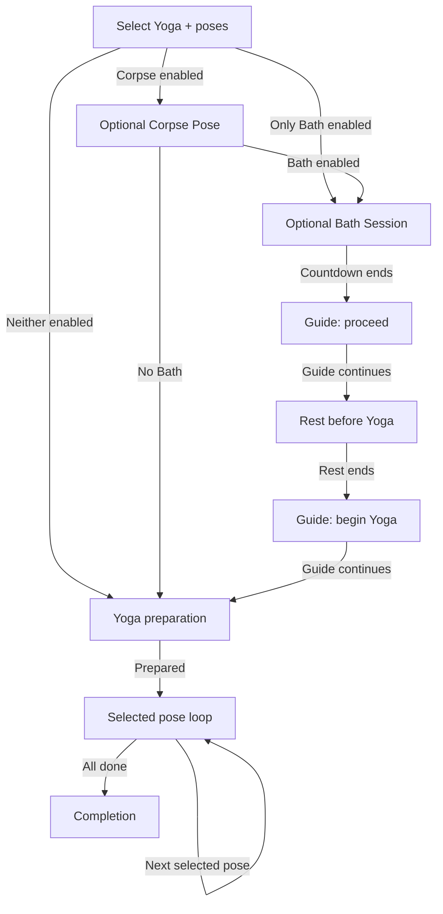
```mermaid
flowchart TD
  begin["Select Yoga + poses"]
  corpse["Optional Corpse Pose"]
  bath["Optional Bath Session"]
  gate1["Guide: proceed"]
  rest["Rest before Yoga"]
  gate2["Guide: begin Yoga"]
  prep["Yoga preparation"]
  poses["Selected pose loop"]
  finish["Completion"]
  begin -->|"Corpse enabled"| corpse
  begin -->|"Only Bath enabled"| bath
  begin -->|"Neither enabled"| prep
  corpse -->|"Bath enabled"| bath
  corpse -->|"No Bath"| prep
  bath -->|"Countdown ends"| gate1
  gate1 -->|"Guide continues"| rest
  rest -->|"Rest ends"| gate2
  gate2 -->|"Guide continues"| prep
  prep -->|"Prepared"| poses
  poses -->|"Next selected pose"| poses
  poses -->|"All done"| finish
```

| Step | Current behavior |
| --- | --- |
| Select Yoga + poses | At least one selected pose required at Begin. Shared focused startup. |
| Optional Corpse Pose | Intro → stillness countdown → transition narration at configured point → settle. |
| Optional Bath Session | Intro → instructions → countdown with reminder at 60 seconds. |
| Guide: proceed | Bath completion waits for explicit Continue; does not advance automatically. |
| Rest before Yoga | Default 900 seconds (15 minutes), followed by another guide confirmation. |
| Guide: begin Yoga | Button becomes available after rest; paused session cannot advance. |
| Yoga preparation | 136.1 Hz bounded drone if permitted; intro + preparation narration; prep countdown. |
| Selected pose loop | Pose name/image → explanation → hold countdown → next-pose prompt and gap. |
| Completion | Session-complete narration → settle → common completion. |

- Corpse Pose and Bath can be independently enabled. Runtime pose order comes from the script filtered by the selected pose IDs. Guide waits have unbounded duration beyond the displayed session estimate.

## Intimate Service and massage

All seven nonempty combinations follow this ordered composition.

Sources: [app.js:6759](/Users/lekshmisyam/Desktop/Ikigai/lite/app.js:6759), [app.js:4976](/Users/lekshmisyam/Desktop/Ikigai/lite/app.js:4976), [app.js:5507](/Users/lekshmisyam/Desktop/Ikigai/lite/app.js:5507).

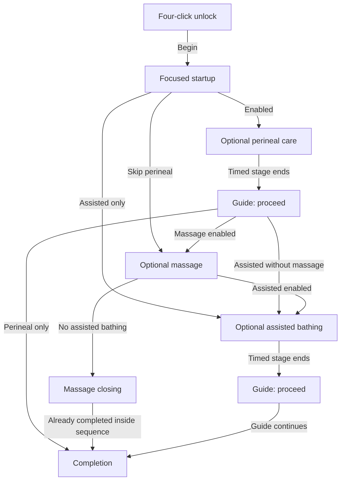
```mermaid
flowchart TD
  unlock["Four-click unlock"]
  start["Focused startup"]
  perineal["Optional perineal care"]
  gate1["Guide: proceed"]
  massage["Optional massage"]
  closing["Massage closing"]
  assisted["Optional assisted bathing"]
  gate2["Guide: proceed"]
  finish["Completion"]
  unlock -->|"Begin"| start
  start -->|"Enabled"| perineal
  start -->|"Skip perineal"| massage
  start -->|"Assisted only"| assisted
  perineal -->|"Timed stage ends"| gate1
  gate1 -->|"Massage enabled"| massage
  gate1 -->|"Assisted without massage"| assisted
  gate1 -->|"Perineal only"| finish
  massage -->|"No assisted bathing"| closing
  massage -->|"Assisted enabled"| assisted
  closing -->|"Already completed inside sequence"| finish
  assisted -->|"Timed stage ends"| gate2
  gate2 -->|"Guide continues"| finish
```

| Step | Current behavior |
| --- | --- |
| Four-click unlock | Panel is locked and choices reset each page load. Select any nonempty subset of care options. |
| Focused startup | No ordinary Arrival, gratitude, personal intention or Emergence wrapper. |
| Optional perineal care | Narrate intro/instructions → timed stage → 60-second reminder if reached. |
| Guide: proceed | Wait for explicit Continue. |
| Optional massage | Full seven-chakra sequence in reverse: Crown → Third Eye → Throat → Heart → Solar → Sacral → Root. |
| Massage closing | If no assisted bathing follows: final silence and closing, then finish inside runSequence. |
| Optional assisted bathing | Intro/instructions → timed stage → reminder; massage sequence used complete:false if this follows. |
| Guide: proceed | Assisted-bath ending waits for explicit Continue. |
| Completion | Outer focused route calls finish if session remains active. |

- Current behavior: when assisted bathing follows massage, shared silence/closing is skipped and is not called after the bath. A nearby comment says closing is deferred, but the executable path does not perform it. This is recorded for a later fix decision.

## Sound Shots

Six types, confirmation, frequency validation, and distinct finish behavior.

Sources: [app.js:4416](/Users/lekshmisyam/Desktop/Ikigai/lite/app.js:4416), [app.js:6879](/Users/lekshmisyam/Desktop/Ikigai/lite/app.js:6879), [app.js:6939](/Users/lekshmisyam/Desktop/Ikigai/lite/app.js:6939), [index.html:257](/Users/lekshmisyam/Desktop/Ikigai/lite/index.html:257).

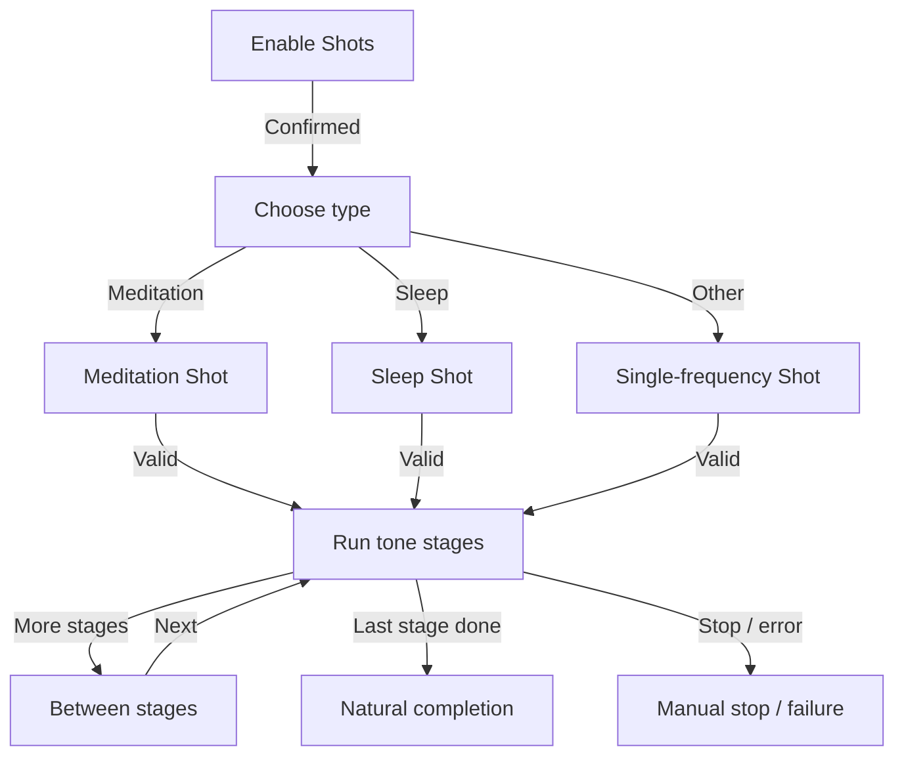
```mermaid
flowchart TD
  enable["Enable Shots"]
  type["Choose type"]
  med["Meditation Shot"]
  sleep["Sleep Shot"]
  single["Single-frequency Shot"]
  run["Run tone stages"]
  gaps["Between stages"]
  reload["Natural completion"]
  abort["Manual stop / failure"]
  enable -->|"Confirmed"| type
  type -->|"Meditation"| med
  type -->|"Sleep"| sleep
  type -->|"Other"| single
  med -->|"Valid"| run
  sleep -->|"Valid"| run
  single -->|"Valid"| run
  run -->|"More stages"| gaps
  gaps -->|"Next"| run
  run -->|"Last stage done"| reload
  run -->|"Stop / error"| abort
```

| Step | Current behavior |
| --- | --- |
| Enable Shots | No Frequency → blocked; otherwise confirm. Cancel leaves Shots off. |
| Choose type | Meditation, HRIM, Anesthetic, Mood & Relaxation, Sleep, or Custom. Labels here describe app modes. |
| Meditation Shot | Root 396 → Sacral 417 → Solar 528 → Heart 639 → Throat 741 → Third Eye 852 → Crown 963 Hz. Ignores selected chakra subset. |
| Sleep Shot | Script sequence: 10 → 6 → 5 → 2 → 6 Hz. |
| Single-frequency Shot | HRIM 528 Hz; Anesthetic 174 Hz; Mood & Relaxation 221.23 Hz; or custom finite frequency >0 and ≤20,000 Hz. These are app data values. |
| Run tone stages | No music or narration; divide selected total active seconds equally across stages. |
| Between stages | Meditation: 2 seconds; Sleep: script intervalSeconds, falling back to 2. |
| Natural completion | Stop sound, hide controls, release wake lock, show Lobby then reload page. |
| Manual stop / failure | Manual Stop uses shared stop; activation failure alerts and uses stopShot. No stats increment. |

- Single-frequency default is 1 second; multi-stage default 7 seconds; selected duration range 1–20 seconds. Displayed total active seconds excludes inter-stage gaps; countdown includes them.

## Experiment activities

Isolated activities and return behavior.

Sources: [app.js:4716](/Users/lekshmisyam/Desktop/Ikigai/lite/app.js:4716), [app.js:7481](/Users/lekshmisyam/Desktop/Ikigai/lite/app.js:7481), [index.html:210](/Users/lekshmisyam/Desktop/Ikigai/lite/index.html:210).

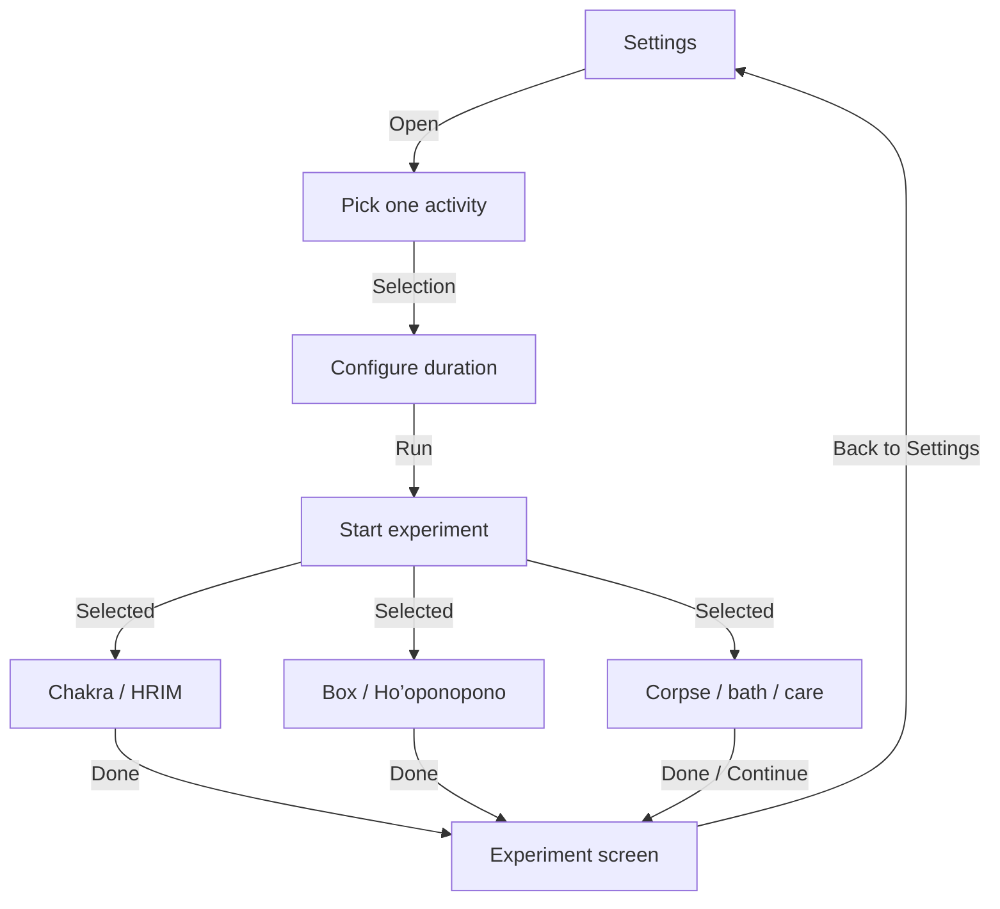
```mermaid
flowchart TD
  settings["Settings"]
  pick["Pick one activity"]
  duration["Configure duration"]
  start["Start experiment"]
  chakra["Chakra / HRIM"]
  practice["Box / Ho’oponopono"]
  care["Corpse / bath / care"]
  return["Experiment screen"]
  settings -->|"Open"| pick
  pick -->|"Selection"| duration
  duration -->|"Run"| start
  start -->|"Selected"| chakra
  start -->|"Selected"| practice
  start -->|"Selected"| care
  chakra -->|"Done"| return
  practice -->|"Done"| return
  care -->|"Done / Continue"| return
  return -->|"Back to Settings"| settings
```

| Step | Current behavior |
| --- | --- |
| Settings | Open Experiment Mode. |
| Pick one activity | Seven individual chakras, HRIM, Box, Ho’oponopono, Corpse Pose, Perineal Care, Bath, Assisted Bath. |
| Configure duration | Chakra/HRIM use minutes; Box uses seconds per step; care and Corpse routines consume seconds. |
| Start experiment | Load selected content; initialize audio, ambience and wake lock; set experiment flag and countdown. |
| Chakra / HRIM | Run one meditateOnChakra with duration override. |
| Box / Ho’oponopono | Call corresponding focused routine directly. |
| Corpse / bath / care | Call isolated routine; bath/care includes guide-controlled Continue. |
| Experiment screen | Natural end and caught failure use stopExperiment; visible Stop uses shared stop which also returns here. |

- Current inconsistency: UI assigns sec or min, while startExperiment tests for seconds. Countdown therefore treats sec as minutes; care UI also labels raw seconds as min. Ho’oponopono has no duration control, but startExperiment still reads the hidden value. No ordinary completion modal or stats update is used.

## Pause, stop and live controls

Shared interaction and cancellation behavior.

Sources: [app.js:5407](/Users/lekshmisyam/Desktop/Ikigai/lite/app.js:5407), [app.js:5891](/Users/lekshmisyam/Desktop/Ikigai/lite/app.js:5891), [app.js:7358](/Users/lekshmisyam/Desktop/Ikigai/lite/app.js:7358), [app.js:7679](/Users/lekshmisyam/Desktop/Ikigai/lite/app.js:7679).

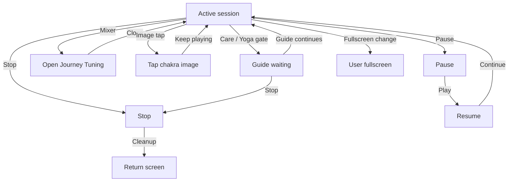
```mermaid
flowchart TD
  active["Active session"]
  pause["Pause"]
  mixer["Open Journey Tuning"]
  stop["Stop"]
  resume["Resume"]
  image["Tap chakra image"]
  return["Return screen"]
  wait["Guide waiting"]
  fullscreen["User fullscreen"]
  active -->|"Pause"| pause
  pause -->|"Play"| resume
  resume -->|"Continue"| active
  active -->|"Mixer"| mixer
  mixer -->|"Close"| active
  active -->|"Stop"| stop
  stop -->|"Cleanup"| return
  active -->|"Image tap"| image
  image -->|"Keep playing"| active
  active -->|"Care / Yoga gate"| wait
  wait -->|"Guide continues"| active
  wait -->|"Stop"| stop
  active -->|"Fullscreen change"| fullscreen
```

| Step | Current behavior |
| --- | --- |
| Active session | Common controls appear during an experience. |
| Pause | Set isPaused; freeze ticker and stage countdowns; cancel browser speech; pause Piper; suspend AudioContext. |
| Open Journey Tuning | Opening mixer does not pause. Volume, voice, space, ambience, brightness and suppression controls apply live. |
| Stop | Cancel narration and timers, stop audio/visuals, resolve guide wait false and hide controls/mixer. |
| Resume | Resume Piper/context. Ordinary browser narration replays the interrupted sentence if pause was observed. |
| Tap chakra image | Toggle session text overlay; session continues. |
| Return screen | Experiment → Experiment screen; other modes → Lobby. No completion statistics. |
| Guide waiting | Continue is accepted only when active and not paused; Stop releases the pending wait. |
| User fullscreen | Track fullscreen on app container; pointer/focus reveal bottom controls, then hide after 120 ms. |

- The app no longer requests or exits fullscreen automatically. Browser-speech cancellation and Piper buffer suspension are different pause mechanisms. Re-enable No Mantra does not immediately restart a previously skipped mantra stage.

## Restart and cinematic prelude

Restart re-enters the normal Begin dispatcher after video.

Sources: [app.js:3679](/Users/lekshmisyam/Desktop/Ikigai/lite/app.js:3679), [app.js:7695](/Users/lekshmisyam/Desktop/Ikigai/lite/app.js:7695), [app.js:62](/Users/lekshmisyam/Desktop/Ikigai/lite/app.js:62).

```mermaid
flowchart TD
  restart["Mixer → Restart"]
  stop["Stop, retain scene"]
  buffer["Prepare and buffer"]
  ready["Begin introduction"]
  hold["Image hold → playback"]
  recover["Buffer recovery"]
  end["Normal video ending"]
  error["Unavailable video"]
  dispatch["Begin again"]
  restart -->|"Confirmed"| stop
  stop -->|"Prepare"| buffer
  buffer -->|"Ready / timeout"| ready
  ready -->|"User clicks"| hold
  hold -->|"Buffer low"| recover
  recover -->|"Recovered"| hold
  hold -->|"Ended"| end
  buffer -->|"Failure"| error
  hold -->|"Failure"| error
  end -->|"Reminder acknowledged"| dispatch
  error -->|"Normal reminder remains"| dispatch
```

| Step | Current behavior |
| --- | --- |
| Mixer → Restart | Confirmation: cancel leaves the current journey running. |
| Stop, retain scene | Stop current journey with preserveScreen:true; open prelude overlay. |
| Prepare and buffer | Paused/silent video with meditator image. Target 4 / 6 / 8 seconds by connection, with stability check. |
| Begin introduction | Reveal button when ready OR after the 90-second bounded wait. Explicit user action required. |
| Image hold → playback | Hold image 3 seconds, then video; audio fades in over 2.4 seconds using separate video volume. |
| Buffer recovery | Below 2 seconds ahead pauses except near end; waiting/stalled enters recovery. Resume at up to 4 seconds, bounded by remaining clip. |
| Normal video ending | Final 0.25-second audiovisual fade; acknowledge DND reminder. |
| Unavailable video | Missing media, preparation failure, media error or rejected play: unavailable result; error path fades 1.2 seconds. |
| Begin again | Wait up to 5 seconds for prior start guard to unwind; click main Begin button using current mode selection. |

- No skip control and no automatic fullscreen. A buffer countdown reports seconds of media still needed, not a measured wall-clock download ETA. Settings audio preview is separate: play 8 seconds, fade and reset without starting a journey.

## Completion, statistics and external handoff

Different end states are intentionally visible here.

Sources: [app.js:5840](/Users/lekshmisyam/Desktop/Ikigai/lite/app.js:5840), [app.js:550](/Users/lekshmisyam/Desktop/Ikigai/lite/app.js:550), [index.html:659](/Users/lekshmisyam/Desktop/Ikigai/lite/index.html:659).

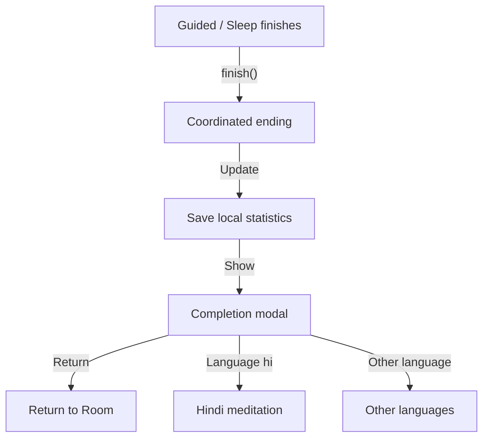
```mermaid
flowchart TD
  natural["Guided / Sleep finishes"]
  cleanup["Coordinated ending"]
  stats["Save local statistics"]
  modal["Completion modal"]
  return["Return to Room"]
  hi["Hindi meditation"]
  earn["Other languages"]
  natural -->|"finish()"| cleanup
  cleanup -->|"Update"| stats
  stats -->|"Show"| modal
  modal -->|"Return"| return
  modal -->|"Language hi"| hi
  modal -->|"Other language"| earn
```

| Step | Current behavior |
| --- | --- |
| Guided / Sleep finishes | Shared finish() for standard, HRIM, focused practices and Sleep. |
| Coordinated ending | Cancel narration and drones; stop mantra without restoring music; fade music; hide controls and clear visuals. |
| Save local statistics | Increment journey count and add rounded wall-clock minutes since start, minimum one. Pause time is included. |
| Completion modal | Show completion message, totals, session time and Return to Room. |
| Return to Room | Cancel pending Earn reveal; hide modal; open Lobby. |
| Hindi meditation | No Earn link. Eligibility uses meditation language, not display language. |
| Other languages | After 3 seconds reveal native Continue to Earn link; user click navigates externally. |

- Earn destination is https://missionode.github.io/earn-app/receive.html?Source=Lite. No automatic navigation. Shots, manual stops, and experiments do not use this stats/completion path.

## Scripts, language and timing

Content selection, validation, fallback and demo behavior.

Sources: [app.js:641](/Users/lekshmisyam/Desktop/Ikigai/lite/app.js:641), [app.js:944](/Users/lekshmisyam/Desktop/Ikigai/lite/app.js:944), [app.js:1160](/Users/lekshmisyam/Desktop/Ikigai/lite/app.js:1160), [app.js:7176](/Users/lekshmisyam/Desktop/Ikigai/lite/app.js:7176), [language-manifest.json:1](/Users/lekshmisyam/Desktop/Ikigai/lite/language-manifest.json:1).

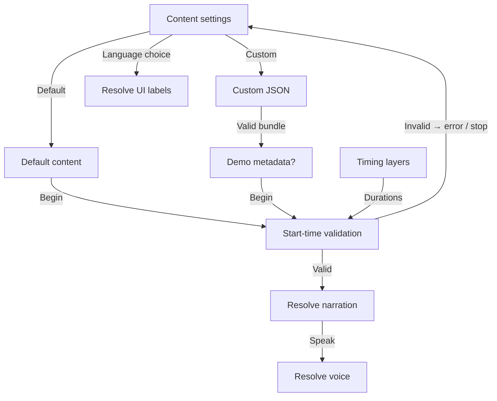
```mermaid
flowchart TD
  settings["Content settings"]
  default["Default content"]
  custom["Custom JSON"]
  demo["Demo metadata?"]
  validate["Start-time validation"]
  resolve["Resolve narration"]
  ui["Resolve UI labels"]
  voice["Resolve voice"]
  timing["Timing layers"]
  settings -->|"Default"| default
  settings -->|"Custom"| custom
  custom -->|"Valid bundle"| demo
  default -->|"Begin"| validate
  demo -->|"Begin"| validate
  validate -->|"Valid"| resolve
  resolve -->|"Speak"| voice
  settings -->|"Language choice"| ui
  timing -->|"Durations"| validate
  validate -->|"Invalid → error / stop"| settings
```

| Step | Current behavior |
| --- | --- |
| Content settings | Choose meditation language, display language, voice and default/custom script source. |
| Default content | All four languages currently point to scripts.json. Journey fetch appends a timestamp query. |
| Custom JSON | Upload file or fetch URL; validate required schema; store bundle in localStorage. Invalid input shows error. |
| Demo metadata? | Recognized demo bundle applies demo timing preset; switching away restores earlier core duration. |
| Start-time validation | Shared guided start validates sections needed for selected practice; custom allows language fallback. |
| Resolve narration | Meditation language → configured fallback language → English / available localized value. Custom system overrides are optional. |
| Resolve UI labels | Settings/Lobby use display language; journey labels and sky names use meditation language. |
| Resolve voice | Matching browser voice or supported configured Piper voice; Hindi has no default Piper voice. |
| Timing layers | Built-in defaults → timing-config → optional named query profile → saved preferences; demo changes selected core duration. |

- Sleep and Shots validate stage frequencies in their own routes. Shots load default language content when a script load is needed; an already-loaded script may be reused. Experiments do not run the same guided schema validation.

## Narration and fallback

Piper synthesis pipeline versus browser speech.

Sources: [app.js:1430](/Users/lekshmisyam/Desktop/Ikigai/lite/app.js:1430), [app.js:5226](/Users/lekshmisyam/Desktop/Ikigai/lite/app.js:5226), [app.js:5660](/Users/lekshmisyam/Desktop/Ikigai/lite/app.js:5660), [piper-worker.js:1](/Users/lekshmisyam/Desktop/Ikigai/lite/piper-worker.js:1).

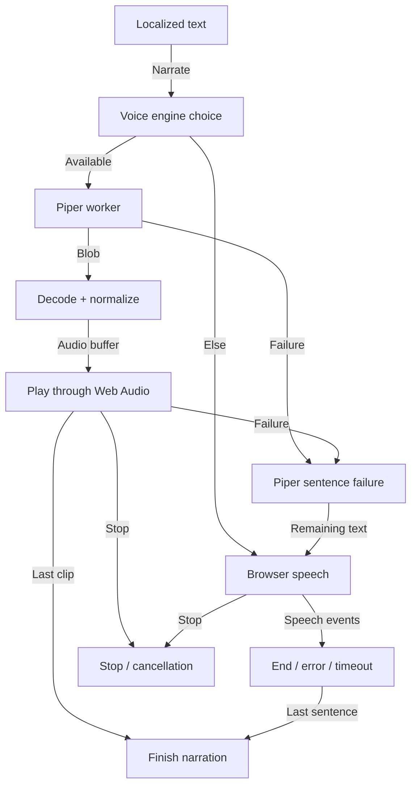
```mermaid
flowchart TD
  text["Localized text"]
  route["Voice engine choice"]
  piper["Piper worker"]
  browser["Browser speech"]
  decode["Decode + normalize"]
  play["Play through Web Audio"]
  fallback["Piper sentence failure"]
  browserend["End / error / timeout"]
  handoff["Finish narration"]
  cancel["Stop / cancellation"]
  text -->|"Narrate"| route
  route -->|"Available"| piper
  route -->|"Else"| browser
  piper -->|"Blob"| decode
  decode -->|"Audio buffer"| play
  piper -->|"Failure"| fallback
  play -->|"Failure"| fallback
  fallback -->|"Remaining text"| browser
  browser -->|"Speech events"| browserend
  play -->|"Last clip"| handoff
  browserend -->|"Last sentence"| handoff
  play -->|"Stop"| cancel
  browser -->|"Stop"| cancel
```

| Step | Current behavior |
| --- | --- |
| Localized text | Begin narration generation; populate ticker and duck music unless silence requested. |
| Voice engine choice | Use Piper only when selected, supported and configured. |
| Piper worker | Warm model; serial worker requests; synthesize first two sentences and keep one ahead. |
| Browser speech | Select matching voice and locale; apply pace/pitch/volume; speak each sentence. |
| Decode + normalize | Decode WAV/blob; update estimated ticker duration with real clip duration. |
| Play through Web Audio | Start ticker at actual playback; route to voice gain, tone controls and effects. |
| Piper sentence failure | Cancel Piper jobs; report fallback; use browser speech for failed and remaining sentences. |
| End / error / timeout | Browser events resolve sentence; timeout avoids waiting forever. Pause can replay interrupted sentence. |
| Finish narration | Sentence gaps; exit gap except mantra handoff; Piper clip fade-out capped at 50 ms to retain final words. Explicit music fade remains; duplicate-path swell removed. |
| Stop / cancellation | Invalidate narration; cancel worker jobs and speech. Intentional stop must not launch fallback speech. |

- Browser speech is outside the Web Audio effects chain. Voice Space/Warmth/Clarity processing applies to Piper audio; browser voice capabilities differ. Soft and interval prompts use related wrappers.

## Audio signal architecture

Logical buses; shared filters are expanded in selected-node details.

Sources: [app.js:1539](/Users/lekshmisyam/Desktop/Ikigai/lite/app.js:1539), [app.js:1636](/Users/lekshmisyam/Desktop/Ikigai/lite/app.js:1636), [app.js:2154](/Users/lekshmisyam/Desktop/Ikigai/lite/app.js:2154), [app.js:2686](/Users/lekshmisyam/Desktop/Ikigai/lite/app.js:2686), [app.js:2789](/Users/lekshmisyam/Desktop/Ikigai/lite/app.js:2789).

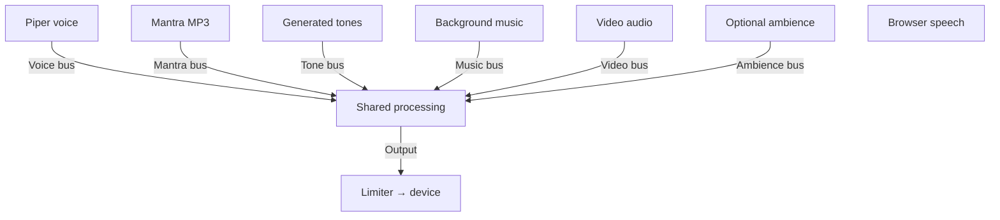
```mermaid
flowchart TD
  piper["Piper voice"]
  mantra["Mantra MP3"]
  generated["Generated tones"]
  music["Background music"]
  video["Video audio"]
  ambience["Optional ambience"]
  shared["Shared processing"]
  limiter["Limiter → device"]
  speech["Browser speech"]
  piper -->|"Voice bus"| shared
  mantra -->|"Mantra bus"| shared
  generated -->|"Tone bus"| shared
  music -->|"Music bus"| shared
  video -->|"Video bus"| shared
  ambience -->|"Ambience bus"| shared
  shared -->|"Output"| limiter
```

| Step | Current behavior |
| --- | --- |
| Piper voice | Decoded clips → voice gain → warmth and clarity filters; parallel Voice Space reverb. |
| Mantra MP3 | SeamlessLoop → mantra gain/filter → dry path and reverb tail → spatial panner. |
| Generated tones | Chakra/sleep drones, elemental layers and transition/Shot tones use their respective generator routes. |
| Background music | Equal-power repeat overlaps → independent loop level → linear music entry gain; dry gate and Music Space send; music spatial panner. |
| Video audio | MediaElementSource → dedicated Video gain → music spatial panner and Music Space send. |
| Optional ambience | Local manifest or user URL → equal-power layered loops → blur and spatial depth/panner. |
| Shared processing | Low-cut → Eyes Close filter → voice-carve filter → exciter → presence → compressor through one path. Filtered duplicate and transition swell removed; dedicated reverb tails remain. Music peaking EQ applies -3 dB when ducked and 0 dB at full level. Voice Space is independent of Spatial Sound; Spatial Off ramps added pan modulation to zero. |
| Limiter → device | Shared chain ends in limiter and AudioContext destination. Bell gain connects directly to limiter. |
| Browser speech | Separate speechSynthesis output; not processed by the shared Web Audio graph. |

- Narration ducks music. Music/mantra gates overlap on entry and exit; completion does not restore music and uses one music exit envelope. Loop volume is separate from repeat crossfades; overlap is bounded to half the buffer, and source cleanup follows audio time through pause. Music entry is linear with no second long source fade. Intentional silence and explicit mute remain. Spatial choices: Off, Stereo, Headphones, Room. Browser/device output and audibility need listening verification; timer throttling and silence inside recordings are not ruled out.

## Sound options and live suppression

What changes when sound settings are toggled.

Sources: [app.js:7358](/Users/lekshmisyam/Desktop/Ikigai/lite/app.js:7358), [app.js:2891](/Users/lekshmisyam/Desktop/Ikigai/lite/app.js:2891), [app.js:3008](/Users/lekshmisyam/Desktop/Ikigai/lite/app.js:3008), [app.js:2253](/Users/lekshmisyam/Desktop/Ikigai/lite/app.js:2253).

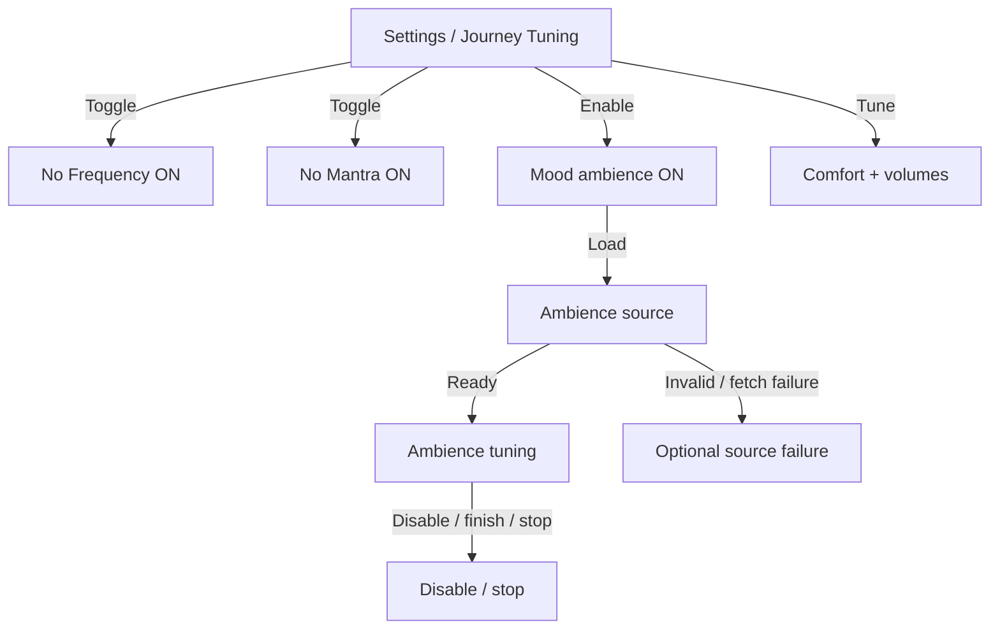
```mermaid
flowchart TD
  mixer["Settings / Journey Tuning"]
  nofreq["No Frequency ON"]
  nomantra["No Mantra ON"]
  ambient["Mood ambience ON"]
  source["Ambience source"]
  tune["Ambience tuning"]
  fail["Optional source failure"]
  off["Disable / stop"]
  comfort["Comfort + volumes"]
  mixer -->|"Toggle"| nofreq
  mixer -->|"Toggle"| nomantra
  mixer -->|"Enable"| ambient
  ambient -->|"Load"| source
  source -->|"Ready"| tune
  source -->|"Invalid / fetch failure"| fail
  tune -->|"Disable / finish / stop"| off
  mixer -->|"Tune"| comfort
```

| Step | Current behavior |
| --- | --- |
| Settings / Journey Tuning | Shared suppression settings, volume controls and optional ambience. |
| No Frequency ON | Cancel drone timer; stop drone, frequency Shot, transition tone and ambience; disable Shots and ambience controls. |
| No Mantra ON | Cancel drone timer; stop drone and mantra; retain spoken guidance and music. |
| Mood ambience ON | Session-only enablement; starts if active and not Music Only; forces soft blur on. |
| Ambience source | Saved custom URL if present; otherwise manifest/local audio buffers. Empty URL restores default selection. |
| Ambience tuning | Intensity, gain, blur and spatial movement. Crossing above 5% gain asks confirmation; cancel restores prior display. |
| Optional source failure | Report status or warning; optional ambience may be unavailable. |
| Disable / stop | Fade ambience out; state and playback are separate. Re-enabling No Frequency only restarts eligible ambience automatically. |
| Comfort + volumes | Eyes Close dims app and changes filters; brightness, voice pace, space, music/video levels act on their buses. |

- No Frequency also suppresses generated bowl/anchor through audio-engine guards. No Mantra affects standard chakra/yoga drone starts, but is not a blanket prohibition on every generated sound route.

## Visuals and browser lifecycle

Natural sky, chakra imagery, immersion and optional capabilities.

Sources: [app.js:3648](/Users/lekshmisyam/Desktop/Ikigai/lite/app.js:3648), [app.js:3654](/Users/lekshmisyam/Desktop/Ikigai/lite/app.js:3654), [style.css:796](/Users/lekshmisyam/Desktop/Ikigai/lite/style.css:796), [night-sky.js:1](/Users/lekshmisyam/Desktop/Ikigai/lite/night-sky.js:1).

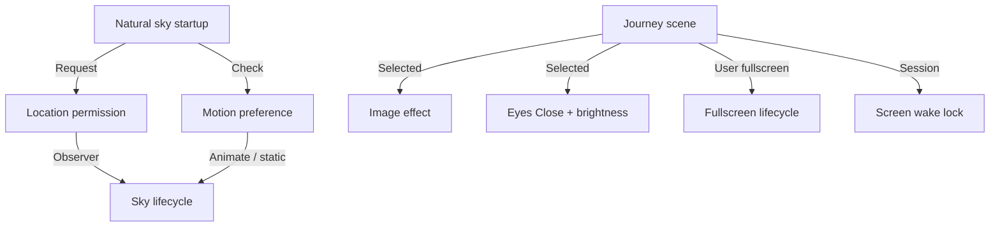
```mermaid
flowchart TD
  init["Natural sky startup"]
  geo["Location permission"]
  motion["Motion preference"]
  scene["Journey scene"]
  sky["Sky lifecycle"]
  effect["Image effect"]
  comfort["Eyes Close + brightness"]
  fullscreen["Fullscreen lifecycle"]
  wake["Screen wake lock"]
  init -->|"Request"| geo
  init -->|"Check"| motion
  geo -->|"Observer"| sky
  motion -->|"Animate / static"| sky
  scene -->|"Selected"| effect
  scene -->|"Selected"| comfort
  scene -->|"User fullscreen"| fullscreen
  scene -->|"Session"| wake
```

| Step | Current behavior |
| --- | --- |
| Natural sky startup | Load NaturalNightSky before app; cache a seeded 700–2,400-star backdrop with faint procedural galactic luminance and dark dust lanes. Neutral night gradient replaces drifting colored CSS clouds. |
| Location permission | Success updates observer and named celestial bodies; denied/unavailable retains approximate sky. Fine background stars are procedural, not a location-calibrated star catalog. |
| Motion preference | Reduced motion renders a static frame; changes to the OS preference immediately stop/restart animation. At most 110 stars shimmer; positions remain fixed. |
| Journey scene | Chakra color, aura, deity/symbol selection, progress dots and narration ticker. |
| Sky lifecycle | Resize rebuilds the cached backdrop with deterministic placement; normal frames composite it and shimmer selected stars. Celestial positions refresh at most once per minute. Textured lunar illumination is phase-cached; planets are small points and the Moon is intentionally unlabeled. Named planets and bright stars use compact 11 px labels with 30% text plus 15% backing and outline. Backing alone receives a soft 3 px blur; text/outline stay sharp and underlying stars are not blurred. Unsupported canvas filters retain plain backing. Meteors occur singly after a delayed start, then every 45–120 seconds. Hidden pages cancel animation and clear meteors. |
| Image effect | Natural/Aura/Holographic retain CSS effects. Sacred Depth uses a local WebGL 2.5D scene: authored smooth relief displacement, luminance-derived highlight lighting and textured atmosphere around source transparency. Original artwork alpha is preserved. A read-only mantra analyser gently modulates highlights with two-second smoothing; no microphone or audio gain change. Capped at 30 fps, 960 px longest drawing edge and 1.25 DPR. Pause freezes the renderer; hidden pages stop frames; reduced motion draws a static scene. Stop or Eyes Close restores the original image. WebGL/texture failure or context loss falls back to CSS; restored context can retry. Scene breathing is decorative, not synchronized to separate Box Breathing instructions. |
| Eyes Close + brightness | Explicit user brightness, Sleep dimming and Eyes Close remain honored. Eyes Close suppresses decorative motion/light; audio comfort filtering remains unchanged. |
| Fullscreen lifecycle | Only responds to user/browser fullscreen; app-container fullscreen controls have pointer/focus reveal. |
| Screen wake lock | Best-effort request in supported routes; failure is swallowed; release on stop/completion. |

- The lunar surface and background star field are illustrative procedural renderings; existing named-body location calculations remain approximate. New sky has no external assets or network dependency and caps DPR at 1.5. Static/unit checks cover bounded work, stable placement, reduced-motion draws and lunar illumination. Browser/device appearance remains unverified because the preview request was declined.

## Persistence, caching and network

Local state and the actual service-worker request routing.

Sources: [sw.js:1](/Users/lekshmisyam/Desktop/Ikigai/lite/sw.js:1), [app.js:5958](/Users/lekshmisyam/Desktop/Ikigai/lite/app.js:5958), [app.js:6184](/Users/lekshmisyam/Desktop/Ikigai/lite/app.js:6184), [piper-models.json:1](/Users/lekshmisyam/Desktop/Ikigai/lite/piper-models.json:1).

```mermaid
flowchart TD
  page["Page / experience requests"]
  prefs["localStorage"]
  session["Session-only choices"]
  install["Service worker install"]
  activate["Activate cache generation"]
  optional["Optional ambience"]
  special["Piper / language"]
  general["Other requests"]
  offline["Offline outcome"]
  page -->|"Read / save"| prefs
  page -->|"Runtime"| session
  page -->|"Register / install"| install
  install -->|"Installed"| activate
  activate -->|"Request class"| optional
  activate -->|"Request class"| special
  activate -->|"Else"| general
  optional -->|"Network-dependent"| offline
  special -->|"Hit / miss"| offline
  general -->|"Hit / miss"| offline
```

| Step | Current behavior |
| --- | --- |
| Page / experience requests | HTML/CSS/JS, JSON, audio/video and Piper assets. |
| localStorage | Languages, voices, durations, chakra choices, intention, custom script, mixer settings and stats; consultation stores answers separately. |
| Session-only choices | Experience modes, intimate unlock and mood ambience enablement reset on page load. No full in-progress journey restore. |
| Service worker install | cache.addAll shell/content/audio assets; one rejected required asset rejects precache installation. skipWaiting requested. |
| Activate cache generation | Claim clients; delete every cache except three exact current shell/Piper/language names. |
| Optional ambience | Manifest and matching pleasure files use network no-store, despite manifest appearing in precache. |
| Piper / language | Cache-first, fetch on miss, cache successful response. Piper recognizes local assets and Hugging Face voice URLs. |
| Other requests | Exact caches.match(request), otherwise network; ordinary misses are not added to cache. |
| Offline outcome | Only matching cached requests can work offline. Timestamped content and versioned shell requests may miss unversioned precache entries. |

- Video is not precached. Browsing tests disable service workers. Offline startup and upgrades are verification priorities; the PWA label alone does not prove offline journey operation.

## Failure and recovery map

Implemented fallback destinations and open verification areas.

Sources: [app.js:1](/Users/lekshmisyam/Desktop/Ikigai/lite/app.js:1), [app.js:4537](/Users/lekshmisyam/Desktop/Ikigai/lite/app.js:4537), [app.js:4416](/Users/lekshmisyam/Desktop/Ikigai/lite/app.js:4416), [app.js:5241](/Users/lekshmisyam/Desktop/Ikigai/lite/app.js:5241), [sw.js:1](/Users/lekshmisyam/Desktop/Ikigai/lite/sw.js:1).

```mermaid
flowchart TD
  failure["Failure / interruption"]
  config["Configuration fetch"]
  content["Journey content invalid"]
  audio["Audio / narration failure"]
  video["Prelude unavailable"]
  optional["Optional capability denied"]
  storage["Storage / cache failure"]
  cancel["Intentional stop"]
  verify["Runtime verification needed"]
  failure -->|"Config"| config
  failure -->|"Content"| content
  failure -->|"Playback"| audio
  failure -->|"Prelude"| video
  failure -->|"Permission / support"| optional
  failure -->|"Persistence"| storage
  audio -->|"User stops"| cancel
  content -->|"Recovery quality"| verify
  video -->|"Stall / retry"| verify
  storage -->|"No global recovery"| verify
```

| Step | Current behavior |
| --- | --- |
| Failure / interruption | Classify by owning subsystem. |
| Configuration fetch | Timing → defaults; language registry → built-in language choices; Piper registry → empty registry. |
| Journey content invalid | Shared guided start alerts and stops; Sleep caller catches and stops; Shot catch uses stopShot; Experiment catch returns to experiment. |
| Audio / narration failure | Mantra soft-fails and restores music; Piper falls back to browser; browser speech error/timeout releases wait. |
| Prelude unavailable | Media error/rejected play → fade / unavailable → Begin dispatcher; stalled media enters buffer recovery. |
| Optional capability denied | Geolocation → approximate sky; wake lock/output selection unsupported → continue. |
| Storage / cache failure | Some reads have guards; many localStorage writes are direct. Precache addAll has no partial-install fallback. |
| Intentional stop | Cancel pending narration/generation and guide waits; stop playback; return screen. |
| Runtime verification needed | Slow network, page hidden, mobile audio interruption, rapid double Begin/Restart, cache upgrades and storage denial. |

- Not every async failure is caught by the top-level window.onerror handler. Missing boundaries are shown as verification work rather than invented successful recovery.

## Consultation flow

Seven cards, 35 responses, local notes and consultant review.

Sources: [docs/assesment.html:503](/Users/lekshmisyam/Desktop/Ikigai/lite/docs/assesment.html:503), [docs/assesment.html:611](/Users/lekshmisyam/Desktop/Ikigai/lite/docs/assesment.html:611), [docs/assesment.html:726](/Users/lekshmisyam/Desktop/Ikigai/lite/docs/assesment.html:726).

```mermaid
flowchart TD
  lobby["Begin Session Consultation"]
  restore["Restore local responses"]
  answer["Seven chakra cards"]
  save["Save and update"]
  card["Completed card insight"]
  review["All 35 answered"]
  manual["Manual session planning"]
  clear["Clear for New Client"]
  lobby -->|"Open"| restore
  restore -->|"Continue"| answer
  answer -->|"Input"| save
  save -->|"Card complete"| card
  save -->|"More responses"| answer
  card -->|"All complete"| review
  review -->|"Consultant reviews"| manual
  answer -->|"New client"| clear
  clear -->|"Confirmed reset"| restore
```

| Step | Current behavior |
| --- | --- |
| Begin Session Consultation | Navigate to docs/assesment.html. |
| Restore local responses | chakraAnswers and chakraAssessmentNotes; malformed stored object falls back to empty. |
| Seven chakra cards | Five questions each; choose aligned, unsure or a concern direction. Optional per-card notes. |
| Save and update | Every response/note change saves locally and updates evaluations. |
| Completed card insight | After all questions in a card: strengths, patterns, uncertainties, follow-up and meditation consideration. |
| All 35 answered | Show combined consultant review, recurring themes and follow-up prompts. Partial answers show progress. |
| Manual session planning | Review with client; navigate back to Lite and choose session settings manually. No automatic prescription handoff. |
| Clear for New Client | Confirmation required; accepted → delete answers/notes and reload. Cancel preserves current record. |

- Font-size controls persist a separate scale. EN/Malayalam translation uses an external Google Translate widget, unlike the app’s native locale bundles. Answers and notes persist on the same browser until cleared.

## Frequency repertory handoff

Searchable reference → prepared custom Shot → explicit activation.

Sources: [docs/repertory.html:153](/Users/lekshmisyam/Desktop/Ikigai/lite/docs/repertory.html:153), [app.js:6939](/Users/lekshmisyam/Desktop/Ikigai/lite/app.js:6939).

```mermaid
flowchart TD
  open["Open repertory"]
  load["Load two JSON sources"]
  browse["Browse and search"]
  prepare["Prepare Shot link"]
  consume["Consume query"]
  confirm["Normal Shot confirmation"]
  ready["Prepared custom Shot"]
  begin["User presses Begin"]
  open -->|"Fetch"| load
  load -->|"Valid"| browse
  browse -->|"Choose entry"| prepare
  prepare -->|"Navigate"| consume
  consume -->|"Valid parameters"| confirm
  confirm -->|"Accepted"| ready
  ready -->|"Explicit action"| begin
```

| Step | Current behavior |
| --- | --- |
| Open repertory | From custom-Shot controls or direct docs/repertory.html navigation. |
| Load two JSON sources | scripts.json provides configured frequencies; frequency-repertory.json provides reference entries. Validate each Shot frequency. |
| Browse and search | English/Malayalam toggle; search names, focus, frequency and metadata; clear query; show empty-results state. |
| Prepare Shot link | Navigate to index.html with shotSource=repertory and shotFrequency query. |
| Consume query | Remove parameters using history.replaceState before validation/confirmation. |
| Normal Shot confirmation | Invalid frequency or No Frequency blocks preparation. Cancel leaves Shot off. |
| Prepared custom Shot | Set custom type and frequency, reset duration, show Lobby and focus frequency field. |
| User presses Begin | Only now run Shot; completion reload cannot replay consumed URL request. |

- Fetch or catalog-validation failures show a load error. This handoff prepares settings; it never automatically plays audio. checkFirstTime runs afterward, so an unconfigured visitor can still be routed to Settings.

## Coverage and limitations

This atlas represents the reachable branches identified in the main UI/controller, supporting pages and service worker. Repeated stages are loops; independent language, audio, visual and timing choices compose with the journey maps instead of expanding into millions of duplicate diagrams. Timer values are source defaults unless otherwise stated. Imported content can add wording and data variants.

The atlas follows the source snapshot identified above, including explicitly labeled uncommitted changes. It is source analysis, not device playback or a formal proof of exhaustive state-space coverage. User/browser events can interleave in ways that require runtime tests. The logical audio diagram intentionally groups individual filter and oscillator nodes.

Prior baseline: 21 of 23 non-browser test commands passed. Content-safety and drone-duration checks stop because owner-managed docs/dot.json is absent. New natural-sky behavior has static/unit evidence; browser preview was declined. No listening checks were run.
