# Chakra Meditation · Flow Atlas

Source snapshot: production 6e58c33 (live) + video introduction fills any orientation and shows a loading meter (local commit, not yet pushed) · 2026-10-06.

Focused release snapshot: centering-breath narration now invites comfortable rest in all five supported languages. No Frequency is selected for clients without a saved preference; a previously saved explicit opt-out remains respected. The established sound-suppression and journey flows are unchanged. Browser visual verification was not run. Calm translated in-app messages replace browser alerts (no developer text shown); repertory page in five languages with a No Frequency note, and it no longer changes the app language. Lobby frequency reminder above Begin: shows whether No Frequency Mode is on (tones off) or off, with a one-tap Turn on / Turn off that stays in sync with Settings. 2-Minute Mind Reset has no breathing cues: each mood uses body, senses, movement or thought, with time to do each step. Clearer first voice download (size, offline note, Download now, MB/percent progress card and floating pill); Sleep wind-down (last 3 minutes fade to dark and silence, quiet goodnight finish, wake lock released); app images served as WebP (about 20 MB → 1.6 MB). Heavenly Sound: voice has its own clean bus (no Eyes Close muffling), mud cut, soft de-ess and air lift; new heavenly echo (70 ms pre-delay, 3.5 s darkening tail, ducked under words, blooms in pauses), Off / Soft Halo / Heavenly; gentle master compressor and soft limiter; no 40 Hz hum; device sample rate. Chakra Touch added to the dev-mode Play Zone (chakra-touch map): consent-first couples touch game with a fixed Giver and Receiver, the receiver’s private Yes/Maybe/No map, Pause and check-ins. Mantra exits smoothly: 12 s chakra exit window (6 s fade + tail) inside chant time, pause fades the whole mix before suspending, skip fades over ~3 s. Assessment dot fixed: pleasure-vs-caution rounds, 75% rule (red now reachable), no card twice in a row, healthier chakra answer shown on either side. Assessment questions and value cards rewritten in plain, translation-friendly English (same meaning, IDs and weights). Narration rewritten in five languages to be natural, meditative and confident; engine keeps ? ! tone, breaks long sentences at commas and applies voice-only respellings (narration-speech-form module). Contactless Eye Shooter added to the dev-mode Play Zone (eye-shooter map): explanation-only gaze game with a points table and points goal. Hush Hush v2.0: hand-off lock, whose-turn banner, chakra images, real wheel, result flash; outer-body-part cards and 18+ Secret Card words; fixed an unclosed CSS media block that limited game and Pitch styles to small phones. Game renamed to Hush Hush (icebreaker) inside a new dev-mode Play Zone games section in the Lobby. Secret Body Part moved from Experiment Mode to its own dev-mode Lobby panel after Mood & Relaxation Ambience. Public Pitch Mode (2-Minute Mind Reset) added between Sound Shot and Meditation Room with fixed male voices per language (pitch-mode map). Dev-mode Secret Body Part party game added under Experiment Mode (secret-body-game map). 2026-09-30 release: ported local dev-mode (Advanced Features) Quiet Courage and Self-Exploration trio (Confidence Visualization, Deep Secrets, Final Challenge) as ordered preparation stages after Guided Noting; Lobby roadmap now follows runtime order (Intention before preparation practices); dev-mode session-only Reverse Journey (Crown → Root) restored.

Open [the interactive atlas](./index.html) for diagrams, node details, source references, SVG export and printing.

## Index

1. [Curriculum and marketing assets](#curriculum-branding)
2. [The whole application](#overview)
3. [Modularization safety loop](#modularization)
4. [Startup and first visit](#startup)
5. [Cosmic Observatory theme · implementation checkpoint](#cosmic-theme-planned)
6. [Mode selection and start routing](#modes)
7. [Standard chakra journey](#standard)
8. [Skip the current session item](#session-skip)
9. [Inside one chakra](#chakra)
10. [HRIM activation](#hrim)
11. [Sleep and Music Only](#sleep)
12. [Box breathing and Ho’oponopono](#focused)
13. [Yoga experience](#yoga)
14. [Intimate Service and massage](#care)
15. [Sound Shots](#shots)
16. [Experiment activities](#experiments)
17. [Ordered Chakra Journey add-ons](#journey-addons)
18. [Lobby journey roadmap](#journey-roadmap)
19. [Quiet Courage · private self-expression practice](#quiet-courage)
20. [Hush Hush · dev-mode icebreaker game](#secret-body-game)
21. [Contactless Eye Shooter · dev-mode gaze game](#eye-shooter)
22. [Walk in My Shoes · dev-mode role-play acting game](#role-play)
23. [Chakra Touch · dev-mode couples touch game](#chakra-touch)
24. [Pitch Mode · 2-Minute Mind Reset](#pitch-mode)
25. [Self-Exploration · Confidence Visualization, Deep Secrets and the standalone optional-service card](#self-exploration-challenges)
26. [Separate time for each chakra](#per-chakra-time)
27. [Pause, stop and live controls](#controls)
28. [Optional Lobby video introduction](#restart)
29. [Completion, statistics and external handoff](#completion)
30. [Scripts, language and timing](#content)
31. [Narration and fallback](#narration)
32. [Audio signal architecture](#audio)
33. [Sound options and live suppression](#sound-options)
34. [Visuals and browser lifecycle](#visuals)
35. [Earth observer reference and atmosphere](#earth-atmosphere)
36. [Thematic solar containment glow](#solar-containment)
37. [Persistence, caching and network](#storage)
38. [Failure and recovery map](#recovery)
39. [Isolated checkpoint delivery](#delivery-workflow)
40. [Display-language UI renderer](#locale-ui-renderer)
41. [Timing configuration and saved values](#timing-configuration)
42. [Automatic journey voice profile](#journey-voice-profile)
43. [Session-only journey-mode hydration](#session-mode-hydration)
44. [Mixer preference control hydration](#mixer-preference-hydration)
45. [Journey selection preference hydration](#journey-selection-hydration)
46. [Timing preference control hydration](#timing-preference-hydration)
47. [Appearance preference control hydration](#appearance-preference-hydration)
48. [Script preference control hydration](#script-preference-hydration)
49. [Custom meditation script settings](#custom-script-settings)
50. [Personal-care preference control hydration](#care-preference-hydration)
51. [Narration feelings](#narration-feeling)
52. [Styling: design system and Tailwind](#styling-system)
53. [Settings backup and restore](#settings-backup)
54. [Operator-led chakra assessment](#assessment-tournament)
55. [Frequency repertory handoff](#repertory)
56. [Benefits and safety (FAQ)](#benefits-safety)

## Curriculum and marketing assets

Approved facilitator programme → reusable marketing package. This is documentation and collateral, not an app navigation path.

Sources: [meditation_curriculum.md:1](/Users/lekshmisyam/Desktop/Ikigai/lite/meditation_curriculum.md:1), [branding/source/brochure-content.md:1](/Users/lekshmisyam/Desktop/Ikigai/lite/branding/source/brochure-content.md:1), [branding/README.md:1](/Users/lekshmisyam/Desktop/Ikigai/lite/branding/README.md:1).

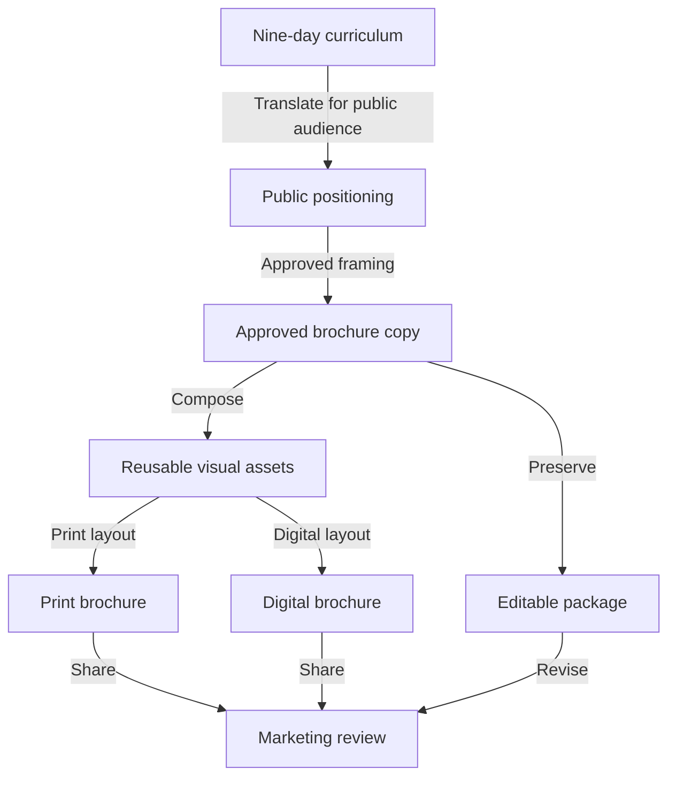
```mermaid
flowchart TD
  curriculum["Nine-day curriculum"]
  position["Public positioning"]
  copy["Approved brochure copy"]
  visual["Reusable visual assets"]
  print["Print brochure"]
  digital["Digital brochure"]
  source["Editable package"]
  review["Marketing review"]
  curriculum -->|"Translate for public audience"| position
  position -->|"Approved framing"| copy
  copy -->|"Compose"| visual
  visual -->|"Print layout"| print
  visual -->|"Digital layout"| digital
  copy -->|"Preserve"| source
  print -->|"Share"| review
  digital -->|"Share"| review
  source -->|"Revise"| review
```

| Step | Current behavior |
| --- | --- |
| Nine-day curriculum | Facilitator-ready progression: foundations and Root through Crown, integrated sound practice, Resonant Energy Meditation, reflection, home practice and safety boundaries. |
| Public positioning | Beginner-friendly, premium and technology-supported. Traditional contemplative practices are not presented as medical treatment or guaranteed outcomes. |
| Approved brochure copy | Nine-day overview, immersive technology, one-hour starter demo, business solutions, trained-manpower support, franchise opportunity, six-step delivery process and contact details. |
| Reusable visual assets | Supplied Srishti Innovative logo plus generated text-free hero artwork with exactly two premium inclined seats, two participants and an infinite-cosmos screen. |
| Print brochure | Two-page A4 roll-fold PDF with embedded fonts, 3 mm bleed, crop/fold marks, 97/100/100 mm outside panels and mirrored inside panels. Printer colour conversion and physical fold proof remain production steps. |
| Digital brochure | Seven-page 4:5 PDF with clickable WhatsApp, email, website and QR links. Includes the 1080×1350 social cover; original hero proportions retained. |
| Editable package | Editorial PDF generator, original artwork, vector website QR, brand guide, approved copy, production notes and build report are stored under branding. The original build command forwards to the current edition. |
| Marketing review | Open branding/index.html to browse every current page and download PDFs, social cover, QR and sources. This is a static collateral gallery separate from the PWA. |

- The Quick Starter Demo is one hour and carries the secondary note “Charges may apply.” Public contact: +91 7510726715, syamnath.s@srishtiinnovative.com and www.srishtis.com. Pricing is intentionally omitted. These files are not precached by the PWA or exposed as an in-app route.

## The whole application

Navigation, journey families, supporting systems, and exits.

Sources: [index.html:1](/Users/lekshmisyam/Desktop/Ikigai/lite/index.html:1), [modules/screen-navigation.js:1](/Users/lekshmisyam/Desktop/Ikigai/lite/modules/screen-navigation.js:1), [modules/ambient-particle-field.js:1](/Users/lekshmisyam/Desktop/Ikigai/lite/modules/ambient-particle-field.js:1), [tests/screen-navigation.test.mjs:1](/Users/lekshmisyam/Desktop/Ikigai/lite/tests/screen-navigation.test.mjs:1), [app.js:2159](/Users/lekshmisyam/Desktop/Ikigai/lite/app.js:2159), [app.js:2944](/Users/lekshmisyam/Desktop/Ikigai/lite/app.js:2944).

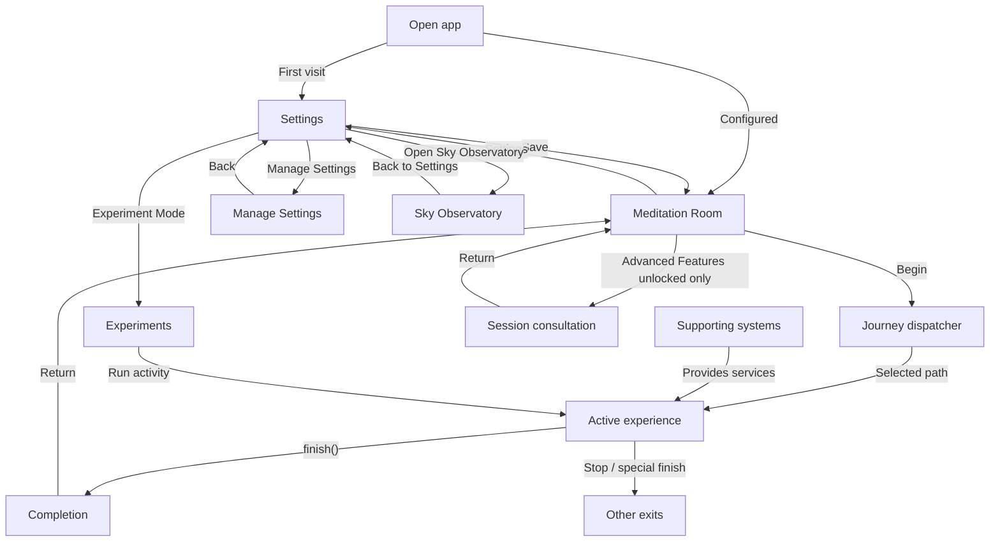
```mermaid
flowchart TD
  launch["Open app"]
  settings["Settings"]
  lobby["Meditation Room"]
  manage["Manage Settings"]
  experiments["Experiments"]
  sky["Sky Observatory"]
  journeys["Journey dispatcher"]
  consult["Session consultation"]
  runtime["Active experience"]
  support["Supporting systems"]
  complete["Completion"]
  other["Other exits"]
  launch -->|"First visit"| settings
  launch -->|"Configured"| lobby
  settings -->|"Save"| lobby
  lobby -->|"Settings"| settings
  settings -->|"Manage Settings"| manage
  manage -->|"Back"| settings
  settings -->|"Experiment Mode"| experiments
  settings -->|"Open Sky Observatory"| sky
  sky -->|"Back to Settings"| settings
  lobby -->|"Advanced Features unlocked only"| consult
  consult -->|"Return"| lobby
  lobby -->|"Begin"| journeys
  journeys -->|"Selected path"| runtime
  support -->|"Provides services"| runtime
  runtime -->|"finish()"| complete
  runtime -->|"Stop / special finish"| other
  experiments -->|"Run activity"| runtime
  complete -->|"Return"| lobby
```

| Step | Current behavior |
| --- | --- |
| Open app | Browser or installed PWA; local preferences and cached assets influence startup. |
| Settings | First visit or Lobby → Settings. Languages, voice, sound, visuals, timing and scripts; Advanced Features controls operator-only tools. Settings includes a localized CTA to the dedicated Sky Observatory. |
| Meditation Room | Main mode selection, chakra choices, intention and duration. The assessment entry is public; only its value rounds and dot need Advanced Features. |
| Manage Settings | Public settings import and Advanced Features-protected export. |
| Experiments | Settings → isolated activity → return to Experiment screen. See Experiments map. |
| Sky Observatory | Settings → Open Sky Observatory. Only this page animates the astronomy canvas; journey/support pages show a static frame, while Lobby/Settings remain clear. Back to Settings stops it. |
| Journey dispatcher | Shots → Music Only → Sleep → focused or standard guided start. See mode map. |
| Session consultation | Single entry point: Lobby “Begin Session Consultation” CTA, available only after Advanced Features unlock. It establishes a short same-tab assessment handoff; Settings has no assessment link. |
| Active experience | Shared timer, audio, narration, visuals, mixer, pause and stop. |
| Supporting systems | JSON scripts, language bundles, Web Audio, Piper worker, localStorage and service worker. |
| Completion | Guided and Sleep flows update local stats; return to room or eligible Earn link. |
| Other exits | Shot completion reloads; Music Only stops manually; experiments return to their screen. |

- Exactly one assessment CTA is in the Lobby; Settings has no assessment link. It starts hidden/disabled, appears only after the shared Advanced Features unlock, hides again on relock, and establishes a 15-minute same-tab handoff. The Sky CTA is public. Only the Observatory runs the calculated sky animation; journey/support screens draw one static frame, and Lobby/Settings hide it. Client-side assessment feature gate, not server authentication.
- The Lobby also offers Pitch Mode (2-Minute Mind Reset) between Sound Shot and the Meditation Room; see the pitch-mode map.

## Modularization safety loop

Atlas-led, behavior-preserving extraction with one independently verifiable boundary per checkpoint.

Sources: [modules/settings-backup.js:1](/Users/lekshmisyam/Desktop/Ikigai/lite/modules/settings-backup.js:1), [modules/app-state.js:1](/Users/lekshmisyam/Desktop/Ikigai/lite/modules/app-state.js:1), [modules/content-localization.js:1](/Users/lekshmisyam/Desktop/Ikigai/lite/modules/content-localization.js:1), [modules/media-lifecycle.js:1](/Users/lekshmisyam/Desktop/Ikigai/lite/modules/media-lifecycle.js:1), [modules/piper-lifecycle.js:1](/Users/lekshmisyam/Desktop/Ikigai/lite/modules/piper-lifecycle.js:1), [modules/audio-route-lifecycle.js:1](/Users/lekshmisyam/Desktop/Ikigai/lite/modules/audio-route-lifecycle.js:1), [modules/journey-routing.js:1](/Users/lekshmisyam/Desktop/Ikigai/lite/modules/journey-routing.js:1), [modules/practice-module-loader.js:1](/Users/lekshmisyam/Desktop/Ikigai/lite/modules/practice-module-loader.js:1), [modules/journey-chrome.js:1](/Users/lekshmisyam/Desktop/Ikigai/lite/modules/journey-chrome.js:1), [modules/body-scan-practice.js:1](/Users/lekshmisyam/Desktop/Ikigai/lite/modules/body-scan-practice.js:1), [modules/guided-noting-practice.js:1](/Users/lekshmisyam/Desktop/Ikigai/lite/modules/guided-noting-practice.js:1), [modules/dharana-practice.js:1](/Users/lekshmisyam/Desktop/Ikigai/lite/modules/dharana-practice.js:1), [modules/box-breathing-practice.js:1](/Users/lekshmisyam/Desktop/Ikigai/lite/modules/box-breathing-practice.js:1), [modules/visualization-practice.js:1](/Users/lekshmisyam/Desktop/Ikigai/lite/modules/visualization-practice.js:1), [modules/hooponopono-practice.js:1](/Users/lekshmisyam/Desktop/Ikigai/lite/modules/hooponopono-practice.js:1), [modules/undo-unlearn-practice.js:1](/Users/lekshmisyam/Desktop/Ikigai/lite/modules/undo-unlearn-practice.js:1), [modules/screen-navigation.js:1](/Users/lekshmisyam/Desktop/Ikigai/lite/modules/screen-navigation.js:1), [modules/session-estimate.js:1](/Users/lekshmisyam/Desktop/Ikigai/lite/modules/session-estimate.js:1), [modules/session-countdown.js:1](/Users/lekshmisyam/Desktop/Ikigai/lite/modules/session-countdown.js:1), [modules/session-item-runner.js:1](/Users/lekshmisyam/Desktop/Ikigai/lite/modules/session-item-runner.js:1), [modules/mood-ambience-settings-view.js:1](/Users/lekshmisyam/Desktop/Ikigai/lite/modules/mood-ambience-settings-view.js:1), [modules/drone-duration-settings-view.js:1](/Users/lekshmisyam/Desktop/Ikigai/lite/modules/drone-duration-settings-view.js:1), [modules/lobby-experience-visibility.js:1](/Users/lekshmisyam/Desktop/Ikigai/lite/modules/lobby-experience-visibility.js:1), [modules/yoga-experience-settings.js:1](/Users/lekshmisyam/Desktop/Ikigai/lite/modules/yoga-experience-settings.js:1), [modules/range-controls.js:1](/Users/lekshmisyam/Desktop/Ikigai/lite/modules/range-controls.js:1), [modules/journey-roadmap.js:1](/Users/lekshmisyam/Desktop/Ikigai/lite/modules/journey-roadmap.js:1), [modules/locale-ui-renderer.js:1](/Users/lekshmisyam/Desktop/Ikigai/lite/modules/locale-ui-renderer.js:1), [modules/timing-settings.js:1](/Users/lekshmisyam/Desktop/Ikigai/lite/modules/timing-settings.js:1), [modules/ambient-particle-field.js:1](/Users/lekshmisyam/Desktop/Ikigai/lite/modules/ambient-particle-field.js:1), [modules/visual-engine.js:1](/Users/lekshmisyam/Desktop/Ikigai/lite/modules/visual-engine.js:1), [tests/journey-chrome.test.mjs:1](/Users/lekshmisyam/Desktop/Ikigai/lite/tests/journey-chrome.test.mjs:1), [tests/practice-module-loader.test.mjs:1](/Users/lekshmisyam/Desktop/Ikigai/lite/tests/practice-module-loader.test.mjs:1), [tests/e2e/modularization-baseline.spec.js:1](/Users/lekshmisyam/Desktop/Ikigai/lite/tests/e2e/modularization-baseline.spec.js:1), [tests/e2e/practice-modules-lazy-load.spec.js:1](/Users/lekshmisyam/Desktop/Ikigai/lite/tests/e2e/practice-modules-lazy-load.spec.js:1), [tests/e2e/optional-video-lazy-load.spec.js:1](/Users/lekshmisyam/Desktop/Ikigai/lite/tests/e2e/optional-video-lazy-load.spec.js:1), [tests/journey-video-prelude.test.mjs:1](/Users/lekshmisyam/Desktop/Ikigai/lite/tests/journey-video-prelude.test.mjs:1), [modules/journey-video-prelude.js:1](/Users/lekshmisyam/Desktop/Ikigai/lite/modules/journey-video-prelude.js:1), [app.js:1](/Users/lekshmisyam/Desktop/Ikigai/lite/app.js:1), [index.html:783](/Users/lekshmisyam/Desktop/Ikigai/lite/index.html:783), [sw.js:1](/Users/lekshmisyam/Desktop/Ikigai/lite/sw.js:1), [tests/journey-routing.test.mjs:1](/Users/lekshmisyam/Desktop/Ikigai/lite/tests/journey-routing.test.mjs:1), [tests/screen-navigation.test.mjs:1](/Users/lekshmisyam/Desktop/Ikigai/lite/tests/screen-navigation.test.mjs:1), [tests/session-estimate.test.mjs:1](/Users/lekshmisyam/Desktop/Ikigai/lite/tests/session-estimate.test.mjs:1), [tests/session-countdown.test.mjs:1](/Users/lekshmisyam/Desktop/Ikigai/lite/tests/session-countdown.test.mjs:1), [tests/session-item-runner.test.mjs:1](/Users/lekshmisyam/Desktop/Ikigai/lite/tests/session-item-runner.test.mjs:1), [tests/mood-ambience-settings-view.test.mjs:1](/Users/lekshmisyam/Desktop/Ikigai/lite/tests/mood-ambience-settings-view.test.mjs:1), [tests/drone-duration-settings-view.test.mjs:1](/Users/lekshmisyam/Desktop/Ikigai/lite/tests/drone-duration-settings-view.test.mjs:1), [tests/lobby-experience-visibility.test.mjs:1](/Users/lekshmisyam/Desktop/Ikigai/lite/tests/lobby-experience-visibility.test.mjs:1), [tests/yoga-experience-settings.test.mjs:1](/Users/lekshmisyam/Desktop/Ikigai/lite/tests/yoga-experience-settings.test.mjs:1), [tests/range-controls.test.mjs:1](/Users/lekshmisyam/Desktop/Ikigai/lite/tests/range-controls.test.mjs:1), [tests/journey-roadmap.test.mjs:1](/Users/lekshmisyam/Desktop/Ikigai/lite/tests/journey-roadmap.test.mjs:1), [tests/locale-ui-renderer.test.mjs:1](/Users/lekshmisyam/Desktop/Ikigai/lite/tests/locale-ui-renderer.test.mjs:1), [tests/timing-settings.test.mjs:1](/Users/lekshmisyam/Desktop/Ikigai/lite/tests/timing-settings.test.mjs:1), [docs/app-map/FIX-QUEUE.md:1](/Users/lekshmisyam/Desktop/Ikigai/lite/docs/app-map/FIX-QUEUE.md:1), [modules/audio-voice-effects.js:1](/Users/lekshmisyam/Desktop/Ikigai/lite/modules/audio-voice-effects.js:1), [tests/audio-voice-effects.test.mjs:1](/Users/lekshmisyam/Desktop/Ikigai/lite/tests/audio-voice-effects.test.mjs:1), [modules/audio-engine-initialization.js:1](/Users/lekshmisyam/Desktop/Ikigai/lite/modules/audio-engine-initialization.js:1), [tests/audio-engine-initialization.test.mjs:1](/Users/lekshmisyam/Desktop/Ikigai/lite/tests/audio-engine-initialization.test.mjs:1), [modules/audio-signal-design.js:1](/Users/lekshmisyam/Desktop/Ikigai/lite/modules/audio-signal-design.js:1), [tests/audio-signal-design.test.mjs:1](/Users/lekshmisyam/Desktop/Ikigai/lite/tests/audio-signal-design.test.mjs:1), [modules/audio-spatial-geometry.js:1](/Users/lekshmisyam/Desktop/Ikigai/lite/modules/audio-spatial-geometry.js:1), [tests/audio-spatial-geometry.test.mjs:1](/Users/lekshmisyam/Desktop/Ikigai/lite/tests/audio-spatial-geometry.test.mjs:1), [modules/audio-elemental-layer.js:1](/Users/lekshmisyam/Desktop/Ikigai/lite/modules/audio-elemental-layer.js:1), [tests/audio-elemental-layer.test.mjs:1](/Users/lekshmisyam/Desktop/Ikigai/lite/tests/audio-elemental-layer.test.mjs:1), [modules/audio-tone-playback.js:1](/Users/lekshmisyam/Desktop/Ikigai/lite/modules/audio-tone-playback.js:1), [tests/audio-tone-playback.test.mjs:1](/Users/lekshmisyam/Desktop/Ikigai/lite/tests/audio-tone-playback.test.mjs:1), [modules/audio-drone-start.js:1](/Users/lekshmisyam/Desktop/Ikigai/lite/modules/audio-drone-start.js:1), [tests/audio-drone-start.test.mjs:1](/Users/lekshmisyam/Desktop/Ikigai/lite/tests/audio-drone-start.test.mjs:1), [modules/audio-drone-stop.js:1](/Users/lekshmisyam/Desktop/Ikigai/lite/modules/audio-drone-stop.js:1), [tests/audio-drone-stop.test.mjs:1](/Users/lekshmisyam/Desktop/Ikigai/lite/tests/audio-drone-stop.test.mjs:1), [modules/audio-mantra-playback.js:1](/Users/lekshmisyam/Desktop/Ikigai/lite/modules/audio-mantra-playback.js:1), [tests/audio-mantra-playback.test.mjs:1](/Users/lekshmisyam/Desktop/Ikigai/lite/tests/audio-mantra-playback.test.mjs:1), [modules/audio-background-music-lifecycle.js:1](/Users/lekshmisyam/Desktop/Ikigai/lite/modules/audio-background-music-lifecycle.js:1), [tests/audio-background-music-lifecycle.test.mjs:1](/Users/lekshmisyam/Desktop/Ikigai/lite/tests/audio-background-music-lifecycle.test.mjs:1), [modules/audio-background-music-controls.js:1](/Users/lekshmisyam/Desktop/Ikigai/lite/modules/audio-background-music-controls.js:1), [tests/audio-background-music-controls.test.mjs:1](/Users/lekshmisyam/Desktop/Ikigai/lite/tests/audio-background-music-controls.test.mjs:1), [modules/audio-music-echo.js:1](/Users/lekshmisyam/Desktop/Ikigai/lite/modules/audio-music-echo.js:1), [tests/audio-music-echo.test.mjs:1](/Users/lekshmisyam/Desktop/Ikigai/lite/tests/audio-music-echo.test.mjs:1), [modules/journey-hypnosis-wrapper.js:1](/Users/lekshmisyam/Desktop/Ikigai/lite/modules/journey-hypnosis-wrapper.js:1), [tests/journey-hypnosis-wrapper.test.mjs:1](/Users/lekshmisyam/Desktop/Ikigai/lite/tests/journey-hypnosis-wrapper.test.mjs:1), [modules/journey-opening-stage.js:1](/Users/lekshmisyam/Desktop/Ikigai/lite/modules/journey-opening-stage.js:1), [tests/journey-opening-stage.test.mjs:1](/Users/lekshmisyam/Desktop/Ikigai/lite/tests/journey-opening-stage.test.mjs:1), [modules/journey-content-loader.js:1](/Users/lekshmisyam/Desktop/Ikigai/lite/modules/journey-content-loader.js:1), [tests/journey-content-loader.test.mjs:1](/Users/lekshmisyam/Desktop/Ikigai/lite/tests/journey-content-loader.test.mjs:1), [modules/standard-journey-sequence.js:1](/Users/lekshmisyam/Desktop/Ikigai/lite/modules/standard-journey-sequence.js:1), [tests/standard-journey-sequence.test.mjs:1](/Users/lekshmisyam/Desktop/Ikigai/lite/tests/standard-journey-sequence.test.mjs:1), [modules/script-source-settings.js:1](/Users/lekshmisyam/Desktop/Ikigai/lite/modules/script-source-settings.js:1), [tests/script-source-settings.test.mjs:1](/Users/lekshmisyam/Desktop/Ikigai/lite/tests/script-source-settings.test.mjs:1), [modules/experiment-settings-view.js:1](/Users/lekshmisyam/Desktop/Ikigai/lite/modules/experiment-settings-view.js:1), [tests/experiment-settings-view.test.mjs:1](/Users/lekshmisyam/Desktop/Ikigai/lite/tests/experiment-settings-view.test.mjs:1), [modules/session-transport-controls.js:1](/Users/lekshmisyam/Desktop/Ikigai/lite/modules/session-transport-controls.js:1), [tests/session-transport-controls.test.mjs:1](/Users/lekshmisyam/Desktop/Ikigai/lite/tests/session-transport-controls.test.mjs:1), [modules/completion-view.js:1](/Users/lekshmisyam/Desktop/Ikigai/lite/modules/completion-view.js:1), [tests/completion-view.test.mjs:1](/Users/lekshmisyam/Desktop/Ikigai/lite/tests/completion-view.test.mjs:1), [tests/screen-navigation.test.mjs:1](/Users/lekshmisyam/Desktop/Ikigai/lite/tests/screen-navigation.test.mjs:1), [modules/experiment-session.js:1](/Users/lekshmisyam/Desktop/Ikigai/lite/modules/experiment-session.js:1), [tests/experiment-session.test.mjs:1](/Users/lekshmisyam/Desktop/Ikigai/lite/tests/experiment-session.test.mjs:1), [modules/journey-preparation-selection.js:1](/Users/lekshmisyam/Desktop/Ikigai/lite/modules/journey-preparation-selection.js:1), [tests/journey-preparation-selection.test.mjs:1](/Users/lekshmisyam/Desktop/Ikigai/lite/tests/journey-preparation-selection.test.mjs:1), [modules/yoga-experience-settings.js:1](/Users/lekshmisyam/Desktop/Ikigai/lite/modules/yoga-experience-settings.js:1), [tests/yoga-experience-settings.test.mjs:1](/Users/lekshmisyam/Desktop/Ikigai/lite/tests/yoga-experience-settings.test.mjs:1), [modules/drone-duration-settings-view.js:1](/Users/lekshmisyam/Desktop/Ikigai/lite/modules/drone-duration-settings-view.js:1), [tests/drone-duration-settings-view.test.mjs:1](/Users/lekshmisyam/Desktop/Ikigai/lite/tests/drone-duration-settings-view.test.mjs:1), [tests/timing-settings-view.test.mjs:1](/Users/lekshmisyam/Desktop/Ikigai/lite/tests/timing-settings-view.test.mjs:1), [tests/mood-ambience-settings-view.test.mjs:1](/Users/lekshmisyam/Desktop/Ikigai/lite/tests/mood-ambience-settings-view.test.mjs:1), [modules/lobby-experience-visibility.js:1](/Users/lekshmisyam/Desktop/Ikigai/lite/modules/lobby-experience-visibility.js:1), [tests/lobby-experience-visibility.test.mjs:1](/Users/lekshmisyam/Desktop/Ikigai/lite/tests/lobby-experience-visibility.test.mjs:1), [tests/timing-settings.test.mjs:1](/Users/lekshmisyam/Desktop/Ikigai/lite/tests/timing-settings.test.mjs:1), [tests/session-estimate.test.mjs:1](/Users/lekshmisyam/Desktop/Ikigai/lite/tests/session-estimate.test.mjs:1), [tests/session-countdown.test.mjs:1](/Users/lekshmisyam/Desktop/Ikigai/lite/tests/session-countdown.test.mjs:1), [tests/mood-ambience-settings-view.test.mjs:1](/Users/lekshmisyam/Desktop/Ikigai/lite/tests/mood-ambience-settings-view.test.mjs:1), [tests/audio-effects-settings-view.test.mjs:1](/Users/lekshmisyam/Desktop/Ikigai/lite/tests/audio-effects-settings-view.test.mjs:1), [tests/visual-effect.test.mjs:1](/Users/lekshmisyam/Desktop/Ikigai/lite/tests/visual-effect.test.mjs:1), [tests/piper-lifecycle.test.mjs:1](/Users/lekshmisyam/Desktop/Ikigai/lite/tests/piper-lifecycle.test.mjs:1), [tests/completion-view.test.mjs:1](/Users/lekshmisyam/Desktop/Ikigai/lite/tests/completion-view.test.mjs:1), [tests/media-controls-view.test.mjs:1](/Users/lekshmisyam/Desktop/Ikigai/lite/tests/media-controls-view.test.mjs:1), [tests/demo-script.test.mjs:1](/Users/lekshmisyam/Desktop/Ikigai/lite/tests/demo-script.test.mjs:1), [tests/content-localization.test.mjs:1](/Users/lekshmisyam/Desktop/Ikigai/lite/tests/content-localization.test.mjs:1), [tests/drone-duration-settings-view.test.mjs:1](/Users/lekshmisyam/Desktop/Ikigai/lite/tests/drone-duration-settings-view.test.mjs:1), [modules/audio-pleasure-ambience.js:1](/Users/lekshmisyam/Desktop/Ikigai/lite/modules/audio-pleasure-ambience.js:1), [tests/audio-pleasure-ambience.test.mjs:1](/Users/lekshmisyam/Desktop/Ikigai/lite/tests/audio-pleasure-ambience.test.mjs:1), [modules/shot-session.js:1](/Users/lekshmisyam/Desktop/Ikigai/lite/modules/shot-session.js:1), [tests/shot-session.test.mjs:1](/Users/lekshmisyam/Desktop/Ikigai/lite/tests/shot-session.test.mjs:1), [modules/sleep-journey.js:1](/Users/lekshmisyam/Desktop/Ikigai/lite/modules/sleep-journey.js:1), [tests/sleep-journey.test.mjs:1](/Users/lekshmisyam/Desktop/Ikigai/lite/tests/sleep-journey.test.mjs:1), [modules/yoga-session.js:1](/Users/lekshmisyam/Desktop/Ikigai/lite/modules/yoga-session.js:1), [tests/yoga-session.test.mjs:1](/Users/lekshmisyam/Desktop/Ikigai/lite/tests/yoga-session.test.mjs:1), [modules/care-session.js:1](/Users/lekshmisyam/Desktop/Ikigai/lite/modules/care-session.js:1), [tests/care-session.test.mjs:1](/Users/lekshmisyam/Desktop/Ikigai/lite/tests/care-session.test.mjs:1), [modules/chakra-session.js:1](/Users/lekshmisyam/Desktop/Ikigai/lite/modules/chakra-session.js:1), [tests/chakra-session.test.mjs:1](/Users/lekshmisyam/Desktop/Ikigai/lite/tests/chakra-session.test.mjs:1), [modules/piper-narration.js:1](/Users/lekshmisyam/Desktop/Ikigai/lite/modules/piper-narration.js:1), [tests/long-narration.test.mjs:1](/Users/lekshmisyam/Desktop/Ikigai/lite/tests/long-narration.test.mjs:1), [tests/narration-audio-only.test.mjs:1](/Users/lekshmisyam/Desktop/Ikigai/lite/tests/narration-audio-only.test.mjs:1), [modules/guide-controlled-transition.js:1](/Users/lekshmisyam/Desktop/Ikigai/lite/modules/guide-controlled-transition.js:1), [tests/guide-controlled-transition.test.mjs:1](/Users/lekshmisyam/Desktop/Ikigai/lite/tests/guide-controlled-transition.test.mjs:1), [modules/session-stop.js:1](/Users/lekshmisyam/Desktop/Ikigai/lite/modules/session-stop.js:1), [tests/session-stop.test.mjs:1](/Users/lekshmisyam/Desktop/Ikigai/lite/tests/session-stop.test.mjs:1), [tests/completion-session.test.mjs:1](/Users/lekshmisyam/Desktop/Ikigai/lite/tests/completion-session.test.mjs:1).

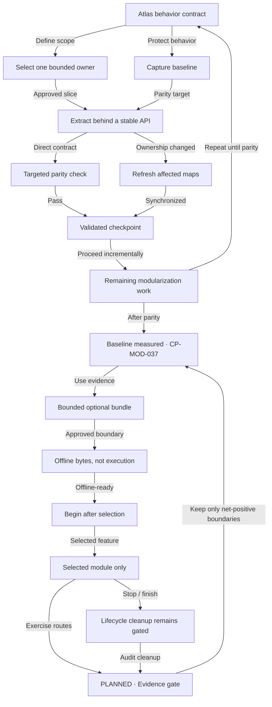
```mermaid
flowchart TD
  atlas["Atlas behavior contract"]
  boundary["Select one bounded owner"]
  baseline["Capture baseline"]
  extract["Extract behind a stable API"]
  test["Targeted parity check"]
  maps["Refresh affected maps"]
  checkpoint["Validated checkpoint"]
  next["Remaining modularization work"]
  measure["Baseline measured · CP-MOD-037"]
  partition["Bounded optional bundle"]
  cache["Offline bytes, not execution"]
  preload["Begin after selection"]
  activate["Selected module only"]
  release["Lifecycle cleanup remains gated"]
  verify["PLANNED · Evidence gate"]
  atlas -->|"Define scope"| boundary
  atlas -->|"Protect behavior"| baseline
  boundary -->|"Approved slice"| extract
  baseline -->|"Parity target"| extract
  extract -->|"Direct contract"| test
  extract -->|"Ownership changed"| maps
  test -->|"Pass"| checkpoint
  maps -->|"Synchronized"| checkpoint
  checkpoint -->|"Proceed incrementally"| next
  next -->|"Repeat until parity"| atlas
  next -->|"After parity"| measure
  measure -->|"Use evidence"| partition
  partition -->|"Approved boundary"| cache
  cache -->|"Offline-ready"| preload
  preload -->|"Selected feature"| activate
  activate -->|"Stop / finish"| release
  activate -->|"Exercise routes"| verify
  release -->|"Audit cleanup"| verify
  verify -->|"Keep only net-positive boundaries"| measure
```

| Step | Current behavior |
| --- | --- |
| Atlas behavior contract | Choose the affected runtime maps and protected invariants before moving code. |
| Select one bounded owner | Prefer a cohesive dependency-light surface with an existing deterministic test. |
| Capture baseline | Record branch, dirty files, current test evidence and exact public behavior. |
| Extract behind a stable API | Move ownership without changing labels, storage keys, timing, audio, visuals or journey order. |
| Targeted parity check | Test the module directly and confirm its integration references and offline asset delivery. |
| Refresh affected maps | Update delivered ownership and source references; keep future work in the fix queue. |
| Validated checkpoint | Review scope and errors; commit only intended files after fresh checks. |
| Remaining modularization work | Continue the remaining justified app/controller ownership seams, reconcile the integration baseline, then complete repeatable cold/warm/offline loading measurements and the separately approved browser evidence gate before declaring modularization complete. |
| Baseline measured · CP-MOD-037 | Cold/warm/offline script count, encoded resource bytes, transfer sizes, cache control and page errors; CPU/heap snapshots are indicative only. |
| Bounded optional bundle | Seven selected guided-practice scripts are the first bundle; measured initial-JS reduction is modest (~13.1 KiB locally). |
| Offline bytes, not execution | Service worker precaches the seven practice script URLs, while the eager shell includes only the small loader. |
| Begin after selection | The selected Lobby toggles map to exact module IDs and one deduplicated loadMany call before video/audio startup. |
| Selected module only | Each practice runner ensures its own module is loaded; failed loads clear pending state and the localized alert lets the user retry. |
| Lifecycle cleanup remains gated | Stop workers, buffers, AudioNodes, media, animation/WebGL, observers, timers and listeners where safe. |
| PLANNED · Evidence gate | Cold/warm/offline, PWA update, route, cancellation/restart and device/browser performance evidence must show net benefit. |

- Delivered seams: settings backup owns collection/validation/replacement; app-state owns initial state; content-localization owns path lookup, language fallback, localized shapes and script validation; media-lifecycle owns stage fade scoping, Unicode narration chunking, Piper envelope constants and native seamless-loop preparation/cleanup; piper-lifecycle owns worker queueing, model configuration, synthesis/decode cache, playback envelopes and cancellation; audio-route-lifecycle owns idempotent effect connection, audio-clock tail retirement, cancellation and disconnection; journey-routing owns focused-mode selection, launch priority, prelude-safe chakra validation, chakra-order selection, ordered preparation-stage planning and sequential execution with a session-active cancellation guard; body-scan-practice owns timed eight-region narration, guarded sequencing and black-scene cleanup; guided-noting-practice owns timed reminder sequencing, cancellation checks and black-scene cleanup; dharana-practice owns focus-anchor/veil setup, selected shape/color, reduced-motion-compatible active-time shrink progression, narrated release and cleanup; box-breathing-practice owns preparation/tutorial transitions, the localized four-step cycle, four repetitions, 100 ms pause-aware time accounting, completion narration and background-music handoff; visualization-practice owns blackout, audio/narration timing and gradual return; hooponopono-practice owns its phrase cycles and closing handoff; undo-unlearn-practice owns phase sequencing and guaranteed black-scene cleanup; screen-navigation owns shared screen visibility, static-sky decoration guards, decorationchange notification and scroll resets. The eager shell loads `practice-module-loader.js`, not these seven APIs. The loader injects only selected classic scripts on Begin, deduplicates concurrent loads, and clears failures so a localized failure can be retried; their exact URLs remain precached for offline use. The first local comparison reduces startup JavaScript bodies by ~13.1 KiB with navigation timing variability, so only this byte reduction is claimed; CPU, heap, thermal, compressed production and device effects remain unproven. AudioEngine bus construction remains owner-deferred until the next weekly reset.
- CP-MOD-154: audio-voice-effects owns voice warmth/clarity coercion, neutral fallback, clamps and gain ramps plus Voice Space profiles, active-playback convolver gate, tail duration and send/wet/filter ramps. AudioEngine retains public adapters and playback-state assignment order. Eager script follows audio-music-echo and is offline precached; this ownership extraction makes no performance or audio-quality claim.
- CP-MOD-078–082 extract experiment view bindings, Lobby assessment navigation, pause/stop control bindings, completion dismissal and selected-practice ID mapping. Existing runtime behavior and selected-only practice loading remain unchanged; direct automated checks pass. No browser/device or performance gain is claimed.
- CP-MOD-083–087 extend the existing preparation, Yoga and drone-duration settings owners with preference and change-event binding. Existing mutual exclusion, normalization, persistence keys, callback order and session-estimate refresh behavior remain in force; selected-only loading is unchanged. Ownership/testability only; no browser/device or performance gain is claimed.
- CP-MOD-088–097 extract ten control-binding responsibilities into existing owners: High Energy estimate refresh, standard and HRIM duration sliders, five Mood & Relaxation controls, the Yoga Advanced Features gate and Shot-type refresh. Preserve normalization, lock/No Frequency checks, confirmation threshold, storage keys, mode order and estimate/audio update sequence. This is organization/testability only; no browser/device/performance gain is claimed.
- CP-MOD-048 moves the original AudioEngine initialization graph behind an explicit dependency API without changing node creation order, routes or gain/filter/tail defaults. Runtime playback, spatial setters and source cleanup remain with AudioEngine for separately scoped checkpoints. No audible, startup, CPU, heap or thermal gain is implied.
- CP-MOD-049 extracts pure signal-buffer construction with AudioContext/randomness passed explicitly; AudioEngine keeps its compatibility adapters and cached-noise ownership. The new eager module is precached for offline playback. This changes ownership only.
- CP-MOD-050 extracts only generic spatial-panner construction and movement; spatial mode configuration and orchestration remain app-owned. The eager module is precached. This changes ownership only.
- CP-MOD-051 extracts elemental noise-layer lifecycle, preserving the seven index profiles, audio values and cleanup. `AudioEngine` retains its compatibility method and all higher-level drone lifecycle decisions. This changes ownership only.
- CP-MOD-052 extracts frequency-only Shot and guided cue audio lifecycles with app state injected explicitly. Public AudioEngine method names and live-session routing remain stable. No audible or performance benefit is implied.
- CP-MOD-053 extracts chakra/HRIM and sleep drone startup, preserving all exact frequency and support-oscillator behavior. AudioEngine retains its stable methods and all drone shutdown state. This is ownership/testing work only.
- CP-MOD-054 extracts drone stop/fade cleanup while preserving the AudioEngine compatibility API and its original source retirement order. This is lifecycle ownership work only.
- CP-MOD-055 extracts mantra play/stop orchestration, retaining AudioEngine compatibility adapters and background music policy. Cancellation, fade, reverb and cached decode behavior are preserved. Ownership/testability only.
- CP-MOD-056 extracts background music loop start/stop with AudioEngine adapters, preserving decoded buffer reuse, live-loop continuity, delayed restart retirement, echo setup order and stop-tail cleanup. Ownership/testability only.
- CP-MOD-057 extracts background-music fades, gain role preservation, stage ducking, mantra mute/restore, reverb-tail gating and timer cancellation behind stable AudioEngine adapters. Eager/offline delivery and behavior are preserved; ownership/testability only.
- CP-MOD-058 extracts music-echo preset selection and its 250 ms AudioParam ramps behind the existing AudioEngine method. Preset values, invalid-mode fallback, convolver tail lifecycle and eager/offline availability remain unchanged; ownership/testability only.
- CP-MOD-059 extracts optional Arrival and Emergence orchestration behind app adapters; the standard journey graph, cue frequencies/timings, localized narration source, No Frequency pacing and stop guards remain unchanged. Eager/offline delivery; ownership/testability only.
- CP-MOD-060 extracts the opening/Gratitude stage behind an app adapter. Existing safety narration, Moon/Returning choice, optional private intention and HRIM-specific opening remain unchanged; ownership/testability only.
- CP-MOD-061 extracts language/custom source selection, same-language cache reuse, fetch and script validation behind an app adapter. App cache state is committed before validation as before; validation context timing, failure text and startup ordering remain unchanged. Eager/offline delivery; ownership/testability only.
- CP-MOD-067a moves only the existing custom/default script-source change handler into `modules/script-source-settings.js`. Demo-duration coordination, estimate refresh, panel visibility, persistence and journey-script cache invalidation keep their original order; no behavior or performance change is claimed.
- CP-MOD-067b moves file reading, JSON/schema validation, successful persistence, demo-duration coordination, estimate refresh, status display and journey-cache invalidation into the same settings module. Existing success/error copy and failure behavior remain; URL fetch was app-owned at this intermediate slice.
- CP-MOD-067c moves URL fetching into `modules/script-source-settings.js` with latest-nonempty-request-wins, stale completion suppression, empty-URL no-op and failure atomicity. Journey-time validation/loading remains in `modules/journey-content-loader.js`; ownership only, no performance claim.
- CP-MOD-098–107 move ten bounded language, voice-preview, Yoga, Sleep and Shot interaction behaviors into existing view owners. The cross-mode policy and unlock lifecycle remain in app.js; no lazy boundary or user-flow change.
- CP-MOD-108–127 move twenty value/display helpers into their cohesive existing owners: ambience normalization and gain/blur policy (8), Shot/drone/Sleep timing policy (7), spatial-mode normalization (1), countdown SVG rendering/hiding (2), narration-duration estimation (1), and visual-effect normalization (1). App-facing adapters preserve call sites and configurations. Existing eager/offline script delivery remains unchanged; this is testability/ownership work, not a performance claim.
- CP-MOD-128 moves chakra-symbol image load/error/cached-image visibility handling into the existing VisualEngine instance. App call sites retain the same selected artwork and timing; request identity guards still prevent stale image callbacks from revealing a superseded symbol. Eager/offline delivery and visual behavior are unchanged; ownership/testability only.
- CP-MOD-129–148 moves twenty helper responsibilities into established owners: Piper voice ID/registry/cadence/gender/locale selection (10), completion Earn-link cancellation/eligibility/scheduling (3), voice-status rendering (1), demo-script duration/message/eligibility policies (3), generated-intention language refresh (2), and contextual drone-duration summary rendering (1). Stable app adapters preserve runtime call sites; there is no new eager module or lazy boundary. Direct tests pass; this is ownership/testability work only.
- CP-MOD-155 moves the isolated experiment start/stop lifecycle into `modules/experiment-session.js` behind MeditationController adapters. Advanced Features care guard, content source selection/cache key, audio/ambience and wake-lock setup, duration assignment, activity dispatch, error fallback and stop cleanup order are retained. The existing experiment duration-unit mismatch remains tracked in FIX-QUEUE; this extraction intentionally does not change it.
- CP-MOD-156 moves the Sound Shots sequence and completion/stop cleanup into `modules/shot-session.js` behind the existing MeditationController APIs. Script selection, guards, stage frequencies/labels, active-time and interval timing, countdown, pause/cancel checks, audio setup and finish/reset behavior remain unchanged. The module stays eager and offline-cached; no performance claim.
- CP-MOD-157 moves Sleep journey orchestration to `modules/sleep-journey.js` behind its existing controller adapter. Locked/start guards, script source/cache behavior, timer, visual/audio setup, five stages, pause-aware timing, 3-second gaps, and long ending fade remain unchanged. Eager/offline delivery remains; ownership only, no performance claim.
- CP-MOD-158 moves the Yoga session stage sequence into `modules/yoga-session.js` behind `runYogaSession()`. Optional Corpse Pose and standard Bath/rest, grounding drone, narration, preparation, selected poses, visuals, pause-aware holds and completion remain ordered; Intimate Service stays separate. Eager/offline ownership only, no performance claim.
- CP-MOD-159 moves Intimate Service care-stage timing, operator-guided transitions, experiment-duration override, massage sequence composition and assisted-bathing order into `modules/care-session.js`. Existing controller and experiment APIs remain stable; the user flow is unchanged. The module remains eager/offline-cached; ownership only, no performance claim.
- CP-MOD-160 moves the shared single-chakra/HRIM stage implementation into `modules/chakra-session.js` behind the stable `meditateOnChakra()` adapter. Chakra artwork/progress, narration → mantra → conditionally bounded drone, pause-aware chant timing, post-mantra tail and affirmation remain ordered. Normal, HRIM and reverse-massage routes share the same stage; eager/offline ownership only, no performance claim.
- CP-MOD-161 moves Piper sentence-queued narration orchestration into `modules/piper-narration.js` behind the existing `narrateWithPiper()` adapter. Lead-in and sentence gaps, bounded decode-ahead, cancellation-generation checks, pause waits, browser-speech fallback, clip/mantra fades, exit timing and voice-carve ramps remain unchanged. Script remains eager and offline precached; this is ownership/testability only, not a performance claim.
- CP-MOD-162 moves the shared guide-controlled countdown/Continue wait into `modules/guide-controlled-transition.js` behind the stable controller method used by Yoga and care. Missing-control and inactive guards, rounded countdown, pause-blocked clicks, focus, Stop cancellation and listener cleanup remain unchanged. Eager/offline ownership only; no performance claim.
- CP-MOD-163 moves Stop cleanup into `modules/session-stop.js` behind `MeditationController.stop()`. Activity flags, stage/drone/tone/mantra/music/ambience shutdown order, Piper fade cancellation, wake-lock/countdown release, guide resolution, UI/aura/brightness reset, experiment-versus-Lobby return and preserveScreen behavior remain unchanged. Eager/offline ownership only; no performance claim.
- CP-MOD-164 moves natural completion cleanup, elapsed-session accounting, stats persistence, translated modal setup and Earn handoff scheduling into the existing `modules/completion-view.js` owner behind `MeditationController.finish()`. Audio shutdown order, 1-minute minimum rounding, persisted keys, cleanup and visual/result behavior are retained; no new script/cache entry or performance claim.
- CP-MOD-152 moves Mood & Relaxation ambience manifest loading, custom-URL rollback, loop start/stop, gain/blur ramps and spatial approach into one existing-domain audio lifecycle module. AudioEngine method names, state owner, journey calls, parameters, failure recovery and eager/offline availability remain unchanged; no flow, audio-quality or performance change is claimed.
- CP-MOD-153 moves first-visit routing into the existing screen-navigation owner. The app retains its checkFirstTime adapter and both initialization call sites; chakra_configured truthiness, destination visibility, decoration notification, scroll resets and exact aura gradients/opacity are unchanged. No module, script/cache entry or performance claim is added.
- CP-MOD-165 audits the remaining `MeditationController.start()` boundary: retain it as the app-level dispatcher because it coordinates user-gesture speech unlock, content validation, audio/Piper preparation, wake lock, newcomer onboarding, route ordering and shared failure/cancellation cleanup. Its cohesive inner lifecycles have owners; extracting the full dispatcher would relocate orchestration without reducing coupling. Selected preparation scripts and the optional video controller remain the justified lazy boundaries. Six other route-specific owners total 8,278 gzip bytes statically before loader overhead; keep eager/offline-cached until fresh cold/warm/offline browser measurements demonstrate net benefit. No current runtime or performance claim.
- CP-MOD-166 moves standard chakra-sequence ownership into `modules/standard-journey-sequence.js`; the app controller keeps its stable `runSequence()` adapter and owns start dispatch. Direct tests cover stage order, optional integrations, partial runs, Music Only, cancellation and finish. No user-flow or eager/offline delivery change.

## Startup and first visit

Loading order and optional browser capabilities.

Sources: [modules/screen-navigation.js:1](/Users/lekshmisyam/Desktop/Ikigai/lite/modules/screen-navigation.js:1), [tests/screen-navigation.test.mjs:1](/Users/lekshmisyam/Desktop/Ikigai/lite/tests/screen-navigation.test.mjs:1), [modules/settings-help-view.js:1](/Users/lekshmisyam/Desktop/Ikigai/lite/modules/settings-help-view.js:1), [tests/settings-help-view.test.mjs:1](/Users/lekshmisyam/Desktop/Ikigai/lite/tests/settings-help-view.test.mjs:1), [index.html:147](/Users/lekshmisyam/Desktop/Ikigai/lite/index.html:147), [app.js:2159](/Users/lekshmisyam/Desktop/Ikigai/lite/app.js:2159), [app.js:1847](/Users/lekshmisyam/Desktop/Ikigai/lite/app.js:1847), [app.js:2944](/Users/lekshmisyam/Desktop/Ikigai/lite/app.js:2944).

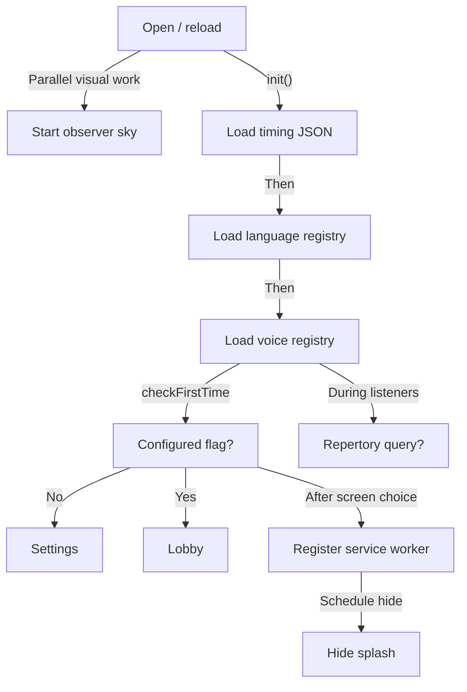
```mermaid
flowchart TD
  open["Open / reload"]
  sky["Start observer sky"]
  timing["Load timing JSON"]
  language["Load language registry"]
  voices["Load voice registry"]
  configured["Configured flag?"]
  repertory["Repertory query?"]
  settings["Settings"]
  lobby["Lobby"]
  sw["Register service worker"]
  splash["Hide splash"]
  open -->|"Parallel visual work"| sky
  open -->|"init()"| timing
  timing -->|"Then"| language
  language -->|"Then"| voices
  voices -->|"checkFirstTime"| configured
  voices -->|"During listeners"| repertory
  configured -->|"No"| settings
  configured -->|"Yes"| lobby
  configured -->|"After screen choice"| sw
  sw -->|"Schedule hide"| splash
```

| Step | Current behavior |
| --- | --- |
| Open / reload | Objects and state are constructed; splash is visible. |
| Start observer sky | Load local Astronomy Engine and the real star catalogue before the sky controller. Begin with an explicitly labelled Greenwich reference, then replace it with granted device coordinates. Positions use the current UTC instant; display timezone does not shift them. |
| Load timing JSON | Built-in defaults on failure; timingProfile query can apply fast-test overrides. |
| Load language registry | Restore meditation language or Malayalam default; restore display language or English fallback. Load all five locale bundles, including the fully localized Tamil bundle. |
| Load voice registry | Fetch the versioned Piper definitions; offer Tamil Rasa and Hindi Priyamvada defaults alongside the Malayalam, English and Russian voices; enumerate browser voices; restore preferences and attach UI handlers. Community weights load on first preview/use. |
| Configured flag? | chakra_configured determines initial screen. |
| Repertory query? | Keep shotSource / shotFrequency pending while locked. Seven-tap unlock consumes the query and offers normal Shot confirmation; initial screen choice remains unchanged. |
| Settings | Unconfigured visitor. “Go to Meditation Room” saves settings, sets chakra_configured and opens the Lobby. |
| Lobby | Configured visitor. Session-only modes start cleared. |
| Register service worker | Registration is inside a window load listener added after awaited startup work. Registration timing deserves verification. |
| Hide splash | 2.5-second delay begins after async initialization reaches its end. |

- Timing fetch failure uses defaults. Language loading catches failures and installs built-in options. The small practice loader is eager, but its seven guided-practice scripts are not parsed until selected on Begin; see Mode Selection and the modularization map. This does not establish complete offline readiness.
- CP-MOD-153: screen-navigation now reads chakra_configured at the existing checkFirstTime call time, showing Lobby for a truthy stored value and Settings otherwise. Both destinations retain dynamic decorations and one decorationchange notification before the aura treatment. The original bottom/top violet radial gradients and opacity 1, missing-aura guard, startup order and initialization-failure fallback are preserved.

## Cosmic Observatory theme · implementation checkpoint

Owner-approved redesign in bounded slices; behavior and performance contracts remain in force.

Sources: [.loop/tracks/cosmic-observatory-theme/spec-plan-review.md:1](/Users/lekshmisyam/Desktop/Ikigai/lite/.loop/tracks/cosmic-observatory-theme/spec-plan-review.md:1), [docs/design/lite-cosmic-observatory/README.md:1](/Users/lekshmisyam/Desktop/Ikigai/lite/docs/design/lite-cosmic-observatory/README.md:1), [index.html:1](/Users/lekshmisyam/Desktop/Ikigai/lite/index.html:1), [tailwind/legacy.css:1](/Users/lekshmisyam/Desktop/Ikigai/lite/tailwind/legacy.css:1), [modules/screen-navigation.js:1](/Users/lekshmisyam/Desktop/Ikigai/lite/modules/screen-navigation.js:1), [modules/ambient-particle-field.js:1](/Users/lekshmisyam/Desktop/Ikigai/lite/modules/ambient-particle-field.js:1), [docs/app-map/FIX-QUEUE.md:1](/Users/lekshmisyam/Desktop/Ikigai/lite/docs/app-map/FIX-QUEUE.md:1).

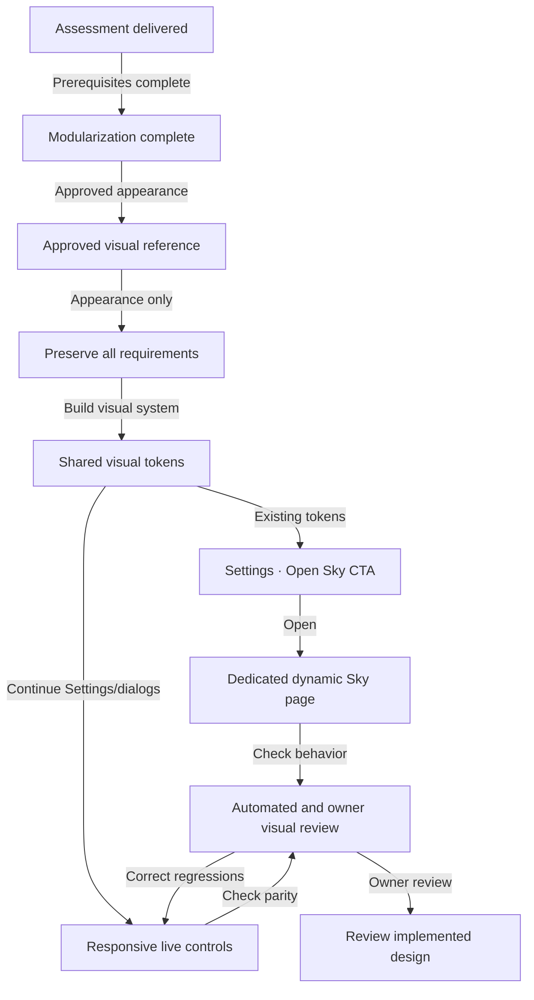
```mermaid
flowchart TD
  assessment["Assessment delivered"]
  modules["Modularization complete"]
  reference["Approved visual reference"]
  contract["Preserve all requirements"]
  tokens["Shared visual tokens"]
  skyCta["Settings · Open Sky CTA"]
  skyPage["Dedicated dynamic Sky page"]
  surfaces["Responsive live controls"]
  verify["Automated and owner visual review"]
  review["Review implemented design"]
  assessment -->|"Prerequisites complete"| modules
  modules -->|"Approved appearance"| reference
  reference -->|"Appearance only"| contract
  contract -->|"Build visual system"| tokens
  tokens -->|"Existing tokens"| skyCta
  skyCta -->|"Open"| skyPage
  skyPage -->|"Check behavior"| verify
  tokens -->|"Continue Settings/dialogs"| surfaces
  surfaces -->|"Check parity"| verify
  verify -->|"Correct regressions"| surfaces
  verify -->|"Owner review"| review
```

| Step | Current behavior |
| --- | --- |
| Assessment delivered | The standalone operator assessment is implemented and synchronized; operator acceptance remains a tracked follow-up. |
| Modularization complete | Current modularization and selected-practice/video lazy-loading scope is complete; further deferral is optional and measurement-gated. |
| Approved visual reference | See docs/design/lite-cosmic-observatory/approved-concept-v1.png: midnight panels, ivory text, champagne actions and cosmic setting. |
| Preserve all requirements | Keep every option, default, gate, translation, navigation, timing, audio and persistence contract. Mockup omissions and sample values are illustrative. |
| Shared visual tokens | Lobby tokens and responsive presentation are implemented locally; current control IDs, order, options and behavior remain unchanged. |
| Settings · Open Sky CTA | Localized Settings CTA is live and navigates through the shared screen owner. |
| Dedicated dynamic Sky page | Sky is relocated to its own responsive page. Observer calculations, cardinal order, horizon, Earth atmosphere/26°C artwork and Sun shield remain. |
| Responsive live controls | Settings/dialog theme pass remains. Continue with existing handlers and all current options. |
| Automated and owner visual review | Focused navigation/locale/cache tests are required; owner reviews languages, keyboard, mobile/tablet/desktop and celestial-label clearance in the browser. |
| Review implemented design | The preview is delivered locally for owner browser review. Production publication needs a separate request. |

- CP-THEME-IMPL-001 Lobby presentation is local; CP-THEME-IMPL-002 adds the Settings-linked Sky page; CP-THEME-IMPL-003 finishes supporting surfaces and restores one-shot static sky imagery on journey/support pages. Only the Observatory animates; Lobby/Settings remain clear. The illustrated atmospheres and Sun shield remain non-physical artwork; calculated positions preserve observer data. Focused automated checks are required. Browser visual verification is intentionally reserved for the owner and has not been claimed.

## Mode selection and start routing

Mutual exclusion, validation, selected practice loading, dispatch priority, and the tested Sleep/Shot change guards.

Sources: [modules/journey-routing.js:1](/Users/lekshmisyam/Desktop/Ikigai/lite/modules/journey-routing.js:1), [modules/journey-preparation-selection.js:1](/Users/lekshmisyam/Desktop/Ikigai/lite/modules/journey-preparation-selection.js:1), [tests/journey-preparation-selection.test.mjs:1](/Users/lekshmisyam/Desktop/Ikigai/lite/tests/journey-preparation-selection.test.mjs:1), [modules/practice-module-loader.js:1](/Users/lekshmisyam/Desktop/Ikigai/lite/modules/practice-module-loader.js:1), [modules/lobby-experience-visibility.js:1](/Users/lekshmisyam/Desktop/Ikigai/lite/modules/lobby-experience-visibility.js:1), [tests/lobby-experience-visibility.test.mjs:1](/Users/lekshmisyam/Desktop/Ikigai/lite/tests/lobby-experience-visibility.test.mjs:1), [modules/chakra-selection-view.js:1](/Users/lekshmisyam/Desktop/Ikigai/lite/modules/chakra-selection-view.js:1), [tests/chakra-selection-view.test.mjs:1](/Users/lekshmisyam/Desktop/Ikigai/lite/tests/chakra-selection-view.test.mjs:1), [modules/yoga-experience-settings.js:1](/Users/lekshmisyam/Desktop/Ikigai/lite/modules/yoga-experience-settings.js:1), [tests/yoga-experience-settings.test.mjs:1](/Users/lekshmisyam/Desktop/Ikigai/lite/tests/yoga-experience-settings.test.mjs:1), [modules/journey-content-loader.js:1](/Users/lekshmisyam/Desktop/Ikigai/lite/modules/journey-content-loader.js:1), [tests/journey-content-loader.test.mjs:1](/Users/lekshmisyam/Desktop/Ikigai/lite/tests/journey-content-loader.test.mjs:1), [modules/quiet-courage-practice.js:1](/Users/lekshmisyam/Desktop/Ikigai/lite/modules/quiet-courage-practice.js:1), [tests/quiet-courage-practice.test.mjs:1](/Users/lekshmisyam/Desktop/Ikigai/lite/tests/quiet-courage-practice.test.mjs:1), [app.js:1442](/Users/lekshmisyam/Desktop/Ikigai/lite/app.js:1442), [app.js:1538](/Users/lekshmisyam/Desktop/Ikigai/lite/app.js:1538), [app.js:1699](/Users/lekshmisyam/Desktop/Ikigai/lite/app.js:1699), [app.js:2944](/Users/lekshmisyam/Desktop/Ikigai/lite/app.js:2944).

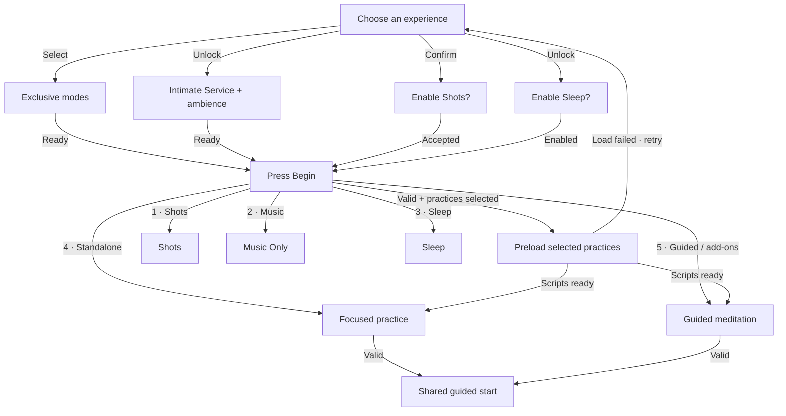
```mermaid
flowchart TD
  lobby["Choose an experience"]
  exclusive["Exclusive modes"]
  care["Intimate Service + ambience"]
  shots["Enable Shots?"]
  sleepgate["Enable Sleep?"]
  begin["Press Begin"]
  preload["Preload selected practices"]
  shot["Shots"]
  music["Music Only"]
  sleep["Sleep"]
  focused["Focused practice"]
  guided["Guided meditation"]
  start["Shared guided start"]
  lobby -->|"Select"| exclusive
  lobby -->|"Unlock"| care
  lobby -->|"Confirm"| shots
  lobby -->|"Unlock"| sleepgate
  exclusive -->|"Ready"| begin
  care -->|"Ready"| begin
  shots -->|"Accepted"| begin
  sleepgate -->|"Enabled"| begin
  begin -->|"Valid + practices selected"| preload
  begin -->|"1 · Shots"| shot
  begin -->|"2 · Music"| music
  begin -->|"3 · Sleep"| sleep
  begin -->|"4 · Standalone"| focused
  begin -->|"5 · Guided / add-ons"| guided
  preload -->|"Scripts ready"| focused
  preload -->|"Scripts ready"| guided
  preload -->|"Load failed · retry"| lobby
  focused -->|"Valid"| start
  guided -->|"Valid"| start
```

| Step | Current behavior |
| --- | --- |
| Choose an experience | Ordinary mode uses selected chakras; choose at least one. A frequency reminder above Begin shows whether No Frequency Mode is on (tones silent) or off, with a one-tap switch. Dev mode (Advanced Features) also reveals a session-only Reverse Journey toggle below the chakra list; it is hidden, disabled and cleared when locked or reloaded, and never saved. |
| Exclusive modes | HRIM, Sleep, Music Only and Yoga clear competing modes, all journey add-ons and intimate-service choices. Yoga is hidden and disabled until Advanced Features is unlocked; relock clears it and direct locked selection/start is rejected. Box Breathing, Dharana, Visualization and Ho’oponopono are compatible journey add-ons. |
| Intimate Service + ambience | Hidden by default. Settings → About → App version needs seven rapid taps, resetting after 1.5 seconds between taps. Taps 1–4 are silent; 5–6 show a countdown; tap 7 opens a localized password prompt. Only a Web Crypto SHA-256 match unlocks the current page load; wrong, cancelled or unsupported verification retains the lock. The unlocked Lobby panel contains care stages and Mood & Relaxation ambience controls; they are not duplicated in Journey Tuning. Advanced Features OFF clears care, Shots, Sleep, Yoga and enabled ambience, stops ambience playback, then locks/hides their controls. Reload locks again. Any combination of three care options is allowed; choosing care clears other modes. |
| Enable Shots? | Hidden and disabled until the shared seven-tap-and-password unlock. No Frequency still blocks it. Confirmation is required; cancel restores normal mode and Shots clear all journey add-ons. |
| Enable Sleep? | Hidden and disabled until the shared seven-tap-and-password unlock. Relock clears it; direct locked start is rejected. |
| Press Begin | Actual dispatcher tests Shots first; then derives Sleep and focused experience. Missing choices (no chakra, no yoga pose) and start failures show a calm, translated in-app message (modules/app-notice.js) instead of a browser alert; technical errors are logged quietly (console and localStorage chakra_last_error), never shown as raw text. |
| Preload selected practices | After start validation, only checked preparation/integration practices are loaded before video or audio startup. No selected practice means no practice script request. A load error is localized, leaves the session unstarted, and allows retry. |
| Shots | Validate custom Hz: finite, >0 and ≤20,000. Initialize audio and run Shot. |
| Music Only | Start indefinite music with common controls. |
| Sleep | Load and validate five stages; start silent narration-free journey. |
| Focused practice | Yoga and Intimate Care are standalone routes. With no chakra selected, Box Breathing, Visualization, Dharana, Body Scan, Guided Noting, Advanced Features-only Self-Exploration (Quiet Courage, Confidence Visualization, Deep Secrets), Ho’oponopono and Undo & Unlearn run as standalone preparation sessions in the displayed order; Ho’oponopono and Undo & Unlearn follow the chakra loop when chakras are selected. |
| Guided meditation | HRIM bypasses chakra selection; standard requires chakras unless a standalone preparation practice is selected. |
| Shared guided start | DND reminder, scripts, validation, audio, Piper warmup, wake lock, timers, selected routine. |

- Lobby experience visibility owns Shot-type refresh, Sleep’s session-only unlock gate, and Shots rejection/confirmation/activation UI bindings. It delegates all cross-mode clearing to app-owned enforceMasterToggle and callbacks; it does not own mode policy. Shots hide incompatible Lobby controls. Add-on selectors remain independently selectable and their option rows open directly below each checked item. Checking Music Only, Sleep, Yoga, Intimate Care or Shots clears journey add-ons; those exclusive choices can also clear Corpse Pose. Selected guided-practice scripts load only after Begin validation and before an optional video/audio start; failed loading returns to the Lobby before a session starts. ChakraSelectionView owns immediate chakra preference persistence and active-chip display; Save Settings retains its explicit persistence call.
- Self-Exploration is available only while Advanced Features is unlocked; relocking clears its session-only selections and locked start rejects stale selections. Selected practice modules load only after valid Begin and can run without a chakra.
- CP-MOD-088 moves High Energy estimate refresh into the existing High Energy selection handler, retaining visibility-before-estimate ordering. CP-MOD-097 moves Shot-type reset/visibility/estimate binding into the Lobby visibility owner; Shots/Sleep validation and confirmation paths stay app-owned.

## Standard chakra journey

Selected chakras in Root → Crown order; returning, newcomer and demo branches included.

Sources: [modules/intention-settings-view.js:1](/Users/lekshmisyam/Desktop/Ikigai/lite/modules/intention-settings-view.js:1), [tests/intention-settings-view.test.mjs:1](/Users/lekshmisyam/Desktop/Ikigai/lite/tests/intention-settings-view.test.mjs:1), [modules/journey-hypnosis-wrapper.js:1](/Users/lekshmisyam/Desktop/Ikigai/lite/modules/journey-hypnosis-wrapper.js:1), [tests/journey-hypnosis-wrapper.test.mjs:1](/Users/lekshmisyam/Desktop/Ikigai/lite/tests/journey-hypnosis-wrapper.test.mjs:1), [modules/journey-opening-stage.js:1](/Users/lekshmisyam/Desktop/Ikigai/lite/modules/journey-opening-stage.js:1), [tests/journey-opening-stage.test.mjs:1](/Users/lekshmisyam/Desktop/Ikigai/lite/tests/journey-opening-stage.test.mjs:1), [modules/session-item-runner.js:1](/Users/lekshmisyam/Desktop/Ikigai/lite/modules/session-item-runner.js:1), [tests/session-item-runner.test.mjs:1](/Users/lekshmisyam/Desktop/Ikigai/lite/tests/session-item-runner.test.mjs:1), [index.html:450](/Users/lekshmisyam/Desktop/Ikigai/lite/index.html:450), [modules/journey-transition-stages.js:1](/Users/lekshmisyam/Desktop/Ikigai/lite/modules/journey-transition-stages.js:1), [tests/journey-transition-stages.test.mjs:1](/Users/lekshmisyam/Desktop/Ikigai/lite/tests/journey-transition-stages.test.mjs:1), [modules/standard-journey-sequence.js:1](/Users/lekshmisyam/Desktop/Ikigai/lite/modules/standard-journey-sequence.js:1), [tests/standard-journey-sequence.test.mjs:1](/Users/lekshmisyam/Desktop/Ikigai/lite/tests/standard-journey-sequence.test.mjs:1), [modules/journey-content-loader.js:1](/Users/lekshmisyam/Desktop/Ikigai/lite/modules/journey-content-loader.js:1), [tests/journey-content-loader.test.mjs:1](/Users/lekshmisyam/Desktop/Ikigai/lite/tests/journey-content-loader.test.mjs:1), [app.js:1699](/Users/lekshmisyam/Desktop/Ikigai/lite/app.js:1699), [app.js:1709](/Users/lekshmisyam/Desktop/Ikigai/lite/app.js:1709), [app.js:1751](/Users/lekshmisyam/Desktop/Ikigai/lite/app.js:1751), [app.js:2048](/Users/lekshmisyam/Desktop/Ikigai/lite/app.js:2048), [app.js:1418](/Users/lekshmisyam/Desktop/Ikigai/lite/app.js:1418), [app.js:1420](/Users/lekshmisyam/Desktop/Ikigai/lite/app.js:1420), [app.js:2269](/Users/lekshmisyam/Desktop/Ikigai/lite/app.js:2269), [app.js:1515](/Users/lekshmisyam/Desktop/Ikigai/lite/app.js:1515), [app.js:2474](/Users/lekshmisyam/Desktop/Ikigai/lite/app.js:2474).

```mermaid
flowchart TD
  begin["Press Begin"]
  newcomer["Newcomer orientation"]
  setup["Audio + warmup"]
  arrive["Arriving countdown"]
  prepare["Preparation"]
  wrapper["Arrival induction"]
  moon["Moon opening"]
  return["Returning opening"]
  gratitude["Gratitude + intention"]
  ready["Arrival readiness"]
  loop["Selected chakra loop"]
  end["Silence + closing"]
  emerge["Emergence"]
  finish["Completion"]
  begin -->|"Returning off · normal standard"| newcomer
  newcomer -->|"Narration complete or Skip"| setup
  begin -->|"Returning on / demo / Sleep / Music Only / focused"| setup
  setup -->|"Ready"| arrive
  arrive -->|"Warmup awaited"| prepare
  prepare -->|"Non-demo"| wrapper
  prepare -->|"Demo + new opening"| moon
  prepare -->|"Demo + returning"| return
  wrapper -->|"Returning off"| moon
  wrapper -->|"Returning on"| return
  moon -->|"Opening pause"| gratitude
  return -->|"ready"| gratitude
  gratitude -->|"Demo"| loop
  ready -->|"Ready"| loop
  loop -->|"Last chakra"| end
  end -->|"Non-demo"| emerge
  end -->|"Demo"| finish
  emerge -->|"Done"| finish
```

| Step | Current behavior |
| --- | --- |
| Press Begin | First validate a normal journey has one or more chakras selected; reject immediately if not. If valid and the persisted Lobby Video Introduction option is selected, play the explicit video introduction; otherwise continue directly. Remaining mode-specific guards and first-time eligibility run in the dispatcher after the optional prelude. |
| Newcomer orientation | Only for a normal standard journey when Returning Journey is unchecked. A gender-neutral aura scene highlights each chakra in sequence with its symbol and translated name/location caption. Spoken orientation uses the Meditation Language and says the same chakra name as the caption, in confident wording ("Root sits at the base of the spine. It brings steadiness."), then proceeds to Arriving. Skip cancels the current narration and continues with the next planned journey item. |
| Audio + warmup | Background music starts silently; optional ambience; Piper warms during Arriving; wake lock requested. |
| Arriving countdown | Configured 10–300 seconds, default 60. Music entry uses 20% of the selected period capped at 3s (10s → 2s); the settling timer remains unchanged. |
| Preparation | Initial settle → pre-practice guidance. In English, Malayalam, Hindi and Russian: Sacral includes wholesome fun and everyday happiness; Solar frames a kind, realistic deep-work period; Third Eye includes concentration, attention management, intelligence as an ordinary learning skill, and unforced deep work. These are reflective practices, not outcome guarantees. |
| Arrival induction | Ordinary non-demo only: narration → 432 Hz transition tone for half the selected drone window. |
| Moon opening | When Returning is off, use current moon-phase script. |
| Returning opening | When enabled, use intro.returning; independent of journey statistics. |
| Gratitude + intention | Gratitude narration; if personal intention is nonempty, speak intention with optional timed tone. |
| Arrival readiness | Ordinary non-demo only: narration → 528 Hz transition tone → post-preparation gap. |
| Selected chakra loop | Each chakra: narration → mantra and bounded drone → affirmation. Between chakras: breathing interval. Default order is Root → Crown; with dev mode (Advanced Features) unlocked and the session-only Reverse Journey checked, the selected chakras run Crown → Root. HRIM and focused experiences ignore it. |
| Silence + closing | Final silence → closing narration → full-body affirmation with configured gaps. |
| Emergence | Non-demo only: bowl unless No Frequency → complete guidance → emergence countdown (minimum 30s) → final quiet. Narration music transitions use 20% of the setting capped at 3s; long session exit follows completion. |
| Completion | Stop audio / visuals, update stats and show completion choices. |

- Demo is recognized from custom-script metadata and uses a short core duration. It omits Arrival/Emergence wrappers, not the entire standard preparation and closing flow. No Frequency suppresses tones while keeping the surrounding guidance and gaps. Returning Journey is an explicit preference, not a record of prior sessions. Current planned items can be skipped independently; the universal skip lifecycle is mapped separately.
- CP-MOD-167 moves the existing interval, silence and closing-stage lifecycles into `modules/journey-transition-stages.js` behind stable `handleInterval()`, `handleSilence()` and `runClosing()` adapters. Transition timing, pause/Stop behavior, narration completion, display opacity, affirmation and visual treatment stay unchanged; the graph topology is unchanged.
- CP-MOD-166 moves the existing standard chakra-stage loop and its optional integration/closing sequence into `modules/standard-journey-sequence.js` behind `MeditationController.runSequence()`. Music Only remains exclusive; chakra order, between-chakra intervals, optional Ho’oponopono/Undo, silence, closing, Emergence, completion and Stop guards are unchanged. This changes ownership only; journey topology and eager/offline loading remain unchanged.
- CP-MOD-059 moves the optional 432/528 Hz Arrival cues and Emergence sequence into `modules/journey-hypnosis-wrapper.js`. This is source ownership only: the standard journey order, wrapper eligibility, narration, pause timing, No Frequency quiet gaps and stop checks remain as mapped; no journey or performance change is claimed.
- CP-MOD-060 moves the existing shared guided-opening/Gratitude stage into `modules/journey-opening-stage.js`; preparation safety, optional Moon/Returning opening, Gratitude, private-intention narration, HRIM routing and Arrival readiness retain their prior order and guards. This is source ownership only.
- CP-MOD-061 moves the existing start-time content source and validation work behind `modules/journey-content-loader.js`; custom/default selection, same-language reuse, cache-before-validation order, validation context timing and failure exits remain unchanged. Source ownership only.
- CP-MOD-108–127 moves the conservative narration-duration estimate into `modules/session-estimate.js`; Malayalam character-rate, pacing factors, Piper multiplier, lead-in and sentence gaps remain injected from the existing app policies.

## Skip the current session item

The global Skip control cancels only the active planned item and carries on with the remaining sequence.

Sources: [modules/session-item-runner.js:1](/Users/lekshmisyam/Desktop/Ikigai/lite/modules/session-item-runner.js:1), [modules/session-transport-controls.js:1](/Users/lekshmisyam/Desktop/Ikigai/lite/modules/session-transport-controls.js:1), [app.js:1105](/Users/lekshmisyam/Desktop/Ikigai/lite/app.js:1105), [index.html:860](/Users/lekshmisyam/Desktop/Ikigai/lite/index.html:860), [tests/session-item-runner.test.mjs:1](/Users/lekshmisyam/Desktop/Ikigai/lite/tests/session-item-runner.test.mjs:1), [tests/session-transport-controls.test.mjs:1](/Users/lekshmisyam/Desktop/Ikigai/lite/tests/session-transport-controls.test.mjs:1).

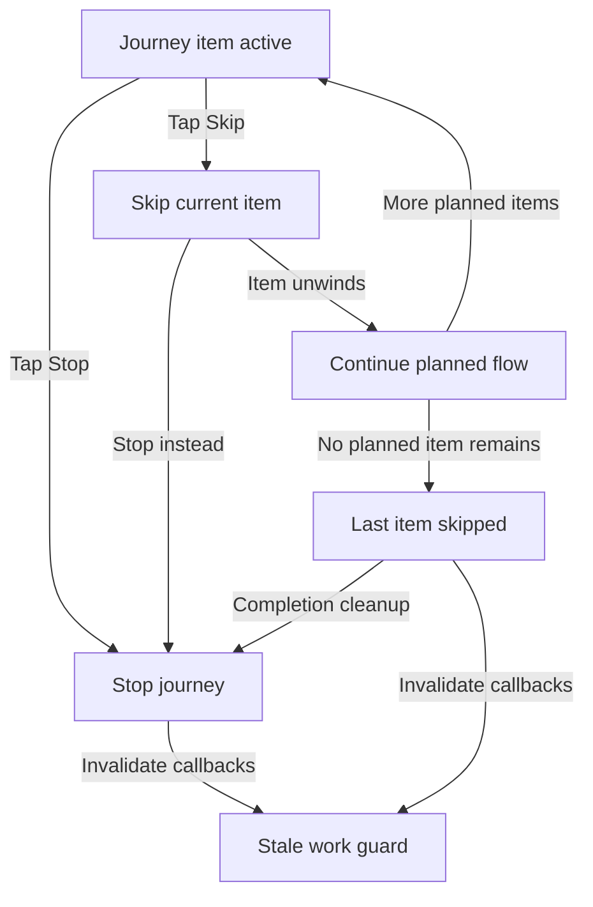
```mermaid
flowchart TD
  ready["Journey item active"]
  skip["Skip current item"]
  next["Continue planned flow"]
  last["Last item skipped"]
  stop["Stop journey"]
  guard["Stale work guard"]
  ready -->|"Tap Skip"| skip
  skip -->|"Item unwinds"| next
  next -->|"No planned item remains"| last
  next -->|"More planned items"| ready
  ready -->|"Tap Stop"| stop
  skip -->|"Stop instead"| stop
  last -->|"Completion cleanup"| stop
  stop -->|"Invalidate callbacks"| guard
  last -->|"Invalidate callbacks"| guard
```

| Step | Current behavior |
| --- | --- |
| Journey item active | Skip is disabled until an item starts. Pause remains independent. |
| Skip current item | Skip cancels narration, mantra, tones, ambience and visuals owned by the current item (the mantra fades over about 3 seconds); its wrapper unwinds without stopping the journey. |
| Continue planned flow | Resume at the next selected chakra, practice, interval, or closing stage. Skipping newcomer orientation bypasses it and proceeds directly to normal Arriving/setup; it does not bypass chakra validation. |
| Last item skipped | The normal sequence completes through its existing finish path. |
| Stop journey | The separate Stop control ends the entire session and performs session cleanup. |
| Stale work guard | Stop, natural completion or restart invalidates pending item callbacks; they cannot revive a finished session. |

- All five visible UI locales provide a translated Skip label. This is source and deterministic-test evidence only; browser/device playback and visual behavior were not run.

## Inside one chakra

Narration, audio handoff, bounded exposure, and loop transitions.

Sources: [modules/ambient-particle-field.js:165](/Users/lekshmisyam/Desktop/Ikigai/lite/modules/ambient-particle-field.js:165), [app.js:2370](/Users/lekshmisyam/Desktop/Ikigai/lite/app.js:2370), [app.js:2462](/Users/lekshmisyam/Desktop/Ikigai/lite/app.js:2462), [app.js:2490](/Users/lekshmisyam/Desktop/Ikigai/lite/app.js:2490), [modules/chakra-session.js:1](/Users/lekshmisyam/Desktop/Ikigai/lite/modules/chakra-session.js:1), [tests/chakra-session.test.mjs:1](/Users/lekshmisyam/Desktop/Ikigai/lite/tests/chakra-session.test.mjs:1).

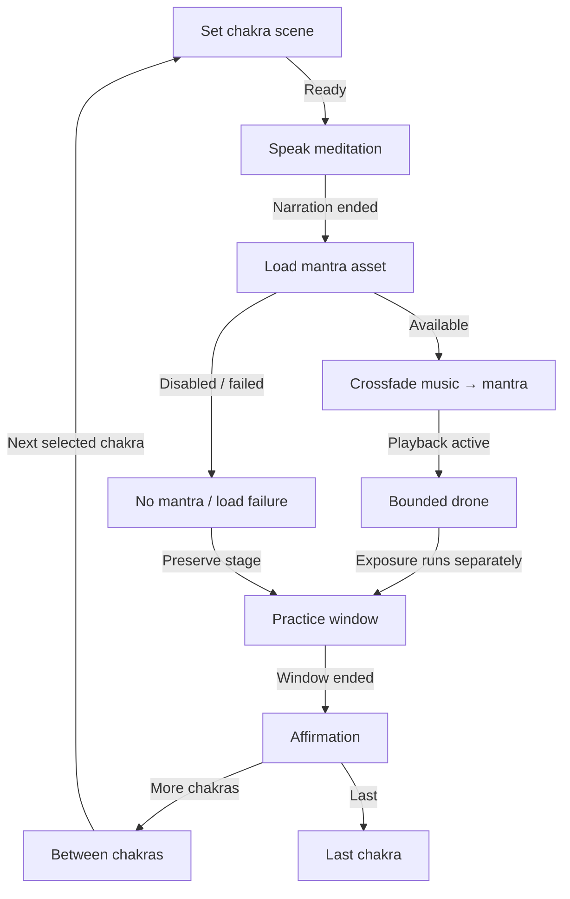
```mermaid
flowchart TD
  visual["Set chakra scene"]
  voice["Speak meditation"]
  load["Load mantra asset"]
  mantra["Crossfade music → mantra"]
  skip["No mantra / load failure"]
  drone["Bounded drone"]
  hold["Practice window"]
  affirm["Affirmation"]
  interval["Between chakras"]
  close["Last chakra"]
  visual -->|"Ready"| voice
  voice -->|"Narration ended"| load
  load -->|"Available"| mantra
  load -->|"Disabled / failed"| skip
  mantra -->|"Playback active"| drone
  drone -->|"Exposure runs separately"| hold
  skip -->|"Preserve stage"| hold
  hold -->|"Window ended"| affirm
  affirm -->|"More chakras"| interval
  interval -->|"Next selected chakra"| visual
  affirm -->|"Last"| close
```

| Step | Current behavior |
| --- | --- |
| Set chakra scene | Choose deity image if available, otherwise symbol; set mantra label, color, aura and progress dot. |
| Speak meditation | Selected language, Piper or browser speech. No chakra drone under this narration. |
| Load mantra asset | Cached decoded buffer or fetch and decode the matching MP3. |
| Crossfade music → mantra | After decoding and cancellation guard, simultaneously fade music out and mantra in over 6 seconds. User mantra volume is applied once. |
| No mantra / load failure | No Mantra skips playback. Asset failure logs error and restores music; stage continues. |
| Bounded drone | Only if mantra exists and both suppression modes permit: Beginner 4 s, Intermediate 10 s, Advanced 14 s, Expert 20 s. |
| Practice window | Core minutes ×60 minus 15-second lead-out and minus the extra mantra-exit time (chakraMantraExit 12s − chakraPostMantra 4s = 8s), bounded at zero. Pauses suspend elapsed stage time. |
| Affirmation | The mantra leaves over the chakraMantraExit window (default 12s: 6s dry fade/music restoration plus 6s wet-tail fade), which starts inside the chant time so the chakra keeps the same total length; it reaches zero before the affirmation. Zero-duration test profiles remain zero. |
| Between chakras | Stop drone; 2-second preparation; wait for BOTH configured interval and complete breathing narration. Music transitions during this narration use 20% of the interval capped at 3s (10s → 2s). Restore the temporary cap on success/failure. |
| Last chakra | Caller chooses closing/completion, or next care stage. |

- Core practice duration does not extend the fixed drone exposure window. HRIM reuses this routine with high_energy content and its own duration.
- CP-MOD-160: `chakra-session.js` owns the shared chakra/HRIM stage behind `meditateOnChakra()`. Both standard and reverse chakra loops still use the same adapter; narration, mantra, bounded drone, pause timing, audio tail and affirmation ordering are retained.

## HRIM activation

A dedicated high-energy journey using one stage.

Sources: [app.js:1498](/Users/lekshmisyam/Desktop/Ikigai/lite/app.js:1498), [app.js:1713](/Users/lekshmisyam/Desktop/Ikigai/lite/app.js:1713), [app.js:2346](/Users/lekshmisyam/Desktop/Ikigai/lite/app.js:2346), [app.js:2490](/Users/lekshmisyam/Desktop/Ikigai/lite/app.js:2490).

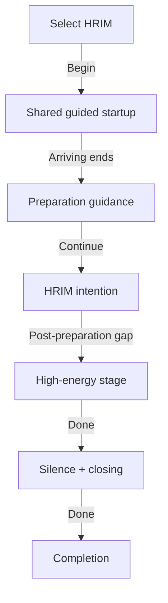
```mermaid
flowchart TD
  choose["Select HRIM"]
  start["Shared guided startup"]
  prepare["Preparation guidance"]
  intention["HRIM intention"]
  stage["High-energy stage"]
  closing["Silence + closing"]
  finish["Completion"]
  choose -->|"Begin"| start
  start -->|"Arriving ends"| prepare
  prepare -->|"Continue"| intention
  intention -->|"Post-preparation gap"| stage
  stage -->|"Done"| closing
  closing -->|"Done"| finish
```

| Step | Current behavior |
| --- | --- |
| Select HRIM | Clears competing experiences; uses its own practice duration and drone setting. |
| Shared guided startup | DND, validation, audio, Piper warmup and Arriving countdown. |
| Preparation guidance | No Arrival wrapper, Moon opening or Returning opening. |
| HRIM intention | Activation-oriented text inserts personal intention; optional timed intention tone; HRIM pacing. |
| High-energy stage | Meditation narration → HREEM mantra → bounded drone → affirmation. |
| Silence + closing | Shared closing and full-body affirmation; no Emergence wrapper. |
| Completion | Stats and completion modal. |

- No local-time restriction appears in this route. HRIM is separate from the seven selected chakras.

## Sleep and Music Only

Two independent narration-free experiences.

Sources: [modules/sleep-journey.js:1](/Users/lekshmisyam/Desktop/Ikigai/lite/modules/sleep-journey.js:1), [scripts.json:1](/Users/lekshmisyam/Desktop/Ikigai/lite/scripts.json:1), [tests/sleep-journey.test.mjs:1](/Users/lekshmisyam/Desktop/Ikigai/lite/tests/sleep-journey.test.mjs:1), [modules/completion-view.js:54](/Users/lekshmisyam/Desktop/Ikigai/lite/modules/completion-view.js:54), [app.js:950](/Users/lekshmisyam/Desktop/Ikigai/lite/app.js:950), [app.js:1379](/Users/lekshmisyam/Desktop/Ikigai/lite/app.js:1379), [app.js:1538](/Users/lekshmisyam/Desktop/Ikigai/lite/app.js:1538).

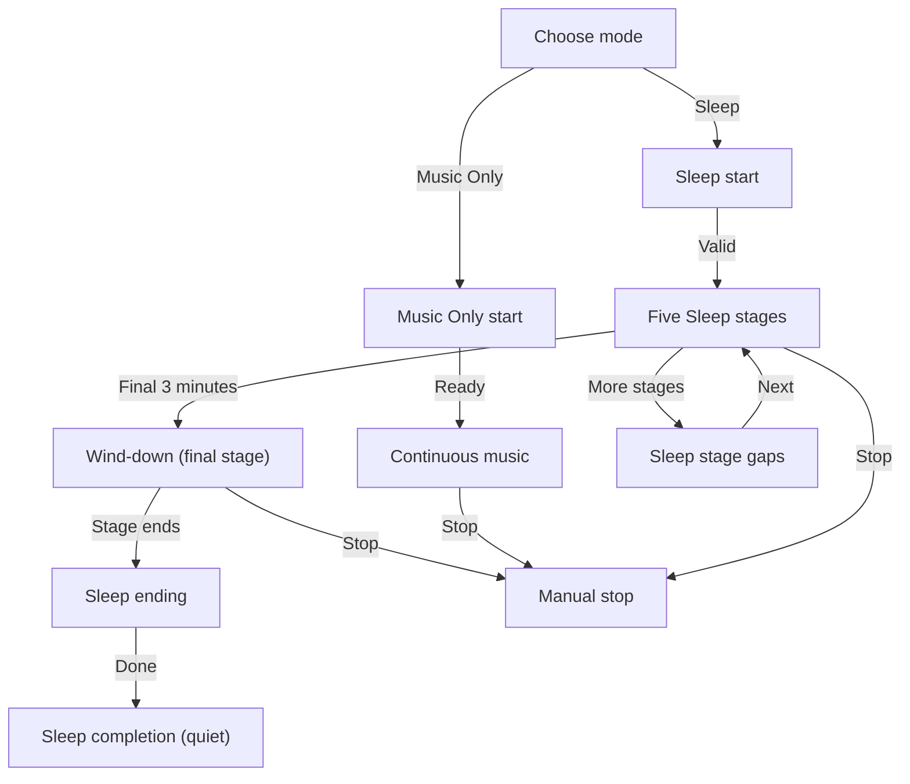
```mermaid
flowchart TD
  choose["Choose mode"]
  sleep["Sleep start"]
  music["Music Only start"]
  stages["Five Sleep stages"]
  winddown["Wind-down (final stage)"]
  loop["Continuous music"]
  gap["Sleep stage gaps"]
  fade["Sleep ending"]
  stop["Manual stop"]
  complete["Sleep completion (quiet)"]
  choose -->|"Sleep"| sleep
  choose -->|"Music Only"| music
  sleep -->|"Valid"| stages
  stages -->|"More stages"| gap
  gap -->|"Next"| stages
  stages -->|"Final 3 minutes"| winddown
  winddown -->|"Stage ends"| fade
  fade -->|"Done"| complete
  winddown -->|"Stop"| stop
  music -->|"Ready"| loop
  loop -->|"Stop"| stop
  stages -->|"Stop"| stop
```

| Step | Current behavior |
| --- | --- |
| Choose mode | Music Only is public. Sleep is visible only after the shared seven-tap-and-password Advanced Features unlock; direct locked activation is rejected. Both bypass normal guided preparation and chakra narration. |
| Sleep start | DND reminder; load content; exactly five valid stage frequencies required. Sleep dimming multiplies user brightness by 0.4 without filtering the app ancestor; fixed controls retain viewport positioning. |
| Music Only start | Show background symbol; no session countdown; request wake lock. |
| Five Sleep stages | Drowsiness 10 → Light Sleep 6 → True Sleep 5 → Deep Sleep 2 → REM Rest 6 Hz (script values). Each uses configured minutes and its own bounded sleep drone. |
| Wind-down (final stage) | In the last 3 minutes of the final stage (or the whole stage if shorter): screen fades to near-black (sleep dimming 0.4 → 0.03), music and ambience drift to silence over the same window, text reads “Drifting into sleep”. Taps on the dark screen only peek (controls back for 6 s); they never press a hidden button. |
| Continuous music | Background loop and visual pulse continue until user stops. No ordinary completion. |
| Sleep stage gaps | Stop drone after each stage; actual journey waits 3 seconds between stages. |
| Sleep ending | After a wind-down, a 4-second settle (without one, the old 12-second music fade), then a quiet finish if still active. |
| Manual stop | Shared stop cleanup → Lobby; no completed-journey increment. |
| Sleep completion (quiet) | Stats count; audio stops; wake lock released so the phone can sleep. No bright completion modal and no Earn hand-off: a black goodnight screen (“Good night”, very dim until tapped) with Return to Room → Lobby. |

- Sleep does not narrate. Its actual gap is hardcoded to 3 seconds, while its estimate reads script intervalSeconds. Music Only does not start the optional ambience through its normal route.
- CP-MOD-157 moves only Sleep journey orchestration behind the existing runSleepJourney adapter. Unlock/start guards, content caching and fetch query, timer initialization, music/ambience startup, five-stage pacing, pause-aware gaps, drone ownership and the 12-second ending fade retain their order. The module remains eager and precached; no performance improvement is claimed.

## Box breathing and Ho’oponopono

Standalone practices launched through shared guided startup.

Sources: [modules/journey-transition-stages.js:25](/Users/lekshmisyam/Desktop/Ikigai/lite/modules/journey-transition-stages.js:25), [app.js:1498](/Users/lekshmisyam/Desktop/Ikigai/lite/app.js:1498), [app.js:1742](/Users/lekshmisyam/Desktop/Ikigai/lite/app.js:1742), [app.js:1700](/Users/lekshmisyam/Desktop/Ikigai/lite/app.js:1700), [app.js:1861](/Users/lekshmisyam/Desktop/Ikigai/lite/app.js:1861), [app.js:1713](/Users/lekshmisyam/Desktop/Ikigai/lite/app.js:1713), [app.js:1913](/Users/lekshmisyam/Desktop/Ikigai/lite/app.js:1913), [app.js:2388](/Users/lekshmisyam/Desktop/Ikigai/lite/app.js:2388).

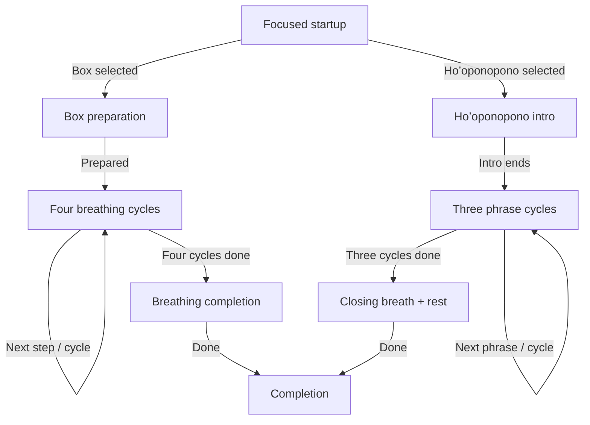
```mermaid
flowchart TD
  start["Focused startup"]
  box["Box preparation"]
  hoo["Ho’oponopono intro"]
  cycles["Four breathing cycles"]
  phrases["Three phrase cycles"]
  boxdone["Breathing completion"]
  hoodone["Closing breath + rest"]
  finish["Completion"]
  start -->|"Box selected"| box
  start -->|"Ho’oponopono selected"| hoo
  box -->|"Prepared"| cycles
  cycles -->|"Next step / cycle"| cycles
  cycles -->|"Four cycles done"| boxdone
  hoo -->|"Intro ends"| phrases
  phrases -->|"Next phrase / cycle"| phrases
  phrases -->|"Three cycles done"| hoodone
  boxdone -->|"Done"| finish
  hoodone -->|"Done"| finish
```

| Step | Current behavior |
| --- | --- |
| Focused startup | DND, load/validate scripts, audio, Piper warmup; bypass ordinary Arriving / chakra wrapper. |
| Box preparation | Breathing screen; fade music out; centering guidance and preparation gap. |
| Ho’oponopono intro | Meditation screen; intro narration and short pause. |
| Four breathing cycles | Each cycle uses four localized steps: inhale, hold, exhale, hold; visual circle and step timer. |
| Three phrase cycles | Narrate all four phrases, with pauses, three times. |
| Breathing completion | Completion guidance; restore music; completion settle. |
| Closing breath + rest | Closing narration fades music; final rest default 15 seconds. |
| Completion | Common stats and completion modal. |

- Neither route automatically appends a chakra journey. Box step length comes from timeBreathing; its ordinary Settings timing row is hidden in the current UI.

## Yoga experience

Advanced Features-gated rest, bathing, selected poses and shared master-mode behavior.

Sources: [modules/yoga-experience-settings.js:1](/Users/lekshmisyam/Desktop/Ikigai/lite/modules/yoga-experience-settings.js:1), [tests/yoga-experience-settings.test.mjs:1](/Users/lekshmisyam/Desktop/Ikigai/lite/tests/yoga-experience-settings.test.mjs:1), [index.html:450](/Users/lekshmisyam/Desktop/Ikigai/lite/index.html:450), [timing-config.json:1](/Users/lekshmisyam/Desktop/Ikigai/lite/timing-config.json:1), [app.js:1178](/Users/lekshmisyam/Desktop/Ikigai/lite/app.js:1178), [modules/shot-session.js:59](/Users/lekshmisyam/Desktop/Ikigai/lite/modules/shot-session.js:59), [app.js:1981](/Users/lekshmisyam/Desktop/Ikigai/lite/app.js:1981), [app.js:2180](/Users/lekshmisyam/Desktop/Ikigai/lite/app.js:2180), [modules/yoga-session.js:1](/Users/lekshmisyam/Desktop/Ikigai/lite/modules/yoga-session.js:1), [tests/yoga-session.test.mjs:1](/Users/lekshmisyam/Desktop/Ikigai/lite/tests/yoga-session.test.mjs:1), [modules/guide-controlled-transition.js:1](/Users/lekshmisyam/Desktop/Ikigai/lite/modules/guide-controlled-transition.js:1), [tests/guide-controlled-transition.test.mjs:1](/Users/lekshmisyam/Desktop/Ikigai/lite/tests/guide-controlled-transition.test.mjs:1).

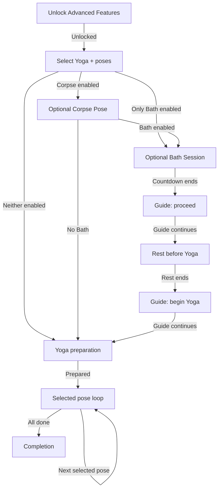
```mermaid
flowchart TD
  unlock["Unlock Advanced Features"]
  begin["Select Yoga + poses"]
  corpse["Optional Corpse Pose"]
  bath["Optional Bath Session"]
  gate1["Guide: proceed"]
  rest["Rest before Yoga"]
  gate2["Guide: begin Yoga"]
  prep["Yoga preparation"]
  poses["Selected pose loop"]
  finish["Completion"]
  unlock -->|"Unlocked"| begin
  begin -->|"Corpse enabled"| corpse
  begin -->|"Only Bath enabled"| bath
  begin -->|"Neither enabled"| prep
  corpse -->|"Bath enabled"| bath
  corpse -->|"No Bath"| prep
  bath -->|"Countdown ends"| gate1
  gate1 -->|"Guide continues"| rest
  rest -->|"Rest ends"| gate2
  gate2 -->|"Guide continues"| prep
  prep -->|"Prepared"| poses
  poses -->|"Next selected pose"| poses
  poses -->|"All done"| finish
```

| Step | Current behavior |
| --- | --- |
| Unlock Advanced Features | Seven rapid App version taps and password verification reveal and enable Yoga for this page load. Reload or switching Advanced Features off hides, disables and clears Yoga. |
| Select Yoga + poses | At least one selected pose required at Begin. A locked direct selection or start is rejected before audio initialization. Shared focused startup. |
| Optional Corpse Pose | Intro → stillness countdown → transition narration at configured point → settle. |
| Optional Bath Session | Intro → instructions → countdown with reminder at 60 seconds. |
| Guide: proceed | Bath completion waits for explicit Continue; does not advance automatically. |
| Rest before Yoga | Default 900 seconds (15 minutes), followed by another guide confirmation. |
| Guide: begin Yoga | Button becomes available after rest; paused session cannot advance. |
| Yoga preparation | 136.1 Hz bounded drone if permitted; intro + preparation narration; prep countdown. |
| Selected pose loop | Pose name/image → explanation → hold countdown → next-pose prompt and gap. |
| Completion | Session-complete narration → settle → common completion. |

- Yoga shares the session-only Advanced Features gate with Sleep, Shots and Intimate Service. Corpse Pose and Bath can be independently enabled. Runtime pose order comes from the script filtered by selected pose IDs. Guide waits have unbounded duration beyond the displayed session estimate.
- CP-MOD-096 moves only the Yoga Advanced Features event gate into `modules/yoga-experience-settings.js`; locked attempts still clear the checkbox/state, hide setup, refresh visibility/estimate and return without invoking the master-toggle path.
- CP-MOD-158: `yoga-session.js` owns the Yoga stage sequence behind the existing `runYogaSession()` app adapter. The standard Bath/rest handoff, pose presentation, narration, timer, and completion remain the same; Intimate Service is not included. The module is eager/offline-cached pending any separately measured lazy boundary.

## Intimate Service and massage

All seven nonempty combinations follow this ordered composition.

Sources: [modules/shot-session.js:21](/Users/lekshmisyam/Desktop/Ikigai/lite/modules/shot-session.js:21), [app.js:1957](/Users/lekshmisyam/Desktop/Ikigai/lite/app.js:1957), [app.js:1969](/Users/lekshmisyam/Desktop/Ikigai/lite/app.js:1969), [app.js:2028](/Users/lekshmisyam/Desktop/Ikigai/lite/app.js:2028), [app.js:2401](/Users/lekshmisyam/Desktop/Ikigai/lite/app.js:2401), [modules/care-session.js:1](/Users/lekshmisyam/Desktop/Ikigai/lite/modules/care-session.js:1), [tests/care-session.test.mjs:1](/Users/lekshmisyam/Desktop/Ikigai/lite/tests/care-session.test.mjs:1), [modules/guide-controlled-transition.js:1](/Users/lekshmisyam/Desktop/Ikigai/lite/modules/guide-controlled-transition.js:1), [tests/guide-controlled-transition.test.mjs:1](/Users/lekshmisyam/Desktop/Ikigai/lite/tests/guide-controlled-transition.test.mjs:1).

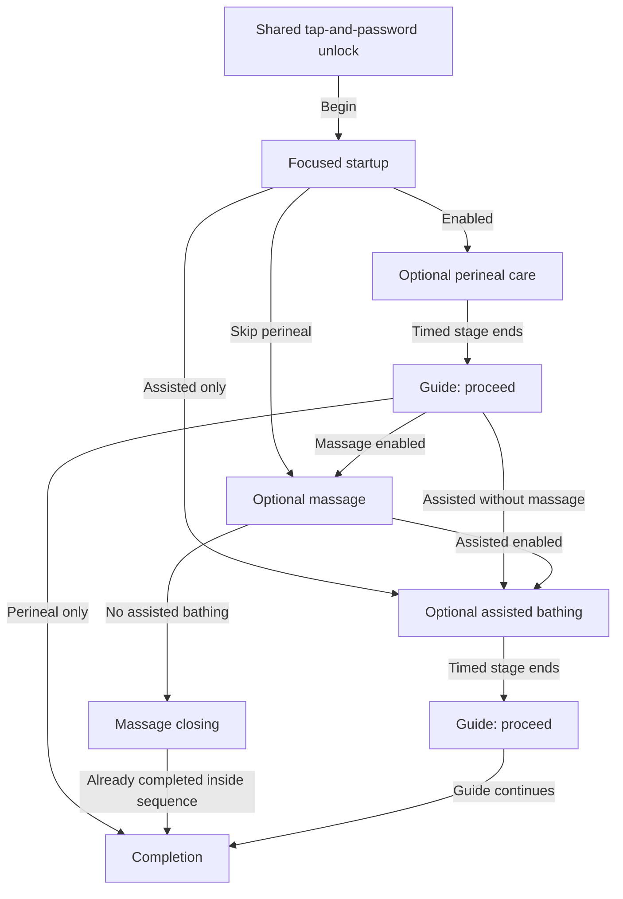
```mermaid
flowchart TD
  unlock["Shared tap-and-password unlock"]
  start["Focused startup"]
  perineal["Optional perineal care"]
  gate1["Guide: proceed"]
  massage["Optional massage"]
  closing["Massage closing"]
  assisted["Optional assisted bathing"]
  gate2["Guide: proceed"]
  finish["Completion"]
  unlock -->|"Begin"| start
  start -->|"Enabled"| perineal
  start -->|"Skip perineal"| massage
  start -->|"Assisted only"| assisted
  perineal -->|"Timed stage ends"| gate1
  gate1 -->|"Massage enabled"| massage
  gate1 -->|"Assisted without massage"| assisted
  gate1 -->|"Perineal only"| finish
  massage -->|"No assisted bathing"| closing
  massage -->|"Assisted enabled"| assisted
  closing -->|"Already completed inside sequence"| finish
  assisted -->|"Timed stage ends"| gate2
  gate2 -->|"Guide continues"| finish
```

| Step | Current behavior |
| --- | --- |
| Shared tap-and-password unlock | Settings → About → App version: seven rapid taps then a successful password prompt reveal care and Shots together. Both are locked and choices reset each page load. Select any nonempty subset of care options. |
| Focused startup | No ordinary Arrival, gratitude, personal intention or Emergence wrapper. |
| Optional perineal care | Narrate intro/instructions → timed stage → 60-second reminder if reached. |
| Guide: proceed | Wait for explicit Continue. |
| Optional massage | Full seven-chakra sequence in reverse: Crown → Third Eye → Throat → Heart → Solar → Sacral → Root. |
| Massage closing | If no assisted bathing follows: final silence and closing, then finish inside runSequence. |
| Optional assisted bathing | Intro/instructions → timed stage → reminder; massage sequence used complete:false if this follows. |
| Guide: proceed | Assisted-bath ending waits for explicit Continue. |
| Completion | Outer focused route calls finish if session remains active. |

- Current behavior: when assisted bathing follows massage, shared silence/closing is skipped and is not called after the bath. A nearby comment says closing is deferred, but the executable path does not perform it. This is recorded for a later fix decision.
- CP-MOD-159: `care-session.js` owns timed care stages, guide-controlled continuation, experiment duration override and Intimate Service composition. App methods remain stable adapters and Yoga continues using the standard Bath Session only.

## Sound Shots

Six types, confirmation, frequency validation, and distinct finish behavior.

Sources: [modules/shot-session.js:1](/Users/lekshmisyam/Desktop/Ikigai/lite/modules/shot-session.js:1), [tests/shot-session.test.mjs:1](/Users/lekshmisyam/Desktop/Ikigai/lite/tests/shot-session.test.mjs:1), [index.html:256](/Users/lekshmisyam/Desktop/Ikigai/lite/index.html:256), [app.js:1476](/Users/lekshmisyam/Desktop/Ikigai/lite/app.js:1476), [app.js:1393](/Users/lekshmisyam/Desktop/Ikigai/lite/app.js:1393).

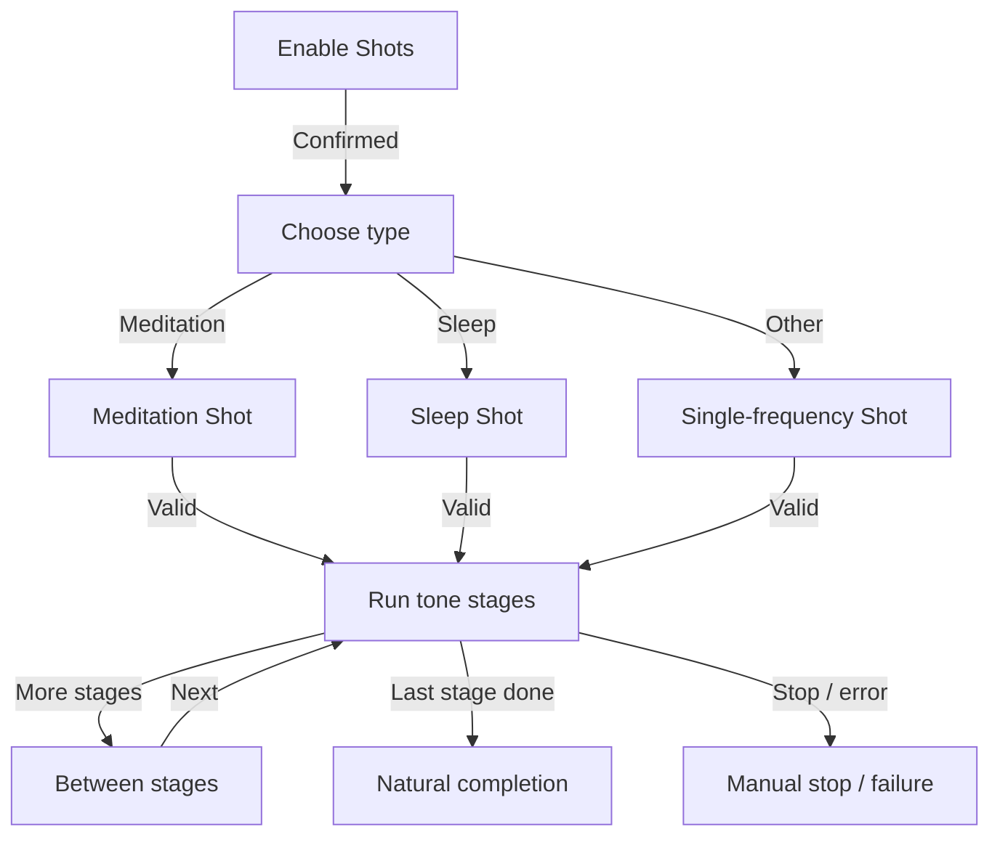
```mermaid
flowchart TD
  enable["Enable Shots"]
  type["Choose type"]
  med["Meditation Shot"]
  sleep["Sleep Shot"]
  single["Single-frequency Shot"]
  run["Run tone stages"]
  gaps["Between stages"]
  reload["Natural completion"]
  abort["Manual stop / failure"]
  enable -->|"Confirmed"| type
  type -->|"Meditation"| med
  type -->|"Sleep"| sleep
  type -->|"Other"| single
  med -->|"Valid"| run
  sleep -->|"Valid"| run
  single -->|"Valid"| run
  run -->|"More stages"| gaps
  gaps -->|"Next"| run
  run -->|"Last stage done"| reload
  run -->|"Stop / error"| abort
```

| Step | Current behavior |
| --- | --- |
| Enable Shots | Heading and controls start hidden/disabled. Shared seven-tap-and-password Advanced Features unlock reveals them alongside care. Relock clears Shots selection; reload locks again. Locked direct execution is rejected. No Frequency → blocked; otherwise confirm. Cancel leaves Shots off. |
| Choose type | Meditation, HRIM, Anesthetic, Mood & Relaxation, Sleep, or Custom. Labels here describe app modes. |
| Meditation Shot | Root 396 → Sacral 417 → Solar 528 → Heart 639 → Throat 741 → Third Eye 852 → Crown 963 Hz. Ignores selected chakra subset. |
| Sleep Shot | Script sequence: 10 → 6 → 5 → 2 → 6 Hz. |
| Single-frequency Shot | HRIM 528 Hz; Anesthetic 174 Hz; Mood & Relaxation 221.23 Hz; or custom finite frequency >0 and ≤20,000 Hz. These are app data values. |
| Run tone stages | No music or narration; divide selected total active seconds equally across stages. |
| Between stages | Meditation: 2 seconds; Sleep: script intervalSeconds, falling back to 2. |
| Natural completion | Stop sound, hide controls, release wake lock, show Lobby then reload page. |
| Manual stop / failure | Manual Stop uses shared stop; activation failure alerts and uses stopShot. No stats increment. |

- Single-frequency default is 1 second; multi-stage default 7 seconds; selected duration range 1–20 seconds. Displayed total active seconds excludes inter-stage gaps; countdown includes them.
- CP-MOD-156: `shot-session.js` owns the Shot start guards, frequency validation, script reuse/loading, staged oscillator lifecycle, countdown, localized labels, failure recovery, success reload and manual-stop cleanup. MeditationController retains runShot/finishShot/stopShot adapters; start from the Lobby and the user-visible flow remain unchanged.

## Experiment activities

Isolated activities and return behavior.

Sources: [modules/screen-navigation.js:1](/Users/lekshmisyam/Desktop/Ikigai/lite/modules/screen-navigation.js:1), [tests/screen-navigation.test.mjs:1](/Users/lekshmisyam/Desktop/Ikigai/lite/tests/screen-navigation.test.mjs:1), [modules/experiment-session.js:1](/Users/lekshmisyam/Desktop/Ikigai/lite/modules/experiment-session.js:1), [tests/experiment-session.test.mjs:1](/Users/lekshmisyam/Desktop/Ikigai/lite/tests/experiment-session.test.mjs:1), [modules/experiment-settings-view.js:1](/Users/lekshmisyam/Desktop/Ikigai/lite/modules/experiment-settings-view.js:1), [tests/experiment-settings-view.test.mjs:1](/Users/lekshmisyam/Desktop/Ikigai/lite/tests/experiment-settings-view.test.mjs:1), [index.html:209](/Users/lekshmisyam/Desktop/Ikigai/lite/index.html:209), [modules/experiment-session.js:1](/Users/lekshmisyam/Desktop/Ikigai/lite/modules/experiment-session.js:1), [tests/experiment-session.test.mjs:1](/Users/lekshmisyam/Desktop/Ikigai/lite/tests/experiment-session.test.mjs:1), [app.js:1703](/Users/lekshmisyam/Desktop/Ikigai/lite/app.js:1703), [app.js:1713](/Users/lekshmisyam/Desktop/Ikigai/lite/app.js:1713).

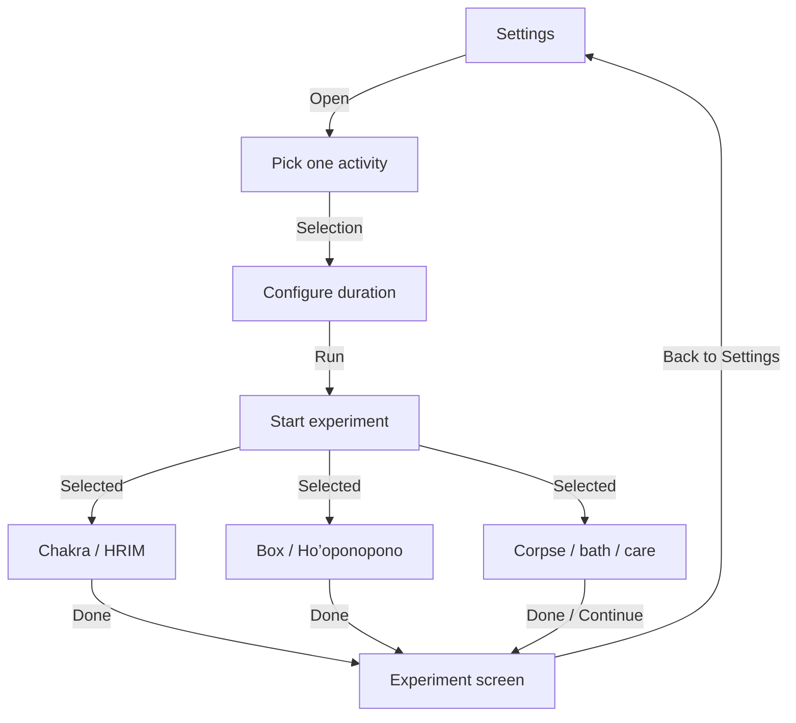
```mermaid
flowchart TD
  settings["Settings"]
  pick["Pick one activity"]
  duration["Configure duration"]
  start["Start experiment"]
  chakra["Chakra / HRIM"]
  practice["Box / Ho’oponopono"]
  care["Corpse / bath / care"]
  return["Experiment screen"]
  settings -->|"Open"| pick
  pick -->|"Selection"| duration
  duration -->|"Run"| start
  start -->|"Selected"| chakra
  start -->|"Selected"| practice
  start -->|"Selected"| care
  chakra -->|"Done"| return
  practice -->|"Done"| return
  care -->|"Done / Continue"| return
  return -->|"Back to Settings"| settings
```

| Step | Current behavior |
| --- | --- |
| Settings | Open Experiment Mode. |
| Pick one activity | Seven individual chakras, HRIM, Box, Ho’oponopono and Corpse Pose are always available. Perineal Care, Bath and Assisted Bath are absent from the native activity picker until the shared seven-tap-and-password Advanced Features unlock. Relocking removes care options, resets a selected care activity to Root and refreshes duration controls. Reload starts locked. |
| Configure duration | Chakra/HRIM use minutes; Box uses seconds per step; care and Corpse routines consume seconds. |
| Start experiment | Reject care activities while Advanced features is locked, before loading content or starting audio. Otherwise load selected content; initialize audio, ambience and wake lock; set experiment flag and countdown. |
| Chakra / HRIM | Run one meditateOnChakra with duration override. |
| Box / Ho’oponopono | Call corresponding focused routine directly. |
| Corpse / bath / care | Call isolated routine; bath/care includes guide-controlled Continue. |
| Experiment screen | Natural end and caught failure use stopExperiment; visible Stop uses shared stop which also returns here. |

- Current inconsistency: UI assigns sec or min, while startExperiment tests for seconds. Countdown therefore treats sec as minutes; care UI also labels raw seconds as min. Ho’oponopono has no duration control, but startExperiment still reads the hidden value. No ordinary completion modal or stats update is used.
- CP-MOD-155 moves activity start/stop orchestration to experiment-session.js. It retains pre-load Advanced Features care rejection, current script cache/source fallback, audio/ambience initialization, wake-lock/countdown setup, dispatch, error alert and ordered cleanup. It does not change the known `sec` versus `seconds` duration-unit issue recorded in FIX-QUEUE.

## Ordered Chakra Journey add-ons

Box → Visualization → Dharana → Body Scan → Guided Noting → Quiet Courage → Confidence Visualization → Deep Secrets → chakras; the same selected route drives its displayed estimate and countdown.

Sources: [modules/journey-routing.js:1](/Users/lekshmisyam/Desktop/Ikigai/lite/modules/journey-routing.js:1), [modules/journey-preparation-selection.js:1](/Users/lekshmisyam/Desktop/Ikigai/lite/modules/journey-preparation-selection.js:1), [modules/quiet-courage-practice.js:1](/Users/lekshmisyam/Desktop/Ikigai/lite/modules/quiet-courage-practice.js:1), [modules/self-exploration-practices.js:1](/Users/lekshmisyam/Desktop/Ikigai/lite/modules/self-exploration-practices.js:1), [modules/practice-module-loader.js:1](/Users/lekshmisyam/Desktop/Ikigai/lite/modules/practice-module-loader.js:1), [modules/lobby-experience-visibility.js:1](/Users/lekshmisyam/Desktop/Ikigai/lite/modules/lobby-experience-visibility.js:1), [modules/journey-roadmap.js:1](/Users/lekshmisyam/Desktop/Ikigai/lite/modules/journey-roadmap.js:1), [modules/session-estimate.js:1](/Users/lekshmisyam/Desktop/Ikigai/lite/modules/session-estimate.js:1), [index.html:365](/Users/lekshmisyam/Desktop/Ikigai/lite/index.html:365), [tests/self-exploration-practices.test.mjs:1](/Users/lekshmisyam/Desktop/Ikigai/lite/tests/self-exploration-practices.test.mjs:1), [modules/quiet-courage-practice.js:1](/Users/lekshmisyam/Desktop/Ikigai/lite/modules/quiet-courage-practice.js:1), [tests/quiet-courage-practice.test.mjs:1](/Users/lekshmisyam/Desktop/Ikigai/lite/tests/quiet-courage-practice.test.mjs:1), [app.js:1498](/Users/lekshmisyam/Desktop/Ikigai/lite/app.js:1498), [app.js:2439](/Users/lekshmisyam/Desktop/Ikigai/lite/app.js:2439).

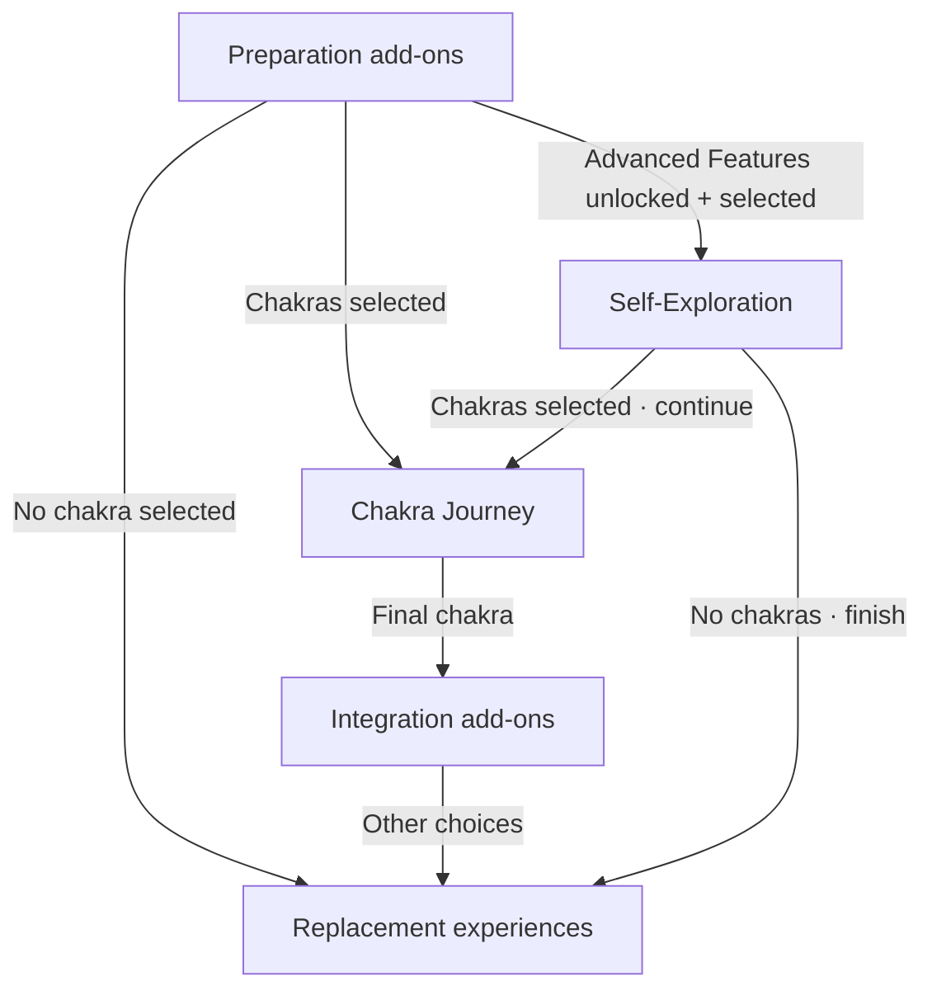
```mermaid
flowchart TD
  prepare["Preparation add-ons"]
  quiet["Self-Exploration"]
  chakras["Chakra Journey"]
  integrate["Integration add-ons"]
  separate["Replacement experiences"]
  prepare -->|"Chakras selected"| chakras
  prepare -->|"No chakra selected"| separate
  chakras -->|"Final chakra"| integrate
  integrate -->|"Other choices"| separate
  prepare -->|"Advanced Features unlocked + selected"| quiet
  quiet -->|"Chakras selected · continue"| chakras
  quiet -->|"No chakras · finish"| separate
```

| Step | Current behavior |
| --- | --- |
| Preparation add-ons | All selectors remain independently combinable. Runtime/Lobby order is Box, Visualization, Dharana, Body Scan, then Guided Noting. Body Scan offers 3/5/8 minutes and eight non-corrective head-to-toe regions; its new module owns the timed narration, cancellation guard and black-scene fade/cleanup while the controller supplies localized copy and app services. Guided Noting offers 2/4/6 minutes, neutral private labels, four spaced reminders, permission to return to breath or stop, and a label-free closing. Quiet Courage uses a subtle 396 Hz Root-associated symbolic tone at its opening; its fade-in/out duration exactly follows Drone Duration (4/10/14/20 seconds), and No Frequency suppresses it. This is an aesthetic grounding cue, not a proven therapeutic frequency. When no chakras are selected, these sessions and Ho’oponopono/Undo & Unlearn run alone; the roadmap shows only the selected standalone stages. With chakras selected, preparation precedes the chakra journey and integration practices follow it. The separate Self-Exploration section appears directly below Journey Preparation when Advanced Features is unlocked; its ordered options follow Quiet Courage, then Confidence Visualization and Deep Secrets after Guided Noting and before chakras. These may run without chakra selection. |
| Self-Exploration | A separate Advanced Features-only section directly below Journey Preparation. Quiet Courage comes first, then Confidence Visualization and Deep Secrets. Selected items follow Guided Noting and precede chakras; any combination can run without chakra selection. Relocking clears all selections. See the Self-Exploration challenges map. |
| Chakra Journey | One or more selected chakras run in the usual chosen order. |
| Integration add-ons | After the final chakra, optional Ho’oponopono runs first, then optional Undo & Unlearn, before silence, Closing and Emergence. Undo & Unlearn offers 5/8/12 minutes and never asks the meditator to identify, recall, speak, type or mentally answer anything. |
| Replacement experiences | Yoga remains a standalone pose-based experience; HRIM, Sleep, Music Only, Shots and Intimate Service also replace the normal Chakra Journey. |

- Preparation stages execute sequentially in the canonical order; the routing owner stops before the next stage if the session becomes inactive. Box Breathing execution lives in `modules/box-breathing-practice.js`; Visualization blackout/audio/narration/return timing in `modules/visualization-practice.js`; Ho’oponopono phrase-cycle timing and visual setup in `modules/hooponopono-practice.js`; Undo & Unlearn phase/scene lifecycle in `modules/undo-unlearn-practice.js`; Dharana in `modules/dharana-practice.js`; Body Scan in `modules/body-scan-practice.js`; Guided Noting in `modules/guided-noting-practice.js`. Quiet Courage starts a low-level 396 Hz symbolic cue only when No Frequency is off; the gain envelope fades in/out across the selected Drone Duration (4/10/14/20 seconds), not the entire practice. Research does not establish a unique frequency that causes courage or therapeutic benefit. The controller supplies localized narration, timing and existing screen/audio/session services. Box Breathing preserves its four-step/four-cycle order, 100 ms pause accounting and music fades. Visualization preserves optional ambience/error fallback, ducked narration, waits, selected duration, silence wake prompt, return-screen fades, ambience stop and music restoration. Ho’oponopono preserves the three four-phrase cycles, configured pauses and closing fade handoff; journey placement remains after the chakra sequence. Undo & Unlearn preserves the selected duration, translated content-free phases and active-session guards, and always hides the scene/releases body mode even if its fade wait rejects. The Lobby estimate owner preserves mode priority, timing/default inputs and the standard add-on formula while app.js refreshes its text and roadmap. Dharana preserves selected anchor shape/color, duration-based CSS timing plus an active-session shrink clock for reduced-motion mode, the four-second narrated release and cleanup. Guided Noting preserves its selected duration, four translated neutral reminders, active-session checks, black-scene five-second fade and cleanup on narration/fade failure. Body Scan, Guided Noting and Undo & Unlearn use only pitch-black fades: no figure, text labels, recurring canvas loop or decorative animation. Undo & Unlearn is content-free: no memory search, private answer or examples; its three forgiveness invitations preserve responsibility, safety, boundaries and choice. It cannot claim another person has forgiven the meditator. Replacement experiences clear every add-on. All narration is contract-checked in the five Meditation Languages.
- Quiet Courage is not a clinical intervention or a demand to become outgoing. Its localized narration gives permission to keep reflection private, imagine a neutral low-stakes scene, pause or stop, and take no real-world action.

## Lobby journey roadmap

Localized, display-only summary of the currently selected Lobby route.

Sources: [modules/journey-roadmap.js:1](/Users/lekshmisyam/Desktop/Ikigai/lite/modules/journey-roadmap.js:1), [tests/journey-roadmap.test.mjs:1](/Users/lekshmisyam/Desktop/Ikigai/lite/tests/journey-roadmap.test.mjs:1), [modules/journey-preference-settings-view.js:1](/Users/lekshmisyam/Desktop/Ikigai/lite/modules/journey-preference-settings-view.js:1), [tests/journey-preference-settings-view.test.mjs:1](/Users/lekshmisyam/Desktop/Ikigai/lite/tests/journey-preference-settings-view.test.mjs:1), [modules/quiet-courage-practice.js:1](/Users/lekshmisyam/Desktop/Ikigai/lite/modules/quiet-courage-practice.js:1), [tests/quiet-courage-practice.test.mjs:1](/Users/lekshmisyam/Desktop/Ikigai/lite/tests/quiet-courage-practice.test.mjs:1), [modules/self-exploration-practices.js:1](/Users/lekshmisyam/Desktop/Ikigai/lite/modules/self-exploration-practices.js:1), [tests/self-exploration-practices.test.mjs:1](/Users/lekshmisyam/Desktop/Ikigai/lite/tests/self-exploration-practices.test.mjs:1), [app.js:552](/Users/lekshmisyam/Desktop/Ikigai/lite/app.js:552), [app.js:1498](/Users/lekshmisyam/Desktop/Ikigai/lite/app.js:1498).

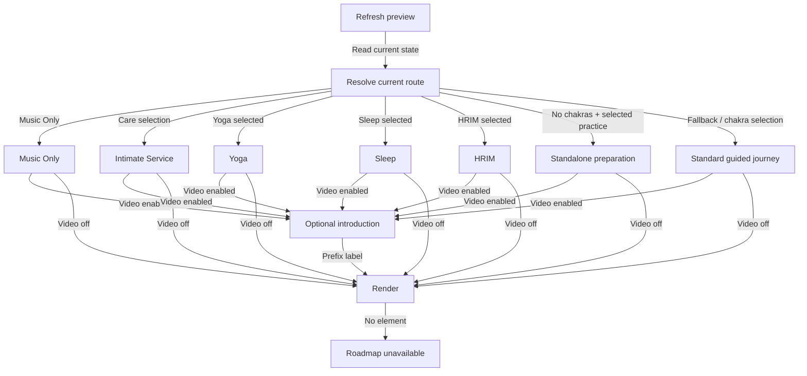
```mermaid
flowchart TD
  refresh["Refresh preview"]
  priority["Resolve current route"]
  music["Music Only"]
  care["Intimate Service"]
  yoga["Yoga"]
  sleep["Sleep"]
  hrim["HRIM"]
  standalone["Standalone preparation"]
  guided["Standard guided journey"]
  video["Optional introduction"]
  render["Render"]
  noTarget["Roadmap unavailable"]
  refresh -->|"Read current state"| priority
  priority -->|"Music Only"| music
  priority -->|"Care selection"| care
  priority -->|"Yoga selected"| yoga
  priority -->|"Sleep selected"| sleep
  priority -->|"HRIM selected"| hrim
  priority -->|"No chakras + selected practice"| standalone
  priority -->|"Fallback / chakra selection"| guided
  music -->|"Video enabled"| video
  care -->|"Video enabled"| video
  yoga -->|"Video enabled"| video
  sleep -->|"Video enabled"| video
  hrim -->|"Video enabled"| video
  standalone -->|"Video enabled"| video
  guided -->|"Video enabled"| video
  music -->|"Video off"| render
  care -->|"Video off"| render
  yoga -->|"Video off"| render
  sleep -->|"Video off"| render
  hrim -->|"Video off"| render
  standalone -->|"Video off"| render
  guided -->|"Video off"| render
  video -->|"Prefix label"| render
  render -->|"No element"| noTarget
```

| Step | Current behavior |
| --- | --- |
| Refresh preview | Lobby mode, add-on, chakra, returning-journey or video-prelude changes request a label recalculation. The preview itself never starts a journey or saves selections. |
| Resolve current route | Music Only → any Intimate Service choice → Yoga → Sleep → HRIM → standalone preparation when no chakras are selected and at least one standalone practice is chosen → standard chakra path. |
| Music Only | One Music Only label. |
| Intimate Service | Only selected care stages, preserving Perineal Care → Massage → Assisted Bathing label order. |
| Yoga | Optional Corpse Pose → optional Bath → Rest Before Yoga → Yoga. |
| Sleep | Sleep → Drowsiness → Light Sleep → True Sleep → Deep Sleep → REM Rest. |
| HRIM | Intention → HRIM → Closing. |
| Standalone preparation | Box → Visualization → Focused Attention → Body Scan → Guided Noting → Ho’oponopono → Undo & Unlearn; only selected stages are included. |
| Standard guided journey | Arrival or Returning → Intention → selected preparation practices (Box → Visualization → Focused Attention → Body Scan → Guided Noting → Quiet Courage → Confidence Visualization → Deep Secrets) → Chakras (shown as “Reverse Journey (Crown ➔ Root)” when dev-mode Reverse Journey is checked) → optional Ho’oponopono → optional Undo & Unlearn → Closing. This matches the runtime, where preparation practices run after the opening and Intention stage. |
| Optional introduction | When the Lobby video preference is enabled, prepend the translated Video Introduction label; this preview label does not play the video. |
| Render | Resolve every label through the current display-language translator and join with the existing » separator. |
| Roadmap unavailable | If the preview element is absent, return without changing anything. |

- The roadmap is a localized preview only. Begin validation and actual dispatch remain in the app/routing owner. Current behavior falls back to standard guided labels when no chakra is selected and no standalone add-on is checked; this preview does not itself enforce Begin eligibility.
- Quiet Courage is included after Guided Noting and before chakras, or among selected standalone preparation stages when no chakra is chosen. Its displayed name and roadmap follow Display Language.
- Confidence Visualization and Deep Secrets follow Quiet Courage in order and are included in both chakra and standalone preparation roadmaps. The optional-service offer is no longer a journey stage (see the Self-Exploration map).

## Quiet Courage · private self-expression practice

Optional Advanced Features practice in the Self-Exploration section directly below Journey Preparation; may run alone or as the last preparation stage before chakras.

Sources: [modules/quiet-courage-practice.js:1](/Users/lekshmisyam/Desktop/Ikigai/lite/modules/quiet-courage-practice.js:1), [tests/quiet-courage-practice.test.mjs:1](/Users/lekshmisyam/Desktop/Ikigai/lite/tests/quiet-courage-practice.test.mjs:1), [modules/journey-routing.js:1](/Users/lekshmisyam/Desktop/Ikigai/lite/modules/journey-routing.js:1), [modules/journey-preparation-selection.js:1](/Users/lekshmisyam/Desktop/Ikigai/lite/modules/journey-preparation-selection.js:1), [modules/lobby-experience-visibility.js:1](/Users/lekshmisyam/Desktop/Ikigai/lite/modules/lobby-experience-visibility.js:1), [modules/journey-roadmap.js:1](/Users/lekshmisyam/Desktop/Ikigai/lite/modules/journey-roadmap.js:1), [app.js:2350](/Users/lekshmisyam/Desktop/Ikigai/lite/app.js:2350), [index.html:365](/Users/lekshmisyam/Desktop/Ikigai/lite/index.html:365).

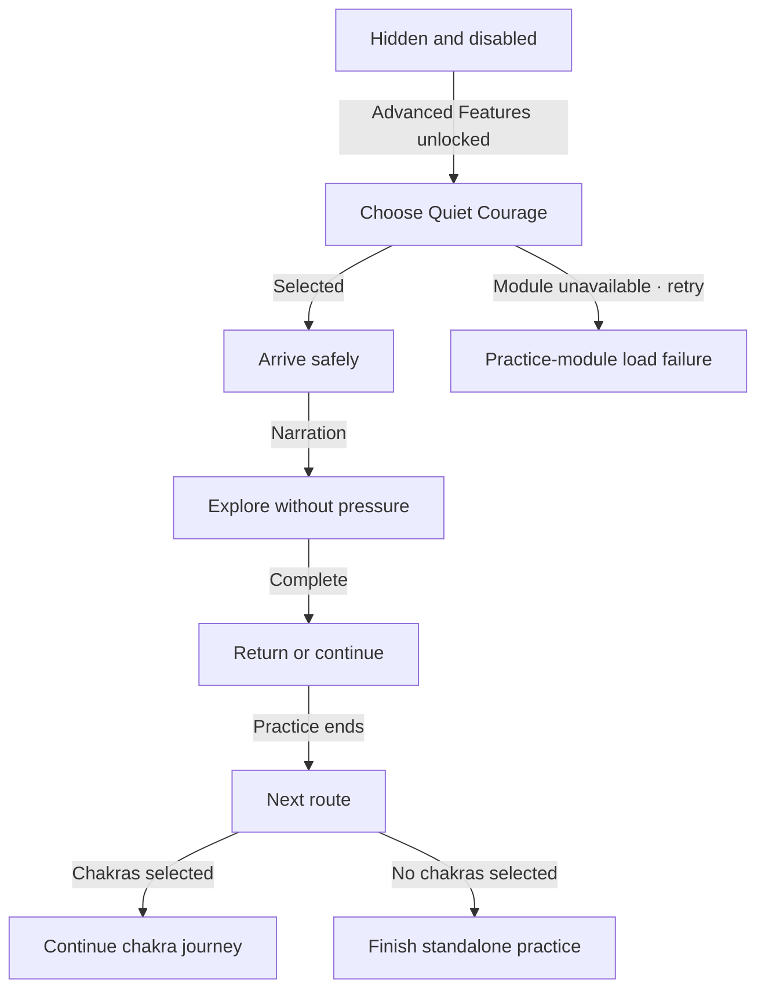
```mermaid
flowchart TD
  locked["Hidden and disabled"]
  choose["Choose Quiet Courage"]
  opening["Arrive safely"]
  explore["Explore without pressure"]
  continue["Return or continue"]
  next["Next route"]
  journey["Continue chakra journey"]
  finish["Finish standalone practice"]
  failure["Practice-module load failure"]
  locked -->|"Advanced Features unlocked"| choose
  choose -->|"Selected"| opening
  choose -->|"Module unavailable · retry"| failure
  opening -->|"Narration"| explore
  explore -->|"Complete"| continue
  continue -->|"Practice ends"| next
  next -->|"Chakras selected"| journey
  next -->|"No chakras selected"| finish
```

| Step | Current behavior |
| --- | --- |
| Hidden and disabled | Only available after the current page load unlocks Advanced Features. It is never restored from storage; relocking clears the selection. |
| Choose Quiet Courage | The first option in the optional Self-Exploration section, shown only while Advanced Features is unlocked. Choose 3/5/8 minutes; it may be combined with preparation or run without selecting a chakra. |
| Arrive safely | The meditator may keep everything private, imagine a neutral situation, rest with the breath, or stop at any time. |
| Explore without pressure | Notice a preference only if comfortable; imagine a safe, ordinary moment; practise pausing, choosing not now, changing one’s mind, or setting a boundary. No real event, disclosure, public action or personality change is requested. |
| Return or continue | After Guided Noting and before chakra selection, complete the Quiet Courage stage; with no chakras, the selected preparation session finishes independently. Cancellation stops the remaining stages. |
| Next route | With selected chakras, continue the journey; otherwise complete the standalone preparation. |
| Continue chakra journey | Run the selected chakra route. |
| Finish standalone practice | Complete the preparation-only session. |
| Practice-module load failure | Show the existing localized retry message; leave the session unstarted. |

- Narration follows the selected meditation language; visible name and roadmap follow display language. Private reflection never requires saying, typing, or reporting anything. This is a wellbeing/choice practice, not treatment or an outcome promise. The subsequent Self-Exploration games are mapped separately in the Self-Exploration challenges graph.

## Hush Hush · dev-mode icebreaker game

Hush Hush (internal name Secret Body Part): a 2–7 player pass-the-phone luck icebreaker opened from the Play Zone games section in the Lobby (after the Mood & Relaxation Ambience section) only while Advanced Features (dev mode) is unlocked. Nothing is saved.

Sources: [modules/secret-body-part-game.js:1](/Users/lekshmisyam/Desktop/Ikigai/lite/modules/secret-body-part-game.js:1), [tests/secret-body-part-game.test.mjs:1](/Users/lekshmisyam/Desktop/Ikigai/lite/tests/secret-body-part-game.test.mjs:1), [app.js:3032](/Users/lekshmisyam/Desktop/Ikigai/lite/app.js:3032), [modules/practice-module-loader.js:1](/Users/lekshmisyam/Desktop/Ikigai/lite/modules/practice-module-loader.js:1).

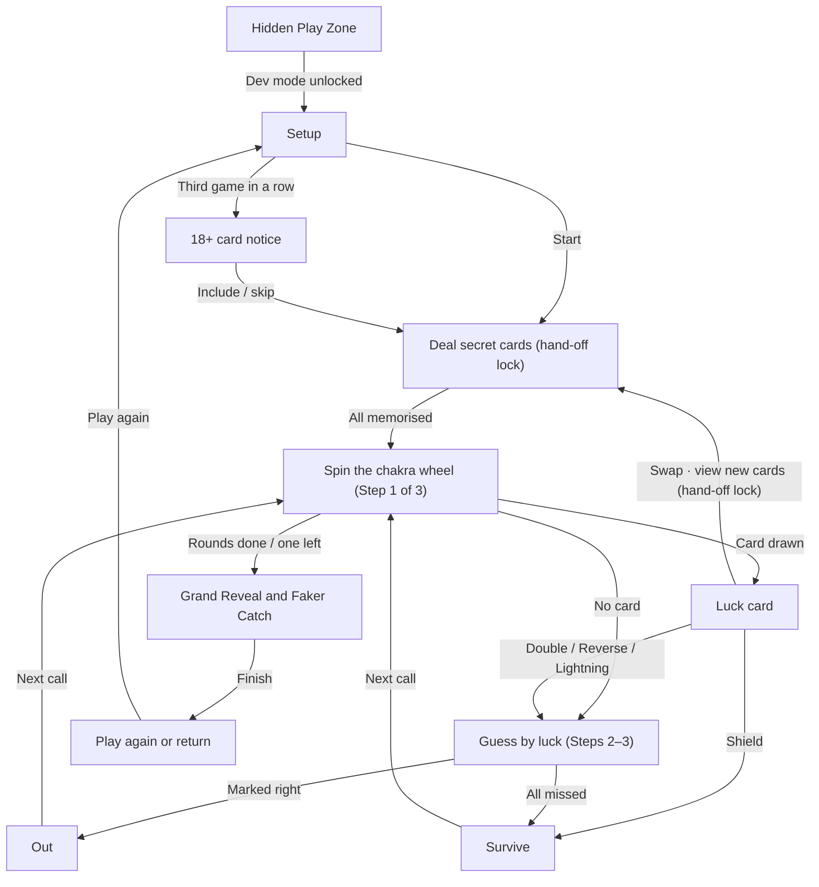
```mermaid
flowchart TD
  locked["Hidden Play Zone"]
  setup["Setup"]
  bold["18+ card notice"]
  deal["Deal secret cards (hand-off lock)"]
  spin["Spin the chakra wheel (Step 1 of 3)"]
  luck["Luck card"]
  guess["Guess by luck (Steps 2–3)"]
  out["Out"]
  survive["Survive"]
  reveal["Grand Reveal and Faker Catch"]
  exit["Play again or return"]
  locked -->|"Dev mode unlocked"| setup
  setup -->|"Third game in a row"| bold
  setup -->|"Start"| deal
  bold -->|"Include / skip"| deal
  deal -->|"All memorised"| spin
  spin -->|"Card drawn"| luck
  spin -->|"No card"| guess
  luck -->|"Swap · view new cards (hand-off lock)"| deal
  luck -->|"Double / Reverse / Lightning"| guess
  luck -->|"Shield"| survive
  guess -->|"Marked right"| out
  guess -->|"All missed"| survive
  out -->|"Next call"| spin
  survive -->|"Next call"| spin
  spin -->|"Rounds done / one left"| reveal
  reveal -->|"Finish"| exit
  exit -->|"Play again"| setup
```

| Step | Current behavior |
| --- | --- |
| Hidden Play Zone | The Play Zone Lobby section with its Hush Hush card (after Mood & Relaxation Ambience, before the session estimate) stays hidden and its button disabled until the current page load unlocks dev mode. Relocking hides it and closes an open game without leaving Settings. |
| Setup | Choose 2–7 players (shown as chakra image tags) and 1–5 rounds. Players are chakras in order: Root, Sacral, Solar, Heart, Throat, Third Eye, Crown. The setup shows how many games were played in a row this page load. |
| 18+ card notice | Before every third consecutive game, an 18+ notice asks the group to include the intimate Secret Card only if everyone is an adult and agrees, or play without it. |
| Deal secret cards (hand-off lock) | A Pass-the-phone screen in each player's chakra colour and image; that player presses and holds “I am <chakra>” (~0.9 s, a quick tap does nothing). The card shows one unique outer body part (no organs, no private parts) and hides itself after 10 s. In a third consecutive game with the 18+ Secret Card accepted, one random player gets an intimate word instead. |
| Spin the chakra wheel (Step 1 of 3) | A coloured wheel with one chakra slice and image per active player stops on the called player (instant with reduce motion). Each round calls every remaining player once in random order. About one spin in four also draws a luck card, shown as a big card. |
| Luck card | Swap (two players swap and privately view new cards), Double Guess, Shield (safe this call), Reverse (the called player guesses a random other player) or Lightning (anyone shouts first). |
| Guess by luck (Steps 2–3) | The phone goes to the called player through the hand-off lock and stays with them all turn. A banner says “<CHAKRA> — you hold the phone” and a box names who is guessing. Guessers only speak. The holder taps the heard word on a 12-word board (always contains the answer); only then do green Right / red Wrong appear. Every answer shows a full-screen result flash with a buzz that moves on by itself. |
| Out | A right answer puts the called player out and gives the guesser a star. |
| Survive | If every guess misses, or Shield/Lightning ends the call, the called player earns a shield. |
| Grand Reveal and Faker Catch | After the last round or when one player remains, all cards flip, the Secret Card last. A correct guess that was marked wrong exposes a Faker, who loses all shields. Awards: Lucky Survivor, Sharp Guesser and Faker of the Night. |
| Play again or return | Play again keeps the in-memory consecutive-game count; returning goes back to the Lobby. Closing the app resets everything. |

- Dev-mode only; not part of any meditation journey or session statistics. The module loads lazily through the practice-module loader and is offline pre-cached. Secret Card words live in SECRET_PARTS inside the module with matching ui.sbpPart_* translations in all five locales.

## Contactless Eye Shooter · dev-mode gaze game

A no-touch gaze practice game for two, for people who avoid looking at someone. Opened from the Play Zone card only while Advanced Features (dev mode) is unlocked. The app only explains the game: no camera, no eye tracking, nothing saved.

Sources: [modules/eye-shooter-game.js:1](/Users/lekshmisyam/Desktop/Ikigai/lite/modules/eye-shooter-game.js:1), [tests/eye-shooter-game.test.mjs:1](/Users/lekshmisyam/Desktop/Ikigai/lite/tests/eye-shooter-game.test.mjs:1), [app.js:3056](/Users/lekshmisyam/Desktop/Ikigai/lite/app.js:3056), [docs/eye-shooter-game.md:1](/Users/lekshmisyam/Desktop/Ikigai/lite/docs/eye-shooter-game.md:1).

```mermaid
flowchart TD
  locked["Hidden Play Zone card"]
  explain["Explanation screen"]
  goal["Choose a points goal"]
  exit["Got it / Back"]
  locked -->|"Dev mode unlocked · How to play"| explain
  explain -->|"Read"| goal
  goal -->|"Got it"| exit
```

| Step | Current behavior |
| --- | --- |
| Hidden Play Zone card | The Eye Shooter card sits in the dev-mode Play Zone; hidden and its How to play button disabled while locked. Relocking closes the screen. |
| Explanation screen | What the game is, four shooting steps (pick a spot, hold focus 3 seconds, blink once, add points) and a five-tier points table: 1 Ears/Back/Hair, 2 Nose/Chin/Shoulders, 3 Lips/Navel/Armpits, 4 Breasts, 5 Eyes/Pubic mound. All spots always shown. |
| Choose a points goal | Short 15, Medium 30 (default) or Long 50. Players keep score themselves. A note asks to play only with a partner who agrees. |
| Got it / Back | Returns to the Lobby. Nothing is saved. |

## Walk in My Shoes · dev-mode role-play acting game

A trust-building role-play for two or more players. Opened from the Play Zone card only while Advanced Features (dev mode) is unlocked. Players agree to play and finalise their roles, a spinner wheel decides the time, the screen stays awake and a soft chime ends the role play. There is no script: the players invent the story. Nothing is recorded or saved.

Sources: [modules/role-play-game.js:1](/Users/lekshmisyam/Desktop/Ikigai/lite/modules/role-play-game.js:1), [modules/wake-lock.js:1](/Users/lekshmisyam/Desktop/Ikigai/lite/modules/wake-lock.js:1), [tests/role-play-game.test.mjs:1](/Users/lekshmisyam/Desktop/Ikigai/lite/tests/role-play-game.test.mjs:1), [app.js:3080](/Users/lekshmisyam/Desktop/Ikigai/lite/app.js:3080), [docs/role-play-game.md:1](/Users/lekshmisyam/Desktop/Ikigai/lite/docs/role-play-game.md:1).

```mermaid
flowchart TD
  locked["Hidden Play Zone card"]
  roles["Choose players, scene and roles"]
  wheel["Spin for the time"]
  play["Role play running"]
  chime["Time is up"]
  again["Swap roles and play again"]
  locked -->|"Dev mode unlocked · Play now"| roles
  roles -->|"Everyone happy · roles set"| wheel
  wheel -->|"Change roles"| roles
  wheel -->|"Wheel stopped · Play"| play
  play -->|"Timer reaches zero"| chime
  play -->|"Stop"| roles
  chime -->|"Swap roles"| again
  again -->|"Spin again"| wheel
```

| Step | Current behavior |
| --- | --- |
| Hidden Play Zone card | The Walk in My Shoes card sits in the dev-mode Play Zone; hidden and its Play now button disabled while locked. Relocking closes the game, cancels a spinning wheel and releases the screen. |
| Choose players, scene and roles | Players: 2, 3 or 3+ (3+ starts at four and a stepper goes up to eight). Optional names. Scenes: Radha and Krishna, Storyteller and Listener, Teacher and Curious Student, Guide and Traveller, Interviewer and Guest, Old Friends Meeting Again. With three or more players only Radha and Krishna is offered and the extra players join as their friends. No story is supplied: the players decide it themselves. Each player taps that they are happy to play (not recorded); choosing a role swaps it with its holder so the scene is always complete. The roles are finalised with Roles are set. |
| Spin for the time | Nobody chooses the time. A spinner wheel with five slices (5, 10, 15, 20, 30 minutes) turns for about four seconds (no motion with reduced-motion) and lands on a random slice; the time is then fixed. It can be spun only once per round. Play appears only after the wheel has stopped; Change roles goes back and cancels a spin. |
| Role play running | Pressing Play primes the audio inside the tap, asks the shared wake lock to keep the screen awake and starts a countdown from a real end time (accurate even if the browser slows a background tab). Pause and Resume keep the remaining time; Stop ends the role play without a sound and returns to the roles. |
| Time is up | At zero the timer stops, a soft three-note chime plays, the device vibrates briefly where supported, the wake lock is released and the closing screen shows three gentle reflection prompts. |
| Swap roles and play again | Rotates the roles one place and returns to the wheel for a new time. Back to Meditation Room returns to the Lobby. Nothing is saved. |

- Roles and the opt-in tap are not recorded or stored; there is no camera, microphone or storage. The shared wake lock lives in modules/wake-lock.js and is also used by journeys. Sound needs the Play tap on phones. Wording in Malayalam, Hindi, Russian and Tamil is a draft awaiting native review; browser and device checks are outstanding.

## Chakra Touch · dev-mode couples touch game

A slow, consent-first touch game for two players with fixed roles: one Giver and one Receiver for the whole game. Opened from the Play Zone card only while Advanced Features (dev mode) is unlocked. The wheel picks a place, a card picks how to touch, the receiver keeps eyes closed. Nothing is saved.

Sources: [modules/chakra-touch-game.js:1](/Users/lekshmisyam/Desktop/Ikigai/lite/modules/chakra-touch-game.js:1), [tests/chakra-touch-game.test.mjs:1](/Users/lekshmisyam/Desktop/Ikigai/lite/tests/chakra-touch-game.test.mjs:1), [app.js:3103](/Users/lekshmisyam/Desktop/Ikigai/lite/app.js:3103), [docs/chakra-touch-game.md:1](/Users/lekshmisyam/Desktop/Ikigai/lite/docs/chakra-touch-game.md:1).

```mermaid
flowchart TD
  locked["Disabled Play Zone card"]
  setup["Setup"]
  adult["Spicy adult check"]
  consent["Receiver’s private map"]
  giver["Phone to the giver"]
  spin["Spin the chakra wheel"]
  ask["Maybe: ask first"]
  round["Touch card and timer"]
  paused["Paused"]
  rate["Receiver rates"]
  checkin["Check-in every 3 rounds"]
  end["Private summary"]
  locked -->|"Dev mode unlocked · Play now"| setup
  setup -->|"Spicy"| adult
  setup -->|"Warm / Close"| consent
  adult -->|"Both agree"| consent
  adult -->|"Play Close instead"| consent
  consent -->|"Map done"| giver
  giver -->|"Giver holds"| spin
  spin -->|"Maybe place"| ask
  spin -->|"Yes place"| round
  ask -->|"Yes, this time"| round
  ask -->|"Not this time"| spin
  round -->|"Pause"| paused
  paused -->|"Continue"| round
  round -->|"Time up / Finish now"| rate
  rate -->|"Every 3 rounds"| checkin
  rate -->|"Next round"| spin
  checkin -->|"Good / one level lower"| spin
  checkin -->|"End"| end
  rate -->|"Last round"| end
  paused -->|"End the game"| end
  end -->|"Play again (switched or same)"| setup
```

| Step | Current behavior |
| --- | --- |
| Disabled Play Zone card | The Chakra Touch card sits in the dev-mode Play Zone; its Play now button is disabled while locked. Relocking closes the game. |
| Setup | Giver and Receiver names with a Switch button, heat level (Warm, Close, Spicy 18+), rounds 6/10/14 and touch time 30/45/60 s. |
| Spicy adult check | Both players tick “I am an adult and I agree”, or choose Play Close instead. |
| Receiver’s private map | The phone goes to the receiver (press-and-hold hand-off lock), who marks every place Yes, Maybe or No. Outer body only, no genitals. Warm places start Yes, others Maybe. No is never picked. |
| Phone to the giver | Hand-off lock: “You give in every round. Keep the phone and follow each card.” No more hand-offs after this. |
| Spin the chakra wheel | Same giver and receiver every round. The wheel stops on a place the receiver allowed; about one round in five also draws a luck card (Double time, Your choice, Slow motion). |
| Maybe: ask first | For a Maybe place the receiver answers Yes, this time or Not this time (skips the place). |
| Touch card and timer | The place in its chakra colour and image, a touch card (feather, palm, circles, letter, breath, receiver’s choice; kiss from Close; slow trail at Spicy), eyes-closed reminder and the timer ring. Pause is always visible. |
| Paused | Continue, Skip this round or End the game. |
| Receiver rates | More of this, Just right or Less of this. More of this goes into the private summary. |
| Check-in every 3 rounds | We are good, Go one level lower, or End the game. |
| Private summary | The receiver’s favourite places. Play again: <receiver> gives (roles switched), Play again (same roles) or Back. Nothing saved. |

- Dev-mode only; not part of any meditation journey or session statistics. Lazy-loaded through the practice-module loader and offline pre-cached. Places, touches and luck cards live in the module with ui.ct* translations in all five locales. Role swap was removed (owner: not fun).

## Pitch Mode · 2-Minute Mind Reset

Public marketing demo in normal mode, between Sound Shot and Meditation Room: choose a feeling, hear a two-minute voice-guided session, then an invite.

Sources: [modules/pitch-mode.js:1](/Users/lekshmisyam/Desktop/Ikigai/lite/modules/pitch-mode.js:1), [tests/pitch-mode.test.mjs:1](/Users/lekshmisyam/Desktop/Ikigai/lite/tests/pitch-mode.test.mjs:1), [app.js:1634](/Users/lekshmisyam/Desktop/Ikigai/lite/app.js:1634), [app.js:3010](/Users/lekshmisyam/Desktop/Ikigai/lite/app.js:3010), [piper-models.json:1](/Users/lekshmisyam/Desktop/Ikigai/lite/piper-models.json:1), [docs/pitch-mode.md:1](/Users/lekshmisyam/Desktop/Ikigai/lite/docs/pitch-mode.md:1), [modules/narration-feeling.js:1](/Users/lekshmisyam/Desktop/Ikigai/lite/modules/narration-feeling.js:1), [modules/audio-mode-settings-view.js:31](/Users/lekshmisyam/Desktop/Ikigai/lite/modules/audio-mode-settings-view.js:31), [app.js:1635](/Users/lekshmisyam/Desktop/Ikigai/lite/app.js:1635).

```mermaid
flowchart TD
  lobby["Lobby panel"]
  voice["Borrow the fixed voice"]
  warm["Prepare the voice"]
  start["Start the 2-minute clock"]
  guide["Guided lines"]
  close["Close early"]
  end["End without statistics"]
  invite["Invite"]
  lobby -->|"Tap a mood"| voice
  voice -->|"Fixed voice set"| warm
  warm -->|"Ready / fallback"| start
  start -->|"Begin"| guide
  guide -->|"Close tapped"| close
  guide -->|"Lines finished"| end
  close -->|"Stop"| end
  end -->|"Natural finish"| invite
  invite -->|"Journey / another feeling"| lobby
```

| Step | Current behavior |
| --- | --- |
| Lobby panel | Always visible (no dev mode). Four one-tap moods: Calm, Courage, Energy and Focus. There is no Rest mood. |
| Borrow the fixed voice | For this session only, switch to the fixed male Piper voice for the content language (English Ryan, Hindi Pratham, Russian Dmitri, Malayalam Arjun, Tamil Rasa) at a fixed pace. The Settings voice and pace are ignored and never saved over. |
| Prepare the voice | The first use in a language downloads that voice (about 60 MB); if it cannot load, the browser voice for the language is used. |
| Start the 2-minute clock | Start music, wake lock and the two-minute on-screen countdown. Show the meditation screen with the mood title and aura. No mantra, drone or visual journey. When No Frequency Mode is off, one very soft mood tone plays from the start for the standard Drone Duration window (Beginner 4 s, Intermediate 10 s, Advanced 14 s, Expert 20 s) with soft fades inside it (Calm 639 Hz, Courage 396 Hz, Energy 528 Hz, Focus 852 Hz, a third of the chakra drone level); with No Frequency Mode on there is no tone. Turning No Frequency Mode on mid-session stops it. Music fades in over 5 s together with the 5 s aura fade. |
| Guided lines | Speak the opening, four guided steps and closing in the selected content language. Every opening invites the listener to sit or stand (demos are often standing); no step assumes a chair. Quiet gaps are spread so the voice ends about 12 seconds before two minutes. No breathing cues: Calm softens face, hands and shoulders and listens to sounds; Courage uses posture, feet on the ground and a remembered strength; Energy uses shoulder rolls, an arm stretch and shaking out the hands; Focus rests the eyes on one point and notices three sounds. Gaps up to 14 seconds give time to do each step. Each line carries a narration feeling (see the narration-feeling map): a warm welcome, a settling middle and a close that matches the mood. |
| Close early | The standard Close control stops the demo at any time; pause and the mixer work as usual. |
| End without statistics | Stop the session with the shared stop (no completion statistics) and restore the Settings voice and pace. Outro first: music fades out over 6 s, the aura fades with it and any mood tone fades (1.5 s); then the session stops. Close fades the tone in 0.3 s. |
| Invite | Show “That was 2 minutes. Imagine what 20 minutes could do.” with Begin a full journey (scrolls to the Meditation Room) or Try another feeling (scrolls back to the moods). |

- Normal-mode marketing demo. Pitch-only voices carry pitchOnly in piper-models.json, so the Settings picker and automatic voice choice never list them. Honest wording only: relax, pause, feel calmer or fresher; no healing claims.

## Self-Exploration · Confidence Visualization, Deep Secrets and the standalone optional-service card

Advanced Features-only optional stages after Quiet Courage and before chakras; individually selectable and available as standalone preparation.

Sources: [modules/self-exploration-practices.js:1](/Users/lekshmisyam/Desktop/Ikigai/lite/modules/self-exploration-practices.js:1), [modules/practice-module-loader.js:1](/Users/lekshmisyam/Desktop/Ikigai/lite/modules/practice-module-loader.js:1), [modules/journey-routing.js:1](/Users/lekshmisyam/Desktop/Ikigai/lite/modules/journey-routing.js:1), [modules/journey-preparation-selection.js:1](/Users/lekshmisyam/Desktop/Ikigai/lite/modules/journey-preparation-selection.js:1), [modules/lobby-experience-visibility.js:1](/Users/lekshmisyam/Desktop/Ikigai/lite/modules/lobby-experience-visibility.js:1), [modules/session-estimate.js:1](/Users/lekshmisyam/Desktop/Ikigai/lite/modules/session-estimate.js:1), [modules/journey-roadmap.js:1](/Users/lekshmisyam/Desktop/Ikigai/lite/modules/journey-roadmap.js:1), [app.js:2292](/Users/lekshmisyam/Desktop/Ikigai/lite/app.js:2292), [index.html:367](/Users/lekshmisyam/Desktop/Ikigai/lite/index.html:367), [sw.js:62](/Users/lekshmisyam/Desktop/Ikigai/lite/sw.js:62), [tests/self-exploration-practices.test.mjs:1](/Users/lekshmisyam/Desktop/Ikigai/lite/tests/self-exploration-practices.test.mjs:1).

```mermaid
flowchart TD
  gate["Advanced Features gate"]
  confidence["Confidence Visualization"]
  secrets["Deep Secrets · Speak or Stay Silent"]
  final["Optional service information (not a journey stage)"]
  answer["Transient choice"]
  exit["Skip / Stop / Continue"]
  route["Chakra journey"]
  finish["Standalone completion"]
  gate -->|"Choose + unlocked"| confidence
  gate -->|"Choose + unlocked"| secrets
  gate -->|"Developer mode on and not care first (Lobby card)"| final
  confidence -->|"Next selected stage"| secrets
  secrets -->|"Skip / Stop / Continue"| exit
  final -->|"Meditator chooses"| answer
  exit -->|"Chakras selected"| route
  exit -->|"No chakras"| finish
```

| Step | Current behavior |
| --- | --- |
| Advanced Features gate | Choices are session-only and cleared on relock. Selected practice module loads lazily at Begin and is precached for offline use. |
| Confidence Visualization | A fully clothed, non-explicit self-kindness visualization with a localized step counter. No appearance ideal, body inspection, touching, disclosure, or real-world action. Choose 3/5/8 minutes. |
| Deep Secrets · Speak or Stay Silent | Speaking is optional; fiction/metaphor, silence, skip or stop are welcome. Localized narration says in first person “I won’t record or save what you say here.” The PWA does not request microphone access or capture, transcribe, store or upload speech; an in-room listener may hear. Choose 3/4/6 minutes. |
| Optional service information (not a journey stage) | The offer no longer appears inside any journey. In developer mode only, a standalone Lobby card, separate from the meditation, reads: entirely optional, nothing booked, saved or shared. Yes / No are equal and none is preselected. No countdown, no challenge framing. Hidden when developer mode is locked and for a client the assessment marked care first. |
| Transient choice | Yes only tells the meditator they may ask their guide for information whenever they like. No thanks the meditator. No storage, analytics, assessment, operator record, booking or automatic upsell. |
| Skip / Stop / Continue | Each stage is skippable; cancellation closes its UI and uses the current session exit path. Load failure uses the shared localized recovery notice. |
| Chakra journey | If chakras were selected, continue to the selected chakra stages. |
| Standalone completion | If none were selected, complete the standalone practices. |

- All visible text and spoken prompts are supplied for English, Malayalam, Hindi, Russian and Tamil. No disclosure is scored or rewarded. The Yes choice does not activate or book anything; information can only be requested from the guide, outside the app. The offer is never part of a journey. Browser and device audio verification remain outstanding.

## Separate time for each chakra

Optional own time per chakra under Core Practice Duration, with autofill from the chakra assessment.

Sources: [modules/chakra-timing.js:1](/Users/lekshmisyam/Desktop/Ikigai/lite/modules/chakra-timing.js:1), [modules/chakra-timing-view.js:1](/Users/lekshmisyam/Desktop/Ikigai/lite/modules/chakra-timing-view.js:1), [tests/chakra-timing.test.mjs:1](/Users/lekshmisyam/Desktop/Ikigai/lite/tests/chakra-timing.test.mjs:1), [index.html:490](/Users/lekshmisyam/Desktop/Ikigai/lite/index.html:490), [app.js:2527](/Users/lekshmisyam/Desktop/Ikigai/lite/app.js:2527), [modules/chakra-session.js:39](/Users/lekshmisyam/Desktop/Ikigai/lite/modules/chakra-session.js:39), [modules/session-estimate.js:1](/Users/lekshmisyam/Desktop/Ikigai/lite/modules/session-estimate.js:1), [modules/lobby-experience-visibility.js:111](/Users/lekshmisyam/Desktop/Ikigai/lite/modules/lobby-experience-visibility.js:111).

```mermaid
flowchart TD
  core["Core Practice Duration"]
  switch["Set time for each chakra"]
  off["Switch off"]
  rows["Rows for chosen chakras"]
  reset["Reset all to core"]
  suggest["Fill times from assessment"]
  apply["Apply these times"]
  run["Journey runs"]
  core -->|"Optional"| switch
  switch -->|"Off"| off
  switch -->|"On"| rows
  rows -->|"Reset"| reset
  rows -->|"Assessment"| suggest
  suggest -->|"Suggestion shown"| apply
  apply -->|"Adjust"| rows
  rows -->|"Begin"| run
  off -->|"Begin"| run
  reset -->|"Back to core"| rows
```

| Step | Current behavior |
| --- | --- |
| Core Practice Duration | Kept as the base (1–7 min, 0.5 steps). Every chakra without its own time follows it, so moving the core moves them too. |
| Set time for each chakra | Lobby switch under Core Practice Duration, off by default. Shown only for normal chakra journeys: hidden for Shots, Sleep, HRIM, Music Only, focused experiences and demo scripts. |
| Switch off | Every chakra uses Core Practice Duration, exactly as before. |
| Rows for chosen chakras | Panel sits under Core Practice Duration on wide screens. One row per chakra chosen in Chakra Journey (Root → Crown order), each a padded tile with − / time / + (1–7 min, 0.5 steps); rows update when chakras are ticked or unticked. None chosen: a short message. A hidden chakra keeps its saved time. “· core” marks a chakra still following the core. |
| Reset all to core | All chakras follow Core Practice Duration again. |
| Fill times from assessment | Reads the assessment saved on this device. If it has clear focus chakras with enough answers, shows a suggestion: focus chakras get the core time + 50 % (max 7 min); others follow the core. No clear focus or no assessment: a calm message, nothing changes. |
| Apply these times | One tap applies the suggestion; every chakra can still be adjusted. |
| Journey runs | Each chakra chants for its own time (Reverse Journey and Massage too). Drone exposure keeps its own Drone Duration window. The Lobby estimate and session countdown add up each chakra’s time. |

- Saved on this device as chakra_per_chakra_time_enabled and chakra_per_chakra_times (included in settings backup). Five languages.
- Evidence: unit tests (limits, follow-core, demo, estimate, autofill rules, wiring) and a local browser run: switch, rows, + on Heart (estimate 36 → 37 min), no-assessment message, and a simulated finished assessment suggesting Solar and Throat 7 min, applied only after Apply (estimate 64 → 68 min), no page errors. Rows-for-chosen-chakras checked in a local browser (Root, Heart, Crown → 3 rows; none → message). Not yet checked on a phone.

## Pause, stop and live controls

Shared interaction and cancellation behavior.

Sources: [modules/journey-chrome.js:1](/Users/lekshmisyam/Desktop/Ikigai/lite/modules/journey-chrome.js:1), [modules/session-countdown.js:1](/Users/lekshmisyam/Desktop/Ikigai/lite/modules/session-countdown.js:1), [tests/session-countdown.test.mjs:1](/Users/lekshmisyam/Desktop/Ikigai/lite/tests/session-countdown.test.mjs:1), [modules/journey-video-prelude.js:1](/Users/lekshmisyam/Desktop/Ikigai/lite/modules/journey-video-prelude.js:1), [modules/session-transport-controls.js:1](/Users/lekshmisyam/Desktop/Ikigai/lite/modules/session-transport-controls.js:1), [tests/session-transport-controls.test.mjs:1](/Users/lekshmisyam/Desktop/Ikigai/lite/tests/session-transport-controls.test.mjs:1), [modules/mixer-view.js:1](/Users/lekshmisyam/Desktop/Ikigai/lite/modules/mixer-view.js:1), [tests/mixer-view.test.mjs:1](/Users/lekshmisyam/Desktop/Ikigai/lite/tests/mixer-view.test.mjs:1), [modules/media-controls-view.js:1](/Users/lekshmisyam/Desktop/Ikigai/lite/modules/media-controls-view.js:1), [tests/media-controls-view.test.mjs:1](/Users/lekshmisyam/Desktop/Ikigai/lite/tests/media-controls-view.test.mjs:1), [app.js:1490](/Users/lekshmisyam/Desktop/Ikigai/lite/app.js:1490), [app.js:2551](/Users/lekshmisyam/Desktop/Ikigai/lite/app.js:2551), [app.js:2944](/Users/lekshmisyam/Desktop/Ikigai/lite/app.js:2944), [modules/guide-controlled-transition.js:1](/Users/lekshmisyam/Desktop/Ikigai/lite/modules/guide-controlled-transition.js:1), [tests/guide-controlled-transition.test.mjs:1](/Users/lekshmisyam/Desktop/Ikigai/lite/tests/guide-controlled-transition.test.mjs:1), [modules/session-stop.js:1](/Users/lekshmisyam/Desktop/Ikigai/lite/modules/session-stop.js:1), [tests/session-stop.test.mjs:1](/Users/lekshmisyam/Desktop/Ikigai/lite/tests/session-stop.test.mjs:1).

```mermaid
flowchart TD
  active["Active session"]
  pause["Pause"]
  mixer["Open Journey Tuning"]
  stop["Stop"]
  resume["Resume"]
  image["Tap chakra image"]
  return["Return screen"]
  wait["Guide waiting"]
  fullscreen["User fullscreen"]
  active -->|"Pause"| pause
  pause -->|"Play"| resume
  resume -->|"Continue"| active
  active -->|"Mixer"| mixer
  mixer -->|"Close"| active
  active -->|"Stop"| stop
  stop -->|"Cleanup"| return
  active -->|"Image tap"| image
  image -->|"Keep playing"| active
  active -->|"Care / Yoga gate"| wait
  wait -->|"Guide continues"| active
  wait -->|"Stop"| stop
  active -->|"Fullscreen change"| fullscreen
```

| Step | Current behavior |
| --- | --- |
| Active session | A single numeric remaining-time display lives inside the bottom-right floating control bar beside Journey Tuning, Pause/Resume, icon-only Skip and Close. The old mirrored top-corner rings are removed. Active journeys hide the whole bar in normal and fullscreen views. Hover bottom/control area to reveal; leave for 180 ms to hide. While visible, the reveal zone yields pointer events to the control strip so its buttons remain clickable. Cursor hides after 3s idle and returns on movement without revealing controls elsewhere. Touch/pen tap reveals controls for 3s; keyboard focus reveals them. Open mixer preserves visibility and cursor; session exit/page hiding clears timers and hidden cursor. Sleep and Eyes Close use opacity factors instead of ancestor filters, keeping fixed controls/reveal area viewport-positioned. One-shot timers and class observation, no animation loop. |
| Pause | Non-Lobby/Settings screens already have static sky and decorative effects. Set isPaused; freeze stage countdowns; cancel browser speech; pause Piper; fade the whole mix out over 0.8s through the pause fader, then suspend AudioContext (no hard cut). |
| Open Journey Tuning | Opening mixer does not pause. Volume, voice, space, ambience, brightness and suppression controls apply live. |
| Stop | Cancel narration jobs/timers; Piper fades over two seconds, mantra/music/ambience over eight seconds with effect tails. Do not restore music during Stop. Browser speech cancellation remains immediate. Stop visuals, resolve guide wait false and hide controls/mixer. |
| Resume | Resume Piper/context, then fade the whole mix back in over 1.2s. Ordinary browser narration replays the interrupted sentence if pause was observed. |
| Tap chakra image | Toggle session text overlay; session continues. |
| Return screen | Experiment → Experiment screen; other modes → Lobby. No completion statistics. |
| Guide waiting | Continue is accepted only when active and not paused; Stop releases the pending wait. |
| User fullscreen | Track fullscreen on app container. The timer stays inside the bottom-right controls; fullscreen controls reveal/hide as one unit using the existing hover/touch/keyboard behavior. |

- The app no longer requests or exits fullscreen automatically. Browser-speech cancellation and Piper buffer suspension are different pause mechanisms. Re-enable No Mantra does not immediately restart a previously skipped mantra stage.
- CP-MOD-108–127 moves the shared countdown SVG progress and hide presentation helpers into `modules/session-countdown.js`; ticker cadence and session lifecycle remain unchanged.
- CP-MOD-162 moves the existing shared guide-controlled countdown and Continue button wait into `guide-controlled-transition.js`. Yoga and care keep their current call sites; pause rejection, Stop cancellation, focus management, and listener cleanup are unchanged.
- CP-MOD-163 moves the existing Stop cleanup into `session-stop.js` behind the same controller method. Audio and visual shutdown order, wake lock/countdown release, guide cancellation, UI reset and destination screen are unchanged; this is source ownership only.

## Optional Lobby video introduction

An explicit Lobby preference plays the cinematic introduction before one journey start; a Lobby Play introduction button plays it on its own and returns to the Meditation Room; Restart stays immediate.

Sources: [modules/journey-video-prelude.js:1](/Users/lekshmisyam/Desktop/Ikigai/lite/modules/journey-video-prelude.js:1), [modules/media-controls-view.js:1](/Users/lekshmisyam/Desktop/Ikigai/lite/modules/media-controls-view.js:1), [modules/journey-preference-settings-view.js:1](/Users/lekshmisyam/Desktop/Ikigai/lite/modules/journey-preference-settings-view.js:1), [sw.js:1](/Users/lekshmisyam/Desktop/Ikigai/lite/sw.js:1), [app.js:3844](/Users/lekshmisyam/Desktop/Ikigai/lite/app.js:3844), [app.js:3855](/Users/lekshmisyam/Desktop/Ikigai/lite/app.js:3855).

```mermaid
flowchart TD
  lobby["Lobby → Include video introduction"]
  direct["Lobby → ▶ Play introduction"]
  buffer["Prepare and buffer"]
  ready["Begin introduction"]
  hold["Image hold → playback"]
  recover["Buffer recovery"]
  end["Normal video ending"]
  error["Unavailable video"]
  dispatch["Begin journey"]
  room["Back to the Meditation Room"]
  lobby -->|"Option selected + Begin"| buffer
  buffer -->|"Ready / timeout"| ready
  ready -->|"User clicks"| hold
  hold -->|"Buffer low"| recover
  recover -->|"Recovered"| hold
  hold -->|"Ended"| end
  buffer -->|"Failure"| error
  hold -->|"Failure"| error
  end -->|"Reminder acknowledged"| dispatch
  error -->|"Normal reminder remains"| dispatch
  direct -->|"Play introduction"| buffer
  end -->|"Direct play ended"| room
  error -->|"Direct play unavailable"| room
```

| Step | Current behavior |
| --- | --- |
| Lobby → Include video introduction | The option carries a localized “Cosmic Consciousness Introduction” subtitle. Its persisted choice defaults OFF and appears in the roadmap for every supported journey family. A normal journey with no selected chakras is rejected at the original Begin click, before video preparation. |
| Lobby → ▶ Play introduction | A button beside the option plays the same prelude on its own, whether or not the option is ticked. It does not start, pause or stop a journey and is disabled while the video runs (media-controls-view owns it). |
| Prepare and buffer | Paused/silent video with meditator image. Target 4 / 6 / 8 seconds by connection, with stability check. A progress meter (bar, percentage, accessible progressbar) shows the buffered share of the target and reaches 100% when Begin introduction appears. |
| Begin introduction | Reveal button when ready OR after the 90-second bounded wait. Explicit user action required. |
| Image hold → playback | Hold image 3 seconds, then video; remove the readiness-only dark shade. The meditator image and video render fully opaque and fill the screen in any orientation, turning with the device (sideways shows the whole frame; upright trims the sides, no black bands). Loading and Begin content uses a near-solid dark backing with sharp white text for readability. The prelude is outside ordinary screen dimming, so saved brightness, Sleep and Eyes Close cannot make it translucent. Audio fades in over 2.4 seconds using separate video volume. |
| Buffer recovery | Below 2 seconds ahead pauses except near end; waiting/stalled enters recovery. Resume at up to 4 seconds, bounded by remaining clip. |
| Normal video ending | Final 0.25-second audiovisual fade; acknowledge DND reminder. |
| Unavailable video | Missing media, preparation failure, media error or rejected play: unavailable result; error path fades 1.2 seconds. |
| Begin journey | Continue through the current Lobby mode selection exactly once. Restart bypasses this optional prelude and relaunches directly. |
| Back to the Meditation Room | After a direct play the overlay closes over the unchanged Lobby; the play button is ready again. The DND reminder is not acknowledged, so a later journey still shows it. |

- No skip control and no automatic fullscreen. The video URL is absent at initial page load and attached only when this opted-in introduction starts. A buffer countdown reports seconds of media still needed, not a measured wall-clock download ETA. Settings audio preview is separate and also opts into loading the video: play 8 seconds, fade and reset without starting a journey.

## Completion, statistics and external handoff

Different end states are intentionally visible here.

Sources: [modules/completion-view.js:1](/Users/lekshmisyam/Desktop/Ikigai/lite/modules/completion-view.js:1), [tests/completion-view.test.mjs:1](/Users/lekshmisyam/Desktop/Ikigai/lite/tests/completion-view.test.mjs:1), [index.html:874](/Users/lekshmisyam/Desktop/Ikigai/lite/index.html:874), [app.js:2400](/Users/lekshmisyam/Desktop/Ikigai/lite/app.js:2400), [tests/completion-session.test.mjs:1](/Users/lekshmisyam/Desktop/Ikigai/lite/tests/completion-session.test.mjs:1), [tests/journey-completion-handoff.test.mjs:1](/Users/lekshmisyam/Desktop/Ikigai/lite/tests/journey-completion-handoff.test.mjs:1).

```mermaid
flowchart TD
  natural["Guided / Sleep finishes"]
  cleanup["Coordinated ending"]
  stats["Save local statistics"]
  modal["Completion modal"]
  return["Return to Room"]
  hi["Not eligible"]
  earn["Developer mode and not Hindi"]
  natural -->|"finish()"| cleanup
  cleanup -->|"Update"| stats
  stats -->|"Show"| modal
  modal -->|"Return"| return
  modal -->|"Dev mode locked or Hindi"| hi
  modal -->|"Dev mode active, other language"| earn
```

| Step | Current behavior |
| --- | --- |
| Guided / Sleep finishes | Shared finish() for standard, HRIM, focused practices and Sleep. |
| Coordinated ending | Cancel narration and drones; stop mantra without restoring music; fade music; hide controls and clear visuals. |
| Save local statistics | Increment journey count and add rounded wall-clock minutes since start, minimum one. Pause time is included. |
| Completion modal | Show completion message, totals, session time and Return to Room. |
| Return to Room | Cancel pending Earn reveal; hide modal; open Lobby. |
| Not eligible | No Earn link when developer mode (Advanced Features) is locked, or when the meditation language is Hindi (eligibility uses meditation language, not display language). Locking developer mode also cancels a pending reveal. |
| Developer mode and not Hindi | After 3 seconds, if developer mode is still active, reveal native Continue to Earn link; user click navigates externally. |

- Earn destination is https://missionode.github.io/earn-app/receive.html?Source=Lite. No automatic navigation. Shots, manual stops, and experiments do not use this stats/completion path.
- CP-MOD-129–148 moves Earn-link delay, Hindi exclusion, cancellation/hide, delayed reveal and focus into the completion owner. Completion order and user-initiated navigation are unchanged.
- CP-MOD-164: the existing completion owner now performs the controller’s natural completion cleanup, stats and modal setup. Standard, HRIM, focused and Sleep entry routes remain unchanged; this is ownership only.
- Continue to Earn is a developer-mode feature: the link is scheduled and revealed only while Advanced Features is unlocked (and never for Hindi). Locking Advanced Features cancels a pending reveal; the link stays hidden by default.

## Scripts, language and timing

Content selection, validation, fallback and demo behavior.

Sources: [modules/content-localization.js:1](/Users/lekshmisyam/Desktop/Ikigai/lite/modules/content-localization.js:1), [modules/locale-ui-renderer.js:1](/Users/lekshmisyam/Desktop/Ikigai/lite/modules/locale-ui-renderer.js:1), [tests/locale-ui-renderer.test.mjs:1](/Users/lekshmisyam/Desktop/Ikigai/lite/tests/locale-ui-renderer.test.mjs:1), [scripts.json:1](/Users/lekshmisyam/Desktop/Ikigai/lite/scripts.json:1), [language-manifest.json:1](/Users/lekshmisyam/Desktop/Ikigai/lite/language-manifest.json:1), [app.js:493](/Users/lekshmisyam/Desktop/Ikigai/lite/app.js:493), [app.js:556](/Users/lekshmisyam/Desktop/Ikigai/lite/app.js:556), [app.js:439](/Users/lekshmisyam/Desktop/Ikigai/lite/app.js:439).

```mermaid
flowchart TD
  settings["Content settings"]
  default["Default content"]
  custom["Custom JSON"]
  demo["Demo metadata?"]
  validate["Start-time validation"]
  resolve["Resolve narration"]
  ui["Resolve UI labels"]
  voice["Resolve voice"]
  timing["Timing layers"]
  settings -->|"Default"| default
  settings -->|"Custom"| custom
  custom -->|"Valid bundle"| demo
  default -->|"Begin"| validate
  demo -->|"Begin"| validate
  validate -->|"Valid"| resolve
  resolve -->|"Speak"| voice
  settings -->|"Language choice"| ui
  timing -->|"Durations"| validate
  validate -->|"Invalid → error / stop"| settings
```

| Step | Current behavior |
| --- | --- |
| Content settings | Choose meditation language, display language, voice and default/custom script source. |
| Default content | English, Malayalam, Hindi, Russian and Tamil point to scripts.json. Journey fetch appends a timestamp query. |
| Custom JSON | Upload file or fetch URL; validate required schema; store bundle in localStorage. Invalid input shows error. |
| Demo metadata? | Recognized demo bundle applies demo timing preset; switching away restores earlier core duration. |
| Start-time validation | Shared guided start validates sections needed for selected practice; custom allows language fallback. |
| Resolve narration | Meditation language → configured fallback language → English / available localized value. Custom system overrides are optional. |
| Resolve UI labels | Settings/Lobby labels, placeholders and accessibility names are painted by the locale UI renderer in display language; journey labels and sky names retain their existing language owners. |
| Resolve voice | Fetch the versioned Piper registry to avoid stale service-worker responses. Choose the configured Piper voice for the meditation language by default, or a matching browser voice. Tamil Rasa and Hindi Priyamvada are community Piper models fetched on first preview/use and cached locally; browser fallback remains selectable. Tamil model is CC-BY-4.0. Hindi repository uses a generic CC tag, so confirm model redistribution terms before commercial distribution. |
| Timing layers | Built-in defaults → timing-config → optional named query profile → saved preferences; demo changes selected core duration. |

- Tamil is registered as ta-IN with a complete UI bundle and translated default narration, chakra content, optional practices, care/Yoga prompts and pose descriptions. Hindi and Tamil default to community Piper voices; the versioned registry URL plus shell/service-worker cache generations prevent the app from retaining an older voice list. Their ONNX weights download only on first preview/use (about 64 MB) and are cached in browser storage for later use. Tamil Rasa states CC-BY-4.0 with AI4Bharat Rasa attribution. The Hindi community repository is tagged only as generic CC, so its derivative-model redistribution terms need confirmation before commercial distribution. Browser/device fallback remains available. Box/Dharana/Visualization resolve from locale bundles; Ho’oponopono and other script-led practices resolve from scripts.json. Automated tests verify localized path completeness and voice registry wiring; they do not establish audible pronunciation quality. Sleep and Shots validate stage frequencies in their own routes.
- CP-MOD-129–148 moves generated-intention detection and cross-language refresh policy into content localization. User-authored intentions remain preserved; default copy continues to follow the selected meditation language.

## Narration and fallback

Piper synthesis pipeline versus browser speech.

Sources: [modules/media-lifecycle.js:1](/Users/lekshmisyam/Desktop/Ikigai/lite/modules/media-lifecycle.js:1), [modules/piper-lifecycle.js:1](/Users/lekshmisyam/Desktop/Ikigai/lite/modules/piper-lifecycle.js:1), [modules/voice-download-card.js:1](/Users/lekshmisyam/Desktop/Ikigai/lite/modules/voice-download-card.js:1), [tests/voice-download-card.test.mjs:1](/Users/lekshmisyam/Desktop/Ikigai/lite/tests/voice-download-card.test.mjs:1), [piper-worker.js:1](/Users/lekshmisyam/Desktop/Ikigai/lite/piper-worker.js:1), [piper/runtime/bounded-phonemizer.js:1](/Users/lekshmisyam/Desktop/Ikigai/lite/piper/runtime/bounded-phonemizer.js:1), [piper/runtime/piper-tts-web.js:322](/Users/lekshmisyam/Desktop/Ikigai/lite/piper/runtime/piper-tts-web.js:322), [app.js:1839](/Users/lekshmisyam/Desktop/Ikigai/lite/app.js:1839), [modules/piper-narration.js:1](/Users/lekshmisyam/Desktop/Ikigai/lite/modules/piper-narration.js:1), [tests/long-narration.test.mjs:1](/Users/lekshmisyam/Desktop/Ikigai/lite/tests/long-narration.test.mjs:1), [tests/narration-audio-only.test.mjs:1](/Users/lekshmisyam/Desktop/Ikigai/lite/tests/narration-audio-only.test.mjs:1), [modules/piper-narration.js:1](/Users/lekshmisyam/Desktop/Ikigai/lite/modules/piper-narration.js:1), [tests/long-narration.test.mjs:1](/Users/lekshmisyam/Desktop/Ikigai/lite/tests/long-narration.test.mjs:1), [tests/narration-audio-only.test.mjs:1](/Users/lekshmisyam/Desktop/Ikigai/lite/tests/narration-audio-only.test.mjs:1), [modules/narration-feeling.js:1](/Users/lekshmisyam/Desktop/Ikigai/lite/modules/narration-feeling.js:1).

```mermaid
flowchart TD
  text["Localized text"]
  route["Voice engine choice"]
  download["First voice download"]
  piper["Piper worker"]
  browser["Browser speech"]
  decode["Decode + normalize ahead"]
  play["Play through Web Audio"]
  fallback["Piper sentence failure"]
  browserend["End / error / timeout"]
  handoff["Finish narration"]
  cancel["Stop / cancellation"]
  text -->|"Narrate"| route
  route -->|"First use"| download
  download -->|"Model ready"| piper
  route -->|"Available"| piper
  route -->|"Else"| browser
  piper -->|"Blob"| decode
  decode -->|"Audio buffer"| play
  piper -->|"Failure"| fallback
  play -->|"Failure"| fallback
  fallback -->|"Remaining text"| browser
  browser -->|"Speech events"| browserend
  play -->|"Last clip"| handoff
  browserend -->|"Last sentence"| handoff
  play -->|"Stop"| cancel
  browser -->|"Stop"| cancel
```

| Step | Current behavior |
| --- | --- |
| Localized text | Narration is audio-only: no scrolling text surfaces or Settings toggle. Duck music unless silence requested; spoken audio and deliberate pauses continue unchanged. |
| Voice engine choice | Use Piper only when selected, supported and configured. |
| First voice download | Settings shows a Voice download card: “downloads once (~60 MB), then works offline, Wi-Fi is best”, a mobile-data hint, and Download now. While the model downloads (from Settings or when a journey starts) the card and a floating pill on every screen show MB and percent with a progress bar; failure shows a clear retry message. A complete model in the browser’s private storage (OPFS piper folder) shows “Downloaded. Works offline.” |
| Piper worker | The piper-lifecycle module owns model configuration, serial worker requests, synthesis/decode caching, playback envelopes and cancellation. Text first passes the narration-speech-form module (voice-only respellings: English mantras/Chakra/Sanskrit names, Russian capitals, Hindi/Malayalam/Tamil bija). The media-lifecycle module splits it into sentence pieces that keep their . ? ! । mark (so tone survives); a sentence over 180 Unicode code points breaks at its last comma, semicolon or colon, else a space. A comma-continued piece gets a 0.4s breath instead of the full sentence gap. Prepare first clip, then only one future clip, beginning within twelve seconds of the current clip ending using pause-aware waiting. Reuse phonemizer for at most eight calls or 8,192 input characters before retirement; failed instances are retired. Each inference releases its input/output tensors after WAV creation, including failure cleanup. |
| Browser speech | Select matching voice and locale; apply pace/pitch/volume; speak each piece from the same spoken-form split. |
| Decode + normalize ahead | In-memory LRU cache keyed by text, voice definition and synthesis settings: at most 16 MiB and 48 decoded clips. Hits skip synthesis, decoding and normalization; misses prepare ahead. Evict oldest clips; oversized clips play uncached; cancelled preparation is never cached. No disk persistence. Reuse normalization per buffer via WeakMap. After preparation, recheck pause, session activity and Piper cancellation generation before playback. |
| Play through Web Audio | Play prepared speech through voice gain, tone controls and effects. |
| Piper sentence failure | Cancel Piper jobs; report fallback; use browser speech for failed and remaining sentences. |
| End / error / timeout | Browser events resolve sentence; timeout avoids waiting forever. Pause can replay interrupted sentence. |
| Finish narration | Sentence gaps; exit gap except mantra handoff; Piper clip fade-out capped at 50 ms to retain final words. Explicit music fade remains; duplicate-path swell removed. |
| Stop / cancellation | Invalidate narration and cancel worker jobs. Session Stop/completion ramps active Piper audio down over two seconds; its five-second Space response remains connected through the fade plus tail. Natural clip endings preserve final words. Browser speech cannot use this gain envelope and explicit Stop cancels it immediately. Intentional stop must not launch fallback speech. |

- Browser speech is outside the Web Audio effects chain. Voice Space/Warmth/Clarity processing applies to Piper audio; browser voice capabilities differ. Soft and interval prompts use related wrappers.
- CP-MOD-129–151 moves Piper model lookup, supported pace bounds, cadence settings, browser voice locale/gender and voice selection, registry loading, voice picker option rendering, browser voice-change refresh and silent discovery warm-up into the existing Piper lifecycle owner. The app still supplies locale policy and voice defaults; voice synthesis/playback remain unchanged. Voice-status presentation is owned by media-controls view.
- CP-MOD-161: `piper-narration.js` owns Piper sentence sequencing behind the stable controller adapter. One sentence is prepared ahead during playback; generation cancellation, pause handling, browser-speech fallback, sentence/exit gaps and long final fades remain intact. The script stays eagerly loaded and cached for offline use. No performance gain is claimed.
- Narration feelings (2026-10-04): an optional bounded per-line preset changes Piper pace, noise_scale, noise_w, clip volume and the pause after the line; see the narration-feeling map. Lines without a feeling are unchanged.

## Audio signal architecture

Logical buses; shared filters are expanded in selected-node details.

Sources: [modules/audio-engine-initialization.js:1](/Users/lekshmisyam/Desktop/Ikigai/lite/modules/audio-engine-initialization.js:1), [modules/audio-signal-design.js:1](/Users/lekshmisyam/Desktop/Ikigai/lite/modules/audio-signal-design.js:1), [modules/audio-spatial-geometry.js:1](/Users/lekshmisyam/Desktop/Ikigai/lite/modules/audio-spatial-geometry.js:1), [modules/audio-elemental-layer.js:1](/Users/lekshmisyam/Desktop/Ikigai/lite/modules/audio-elemental-layer.js:1), [modules/audio-tone-playback.js:1](/Users/lekshmisyam/Desktop/Ikigai/lite/modules/audio-tone-playback.js:1), [modules/audio-comfort-effects.js:1](/Users/lekshmisyam/Desktop/Ikigai/lite/modules/audio-comfort-effects.js:1), [modules/audio-drone-start.js:1](/Users/lekshmisyam/Desktop/Ikigai/lite/modules/audio-drone-start.js:1), [modules/audio-drone-stop.js:1](/Users/lekshmisyam/Desktop/Ikigai/lite/modules/audio-drone-stop.js:1), [modules/audio-mantra-playback.js:1](/Users/lekshmisyam/Desktop/Ikigai/lite/modules/audio-mantra-playback.js:1), [modules/audio-background-music-lifecycle.js:1](/Users/lekshmisyam/Desktop/Ikigai/lite/modules/audio-background-music-lifecycle.js:1), [modules/audio-background-music-controls.js:1](/Users/lekshmisyam/Desktop/Ikigai/lite/modules/audio-background-music-controls.js:1), [modules/audio-music-echo.js:1](/Users/lekshmisyam/Desktop/Ikigai/lite/modules/audio-music-echo.js:1), [modules/audio-voice-effects.js:1](/Users/lekshmisyam/Desktop/Ikigai/lite/modules/audio-voice-effects.js:1), [modules/audio-pleasure-ambience.js:1](/Users/lekshmisyam/Desktop/Ikigai/lite/modules/audio-pleasure-ambience.js:1), [modules/media-lifecycle.js:1](/Users/lekshmisyam/Desktop/Ikigai/lite/modules/media-lifecycle.js:1), [modules/piper-lifecycle.js:1](/Users/lekshmisyam/Desktop/Ikigai/lite/modules/piper-lifecycle.js:1), [modules/audio-route-lifecycle.js:1](/Users/lekshmisyam/Desktop/Ikigai/lite/modules/audio-route-lifecycle.js:1), [tests/audio-tone-playback.test.mjs:1](/Users/lekshmisyam/Desktop/Ikigai/lite/tests/audio-tone-playback.test.mjs:1), [tests/audio-comfort-effects.test.mjs:1](/Users/lekshmisyam/Desktop/Ikigai/lite/tests/audio-comfort-effects.test.mjs:1), [modules/audio-voice-effects.js:1](/Users/lekshmisyam/Desktop/Ikigai/lite/modules/audio-voice-effects.js:1), [tests/audio-voice-effects.test.mjs:1](/Users/lekshmisyam/Desktop/Ikigai/lite/tests/audio-voice-effects.test.mjs:1), [app.js:613](/Users/lekshmisyam/Desktop/Ikigai/lite/app.js:613), [app.js:759](/Users/lekshmisyam/Desktop/Ikigai/lite/app.js:759), [docs/heavenly-sound.md:1](/Users/lekshmisyam/Desktop/Ikigai/lite/docs/heavenly-sound.md:1).

```mermaid
flowchart TD
  piper["Piper voice"]
  mantra["Mantra MP3"]
  generated["Generated tones"]
  music["Background music"]
  video["Video audio"]
  ambience["Optional ambience"]
  shared["Shared processing"]
  limiter["Limiter → device"]
  speech["Browser speech"]
  piper -->|"Voice bus → compressor (skips Eyes Close chain)"| shared
  mantra -->|"Mantra bus"| shared
  generated -->|"Tone bus"| shared
  music -->|"Music bus"| shared
  video -->|"Video bus"| shared
  ambience -->|"Ambience bus"| shared
  shared -->|"Output → pause fader → speakers"| limiter
```

| Step | Current behavior |
| --- | --- |
| Piper voice | Decoded clips → voice gain → warmth and clarity filters → mud cut (320 Hz −2 dB) → soft de-ess (6.5 kHz −3 dB) → air shelf (8 kHz +2 dB; +1 dB with Eyes Close) → 90 Hz low cut → voice bus → master compressor. The voice skips the shared Eyes Close/carve/exciter/presence chain, so words stay clear in every mode; centered dry voice stays intact. Parallel Voice Space (after the air shelf): 280 Hz high-pass → fixed 70 ms pre-delay → 3.5-second heavenly impulse (soft early reflections, highs fade faster, deterministic) → low-pass → wet return → echo duck (55% while a clip plays, back to 100% over 0.9 s in pauses) → voice bus. Soft Halo (light): 14% return / 5.5 kHz; Heavenly (spacious): 22% / 6.5 kHz; Off silences send and return; Off or idle voice disconnects the convolution branch after its tail, reconnecting before Piper playback. Preset changes never sweep delay time. Tone inputs clamp to 0–100, invalid values use neutral 50; 250 ms parameter ramps hold current automation where supported. |
| Mantra MP3 | SeamlessLoop → mantra gain/filter → dry path and 7-second heavenly reverb tail (deterministic seed) → spatial panner. Six-second entry belongs to each loop, never zeroing the shared bus. Final Stop/completion uses an eight-second exit plus seven-second response. Stage handoffs split the chakraMantraExit window into equal dry and wet-tail fades (default 6s + 6s), started inside the chant time, so the mantra never drops and affirmation cannot overlap the chant. New mantra entry restores the wet return. Filter modulation fades with the dry exit. Repeated loop Stop does not restart the envelope; restart cancels route retirement and reconnects. |
| Generated tones | Chakra/sleep drones retain configured main frequencies; ordinary main pitch modulation removed. Main sine filter opens to 4× pitch, capped at 45% sample rate. Original six-second drone entry retained; stop holds current gain automation where supported. Tone/filter/panner/gain nodes disconnect on source end. Shots honor zero volume; muted guided cues skip and nonfinite durations reject. Elemental layers retain their own modulation. No new harmonic layers. |
| Background music | Cached PCM equal-power overlap → one native looping source → independent loop level → linear music entry gain; dry gate and Music Space send (heavenly impulse; Soft Halo 12% / 3.4 kHz, Heavenly 18% / 4.2 kHz with 45 ms pre-delay); music spatial panner. Eight-second Stop fade plus five-second reverb response; Off/Stop disconnects convolution after tail/exit; music or video preparation restores the selected route. First playback preserves the original beginning; subsequent cycles enter just after the overlapped head. |
| Video audio | MediaElementSource → dedicated Video gain → music spatial panner and Music Space send. |
| Optional ambience | Local manifest or user URL → native equal-power layered loops → blur and spatial depth/panner. Blur Off/unused and ambience Stop retire convolution after fade/tail. Audio-clock deadlines freeze during suspension, disconnect on end, and are cancelled on reactivation; no polling. |
| Shared processing | Music, drone, mantra, video and ambience: low-cut → Eyes Close filter (1.6 kHz when on) → frequency carve (dips 2.5 kHz by 2 dB, 3 dB with Eyes Close, while narration plays) → exciter (clean pass-through) → presence (−6 dB with Eyes Close) → compressor. Narration joins at the compressor through its own voice bus. Compressor −18 dB, 2:1, 30 ms attack, 600 ms release (no pumping). Drone delay feedback 0.30. No 40 Hz grounding tone. The AudioContext uses the device sample rate. Filtered duplicate and transition swell removed; dedicated reverb tails remain. Music peaking EQ applies -3 dB when ducked and 0 dB at full level. Voice Space is independent of Spatial Sound; narration and bells stay centered. Primary drone/music/mantra positions remain in front, with restrained separation for speakers and HRTF headphones. Drone sway is 0.018 Hz with reduced depth; Off ramps it to zero. Music positioning also applies to prelude video and Music Space. Position changes hold current automation and ramp for 1.2 seconds; fallback stereo uses source bearing. Reapplying the same mode does not restart movement. Active ambience approaches from current depth instead of resetting; switching Off returns depth over 1.2 seconds. |
| Limiter → device | Compressor → soft-knee limiter (−2 dB, 3 ms attack, 250 ms release) → pause fader → AudioContext destination. Bell gain connects directly to the limiter. |
| Browser speech | Separate speechSynthesis output; not processed by the shared Web Audio graph. |

- Narration ducks music. Music/mantra gates overlap on entry and exit; completion does not restore music and uses one music exit envelope. Native loops do not depend on JavaScript timers and keep one source per layer; prepared overlap PCM is reused by original buffer and overlap length via WeakMap. Overlap remains bounded to half the buffer. Source cleanup follows audio time through pause and explicit exit fades. Elemental exit stops both noise and its modulator; source end disconnects filters and modulation gains. Music entry is linear with no second long source fade. Intentional silence and explicit mute remain. Spatial choices: Off, Stereo, Headphones, Room. PCM/mock tests do not establish device audibility, lack of silence inside recordings, or uninterrupted playback if the OS suspends audio.
- CP-MOD-154: modules/audio-voice-effects.js owns setVoiceTuning and setVoiceEcho. Warmth spans -3 to +3 dB and clarity -4 to +4 dB after the existing Number finite check, neutral-50 fallback and 0–100 clamp. Off/light/spacious wet/filter values are now 0/6000, 0.14/5500 and 0.22/6500 (Heavenly Sound; earlier 0/3200, 0.12/3000, 0.18/3600). Route activation requires wet > 0 and voicePlaybackActive === true; tail remains VOICE_REVERB_TAIL_SECONDS + (voiceExitFade || 0) + 0.3. All ramps remain 250 ms with hold-or-cancel/set behavior; pre-delay is untouched. App keeps setVoicePlaybackActive assignments before reapplying the saved echo mode.
- CP-MOD-048 moves only the one-time Web Audio graph construction into `modules/audio-engine-initialization.js`; `AudioEngine.init()` remains the stable adapter and runtime source/effect lifecycles stay with the existing owners. The graph and settings are unchanged; mock-node tests are not device listening evidence.
- CP-MOD-049 moves the existing distortion curve and impulse/noise buffer generation helpers into `modules/audio-signal-design.js`; AudioEngine helper adapters preserve call order and cached-noise lifetime. No sound or performance change is claimed.
- CP-MOD-050 moves only panner creation and generic position interpolation into `modules/audio-spatial-geometry.js`; AudioEngine retains adapters and mode-specific spatial profiles. No spatial behavior or performance change is claimed.
- CP-MOD-051 moves elemental noise-bed node creation and cleanup into `modules/audio-elemental-layer.js`; `startElementalLayer()` remains the AudioEngine adapter and cached-noise ownership stays unchanged. No audio/performance change is claimed.
- CP-MOD-052 moves generated Shot and guided transition-tone oscillator lifecycles into `modules/audio-tone-playback.js`; the AudioEngine compatibility methods, frequency guards and fade envelopes remain. No audio/performance change is claimed.
- CP-MOD-053 moves chakra/HRIM and sleep drone generation into `modules/audio-drone-start.js`; the public AudioEngine methods and shutdown owner remain stable. Preserve No Frequency guards and existing binaural/drone envelopes; no audio or performance change is claimed.
- CP-MOD-054 moves binaural and drone stop/fade cleanup into `modules/audio-drone-stop.js`; public AudioEngine methods remain adapters, including pre-context reset and AudioParam discrimination. No audio/performance improvement is claimed.
- CP-MOD-055 moves recorded mantra startup/stop orchestration into `modules/audio-mantra-playback.js`; AudioEngine keeps compatibility methods and music bus/profile policy. Async decode cancellation, reverb tails, transitions, and restoration semantics remain explicit. No audible or performance improvement is claimed.
- CP-MOD-056 moves background music loop startup/retirement into `modules/audio-background-music-lifecycle.js`; gain/duck/restore and echo policy remain app-owned. Buffer caching, restart waits and fade/tail timing are preserved. No audio/performance benefit is claimed.
- CP-MOD-057 moves background music fade/gain/duck/mute/restore and timer cancellation into `modules/audio-background-music-controls.js`; AudioEngine keeps stable methods, echo profile selection and bus ownership. Zero-volume, stage window, slider-role, mantra suppression and tail-gate behavior are preserved. No audio/performance benefit is claimed.
- CP-MOD-058 moves music-echo preset resolution and parameter ramps into `modules/audio-music-echo.js`; AudioEngine keeps the stable adapter, graph ownership and settings persistence. Voice echo moved to `modules/audio-voice-effects.js` in CP-MOD-154. Profile values, invalid-mode fallback, 250 ms ramps and reverb tail timing are preserved. No audio/performance benefit is claimed.
- CP-MOD-154 moves voice tuning and Voice Space profile application to `modules/audio-voice-effects.js`. AudioEngine retains its public adapters and graph state; playback gating, tail duration and parameter-ramp order are preserved.
- CP-MOD-168 moves the existing five-part singing-bowl oscillator lifecycle into `modules/audio-tone-playback.js`; exact partial ratios, filter Q, gain envelope, No Frequency/mute guards and onended disposal remain covered. CP-MOD-169 moves eyes-closed and audio-filter tuning policy into `modules/audio-comfort-effects.js`, retaining the AudioEngine adapters and every original target/ramp. Both modules are eager and offline-cached; ownership only, with no runtime or sound-quality claim.
- Heavenly Sound (2026-10-01): narration runs warmth → clarity → mud cut (320 Hz −2 dB) → de-ess (6.5 kHz −3 dB) → air shelf (8 kHz +2 dB, +1 dB eyes closed) → 90 Hz low cut → voiceBus → master compressor, skipping the shared Eyes Close lowpass/presence/carve chain. The voice echo send leaves after the air shelf: 280 Hz low cut, fixed 70 ms pre-delay, 3.5 s deterministic heavenly impulse, 5.5–6.5 kHz top, then voiceEchoDuck (55% while a clip plays, back to 100% over 0.9 s) into voiceBus. Eyes Close now softens music/drone/mantra to 1.6 kHz (presence −6 dB). Frequency carving dips non-voice 2.5 kHz during narration. Master compressor −18 dB 2:1 30/600 ms; limiter −2 dB soft knee. Exciter is a clean pass-through, the 40 Hz anchor is removed, drone feedback is 0.30, and the AudioContext uses the device sample rate.

## Sound options and live suppression

What changes when sound settings are toggled.

Sources: [modules/app-state.js:1](/Users/lekshmisyam/Desktop/Ikigai/lite/modules/app-state.js:1), [tests/app-state.test.mjs:1](/Users/lekshmisyam/Desktop/Ikigai/lite/tests/app-state.test.mjs:1), [modules/audio-mode-settings-view.js:1](/Users/lekshmisyam/Desktop/Ikigai/lite/modules/audio-mode-settings-view.js:1), [tests/audio-mode-settings-view.test.mjs:1](/Users/lekshmisyam/Desktop/Ikigai/lite/tests/audio-mode-settings-view.test.mjs:1), [modules/audio-volume-settings-view.js:1](/Users/lekshmisyam/Desktop/Ikigai/lite/modules/audio-volume-settings-view.js:1), [tests/audio-volume-settings-view.test.mjs:1](/Users/lekshmisyam/Desktop/Ikigai/lite/tests/audio-volume-settings-view.test.mjs:1), [modules/audio-effects-settings-view.js:1](/Users/lekshmisyam/Desktop/Ikigai/lite/modules/audio-effects-settings-view.js:1), [tests/audio-effects-settings-view.test.mjs:1](/Users/lekshmisyam/Desktop/Ikigai/lite/tests/audio-effects-settings-view.test.mjs:1), [modules/mood-ambience-settings-view.js:1](/Users/lekshmisyam/Desktop/Ikigai/lite/modules/mood-ambience-settings-view.js:1), [tests/mood-ambience-settings-view.test.mjs:1](/Users/lekshmisyam/Desktop/Ikigai/lite/tests/mood-ambience-settings-view.test.mjs:1), [modules/media-controls-view.js:1](/Users/lekshmisyam/Desktop/Ikigai/lite/modules/media-controls-view.js:1), [tests/media-controls-view.test.mjs:1](/Users/lekshmisyam/Desktop/Ikigai/lite/tests/media-controls-view.test.mjs:1), [modules/audio-pleasure-ambience.js:1](/Users/lekshmisyam/Desktop/Ikigai/lite/modules/audio-pleasure-ambience.js:1), [tests/audio-pleasure-ambience.test.mjs:1](/Users/lekshmisyam/Desktop/Ikigai/lite/tests/audio-pleasure-ambience.test.mjs:1), [modules/audio-voice-effects.js:1](/Users/lekshmisyam/Desktop/Ikigai/lite/modules/audio-voice-effects.js:1), [tests/audio-voice-effects.test.mjs:1](/Users/lekshmisyam/Desktop/Ikigai/lite/tests/audio-voice-effects.test.mjs:1), [tests/audio-effects-settings-view.test.mjs:1](/Users/lekshmisyam/Desktop/Ikigai/lite/tests/audio-effects-settings-view.test.mjs:1), [app.js:2416](/Users/lekshmisyam/Desktop/Ikigai/lite/app.js:2416), [app.js:1091](/Users/lekshmisyam/Desktop/Ikigai/lite/app.js:1091), [app.js:2944](/Users/lekshmisyam/Desktop/Ikigai/lite/app.js:2944).

```mermaid
flowchart TD
  mixer["Settings / Journey Tuning"]
  voicepreview["Preview narration voice"]
  browserfallback["Browser fallback"]
  previewerror["Preview unavailable"]
  nofreq["No Frequency ON"]
  freqreminder["Lobby frequency reminder"]
  nomantra["No Mantra ON"]
  ambient["Mood ambience ON"]
  source["Ambience source"]
  tune["Ambience tuning"]
  fail["Optional source failure"]
  off["Disable / stop"]
  comfort["Comfort + volumes"]
  mixer -->|"Preview"| voicepreview
  voicepreview -->|"Preview succeeds"| mixer
  voicepreview -->|"Piper fails"| browserfallback
  browserfallback -->|"Browser speaks sample"| mixer
  voicepreview -->|"Browser speech unavailable"| previewerror
  mixer -->|"Toggle"| nofreq
  nofreq -->|"Shown in Lobby"| freqreminder
  freqreminder -->|"Turn on / off"| nofreq
  mixer -->|"Toggle"| nomantra
  mixer -->|"Enable from Advanced Lobby"| ambient
  ambient -->|"Load"| source
  source -->|"Ready"| tune
  source -->|"Invalid / fetch failure"| fail
  tune -->|"Disable / finish / stop"| off
  mixer -->|"Tune"| comfort
```

| Step | Current behavior |
| --- | --- |
| Settings / Journey Tuning | Shared suppression settings, voice tuning/pace, echo, spatial mode, voice presets, live paired volume sliders, and comfort controls. `audio-effects-settings-view.js` owns setting interactions; `audio-volume-settings-view.js` synchronizes persisted levels and updates existing audio gains. Mood & Relaxation ambience lives in the Advanced Features Lobby panel. |
| Preview narration voice | Test the selected voice with the current language sample. If Piper initialization, synthesis, or playback fails, choose the first browser voice matching the selected language (otherwise system default), speak the same sample, and show browser-fallback status. The fallback is reflected in the voice picker but is not persisted until Save Settings. If browser speech is unavailable, show the localized Piper preview error. |
| Browser fallback | Uses the available language-matched browser voice, or system default when none is listed. |
| Preview unavailable | Shown only when Piper and browser speech are both unavailable. |
| No Frequency ON | Selected by default when no preference is saved; an explicit saved opt-out remains off. When enabled: cancel drone timer; stop drone, frequency Shot, transition tone and ambience; disable Shots and ambience controls. |
| Lobby frequency reminder | Just above Begin in the Lobby: “Frequency tones are off” (🔇, amber, Turn on) while No Frequency is on, or “Frequency tones are on” (🎵, green, Turn off). The note says chakra drones and other tones stay silent or will play. One tap uses the same setter as the Settings and mixer toggles: saves chakra_no_frequency_mode, syncs both checkboxes and applies the audio side effects. Saving Settings refreshes it; text follows the display language. |
| No Mantra ON | Cancel drone timer; stop drone and mantra; retain spoken guidance and music. |
| Mood ambience ON | Session-only enablement; starts if active and not Music Only; forces soft blur on. |
| Ambience source | Saved custom URL if present; otherwise manifest/local audio buffers. Empty URL restores default selection. |
| Ambience tuning | Intensity, gain, blur and spatial movement. Crossing above 5% gain asks confirmation; cancel restores prior display. |
| Optional source failure | Report status or warning; optional ambience may be unavailable. |
| Disable / stop | Fade ambience out; state and playback are separate. Re-enabling No Frequency only restarts eligible ambience automatically. |
| Comfort + volumes | Eyes Close dims app and changes filters; brightness, voice pace, space, music/video levels act on their buses. |

- Fresh profiles default to No Frequency ON. A saved explicit OFF remains OFF across reloads. No Frequency also suppresses generated bowl/anchor through audio-engine guards. No Mantra affects standard chakra/yoga drone starts, but is not a blanket prohibition on every generated sound route.
- Voice-preview fallback is temporary until settings are saved.
- CP-MOD-154: AudioEngine voice tone and Voice Space adapters delegate to audio-voice-effects; settings state, caller order, graph-readiness guards, profiles and automation are unchanged. Direct module and effects-matrix tests verify this owner; no user-flow branch changes.
- CP-MOD-068 moves only the Lobby Mood & Relaxation custom-URL button, localized status and busy/recovery handling into `modules/mood-ambience-settings-view.js`. `AudioEngine.loadPleasureAmbienceUrl()` remains authoritative for loading, validation and persistence; displayed flow and audio behavior are unchanged.
- CP-MOD-091–095 move the existing Mood & Relaxation intention, intensity, gain/confirmation, blur and blur-level input handlers into this view owner. The same Advanced Features/No Frequency guards, storage keys, confirmation threshold and audio-update order remain.
- CP-MOD-108–127 moves the pure Mood & Relaxation gain/blur/URL/intensity/formatting policies into this owner and moves spatial-mode normalization beside the spatial settings bindings. The app passes the same bounds, profiles and defaults; no sound-level change is intended.
- CP-MOD-152 moves ambience audio lifecycle ownership to `modules/audio-pleasure-ambience.js`; URL preference recovery, optional manifest-layer handling, loop fades, blur/gain automation and spatial approach remain behavior-identical behind AudioEngine adapters. This is an eager offline-cached ownership extraction, not a runtime or sound-quality optimization.

## Visuals and browser lifecycle

Natural sky, chakra imagery, immersion and optional capabilities.

Sources: [modules/journey-video-prelude.js:1](/Users/lekshmisyam/Desktop/Ikigai/lite/modules/journey-video-prelude.js:1), [modules/ambient-particle-field.js:1](/Users/lekshmisyam/Desktop/Ikigai/lite/modules/ambient-particle-field.js:1), [modules/visual-engine.js:1](/Users/lekshmisyam/Desktop/Ikigai/lite/modules/visual-engine.js:1), [modules/visual-comfort-settings-view.js:1](/Users/lekshmisyam/Desktop/Ikigai/lite/modules/visual-comfort-settings-view.js:1), [tests/visual-comfort-settings-view.test.mjs:1](/Users/lekshmisyam/Desktop/Ikigai/lite/tests/visual-comfort-settings-view.test.mjs:1), [sky-astronomy.js:1](/Users/lekshmisyam/Desktop/Ikigai/lite/sky-astronomy.js:1), [night-sky.js:1](/Users/lekshmisyam/Desktop/Ikigai/lite/night-sky.js:1), [tailwind/legacy.css:1](/Users/lekshmisyam/Desktop/Ikigai/lite/tailwind/legacy.css:1), [celestial-presence.js:1](/Users/lekshmisyam/Desktop/Ikigai/lite/celestial-presence.js:1), [app.js:1498](/Users/lekshmisyam/Desktop/Ikigai/lite/app.js:1498), [app.js:1117](/Users/lekshmisyam/Desktop/Ikigai/lite/app.js:1117).

```mermaid
flowchart TD
  init["Natural sky startup"]
  geo["Location permission"]
  motion["Motion preference"]
  scene["Journey scene"]
  sky["Sky lifecycle"]
  effect["Image effect"]
  comfort["Eyes Close + brightness"]
  fullscreen["Fullscreen lifecycle"]
  wake["Screen wake lock"]
  efficiency["Visual work budget"]
  background["Background / inactive cleanup"]
  init -->|"Request"| geo
  init -->|"Check"| motion
  geo -->|"Observer"| sky
  motion -->|"Animate / static"| sky
  scene -->|"Selected"| effect
  scene -->|"Selected"| comfort
  scene -->|"User fullscreen"| fullscreen
  scene -->|"Session"| wake
  sky -->|"Cached drawing"| efficiency
  effect -->|"Bounded drawing"| efficiency
  efficiency -->|"Hide / pause / stop"| background
  background -->|"Visible / active again"| efficiency
```

| Step | Current behavior |
| --- | --- |
| Natural sky startup | Load NaturalNightSky before app; cache a seeded 700–2,400-star backdrop with faint procedural galactic luminance and dark dust lanes. Neutral night gradient replaces drifting colored CSS clouds. |
| Location permission | Granted coordinates and device time determine apparent topocentric positions. Denied, unavailable or timed-out location keeps a labelled Greenwich reference, never an invented local night sky. The dedicated Sky page explains the observer source and enhanced chart presentation in all four languages. No location is sent to a server. Journey entry never prompts for location; it uses a previously available observer or the labelled fallback. |
| Motion preference | Only the dedicated Sky Observatory animates. Lobby/Settings hide the canvas; every other app screen renders one static frame and schedules no continuing sky work. Reduced motion makes the Observatory static too. At most 110 catalogue stars scintillate while motion is permitted; sky positions refresh only on bounded calculation updates, not random drift. |
| Journey scene | Chakra color, aura, deity/symbol selection and progress dots; narration is audio-only. |
| Sky lifecycle | Astronomy Engine 2.1.19 calculates Sun, Moon and seven other planets for the observer, with light time, aberration, precession/nutation and standard refraction. A 5,044-star J2000 catalogue supplies both named and background stars, advanced by proper motion and annual aberration. All share a north–east–south–west panorama with directions centered evenly at 12.5%, 37.5%, 62.5%, 87.5% of viewport width and a straight zero-altitude horizon. Only centers at or above the horizon draw; daylight no longer hides the Moon or replaces real planets with a decorative row. Daylight retains a restrained indigo wash and enhanced visibility to preserve the space theme. Planet sizes and brightness are enhanced; this is a chart, not a camera simulation. Lunar illumination and bright-limb orientation follow the calculated Sun; the Moon stays unlabeled and retains its exact topocentric azimuth/altitude. When above the horizon, a faint cached observer guide connects the fixed Earth reference to the Moon without moving either body. Earth is permanently rendered at one centered position below the horizon with a fixed responsive size, five soft atmospheric volumes and its localized name; scrolling never moves, resizes or hides it. Advanced Features adds the existing illustrative black hole on Lobby/Settings only. Positions and cached gradients/labels update at most once per ten seconds during animation; static journeys have no repeating work and retain their existing astronomy snapshot during layout redraws. Labels use Display Language with plain-name fallback; compact 40% text and 20% backing/outline are retained. Crowded labels may move and gain fine leader lines; object coordinates never move for layout. Meteors remain illustrative, singly scheduled after 5–9 seconds and then every 25–70 seconds with a bounded cached trail. Calculation failures clear stale positions and show an unavailable status; retries remain bounded. |
| Image effect | Natural/Aura/Holographic retain static styling on session screens; all decorative motion is disabled outside Lobby/Settings. Sacred Depth uses a local WebGL 2.5D scene: authored smooth relief displacement, luminance-derived highlight lighting and textured atmosphere around source transparency. Original artwork alpha is preserved. On static screens Sacred Depth draws once on activation/image/size changes and releases its analyser, with no repeating GPU work. Only permitted motion uses a read-only mantra analyser and two-second smoothing; no microphone or audio gain change. Capped at 30 fps, 960 px longest drawing edge and 1.25 DPR. Pause freezes the renderer; hidden pages stop frames; reduced motion draws a static scene. Stop or Eyes Close restores the original image. WebGL/texture failure or context loss falls back to CSS; restored context can retry. Scene breathing is decorative, not synchronized to separate Box Breathing instructions. |
| Eyes Close + brightness | User brightness, Sleep 0.4 and Eyes Close 0.85 multiply as opacity factors on ordinary screens only. Video prelude, fixed controls and overlays remain readable. No filter on body/app ancestors rebases fixed controls; Eyes Close warmth filters only sky canvas and chakra artwork. Before every start the Sleep class is synchronized to the currently selected mode, preventing leftover Sleep dimming in a normal journey. Eyes Close suppresses decorative motion/light; audio comfort filtering remains unchanged. |
| Fullscreen lifecycle | Only responds to user/browser fullscreen; normal/fullscreen journey controls have bottom hover, touch and keyboard reveal, with idle cursor hiding. |
| Screen wake lock | Best-effort request in supported routes; failure is swallowed; release on stop/completion. |
| Visual work budget | Allowed animated surfaces wait 33 ms between display-aligned frame requests (at most 30 fps). Journey/support screens retain a static canvas with no repeating decorative work; Lobby/Settings hide it. Sky caches celestial lighting and blurred labels until positions, language, font readiness or canvas size change; identical resize events skip regeneration. Sacred Depth caches layout until ResizeObserver reports a change. |
| Background / inactive cleanup | Hidden tabs cancel visual frame requests and waiting timers and pause CSS animations. Return redraws a static-screen sky once; only the dedicated Sky page may resume sky motion. Sacred Depth releases its analyser on static screens, pause, hide, reduced motion, stop or fallback; active motion recreates it lazily. Completed Piper clips and bell partials disconnect their temporary audio nodes after playback. |

- Sky positions use local Astronomy Engine and a real star catalogue; only textures, enhanced brightness and decorative protective effects are illustrative. NASA reference comparisons and desktop/mobile browser checks pass. Assets are bundled offline; DPR is capped at 1.5. Unit/pixel tests cover protective-layer visibility, lifecycle and caching. Device thermal profiling and actual local-sky comparison remain open.
- CP-MOD-108–127 moves the allowed visual-effect fallback policy into `modules/visual-engine.js`; selected effects and fallback remain identical.

## Earth observer reference and atmosphere

A permanent centered observer anchor below the horizon.

Sources: [modules/ambient-particle-field.js:78](/Users/lekshmisyam/Desktop/Ikigai/lite/modules/ambient-particle-field.js:78), [modules/ambient-particle-field.js:216](/Users/lekshmisyam/Desktop/Ikigai/lite/modules/ambient-particle-field.js:216), [modules/ambient-particle-field.js:251](/Users/lekshmisyam/Desktop/Ikigai/lite/modules/ambient-particle-field.js:251).

```mermaid
flowchart TD
  day["Earth observer marker"]
  fit["Fixed observer anchor"]
  layers["Five soft atmospheric volumes"]
  overlap["Foreground crosses anchor"]
  scope["Earth-to-Moon reference"]
  day -->|"Place reference"| fit
  fit -->|"Always visible"| layers
  fit -->|"Content crosses"| overlap
  layers -->|"Observer relation"| scope
  overlap -->|"Scroll continues"| fit
```

| Step | Current behavior |
| --- | --- |
| Earth observer marker | Earth permanently marks the central observer reference below the horizon in daytime and night. Actual sky directions use device latitude/longitude and time; the artwork does not reposition celestial bodies. |
| Fixed observer anchor | Choose one responsive Earth size for the current viewport width and one centered position below the horizon. Scrolling and foreground layout changes do not move, resize or hide it. |
| Five soft atmospheric volumes | OWNER-RETAINED: troposphere, stratosphere, mesosphere, thermosphere and exosphere remain five merged atmospheric volumes. The innermost layer uses a cool-aqua 26°C comfort palette, not a temperature reading. Brighter outward bands stay visible beyond the fixed-size opaque disc, fading smoothly into space. Soft clouds and a shaded surface remain. The outer glow reaches 2.8 illustrative Earth radii; only the Earth name is shown. Not altitude-proportional. |
| Foreground crosses anchor | Earth remains rendered at the same cached sky coordinate like the other celestial objects. Foreground interface content may visually cover part of the background artwork, but layout logic never shrinks or suppresses Earth. |
| Earth-to-Moon reference | The Moon retains its exact calculated azimuth/altitude above the horizon. A faint cached guide connects Earth to an above-horizon Moon for observer context; below-horizon Moon remains hidden. No climate, UV, aviation, satellite, orbital or celestial-calculation effect. |

- IMPLEMENTED on the dedicated Settings-linked Sky Observatory page, with a one-shot static sky frame on journey/support screens. The five soft atmospheric layers, cool-aqua 26°C comfort illustration and centered Earth remain artwork, not temperature or protection claims. Moon coordinates remain truthful; the guide is illustrative. Only Sky runs the animation loop and obeys reduced motion. Browser visual review remains owner-pending.

## Thematic solar containment glow

A visual-only warm containment layer surrounding the daytime Sun.

Sources: [modules/ambient-particle-field.js:297](/Users/lekshmisyam/Desktop/Ikigai/lite/modules/ambient-particle-field.js:297), [modules/ambient-particle-field.js:492](/Users/lekshmisyam/Desktop/Ikigai/lite/modules/ambient-particle-field.js:492).

```mermaid
flowchart TD
  day["Sun above the horizon"]
  glow["Diffuse containment glow"]
  scope["Visual-only scope"]
  day -->|"Draw Sun"| glow
  glow -->|"Artwork only"| scope
```

| Step | Current behavior |
| --- | --- |
| Sun above the horizon | The calculated topocentric Sun draws when its apparent center is at or above zero altitude. It no longer belongs to a decorative planetary tableau. |
| Diffuse containment glow | A warm diffuse glow surrounds the calculated Sun with a softly feathered circular shield rim. This protective-ring motif is artwork, not real radiation filtering. |
| Visual-only scope | No solar-physics, radiation, energy-transfer, climate or celestial-calculation effect. |

- IMPLEMENTED with the dedicated Sky Observatory. The soft Sun shield is illustrative only and has no radiation-filtering, climate or energy-transfer effect. The renderer is animated only while this page is open; journey/support backgrounds use a static frame. Browser visual review remains owner-pending.

## Persistence, caching and network

Local state and the actual service-worker request routing.

Sources: [modules/app-state.js:1](/Users/lekshmisyam/Desktop/Ikigai/lite/modules/app-state.js:1), [modules/practice-module-loader.js:1](/Users/lekshmisyam/Desktop/Ikigai/lite/modules/practice-module-loader.js:1), [modules/journey-chrome.js:1](/Users/lekshmisyam/Desktop/Ikigai/lite/modules/journey-chrome.js:1), [modules/journey-video-prelude.js:1](/Users/lekshmisyam/Desktop/Ikigai/lite/modules/journey-video-prelude.js:1), [modules/ambient-particle-field.js:1](/Users/lekshmisyam/Desktop/Ikigai/lite/modules/ambient-particle-field.js:1), [modules/visual-engine.js:1](/Users/lekshmisyam/Desktop/Ikigai/lite/modules/visual-engine.js:1), [sw.js:1](/Users/lekshmisyam/Desktop/Ikigai/lite/sw.js:1), [app.js:1](/Users/lekshmisyam/Desktop/Ikigai/lite/app.js:1), [piper-models.json:1](/Users/lekshmisyam/Desktop/Ikigai/lite/piper-models.json:1).

```mermaid
flowchart TD
  page["Page / experience requests"]
  prefs["localStorage"]
  session["Session-only choices"]
  install["Service worker install"]
  activate["Activate cache generation"]
  optional["Optional ambience"]
  special["Piper / language"]
  general["Other requests"]
  offline["Offline outcome"]
  page -->|"Read / save"| prefs
  page -->|"Runtime"| session
  page -->|"Register / install"| install
  install -->|"Installed"| activate
  activate -->|"Request class"| optional
  activate -->|"Request class"| special
  activate -->|"Else"| general
  optional -->|"Network-dependent"| offline
  special -->|"Hit / miss"| offline
  general -->|"Hit / miss"| offline
```

| Step | Current behavior |
| --- | --- |
| Page / experience requests | HTML/CSS/JS, JSON, audio/video and Piper assets. |
| localStorage | Languages, voices, durations, chakra choices, intention, custom script, mixer settings and stats; consultation stores answers separately. |
| Session-only choices | Experience modes, shared care/Shots unlock and mood ambience enablement reset on page load. No full in-progress journey restore. |
| Service worker install | Precache shell/content/audio assets, including pinned Astronomy Engine, the versioned star catalogue/renderer, and manifest/Tamil locale in a dedicated locale cache; one rejected required asset rejects installation. Piper registry/model cache and shell/language caches use refreshed generations; remote model weights are not duplicated in CacheStorage. skipWaiting requested. |
| Activate cache generation | Claim clients; delete every cache except three exact current shell/Piper/language names. |
| Optional ambience | Manifest and matching pleasure files use network no-store, despite manifest appearing in precache. |
| Piper / language | Local Piper code, worker and registry use the service-worker cache; downloaded Hugging Face model/config blobs use Piper OPFS storage only, avoiding a duplicate Service Worker copy. Locale files use their language cache. |
| Other requests | Exact caches.match(request), otherwise network; ordinary misses are not added to cache. |
| Offline outcome | Only matching cached requests can work offline. App/CSS shell URLs, eager journey, sky and visual owner modules and all seven selected-practice script URLs match their exact precache requests. A selected practice can therefore load offline after selection. If a required script is not cached, the app stays on the Lobby and gives a localized retry message. The optional 7.3 MB video is not precached; its URL is not attached until explicit preview or opted-in introduction. Offline playback therefore follows the existing unavailable-video fallback. |

- CP-MOD-037 verifies service-worker-controlled cold/warm/offline reloads; CP-MOD-038 verifies one selected preparation module loads from the precache while offline; CP-MOD-039 verifies the optional video is not requested initially and is not precached. No full audio-session/device operation is claimed.

## Failure and recovery map

Implemented fallback destinations and open verification areas.

Sources: [app.js:1](/Users/lekshmisyam/Desktop/Ikigai/lite/app.js:1), [modules/journey-video-prelude.js:1](/Users/lekshmisyam/Desktop/Ikigai/lite/modules/journey-video-prelude.js:1), [modules/journey-video-prelude.js:1](/Users/lekshmisyam/Desktop/Ikigai/lite/modules/journey-video-prelude.js:1), [sw.js:1](/Users/lekshmisyam/Desktop/Ikigai/lite/sw.js:1).

```mermaid
flowchart TD
  failure["Failure / interruption"]
  config["Configuration fetch"]
  content["Journey content invalid"]
  audio["Audio / narration failure"]
  video["Prelude unavailable"]
  optional["Optional capability denied"]
  storage["Storage / cache failure"]
  cancel["Intentional stop"]
  verify["Runtime verification needed"]
  failure -->|"Config"| config
  failure -->|"Content"| content
  failure -->|"Playback"| audio
  failure -->|"Prelude"| video
  failure -->|"Permission / support"| optional
  failure -->|"Persistence"| storage
  audio -->|"User stops"| cancel
  content -->|"Recovery quality"| verify
  video -->|"Stall / retry"| verify
  storage -->|"No global recovery"| verify
```

| Step | Current behavior |
| --- | --- |
| Failure / interruption | Classify by owning subsystem. |
| Configuration fetch | Timing → defaults; language registry → built-in language choices; Piper registry → empty registry. |
| Journey content invalid | Shared guided start alerts and stops; Sleep caller catches and stops; Shot catch uses stopShot; Experiment catch returns to experiment. |
| Audio / narration failure | Mantra soft-fails and restores music; Piper falls back to browser; browser speech error/timeout releases wait. |
| Prelude unavailable | Media error/rejected play → fade / unavailable → Begin dispatcher; stalled media enters buffer recovery. |
| Optional capability denied | Geolocation failure retains the explicitly labelled Greenwich reference. Sky calculation failure clears old positions, reports unavailable and bounds retries to ten seconds on animated screens; static screens add no retry timer. Wake lock/output selection unsupported → continue. |
| Storage / cache failure | Some reads have guards; many localStorage writes are direct. Precache addAll has no partial-install fallback. |
| Intentional stop | Cancel pending narration/generation and guide waits; stop playback; return screen. |
| Runtime verification needed | Slow network, page hidden, mobile audio interruption, rapid double Begin/Restart, cache upgrades and storage denial. |

- Not every async failure is caught by the top-level window.onerror handler. Missing boundaries are shown as verification work rather than invented successful recovery.

## Isolated checkpoint delivery

Approved project workflow for high-quality, token-aware implementation without changing runtime behavior.

Sources: [AGENTS.md:1](/Users/lekshmisyam/Desktop/Ikigai/lite/AGENTS.md:1), [HANDOFF.md:1](/Users/lekshmisyam/Desktop/Ikigai/lite/HANDOFF.md:1), [.loop/workflow.md:1](/Users/lekshmisyam/Desktop/Ikigai/lite/.loop/workflow.md:1), [Loop/loop.md:1](/Users/lekshmisyam/Desktop/Ikigai/lite/Loop/loop.md:1), [Loop/TECH-STACK.md:1](/Users/lekshmisyam/Desktop/Ikigai/lite/Loop/TECH-STACK.md:1), [Loop/communication-architecture.md:1](/Users/lekshmisyam/Desktop/Ikigai/lite/Loop/communication-architecture.md:1), [Loop/EFFICIENT-WORKFLOW.md:1](/Users/lekshmisyam/Desktop/Ikigai/lite/Loop/EFFICIENT-WORKFLOW.md:1), [Loop/DELIVERY-WORKFLOW.md:1](/Users/lekshmisyam/Desktop/Ikigai/lite/Loop/DELIVERY-WORKFLOW.md:1).

```mermaid
flowchart TD
  scope["Bounded approved checkpoint"]
  mode["Automatic mode selection"]
  ast["Task-scoped AST map"]
  context["Compact task packet"]
  sandbox["Task worktree + branch"]
  agents["Ephemeral specialists"]
  diff["Unified diff handoff"]
  tier["Automatic model tiering"]
  implement["Focused implementation"]
  review["Two-stage review"]
  sync["Atlas + handoff + checkpoint"]
  reset["Durable session reset"]
  pr["Focused pull request"]
  merge["Approved integration merge"]
  regress["Combined regression gate"]
  release["Separate production checkpoint"]
  scope -->|"Classify"| mode
  mode -->|"Substantial"| ast
  mode -->|"Caveman / Focused"| context
  ast -->|"Bound neighborhood"| context
  context -->|"Route"| tier
  tier -->|"Isolate when needed"| sandbox
  sandbox -->|"Independent work exists"| agents
  sandbox -->|"Single owner"| implement
  agents -->|"Return"| diff
  diff -->|"Validate / apply"| implement
  implement -->|"Validate"| review
  review -->|"Fix findings"| implement
  review -->|"Pass"| sync
  sync -->|"Durable boundary"| reset
  sync -->|"PR-ready"| pr
  reset -->|"Fresh task"| scope
  pr -->|"Approved"| merge
  merge -->|"Synchronize local"| regress
  regress -->|"Repair in owner branch"| implement
  regress -->|"Pass"| release
```

| Step | Current behavior |
| --- | --- |
| Bounded approved checkpoint | Define objective, invariants, acceptance criteria, baseline, file ownership and exact checks. Tiny isolated changes may remain direct. |
| Automatic mode selection | Caveman → Focused → Isolated Autonomy → Ephemeral Specialists → High-Risk Gate. Escalate from evidence, not ceremony. |
| Task-scoped AST map | Map affected symbols, imports/callers, state owners, tests and atlas nodes. Keep parser indexes ephemeral and verify against source. |
| Compact task packet | Load the active handoff, affected atlas/AST neighborhood and targeted source ranges. Loop/TECH-STACK.md and Loop/communication-architecture.md describe Lite’s static browser runtime, local state, Piper worker and cache boundaries; unrelated server examples are removed. |
| Task worktree + branch | Use isolation for substantial, risky, experimental or parallel work. One owner per shared integration hotspot. |
| Ephemeral specialists | Dispatch only independent high-value subtasks with minimal immutable packets; no recursive dispatch or external actions. |
| Unified diff handoff | Specialists return bounded diffs/findings; the primary agent reviews, applies and validates accepted hunks as sole integrator. |
| Automatic model tiering | Classify a marked bounded objective, not forbidden-action wording; use the least-cost capable route and record recommendation versus actual execution. |
| Focused implementation | Make one coherent checkpoint; use deterministic tools and targeted tests. Avoid duplicate agents and background overhead. |
| Two-stage review | First requirements/scope; then correctness, maintainability, accessibility, security, performance and regression risk. |
| Atlas + handoff + checkpoint | Synchronize affected flows and continuity; run fresh applicable checks and record limitations. |
| Durable session reset | Update the single CURRENT RESUME block in HANDOFF.md. AGENTS.md directs new/resumed sessions to it: verify the checkout, load the Lite profile and pick up the next authorized action. Older checkpoints live in docs/handoff-archive/ as history and do not restart completed work; no background task is launched. |
| Focused pull request | Include only intended files, evidence, performance impact, manual checks and rollback boundary. External actions follow approval gates. |
| Approved integration merge | Merge into the integration branch, then fast-forward the local workspace without overwriting unrelated changes. |
| Combined regression gate | Exercise integrated behavior, localization, errors, atlas and relevant performance before release consideration. |
| Separate production checkpoint | Production merge, push and deployment require their own review and authorization. |

- Caveman Mode is deliberately primitive: smallest context, one direct agent, no sub-agents and the smallest deterministic check. A worktree consumes disk space, not model tokens. Effective savings come from bounded AST neighborhoods, unified diffs, fresh sessions, targeted checks, one owner and reduced rework. Assessment → modularization/loading → Cosmic Observatory records the approved dependency order; consult the active handoff and fix queue for completion status. The Lite Loop profile replaces generic server/technology assumptions and keeps browser checks opt-in.

## Display-language UI renderer

Owns localized UI painting and the language, display-language and voice preference change bindings; sky redraws and journey routing remain app-owned.

Sources: [modules/locale-ui-renderer.js:1](/Users/lekshmisyam/Desktop/Ikigai/lite/modules/locale-ui-renderer.js:1), [tests/locale-ui-renderer.test.mjs:1](/Users/lekshmisyam/Desktop/Ikigai/lite/tests/locale-ui-renderer.test.mjs:1), [modules/piper-lifecycle.js:95](/Users/lekshmisyam/Desktop/Ikigai/lite/modules/piper-lifecycle.js:95), [app.js:584](/Users/lekshmisyam/Desktop/Ikigai/lite/app.js:584).

```mermaid
flowchart TD
  language["Meditation language change"]
  display["Display language change"]
  voice["Voice selection and preview"]
  sky["Refresh sky labels"]
  paint["Paint UI"]
  fallback["Stale locale bundle"]
  summaries["Refresh previews"]
  language -->|"Current locale"| sky
  sky -->|"Sky refresh done"| paint
  display -->|"Display locale"| paint
  voice -->|"Voice change may repaint on auto-selection"| paint
  paint -->|"Missing translation"| fallback
  paint -->|"Text pass completes"| summaries
  fallback -->|"Fallback retained"| summaries
```

| Step | Current behavior |
| --- | --- |
| Meditation language change | Update narration language; refresh a generated intention only when it is still localized/default; choose HRIM or standard intention from the current mode; refresh voices, auto-select and repaint locale UI. Tamil is available from the manifest-backed Tamil locale and narration bundle. |
| Display language change | Persist the selected display language and repaint locale UI. |
| Voice selection and preview | Load the versioned Piper registry, offer language-matched voices plus browser fallbacks, select the language default, then preview the manifest sample. Tamil Rasa and Hindi Priyamvada use their configured community model sources; initial model weights download on first use. |
| Refresh sky labels | Before repainting, app refreshes sky location/celestial labels and invalidates the cached celestial label layer. |
| Paint UI | Update title, app labels, group labels, session-stat captions, placeholders, data-i18n text, ARIA labels and text nodes attached to selectable controls. |
| Stale locale bundle | If a key is missing and lookup returns the key itself, preserve the readable HTML fallback for ordinary data-i18n elements. |
| Refresh previews | After label painting, call the existing roadmap refresh first, then the drone-duration summary refresh. Both remain app-owned. |

- The renderer is eager classic-script code and offline-pre-cached. It changes ownership only; no localization coverage or startup-performance improvement is claimed. Sky calculations and celestial redraw remain outside this module. The same owner binds language/display-language/voice preference changes; Save Settings persists the selected narration voice. The Tamil bundle, narration fields, community Piper models and preview defaults are included in the supported-language flow.

## Timing configuration and saved values

The ordered setup path for timing-config.json, named profiles, slider bounds, persisted durations and duration-control event handling.

Sources: [modules/timing-settings.js:1](/Users/lekshmisyam/Desktop/Ikigai/lite/modules/timing-settings.js:1), [modules/timing-settings-view.js:1](/Users/lekshmisyam/Desktop/Ikigai/lite/modules/timing-settings-view.js:1), [modules/drone-duration-settings-view.js:1](/Users/lekshmisyam/Desktop/Ikigai/lite/modules/drone-duration-settings-view.js:1), [tests/timing-settings.test.mjs:1](/Users/lekshmisyam/Desktop/Ikigai/lite/tests/timing-settings.test.mjs:1), [tests/timing-settings-view.test.mjs:1](/Users/lekshmisyam/Desktop/Ikigai/lite/tests/timing-settings-view.test.mjs:1), [tests/drone-duration-settings-view.test.mjs:1](/Users/lekshmisyam/Desktop/Ikigai/lite/tests/drone-duration-settings-view.test.mjs:1), [timing-config.json:1](/Users/lekshmisyam/Desktop/Ikigai/lite/timing-config.json:1), [modules/session-estimate.js:1](/Users/lekshmisyam/Desktop/Ikigai/lite/modules/session-estimate.js:1), [tests/session-estimate.test.mjs:1](/Users/lekshmisyam/Desktop/Ikigai/lite/tests/session-estimate.test.mjs:1), [app.js:447](/Users/lekshmisyam/Desktop/Ikigai/lite/app.js:447), [app.js:3155](/Users/lekshmisyam/Desktop/Ikigai/lite/app.js:3155), [app.js:1498](/Users/lekshmisyam/Desktop/Ikigai/lite/app.js:1498).

```mermaid
flowchart TD
  fetch["Load configuration"]
  profile["Apply optional profile"]
  bounds["Apply range bounds"]
  preferences["Resolve saved practice time"]
  demo["Apply demo preset"]
  fetch -->|"Fetch succeeds"| profile
  fetch -->|"Fetch falls back"| bounds
  profile -->|"Optional named profile"| bounds
  bounds -->|"Controls updated"| preferences
  preferences -->|"Apply final demo override"| demo
```

| Step | Current behavior |
| --- | --- |
| Load configuration | Fetch timing-config.json; on an unavailable response, retain the built-in empty config and warn once. |
| Apply optional profile | If the timingProfile query value names an available profile, shallow-merge journey/transitions/narration/estimate sections and report the selected profile. |
| Apply range bounds | Update configured min/max/step for the mapped Settings controls, then enhance shared range controls. |
| Resolve saved practice time | If the existing localStorage key is absent, use the configured default or built-in fallback. Preserve stored values where present, then clamp against the active configured bounds and persist a changed clamp. |
| Apply demo preset | Only after timingConfig has been assigned and preferences are normalized, run the existing demo core-duration preset callback. |

- The app retains timing compatibility accessors and the demo-specific preset implementation. Existing storage keys, shallow profile merge, fallback values and units are retained. This eager owner is not a startup optimization.
- CP-MOD-066 moves the seven transition-duration and three care-duration input listeners into `modules/timing-settings-view.js`; integer parsing, state/display/storage/estimate order and attachment positions are preserved. Mode-sensitive chakra/Sleep/Shot duration and High Energy controls remain app-owned.
- CP-MOD-089/090 move the existing standard Chakra/Sleep/Shot and HRIM duration slider listeners into `modules/timing-settings-view.js`; mode-specific state keys, labels, fill percentages and drone-summary-before-estimate ordering remain unchanged.
- CP-MOD-108–127 adds directly tested value policies to existing owners: Shot duration defaults, standard/HRIM/Sleep drone-mode normalization, fixed drone exposure, clock formatting, five-stage Sleep frequency validation, conservative language/Piper narration duration, and the existing SVG countdown display adapters. Configuration, units and guard semantics remain unchanged.
- CP-MOD-129–148 moves the context-sensitive drone summary into the existing drone-duration view; the selected mode, duration formula, localized template and formatting callbacks are unchanged.

## Automatic journey voice profile

Chooses and applies the established voice profile at journey start.

Sources: [modules/journey-voice-profile.js:1](/Users/lekshmisyam/Desktop/Ikigai/lite/modules/journey-voice-profile.js:1), [tests/journey-voice-profile.test.mjs:1](/Users/lekshmisyam/Desktop/Ikigai/lite/tests/journey-voice-profile.test.mjs:1), [modules/piper-lifecycle.js:85](/Users/lekshmisyam/Desktop/Ikigai/lite/modules/piper-lifecycle.js:85), [app.js:1498](/Users/lekshmisyam/Desktop/Ikigai/lite/app.js:1498), [app.js:2901](/Users/lekshmisyam/Desktop/Ikigai/lite/app.js:2901).

```mermaid
flowchart TD
  start["Select route"]
  values["Apply existing tuning"]
  persist["Persist voice tuning"]
  controls["Synchronize mixer"]
  audio["Apply audio engine tuning"]
  start -->|"Selected profile"| values
  values -->|"Profile assigned"| persist
  persist -->|"Values saved"| controls
  controls -->|"Controls synchronized"| audio
```

| Step | Current behavior |
| --- | --- |
| Select route | High Energy uses the balanced profile. Other journeys use Shringara only when the app identifies a feminine narration voice; otherwise use soft. |
| Apply existing tuning | Update clarity, warmth, pace and voice echo using the unchanged profile values. |
| Persist voice tuning | Write the existing chakra_voice_* values. |
| Synchronize mixer | Refresh voice sliders, music echo and both spatial-mode controls; activate the selected preset button. |
| Apply audio engine tuning | Set voice warmth/clarity and voice echo when the corresponding audio methods are available. |

- Voice/gender detection and journey dispatch remain app-owned. The module is eager classic-script code and offline-pre-cached. This is an ownership extraction only; no audio-quality, device, or performance improvement is claimed.

## Session-only journey-mode hydration

App-load behavior for session-only mode controls and retired selection keys.

Sources: [modules/session-mode-hydration.js:1](/Users/lekshmisyam/Desktop/Ikigai/lite/modules/session-mode-hydration.js:1), [tests/session-mode-hydration.test.mjs:1](/Users/lekshmisyam/Desktop/Ikigai/lite/tests/session-mode-hydration.test.mjs:1), [app.js:119](/Users/lekshmisyam/Desktop/Ikigai/lite/app.js:119).

```mermaid
flowchart TD
  startup["Startup"]
  prep["Reset preparation choices"]
  preferences["Restore saved preferences"]
  modes["Reset exclusive modes"]
  yoga["Restore Yoga setup"]
  startup -->|"App initialization"| prep
  prep -->|"Established sequence"| preferences
  preferences -->|"Persistent controls restored"| modes
  modes -->|"Exclusive modes reset"| yoga
```

| Step | Current behavior |
| --- | --- |
| Startup | Enter loadPreferences and apply the existing ordered setup. |
| Reset preparation choices | Clear retired reverse/Box Breathing/Ho’oponopono keys and uncheck those preparation selections. |
| Restore saved preferences | Persistent language, timing, audio and care setup remain app-owned and are still restored. |
| Reset exclusive modes | Clear retired Music Only/High Energy/Sleep keys and turn those session-only toggles off. |
| Restore Yoga setup | Keep persisted Corpse Pose, Bath, pose and care setup. Do not restore the session-only Yoga mode toggle. |

- Only the retired mode keys listed in code are removed. No stored configuration or in-progress journey is restored/cleared by this owner. It remains synchronous, eager and offline-pre-cached.

## Mixer preference control hydration

Copies already-loaded preference state into audio and ambience controls in established order.

Sources: [modules/mixer-preference-hydration.js:1](/Users/lekshmisyam/Desktop/Ikigai/lite/modules/mixer-preference-hydration.js:1), [tests/mixer-preference-hydration.test.mjs:1](/Users/lekshmisyam/Desktop/Ikigai/lite/tests/mixer-preference-hydration.test.mjs:1), [app.js:120](/Users/lekshmisyam/Desktop/Ikigai/lite/app.js:120).

```mermaid
flowchart TD
  state["Loaded app state"]
  mixer["Lobby mixer controls"]
  tuning["Voice and spatial controls"]
  settings["Settings mirrors"]
  state -->|"Existing state ready"| mixer
  mixer -->|"Mixer controls in order"| tuning
  tuning -->|"Voice controls in order"| settings
```

| Step | Current behavior |
| --- | --- |
| Loaded app state | The app remains the sole owner of stored mixer values and calls this renderer during loadPreferences. |
| Lobby mixer controls | Hydrate voice, drone, bell, mantra, music, video, visualization ambience and ambience selection controls. |
| Voice and spatial controls | Hydrate clarity, warmth, pace, voice/music echo and both spatial-mode controls. |
| Settings mirrors | Hydrate the five duplicate Settings volume controls using the same values. |

- Preserve all 19 ordered control/state pairs and duplicate mirrors. The app retains persistence, the value-sync helper and audio behavior. This eager mapping is not a performance optimization.

## Journey selection preference hydration

Restores the persisted chakra/intention and related pre-journey controls before mode state and validation.

Sources: [modules/journey-selection-hydration.js:1](/Users/lekshmisyam/Desktop/Ikigai/lite/modules/journey-selection-hydration.js:1), [tests/journey-selection-hydration.test.mjs:1](/Users/lekshmisyam/Desktop/Ikigai/lite/tests/journey-selection-hydration.test.mjs:1), [app.js:121](/Users/lekshmisyam/Desktop/Ikigai/lite/app.js:121).

```mermaid
flowchart TD
  state["Read app selection state"]
  chakra["Restore selected chakras"]
  intention["Restore intention"]
  toggles["Restore journey controls"]
  continue["Continue preference hydration"]
  state -->|"Preferences loaded"| chakra
  chakra -->|"Checkboxes restored"| intention
  intention -->|"Value restored"| toggles
  toggles -->|"Display state ready"| continue
```

| Step | Current behavior |
| --- | --- |
| Read app selection state | Read selected chakras, intention, returning journey, video prelude and audio-filter preference from app-owned state. |
| Restore selected chakras | Mark only the matching Chakra-selection inputs checked. |
| Restore intention | Keep the saved intention; when blank/whitespace, use the existing app default intention. |
| Restore journey controls | Synchronize returning journey, optional video prelude and audio filters. |
| Continue preference hydration | Frequency, session-only mode reset, Beginner/Advanced gating, and Begin validation remain with the app. |

- This is display hydration only; it does not change settings persistence, selected-chakra validation, journey eligibility or dispatch. It loads eagerly and is offline-pre-cached, not a performance optimization.

## Timing preference control hydration

Restores timing slider values and their associated display labels without owning timing configuration.

Sources: [modules/timing-preference-hydration.js:1](/Users/lekshmisyam/Desktop/Ikigai/lite/modules/timing-preference-hydration.js:1), [tests/timing-preference-hydration.test.mjs:1](/Users/lekshmisyam/Desktop/Ikigai/lite/tests/timing-preference-hydration.test.mjs:1), [app.js:2728](/Users/lekshmisyam/Desktop/Ikigai/lite/app.js:2728).

```mermaid
flowchart TD
  core["Core duration controls"]
  drone["Drone duration controls"]
  journey["Journey and care timing controls"]
  remaining["Other preferences"]
  core -->|"Core timing labels ready"| drone
  drone -->|"Mode callback completed"| journey
  journey -->|"Additional timing labels ready"| remaining
```

| Step | Current behavior |
| --- | --- |
| Core duration controls | Set chakra and High Energy duration slider values, apply the existing percentage fill and format minute labels. |
| Drone duration controls | App synchronizes drone duration mode and summary after core duration hydration. |
| Journey and care timing controls | Synchronize arrival, emergence, breathing, corpse, interval, yoga prep/pose and care durations in the existing order; care labels use floored whole minutes. |
| Other preferences | Appearance hydration owns visual-effect and brightness controls; script controls have their own map; range and voice selection remain app-owned. |

- This module only paints app-owned values. Timing config resolution, storage/default/clamping, duration estimates and drone-mode selection remain in their existing owners. Eager delivery is not a performance optimization.

## Appearance preference control hydration

Applies persisted visual-effect and brightness preferences to their existing controls and display surfaces.

Sources: [modules/appearance-preference-hydration.js:1](/Users/lekshmisyam/Desktop/Ikigai/lite/modules/appearance-preference-hydration.js:1), [tests/appearance-preference-hydration.test.mjs:1](/Users/lekshmisyam/Desktop/Ikigai/lite/tests/appearance-preference-hydration.test.mjs:1), [app.js:122](/Users/lekshmisyam/Desktop/Ikigai/lite/app.js:122).

```mermaid
flowchart TD
  state["Loaded app state"]
  effect["Restore visual effect"]
  brightness["Restore brightness"]
  continue["Continue preference hydration"]
  state -->|"Preferences loaded"| effect
  effect -->|"Existing effect applied"| brightness
  brightness -->|"Display values restored"| continue
```

| Step | Current behavior |
| --- | --- |
| Loaded app state | The app remains the sole owner of saved visual effect and brightness values. |
| Restore visual effect | Synchronize the existing effect selector, then invoke the app-owned visual effect application. |
| Restore brightness | Synchronize the brightness control and set the existing #app brightness property. |
| Continue preference hydration | Script selection, custom-script status and voice selection remain app-owned. |

- Calls remain at their original positions in loadPreferences. The app owns saved state and the visual engine; this small module only owns display hydration. It is eager and offline-pre-cached, with no performance claim.

## Script preference control hydration

Restores the selected script source and updates the custom-script presentation without owning journey-time script loading.

Sources: [modules/script-preference-hydration.js:1](/Users/lekshmisyam/Desktop/Ikigai/lite/modules/script-preference-hydration.js:1), [tests/script-preference-hydration.test.mjs:1](/Users/lekshmisyam/Desktop/Ikigai/lite/tests/script-preference-hydration.test.mjs:1), [app.js:2994](/Users/lekshmisyam/Desktop/Ikigai/lite/app.js:2994).

```mermaid
flowchart TD
  state["Loaded app state"]
  source["Restore source selector"]
  panel["Custom-script visibility"]
  status["Restore status message"]
  continue["Continue startup"]
  state -->|"Preferences loaded"| source
  source -->|"Source selected"| panel
  panel -->|"Visibility applied"| status
  status -->|"Status and panel hydrated"| continue
```

| Step | Current behavior |
| --- | --- |
| Loaded app state | The app remains the owner of script source and loaded custom-script content. |
| Restore source selector | Synchronize the saved default/custom source choice. |
| Custom-script visibility | Show the custom-script panel only when the saved source is custom. |
| Restore status message | For an available custom script, retain the existing demo-timing or ready copy; if no script is loaded, leave the prior status untouched. |
| Continue startup | Range display refresh and voice auto-selection remain in the app. |

- The app injects demo-script detection and timing copy. Selector, upload and URL-fetch handlers are owned by `modules/script-source-settings.js`; journey-time content loading remains in `modules/journey-content-loader.js`. Both controllers remain eager and offline-pre-cached; no performance claim.

## Custom meditation script settings

Select, upload or fetch a custom script while retaining the last accepted bundle after failures.

Sources: [modules/script-source-settings.js:1](/Users/lekshmisyam/Desktop/Ikigai/lite/modules/script-source-settings.js:1), [tests/script-source-settings.test.mjs:1](/Users/lekshmisyam/Desktop/Ikigai/lite/tests/script-source-settings.test.mjs:1), [modules/content-localization.js:32](/Users/lekshmisyam/Desktop/Ikigai/lite/modules/content-localization.js:32), [app.js:1](/Users/lekshmisyam/Desktop/Ikigai/lite/app.js:1), [index.html:198](/Users/lekshmisyam/Desktop/Ikigai/lite/index.html:198).

```mermaid
flowchart TD
  settings["Settings: script source"]
  upload["Upload JSON"]
  url["Load from URL"]
  validate["Validation outcome"]
  failed["Failure keeps prior script"]
  race["Concurrent URL loads"]
  continue["Continue to journey"]
  settings -->|"Choose Custom / select file"| upload
  settings -->|"Choose Custom / enter URL"| url
  upload -->|"File selected / valid JSON parse"| validate
  upload -->|"No file"| continue
  upload -->|"Malformed JSON"| failed
  url -->|"Empty URL"| continue
  url -->|"Nonempty URL; request starts"| race
  race -->|"Older request completes; ignored"| race
  race -->|"Latest response received"| validate
  url -->|"HTTP / JSON / fetch error"| failed
  validate -->|"Invalid / rejected schema"| failed
  validate -->|"Valid bundle committed"| continue
  failed -->|"Retry upload"| upload
  failed -->|"Retry URL"| url
```

| Step | Current behavior |
| --- | --- |
| Settings: script source | Choose built-in scripts or Custom. Selecting a source applies/restores the demo duration, refreshes the estimate/roadmap, updates the custom panel and persists the choice; journey script cache is invalidated. |
| Upload JSON | No selected file is a no-op. Read the file, parse JSON and validate required content using the active High Energy/Corpse options and supported-language fallback. |
| Load from URL | Trim the URL. Empty input is a no-op; otherwise show Loading and fetch the script. |
| Validation outcome | For upload or URL, accept only a valid bundle. A successful commit persists the custom bundle, applies/restores demo timing, refreshes the estimate/roadmap, reports success and invalidates cached journey content. |
| Failure keeps prior script | Malformed JSON, rejected schema, HTTP/JSON/fetch error show an error; preserve the previous custom script and journey cache. |
| Concurrent URL loads | Latest nonempty URL request wins. Stale success and failure completions are ignored and cannot replace the winner or overwrite its status. |
| Continue to journey | The selected custom bundle is resolved and validated by the journey content loader at session start. |

- CP-MOD-067a/b/c moves source selection, file upload and URL fetch orchestration into `modules/script-source-settings.js`. Concurrent nonempty URL loads use latest-request-wins; empty URL remains a no-op. Failed operations do not replace the prior accepted bundle or make further changes to journey-cache state. The service worker precaches the small eager controller; optional practice scripts retain their separate selected-only loading behavior.

## Personal-care preference control hydration

Restores saved personal-care toggle values without changing session authorization or care execution.

Sources: [modules/care-preference-hydration.js:1](/Users/lekshmisyam/Desktop/Ikigai/lite/modules/care-preference-hydration.js:1), [tests/care-preference-hydration.test.mjs:1](/Users/lekshmisyam/Desktop/Ikigai/lite/tests/care-preference-hydration.test.mjs:1), [app.js:123](/Users/lekshmisyam/Desktop/Ikigai/lite/app.js:123).

```mermaid
flowchart TD
  state["Loaded preferences"]
  bath["Restore Bath setting"]
  care["Restore care controls"]
  gates["Continue startup"]
  state -->|"Saved care state ready"| bath
  bath -->|"Continue established order"| care
  care -->|"Controls synchronized"| gates
```

| Step | Current behavior |
| --- | --- |
| Loaded preferences | The app owns saved care state and determines when the care experience is available. |
| Restore Bath setting | The existing Yoga settings owner restores Bath independently. |
| Restore care controls | Copy perineal-care, assisted-bathing and massage values to their checkboxes in the existing order. |
| Continue startup | Session-only mode reset, Advanced Features visibility and care execution remain unchanged. |

- The module only synchronizes controls. It does not persist values, unlock Intimate Service, authorize a session or execute care. Eager/offline-pre-cached; no performance claim.

## Narration feelings

Piper has no emotion switch, so each line can carry a small bounded feeling: pace, liveliness, rhythm, closeness and the silence after it.

Sources: [modules/narration-feeling.js:1](/Users/lekshmisyam/Desktop/Ikigai/lite/modules/narration-feeling.js:1), [tests/narration-feeling.test.mjs:1](/Users/lekshmisyam/Desktop/Ikigai/lite/tests/narration-feeling.test.mjs:1), [modules/experiment-session.js:40](/Users/lekshmisyam/Desktop/Ikigai/lite/modules/experiment-session.js:40), [modules/piper-narration.js:6](/Users/lekshmisyam/Desktop/Ikigai/lite/modules/piper-narration.js:6), [modules/piper-lifecycle.js:248](/Users/lekshmisyam/Desktop/Ikigai/lite/modules/piper-lifecycle.js:248), [piper/runtime/piper-tts-web.js:336](/Users/lekshmisyam/Desktop/Ikigai/lite/piper/runtime/piper-tts-web.js:336), [modules/pitch-mode.js:199](/Users/lekshmisyam/Desktop/Ikigai/lite/modules/pitch-mode.js:199), [scripts.json:2](/Users/lekshmisyam/Desktop/Ikigai/lite/scripts.json:2), [docs/narration-feeling.md:1](/Users/lekshmisyam/Desktop/Ikigai/lite/docs/narration-feeling.md:1).

```mermaid
flowchart TD
  line["Narration line"]
  preset["Pick the preset"]
  none["No feeling"]
  voice["Shape the voice"]
  play["Play closer or softer"]
  land["Let it land"]
  pitch["Pitch arcs"]
  line -->|"Tag or caller feeling"| preset
  line -->|"No feeling"| none
  preset -->|"Bounded values"| voice
  voice -->|"Clip ready"| play
  play -->|"Line ends"| land
  pitch -->|"One feeling per line"| line
```

| Step | Current behavior |
| --- | --- |
| Narration line | A script line arrives at narrate(). It may start with a tag such as [tender]; only the six known feelings are removed, so the tag is never spoken or shown. A caller (Pitch Mode) can also pass the feeling directly. Otherwise the line is looked up in the feelings block of the active script (scripts.json, demo-script.json, test-script.json or a custom script): one feeling per field for all five languages, matched by exact text or its first 48 characters. |
| Pick the preset | warm, tender, grounding, still, return or uplift. Values are clamped: pace 0.85–1.08, liveliness 0.75–1.12, rhythm 0.75–1.1, closeness 0.8–1.0, pause after 0–2 s. Unknown feeling: none. |
| No feeling | Lines without a feeling use the Settings pace and the voice defaults, exactly as before. |
| Shape the voice | Length scale = Settings value ÷ pace (still capped by the voice limit); Piper noise_scale × liveliness and noise_w × rhythm, clamped again inside the runtime (0.75–1.12). Cached clips are keyed by these settings. |
| Play closer or softer | Each clip plays at volume × closeness through the Heavenly Sound voice bus. |
| Let it land | After the line, wait the extra pause (not after a fade-out or mantra hand-off). |
| Pitch arcs | 2-Minute Mind Reset: Calm warm → grounding → tender → still → still → return; Courage warm → grounding → grounding → warm → uplift → uplift; Energy warm → uplift → uplift → warm → uplift → uplift; Focus warm → grounding → still → still → grounding → return. |

- Pitch Mode passes feelings per line. Journeys use the scripts.json feelings block: intro and moon lines, all seven chakra meditations and affirmations, closing, High Energy, Ho’oponopono, Corpse Pose, the four care sessions and Yoga (titles and names stay plain). Narration that lives in the locale files (orientation, safety, sleep stages, practices) has no feeling yet.
- Evidence: unit tests for limits, tags, settings, arcs and wiring. Not yet verified: listening on a phone in all five languages (Ryan, Pratham, Dmitri, Arjun, Rasa may react differently).

## Styling: design system and Tailwind

How screens get their look: design-system tokens and one Tailwind build (tailwind.css).

Sources: [tailwind/input.css:1](/Users/lekshmisyam/Desktop/Ikigai/lite/tailwind/input.css:1), [tailwind.css:1](/Users/lekshmisyam/Desktop/Ikigai/lite/tailwind.css:1), [tailwind/legacy.css:4](/Users/lekshmisyam/Desktop/Ikigai/lite/tailwind/legacy.css:4), [index.html:12](/Users/lekshmisyam/Desktop/Ikigai/lite/index.html:12), [index.html:361](/Users/lekshmisyam/Desktop/Ikigai/lite/index.html:361), [tests/tailwind-setup.test.mjs:1](/Users/lekshmisyam/Desktop/Ikigai/lite/tests/tailwind-setup.test.mjs:1), [docs/tailwind-roadmap.md:1](/Users/lekshmisyam/Desktop/Ikigai/lite/docs/tailwind-roadmap.md:1).

```mermaid
flowchart TD
  tokens["Design system tokens"]
  build["Build"]
  legacy["tailwind/legacy.css (legacy layer)"]
  tw["tailwind.css"]
  lobby["Lobby (phase 1)"]
  settings["Settings and Sky (phase 2)"]
  shared["Shared pieces (phase 3)"]
  journey["Journey colours (phase 4)"]
  support["Practice and support (phase 5)"]
  single["One stylesheet (phase 6)"]
  next["Optional next"]
  tokens -->|"Rebuild"| build
  build -->|"Output"| tw
  legacy -->|"Overridden by"| tw
  tw -->|"Styles"| lobby
  tw -->|"Styles"| settings
  tokens -->|"Defaults"| shared
  tokens -->|"Variables"| journey
  journey -->|"Then"| support
  support -->|"Then"| single
  single -->|"Later"| next
  lobby -->|"Then"| next
  settings -->|"Then"| next
```

| Step | Current behavior |
| --- | --- |
| Design system tokens | Colours, Inter font, spacing s1–s6, radii, shadows from the Lite design system, in @theme of tailwind/input.css. Only design-system colours exist. |
| Build | npm run build:css → tailwind.css, the only stylesheet (minified, committed, precached for offline). Preflight on (lowest layer). No CDN, nothing compiles in the browser. |
| tailwind/legacy.css (legacy layer) | Screen rules not yet rewritten as components (was style.css). Bundled into tailwind.css in @layer legacy, above preflight and ds-base, below components and utilities. Old browser defaults (line height, headings, lists, inline images) kept in ds-base so nothing shifts. |
| tailwind.css | Components layer (.ds-lobby, per-chakra rows, FAQ) and tw: utilities used in markup. |
| Lobby (phase 1) | .ds-lobby on the Lobby section; column placement by tw:lobby2:col-…, chakra grid tw:grid-cols-2 / tw:tile4:grid-cols-4 / tw:lobby2:grid-cols-7. |
| Settings and Sky (phase 2) | .ds-settings on Settings and .ds-sky on the Sky page: Settings panels, fields (gold chevron, gold focus) and the same gold primary button as the Lobby; one ink and one muted colour app-wide. |
| Shared pieces (phase 3) | ds-base layer (below legacy): element defaults, gold primary/secondary/link buttons, gold range sliders, steppers, chips, Drone Duration segments, modals, help/FAQ tiles and notices on design-system tokens. |
| Journey colours (phase 4) | Legacy violet and amber retired: style.css variables point at design-system tokens (ink, gold, tile); breathing orb, timer, dots and icon buttons in gold; calm default colour sky teal, replaced by the chakra colour during a journey; script-set aura glows in soft gold. |
| Practice and support (phase 5) | Manage Settings and Experiment Mode on .ds-settings; Arriving on .ds-support; Final Challenge, Pitch moods, orientation scene and Play Zone chrome on design-system colours; Assessment and Repertory pages on design-system ink, gold, surfaces and Inter. |
| One stylesheet (phase 6) | style.css removed; preflight on; links in design-system gold; file picker and frequency reminder in gold. |
| Optional next | Rewrite tailwind/legacy.css screen by screen into components when a screen is touched; then the legacy layer can go (docs/tailwind-roadmap.md). |

- Evidence: tests/tailwind-setup.test.mjs (pipeline, tokens, cascade, preflight, one stylesheet, offline cache, fresh-build match); before/after screenshots for every phase (phase 6: 17 screens at 390 / 1280 px identical except the intended gold links, file picker and reminder); not yet checked on a phone. Phase 0: Playwright e2e: 29 passed, the same 8 tests fail with and without this change in the sandbox (missing audio/video/voice files there).

## Settings backup and restore

Portable restore of this app’s persisted preferences, including Visualization ambience choice and volume; page navigation, import/export interaction and operator-gated export are owned by the settings-manager view module.

Sources: [modules/settings-backup.js:1](/Users/lekshmisyam/Desktop/Ikigai/lite/modules/settings-backup.js:1), [modules/settings-manager-view.js:1](/Users/lekshmisyam/Desktop/Ikigai/lite/modules/settings-manager-view.js:1), [index.html:214](/Users/lekshmisyam/Desktop/Ikigai/lite/index.html:214), [app.js:3345](/Users/lekshmisyam/Desktop/Ikigai/lite/app.js:3345).

```mermaid
flowchart TD
  open["Settings / About"]
  exportgate["Advanced Features unlocked?"]
  pick["Choose backup file"]
  export["Export all saved app settings"]
  validate["Validate backup"]
  confirm["Confirm replacement"]
  replace["Replace saved app settings"]
  invalid["Show error"]
  open -->|"Import"| pick
  open -->|"Open"| exportgate
  exportgate -->|"Unlocked"| export
  pick -->|"Read"| validate
  validate -->|"Valid"| confirm
  validate -->|"Invalid"| invalid
  confirm -->|"Accepted"| replace
  confirm -->|"Cancelled"| open
  replace -->|"Reload"| open
```

| Step | Current behavior |
| --- | --- |
| Settings / About | Manage Settings is always visible and opens without Advanced Features. |
| Advanced Features unlocked? | Export controls are hidden by default and appear only after the shared seven-tap-and-password unlock. Direct export is rejected while locked. |
| Choose backup file | Import accepts JSON files up to 2 MiB. |
| Export all saved app settings | Collect only localStorage keys matching chakra_, including Visualization ambience choice and volume. Create a versioned JSON file locally; no upload or network request. |
| Validate backup | Require format chakra-meditation-settings, version 1, up to 200 chakra_ string settings and bounded individual values. |
| Confirm replacement | Cancellation preserves existing settings. |
| Replace saved app settings | Remove existing chakra_ keys only, restore validated preferences including Visualization ambience choice and volume, then reload. Other site/extension storage is untouched. |
| Show error | Invalid/missing/oversized file preserves existing settings. |

- Import is available without Advanced Features. This is a convenience backup, not encrypted credential storage. The browser download destination is chosen by the user/browser. Export is operator-protected; import is intentionally an explicit, destructive preferences replacement and does not restore session-only journey/Advanced Features state. `settings-manager-view.js` owns navigation and view-event wiring; `settings-backup.js` owns validation and managed storage.

## Operator-led chakra assessment

Single public Lobby entry point; interview with undo (value rounds, value summary and care-first note only in developer mode), per-chakra response coverage, a cautious lowest-support conversation prompt, rapport cue and icebreaker.

Sources: [index.html:513](/Users/lekshmisyam/Desktop/Ikigai/lite/index.html:513), [docs/assesment.html:1](/Users/lekshmisyam/Desktop/Ikigai/lite/docs/assesment.html:1), [modules/assessment-tournament.js:1](/Users/lekshmisyam/Desktop/Ikigai/lite/modules/assessment-tournament.js:1), [data/assessment-questions.json:1](/Users/lekshmisyam/Desktop/Ikigai/lite/data/assessment-questions.json:1), [sw.js:1](/Users/lekshmisyam/Desktop/Ikigai/lite/sw.js:1), [app.js:3789](/Users/lekshmisyam/Desktop/Ikigai/lite/app.js:3789).

```mermaid
flowchart TD
  entry["Lobby assessment CTA"]
  gate["Developer-mode check"]
  locked["Public assessment"]
  handoff["Developer-mode grant"]
  restore["Restore current client"]
  interview["One prompt at a time"]
  undo["Undo last response"]
  coverage["Adaptive coverage"]
  result["Assessment complete"]
  focus["Possible session focus"]
  review["Answers behind lower signals"]
  rapport["Conversation cue"]
  icebreaker["Gentle icebreaker"]
  dot["Value summary and care-first note (developer mode only)"]
  clear["Clear for New Client"]
  translate["Translate dynamically rendered content"]
  failure["Failure and exit"]
  entry -->|"CTA click"| gate
  gate -->|"Unlocked: grant written"| handoff
  gate -->|"Locked: grant cleared"| locked
  locked -->|"Open public assessment"| restore
  handoff -->|"Open with value rounds and dot"| restore
  restore -->|"Valid / fresh"| interview
  interview -->|"Answer / equal / skip"| coverage
  interview -->|"Undo requested"| undo
  undo -->|"Correction re-presented"| interview
  coverage -->|"More evidence; exclude consumed IDs"| interview
  coverage -->|"Evidence complete"| result
  result -->|"Build possible-focus guidance"| focus
  result -->|"List answers behind lower signals (read-only)"| review
  focus -->|"Candidate / near-tie / insufficient evidence reviewed"| clear
  result -->|"Best-supported topic when evidence threshold is met"| rapport
  result -->|"No eligible rapport topic"| icebreaker
  rapport -->|"Offer client-led question"| icebreaker
  icebreaker -->|"Review result"| clear
  result -->|"New client"| clear
  clear -->|"Confirmed reset"| restore
  interview -->|"Prompt render"| translate
  result -->|"Result render"| translate
  restore -->|"Invalid stored data"| failure
  failure -->|"Safe fresh state"| interview
```

| Step | Current behavior |
| --- | --- |
| Lobby assessment CTA | The one entry point is Lobby → Begin Session Consultation. It is visible and enabled for everyone, with or without developer mode. No duplicate assessment link appears in Settings. |
| Developer-mode check | On click: if Advanced Features is unlocked, write a 15-minute same-tab grant; if locked, clear any grant. Relock also clears a pending grant. Then open the page. |
| Public assessment | Without a valid grant (also a direct page visit, a reload after the grant expired, or a relock): chakra questions and the seven chakra results only. No value rounds, no dot, and no placeholder where the dot would be. Value answers already stored are kept hidden and unused; undo only removes chakra questions. |
| Developer-mode grant | A valid 15-minute sessionStorage grant, read once when the page loads, adds the value rounds, the value summary and the care-first note. It is not re-checked mid-interview; a reload after expiry returns to the public assessment. Client-side only; not server authentication. |
| Restore current client | Resume only sanitized, version-compatible local state. Invalid or stale state starts fresh; storage denial continues in memory. |
| One prompt at a time | Show one neutral prompt and two native answer cards. Every answered, equal or skipped prompt is consumed and never repeated. Chronological history supports one-step undo. |
| Undo last response | Remove the latest answer or value-pair response and deliberately offer that item again; reconstruct response order for legacy saved state. |
| Adaptive coverage | Balance evidence across seven chakras with unused unique prompts. Questions and answers are plain, short, translation-friendly English; the healthier answer is shown on the right for 13 of 28 questions (stable per question). Value rounds (developer mode only): “Which of these two matters more to you?”, 12 published neutral pairs from the bank (`valuePairs`) in which every card appears three times, the two care-first cards never meet, never the same card in two rounds in a row, each card alternating sides. A short disclosure line tells the client the guide sees a summary of these choices. No card carries a hidden weight. |
| Assessment complete | Show seven relative answer-support labels and response counts, plus up to three positive archetypes. Each card has a labeled three-step visual cue: muted lavender Lower, soft amber Mixed, cool aqua Higher. Incomplete evidence is neutral, not colored as a score. No percentage confidence. Operator reflection aid only. |
| Possible session focus | After minimum evidence across all seven chakras, show lowest-support chakra(s) as tentative candidates; near-ties within 0.10 are grouped. Candidate cards receive a gold outline and readable “Possible discussion focus” tag. Insufficient or non-differentiating evidence gets client-led wording. |
| Answers behind lower signals | Collapsed, read-only section under the results (same in public and developer mode). Lists each answered question whose chosen answer gave a chakra the lower weight: the question, the chakra(s), the answer given and the higher-support option, so the guide can talk it through with the meditator. No change or recalculation, no controls; equal, skipped and higher-support answers are not listed; value-pair answers are not listed. Neutral wording: today’s answers only, not mistakes, scores or a diagnosis. |
| Conversation cue | Show the best-supported chakra topic only when minimum response coverage exists; it is a prompt based on this assessment, not a character/behavior prediction. Never use values or the private dot. |
| Gentle icebreaker | Pair the topic with an open question inviting the client to choose what feels useful. Insufficient evidence receives a generic client-led question. |
| Value summary and care-first note (developer mode only) | With developer mode active, the result shows in plain words the value cards the client chose most (no colour, no score, no hidden weights) and, only when the published rule is met, a labelled care-first note for the operator: go slowly and suggest no service today. The rule (bank settings): at least 4 answered rounds that include Emotional Safety or Independence, and at least 75% of them choose that card; Equal and Skip never count. Being unflagged says nothing either way. The flag is protective only: it never means ready or suitable, and it never promotes anything. Same-tab hand-off: the optional-service Lobby card is hidden for a care-first client. The flag survives page loads (developer mode itself resets on every load); only Clear for New Client or an explicit relock clears it, or closing the tab. |
| Clear for New Client | Ask confirmation; accepted clears current and retired assessment records then renders a new first prompt. Cancel preserves the current client. |
| Translate dynamically rendered content | Existing Google Translate widget offers English, Malayalam, Hindi, Russian and Tamil, using an off-screen translated-string cache for upcoming prompts and results; network required. |
| Failure and exit | Malformed question bank blocks safely; missing/invalid saved state resets; blocked localStorage falls back to memory; leaving page preserves valid local progress. |

- The JSON bank owns English questions, answer-card labels, chakra/value weights, positive archetypes and neutral conversation topics; the pure engine owns scheduling, uniqueness, chronological undo, relative scoring and conservative dot thresholds; persistence owns sanitized state and legacy-key clearing. Each chakra shows its answered-response count and a textual answer-support category; the former “confidence” number was only minimum-evidence coverage and is removed. The card adds an aria-hidden three-segment lavender/amber/aqua visual mapped to its text category, plus a legend. Possible focus uses only chakra answers, requires configured minimum evidence, groups near-ties within a 0.10 score range, and explicitly avoids a weakest-area claim when there is insufficient or non-differentiating evidence. Candidate cards use a separate gold outline and text tag. This is a conversation prompt, not a validated measure, diagnosis, recommendation or automatic journey setting. Dynamic prompts/status/results continue through Google Translate; network required. The handoff is same-tab UI gating, not server authentication. Exactly one entry point is the Lobby CTA; Settings contains no assessment link.

## Frequency repertory handoff

Searchable reference → prepared custom Shot → explicit activation.

Sources: [docs/repertory.html:169](/Users/lekshmisyam/Desktop/Ikigai/lite/docs/repertory.html:169), [app.js:3299](/Users/lekshmisyam/Desktop/Ikigai/lite/app.js:3299).

```mermaid
flowchart TD
  open["Open repertory"]
  load["Load two JSON sources"]
  browse["Browse and search"]
  prepare["Prepare Shot link"]
  consume["Unlock, then consume query"]
  confirm["Normal Shot confirmation"]
  ready["Prepared custom Shot"]
  begin["User presses Begin"]
  open -->|"Fetch"| load
  load -->|"Valid"| browse
  browse -->|"Choose entry"| prepare
  prepare -->|"Navigate"| consume
  consume -->|"Valid parameters"| confirm
  confirm -->|"Accepted"| ready
  ready -->|"Explicit action"| begin
```

| Step | Current behavior |
| --- | --- |
| Open repertory | From custom-Shot controls or direct docs/repertory.html navigation. |
| Load two JSON sources | scripts.json provides configured frequencies; frequency-repertory.json provides reference entries. Validate each Shot frequency. |
| Browse and search | Language picker with English, Malayalam, Hindi, Russian and Tamil (labels and every entry). Starts in the app display language; the page saves its own choice (chakra_repertory_language) and never changes the app language. Search names, focus, frequency and metadata; clear query; show empty-results state. Tones Lite uses (configured values and the 432 / 528 Hz journey cues) note that they play in journeys only when No Frequency Mode is off. |
| Prepare Shot link | Navigate to index.html with shotSource=repertory and shotFrequency query. |
| Unlock, then consume query | While locked, keep parameters pending. Seven rapid App version taps and a successful password prompt unlock care and Shots; then remove parameters using history.replaceState before validation/confirmation. |
| Normal Shot confirmation | Invalid frequency or No Frequency blocks preparation. Cancel leaves Shot off. |
| Prepared custom Shot | Set custom type and frequency, reset duration, show Lobby and focus frequency field. |
| User presses Begin | Only now run Shot; completion reload cannot replay consumed URL request. |

- Fetch or catalog-validation failures show a load error. This handoff prepares settings; it never automatically plays audio. Initial checkFirstTime still routes new visitors to Settings. The pending handoff is offered only after the shared unlock, then acceptance shows the Lobby.

## Benefits and safety (FAQ)

One calm page for benefits and medical clarity, so the practice itself speaks only of benefits.

Sources: [modules/settings-help-view.js:1](/Users/lekshmisyam/Desktop/Ikigai/lite/modules/settings-help-view.js:1), [tests/benefits-safety.test.mjs:1](/Users/lekshmisyam/Desktop/Ikigai/lite/tests/benefits-safety.test.mjs:1), [index.html:39](/Users/lekshmisyam/Desktop/Ikigai/lite/index.html:39), [locales/en.json:173](/Users/lekshmisyam/Desktop/Ikigai/lite/locales/en.json:173).

```mermaid
flowchart TD
  open["Open the page"]
  benefits["Benefits"]
  how["How it works"]
  symbols["Chakras and frequencies"]
  medical["Not a treatment"]
  care["Extra care and comfort"]
  close["Close"]
  open -->|"Read"| benefits
  open -->|"Read"| how
  benefits -->|"Next"| symbols
  how -->|"Next"| medical
  symbols -->|"Next"| care
  medical -->|"Next"| care
  care -->|"Done"| close
```

| Step | Current behavior |
| --- | --- |
| Open the page | Settings shows a “Benefits and safety” link under the title; the Settings help (?) links to it too. The help closes when the FAQ opens. |
| Benefits | What the practice can do: calmer, easier sleep, clearer focus, closer to yourself; grows with regular practice. |
| How it works | Attention into the body, the natural relaxation response, and expectation — the placebo effect, explained as a real power of your own mind. |
| Chakras and frequencies | A traditional map and symbolic tones; their benefit comes through relaxation, attention and expectation. |
| Not a treatment | Clear statement: wellbeing practice, does not diagnose or treat illness, does not replace a doctor, medicine or therapy. |
| Extra care and comfort | Pregnancy, epilepsy, heart condition, sound sensitivity, recent injury or surgery: practise gently, ask a doctor before Yoga or long sessions; No Frequency Mode turns tones off. Pause or stop any time; full Yoga stop list; talk to someone if difficult feelings stay. |
| Close | × or tap outside returns to Settings. |

- Owner decision (2026-10-04): clients felt distress from “not medical” lines in the practice. Removed from narration and Lobby text: chakra note (“not medical facts”), Yoga “health advice” and the long stop list (narration keeps “if you feel any pain, simply stop and rest”), the 221.23 Hz evidence line, and the repertory medical caution (now points here). Five languages.
- Evidence: unit tests for keys, links and removed disclaimers. Not yet verified in a browser on a phone.

## Coverage and limitations

This atlas represents the reachable branches identified in the main UI/controller, supporting pages and service worker. Repeated stages are loops; independent language, audio, visual and timing choices compose with the journey maps instead of expanding into millions of duplicate diagrams. Timer values are source defaults unless otherwise stated. Imported content can add wording and data variants.

The atlas follows the source snapshot identified above, including explicitly labeled uncommitted changes. It is source analysis, not device playback or a formal proof of exhaustive state-space coverage. User/browser events can interleave in ways that require runtime tests. The logical audio diagram intentionally groups individual filter and oscillator nodes.

2026-09-17 baseline: 34 of 37 non-browser checks pass. Content-safety and drone-duration need owner-managed docs/dot.json; chakra-selection has a pre-existing array-order assertion mismatch. Observer sky has unit, NASA/JPL reference and desktop/mobile Chromium evidence; see ../SKY-ACCURACY.md. No device thermal profiling or listening checks were run.
