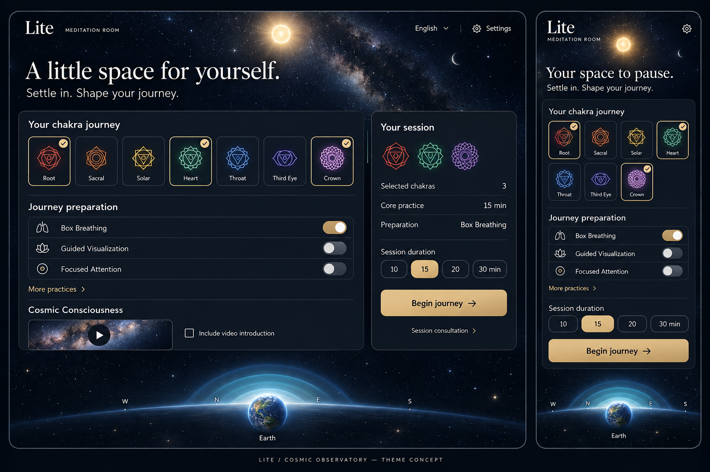

# Lite — Cosmic Observatory

Approved visual direction, checkpoint **CP-THEME-PLAN-001**. Implement after assessment and modularization are complete.

The concept establishes midnight surfaces, ivory text, champagne actions and a spacious cosmic Lobby. Existing functional requirements remain authoritative. In particular, generated sky positions, horizon geometry, example times, omitted controls and English copy are illustrative.

See the [implementation contract](../../../.loop/tracks/cosmic-observatory-theme/spec-plan-review.md) and the atlas's **PLANNED · Cosmic Observatory theme** map. This image is documentation only and must not be loaded or precached by the app.

Provenance: built-in image generator; preserved original output without edits. Requested Images 2.5/Max effort selectors were unavailable, so those settings are not claimed.
